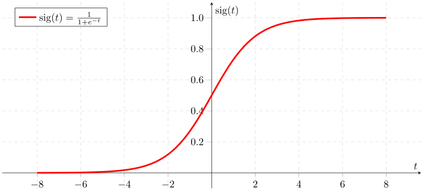

## Problem
We need to estimate probability density $p(x)$ of a random variable from observed values.

## Approach
We will use idea of parametric distribution estimation, which involves choosing *the best* parameters, of a chosen family of densities $p_\theta(x)$, indexed by a parameter $\theta$. The idea is very natural: we choose such parameters, which maximizes the probability (or logarithm of probability) of observed values.

$$
\arg \max\limits_{\theta} \log p_\theta(x) = \theta^* 
$$

### Linear measurements with i.i.d. noise

Suppose, we are given the set of observations:

$$
x_i = \theta^\top a_i + \xi_i, \quad i = [1,m],
$$

where

* $\theta \in \mathbb{R}^n$ - unknown vector of parameters
* $\xi_i$ are IID noise random variables with density $p(z)$
* $x_i$ - measurements, $x \in \mathbb{R}^m$

Which implies the following optimization problem:

$$
\max\limits_{\theta} \log p(x) = \max_\theta \sum\limits_{i=1}^m \log p (x_i - \theta^\top a_i) = \max_\theta L(\theta)
$$

Where the sum goes from the fact, that all observation are independent, which leads to the fact, that $p(\xi) = \prod\limits_{i=1}^m p(\xi_i)$. The target function is called log-likelihood function $L(\theta)$.

#### Gaussian noise

$$
p(z) = \dfrac{1}{\sqrt{2 \pi \sigma^2}} e^{-\frac{z^2}{2 \sigma^2}}
$$

$$
\log p(z) = - \dfrac{1}{2} \log (2 \pi \sigma^2) - \dfrac{z^2}{2 \sigma^2}
$$

$$
\begin{split}
L(\theta) &= \sum\limits_{i=1}^m \left[ - \dfrac{1}{2} \log (2 \pi \sigma^2) - \dfrac{(x_i - \theta^\top a_i)^2}{2 \sigma^2} \right] \\
&= - \dfrac{m}{2} \log (2 \pi \sigma^2) - \dfrac{1}{2 \sigma^2} \sum\limits_{i=1}^m (x_i - \theta^\top a_i)^2
\end{split}
$$

Which means, the maximum likelihood estimation in case of gaussian noise is a least squares solution.

#### Laplacian noise

$$
p(z) = \dfrac{1}{2a} e^{-\frac{|z|}{a}}
$$

$$
\log p(z) = -  \log (2a) - -\dfrac{|z|}{a}
$$

$$
\begin{split}
L(\theta) &= \sum\limits_{i=1}^m \left[ - \log (2a) - -\dfrac{|(x_i - \theta^\top a_i)|}{a} \right] \\
&= - m \log (2 a) - \dfrac{1}{a} \sum\limits_{i=1}^m |x_i - \theta^\top a_i|
\end{split}
$$

Which means, the maximum likelihood estimation in case of Laplacian noise is a $l_1$-norm solution.

#### Uniform noise

$$
p(z) = \begin{cases}
  \frac{1}{2a}, & -a \leq z \leq a, \\
  0, &  z<-a \text{ or } z>a
  \end{cases}
$$

$$
\log p(z) =  \begin{cases}
  - \log(2a), & -a \leq z \leq a, \\
  -\infty, &  z<-a \text{ or } z>a
  \end{cases}
$$

$$

L(\theta) = \begin{cases}
  - m\log(2a), & |x_i - \theta^\top a_i| \leq a, \\
  -\infty, &  \text{ otherwise }
  \end{cases}
$$

Which means, the maximum likelihood estimation in case of uniform noise is any vector $\theta$, which satisfies $\vert x_i - \theta^\top a_i \vert \leq a$.

### Binary logistic regression

Suppose, we are given a set of binary random variables $y_i \in \{0,1\}$. Let us parametrize the distribution function as a sigmoid, using linear transformation of the input as an argument of a sigmoid.

$$
\begin{split}
p(y_i = 1) &= \dfrac{\text{exp}(\theta_0^\top x_i + \theta_1)}{1 + \text{exp}(\theta_0^\top x_i + \theta_1)} \\
p(y_i = 0) &= \dfrac{1}{1 + \text{exp}(\theta_0^\top x_i + \theta_1)}
\end{split}
$$

Let's assume, that first $k$ observations are ones: $y_1, \ldots, y_k =1$, $y_{k+1}, \ldots, y_m = 0$. Then, log-likelihood function will be written as follows:

$$
L(\theta_0, \theta_1) = \sum\limits_{i=1}^k (\theta_0^\top x_i + \theta_1) - \sum\limits_{i=1}^m \log(1 + \text{exp}(\theta_0^\top x_i + \theta_1))
$$

## References

* [Convex Optimization @ UCLA](http://www.seas.ucla.edu/~vandenbe/ee236b/ee236b.html) by Prof. L. Vandenberghe
* [Numerical explanation](https://cvxopt.org/examples/book/logreg.html)
