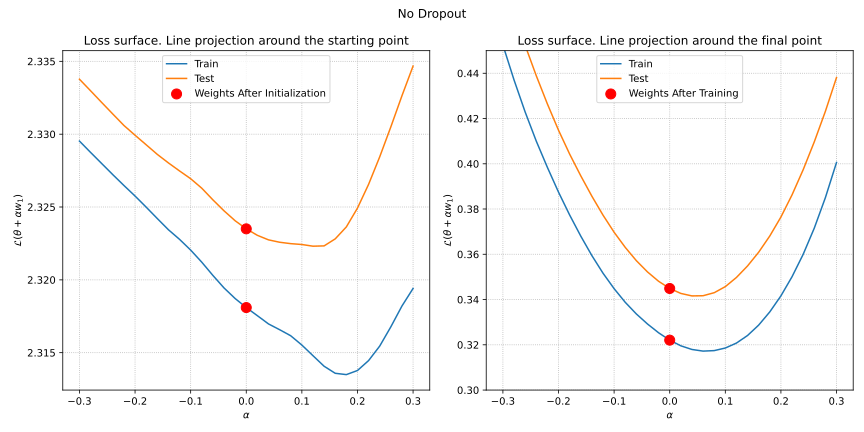

# Scalar Projection

Let's consider the training of our neural network by solving the following optimization problem:

$$
\mathcal{L} (\theta) \to \min_{\theta \in \mathbb{R}^p}
$$

We denote the initial point as $\theta_0$, representing the weights of the neural network at initialization. The weights after training are denoted as $\hat{\theta}$.

In the given example, we have $p = 105,866$, which implies that we are seeking a minimum in a 105,866-dimensional space. Exploring this space is intriguing, and the underlying concept is as follows.

Initially, we generate a random Gaussian direction $w_1 \in \mathbb{R}^p$, which inherits the magnitude of the original neural network weights for each parameter group. Subsequently, we sample the training and testing loss surfaces at points along the direction $w_1$, situated close to either $\theta_0$ or $\hat{\theta}$.

Mathematically, this involves evaluating:

$$
\mathcal{L} (\alpha) = \mathcal{L} (\theta_0 + \alpha w_1), \text{ where } \alpha \in [-b, b].
$$

Here, $\alpha$ plays the role of a coordinate along the $w_1$ direction, and $b$ stands for the bounds of interpolation. Visualizing $\mathcal{L} (\alpha)$ enables us to project the $p$-dimensional surface onto a one-dimensional axis.

It is important to note that the characteristics of the resulting graph heavily rely on the chosen projection direction. It's not feasible to maintain the entirety of the informationWhen transforming a space with 100,000 dimensions into a one-dimensional line through projection. However, certain properties can still be established. For instance, if $\mathcal{L} (\alpha) \mid_{\alpha=0}$ is decreasing, this indicates that the point lies on a slope. Additionally, if the projection is non-convex, it implies that the original surface was not convex.

# Two dimensional projection
We can explore this idea further and draw the projection of the loss surface to the plane, which is defined by 2 random vectors. Note, that with 2 random gaussian vectors in the huge dimensional space are almost certainly orthogonal.

So, as previously, we generate random normalized gaussian vectors $w_1, w_2 \in \mathbb{R}^p$ and evaluate the loss function

$$
\mathcal{L} (\alpha, \beta) = \mathcal{L} (\theta_0 + \alpha w_1 + \beta w_2), \text{ where } \alpha, \beta \in [-b, b]^2.
$$

which immediately leads us to the following nice pictures:





# Code
[Open In Colab](https://colab.research.google.com/github/MerkulovDaniil/optim/blob/master/assets/Notebooks/NN_Surface_Visualization.ipynb){: .btn }