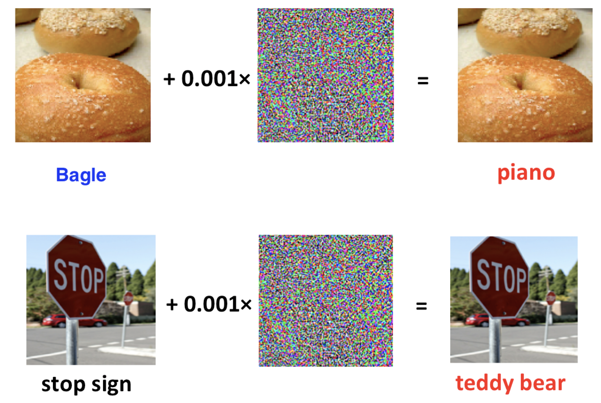

# Lipschitz constant of a convolutional layer in neural network

It was observed, that small perturbation in Neural Network input could lead to significant errors, i.e. misclassifications.

Lipschitz constant bounds the magnitude of the output of a function, so it cannot change drastically with a slight change in the input

$$
\|NN(image) - NN(image+\varepsilon)\| \leq L\|\varepsilon\|
$$

In this notebook we will try to estimate Lipschitz constant of some convolutional layer of a Neural Network.

# Code
[Open In Colab](https://colab.research.google.com/github/MerkulovDaniil/optim/blob/master/assets/Notebooks/Neural_Lipschitz.ipynb){: .btn }