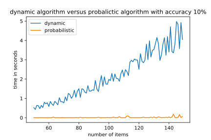

## Introduction

The knapsack problem or rucksack problem is a problem in combinatorial optimization. Given a set of items, each with a weight and a value, determine the number of each item to include in a collection so that the total weight is less than or equal to a given limit and the total value is as large as possible. It derives its name from the problem faced by someone who is constrained by a fixed-size knapsack and must fill it with the most valuable items.

### Definitions
The most common problem is the 0-1 knapsack problem, which restricts the number  $x_{i}$ of copies of each kind of item to zero or one. Given a set of $n$ items numbered from $1$ up to $n$, each with a weigh $w_{i}$ and a value $v_{i}$, along with a maximum weight capacity $W$, 

$$
\begin{split}
& \max\sum_{i=1}^n v_ix_i\\
\text{s.t. } & \sum_{i=1}^n w_ix_i\le W,\;x_i \in {0,1}\\
\end{split}
$$

The decision problem form of the knapsack problem (Can a value of at least V be achieved without exceeding the weight W?) is NP-complete, thus there is no known algorithm both correct and fast (polynomial-time) in all cases.

## Approaches
### Exact solutions

#### Full search
As for other discrete tasks, the backpack problem can be solved by completely sorting through all possible solutions. Suppose there are $n$ items that can be packed in a backpack. It is necessary to determine the maximum value of the cargo, whose weight does not exceed $W$.
For each item, there are 2 options: the item is either put in a backpack or not. Then enumeration of all possible options has time complexity $O(2^n)$, which allows it to be used only for a small number of objects. With an increase in the number of objects, the task becomes unsolvable by this method in an acceptable time.

#### Dynamic programming algorithm
A similar dynamic programming solution for the 0/1 knapsack problem also runs in pseudo-polynomial time. Assume $w_{1},\,w_{2},\,\ldots ,\,w_{n}, W$ are strictly positive integers. Define $m(i,w)$  to be the maximum value that can be attained with weight less than or equal to $w$ using items up to $i$ (first $i$ items). We can define $m(i,w)$ recursively as follows: 

$$
m(i, w) = 
 \begin{cases}
   m(0,w)=0  \\
   m(i,w)=m(i-1,w) &\text{$w_{i}>w$ } \\
   m(i,w)=max(m(i-1,w), m(i-1,w-w_{i})+w_{i}) &\text{$w_{i} \le w$ }
 \end{cases}
$$

The solution can then be found by calculating $m(n,W)$. To do this efficiently, we can use a table to store previous computations. This solution will therefore run in $O(nW)$ time and $O(nW)$ space.

### Approximation algorithms

#### Greedy algorithm
To solve the problem by the greedy algorithm, it is necessary to sort things by their specific value (that is, the ratio of the value of an item to its weight), and put items with the highest specific value in a backpack.
The running time of this algorithm is the sum of the sorting time and stacking time. The difficulty in sorting items is $O(N \ log (N))$. Next, the calculation of how many items fit in a backpack for the total time $O(N)$. Total complexity $O(N \ log (N))$ if necessary sorting and $O(N)$ if already sorted data.
It should be understood that a greedy algorithm can lead to an answer arbitrarily far from optimal. For example, if one item has a weight of 1 and a cost of 2, and another has a weight of $W$ and a cost of $W$, then the greedy algorithm will pick up the final cost of 2 with the optimal answer $W$.

#### Probabilistic algorithm
It is a modification of greedy algorithm. In this algorithm decision to include an item with index $j$ in the knapsack is taken based on th probability of $\frac{\lambda_j}{\sum_{i=1}^n\lambda_i}$, where $\lambda_i$ is the ratio of the value of an item to its weight. This algorithm is run several times and the best solution is selected. If Algorithm starts
as many times as you like, then the probability of getting it as a result
the work of the optimal solution tends to 1. Total complexity is equal to $O(mN  log(N))$ operations.
**Calculating experiment**
The above algorithms were implemented in the python programming language, their source codes are available at the link below. Initial data for the task, namely the values ($v_{i}$) and weights ($w_{i}$) of items were randomly generated. The following ranges of values have been selected $v_{i}\in [0, 100]$ and $w_{i}\in [100, 200]$. Maximum weight capacity $W$ generated randomly from interval $W \in [0.5\sum w_i, 0.75\sum w_i]$.

## Results

Dynamic programming algorithm vs probabilistic algorithm: 

Probabilistic algorithm in case when number of items is fixed (150 items):

## Code

[Open In Colab](https://colab.research.google.com/github/MerkulovDaniil/optim/blob/master/assets/Notebooks/Knapsack_problem.ipynb){: .btn } 

## References

* [Scheduling theory](http://physcontrol.phys.msu.ru/materials/PosobieLazarev/TeorRasp.pdf)
* [Wiki](https://en.wikipedia.org/wiki/Knapsack_problem)