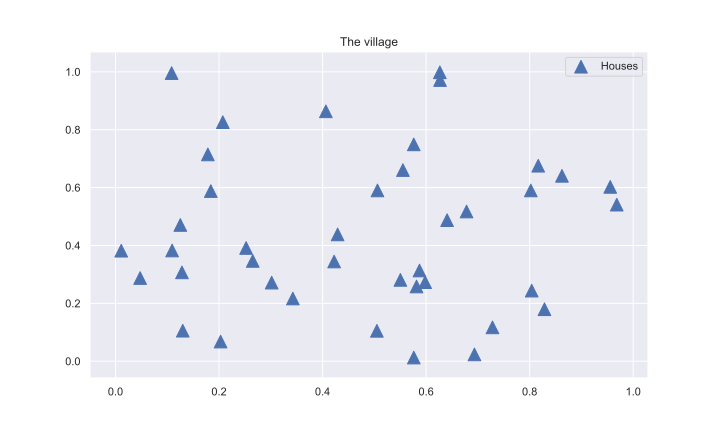

# Travelling salesman problem

## Problem

Suppose, we have $N$ points in $\mathbb{R}^d$ Euclidian space (for
simplicity, we’ll consider and plot case with $d=2$). Let’s imagine,
that these points are nothing else but houses in some 2d village.
Salesman should find the shortest way to go through the all houses only
once.

That is, very simple formulation, however, implies $NP$ - hard problem
with the factorial growth of possible combinations. The goal is to
minimize the following cumulative distance:

$$
d = \sum_{i=1}^{N-1} \| x_{y(i+1)}  - x_{y(i)}\|_2 \to \min_{y},
$$

where $x_k$ is the $k$-th point from $N$ and $y$ stands for the $N$-
dimensional vector of indicies, which describes the order of path.
Actually, the problem could be
[formulated](https://en.wikipedia.org/wiki/Travelling_salesman_problem#Integer_linear_programming_formulations)
as an LP problem, which is easier to solve.

## 🧬Genetic (evolution) algorithm

Our approach is based on the famous global optimization algorithm, known
as evolution algorithm. \### Population and individuals Firstly, we need
to generate the set of random solutions as an initialization. We will
call a set of solutions $\{y_k\}_{k=1}^n$ as *population*, while each
solution is called *individual* (or creature).

Each creature contains integer numbers $1, \ldots, N$, which indicates
the order of bypassing all the houses. The creature, that reflects the
shortest path length among the others will be used as an output of an
algorithm at the current iteration (generation).

### Crossing procedure

Each iteration of the algorithm starts with the crossing (breed)
procedure. Formally speaking, we should formulate the mapping, that
takes two creature vectors as an input and returns its offspring, which
inherits parents properties, while remaining consistent. We will use
[ordered
crossover](http://www.rubicite.com/Tutorials/GeneticAlgorithms/CrossoverOperators/Order1CrossoverOperator.aspx)
as such procedure.

### Mutation

In order to give our algorithm some ability to escape local minima, we
provide it with mutation procedure. We simply swap some houses in an
individual vector. To be more accurate, we define mutation rate (say,
$0.05$). On the one hand, the higher the rate, the less stable the
population is, on the other, the smaller the rate, the more often
algorithm gets stuck in the local minima. We choose
$\text{mutation rate} \cdot n$ individuals and in each case swap random
$\text{mutation rate} \cdot N$ digits.

### Selection

At the end of the iteration we have increased population (due to
crossing results), then we just calculate total path distance to each
individual and select top $n$ of them.

In general, for any $c > 0$, where $d$ is the number of dimensions in
the Euclidean space, there is a polynomial-time algorithm that finds a
tour of length at most $(1 + \frac{1}{c})$ times the optimal for
geometric instances of TSP in

$$
\mathcal{O}\left(N(\log N)^{(\mathcal{O}(c{\sqrt {d}}))^{d-1}}\right)
$$

## Code

[Open In
Colab](https://colab.research.google.com/github/MerkulovDaniil/optim/blob/master/assets/Notebooks/Travelling%20salesman%20problem.ipynb)

## References

- [General information about genetic
  algorithms](http://www.rubicite.com/Tutorials/GeneticAlgorithms.aspx)
- [Wiki](https://en.wikipedia.org/wiki/Travelling_salesman_problem)
