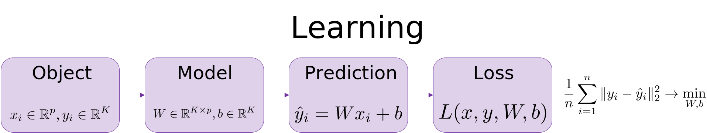

# Matrix calculus

## Matrix calculus

1.  Find the derivatives of
    $f(x) = Ax, \quad \nabla_x f(x) = ?, \nabla_A f(x) = ?$

2.  Find $\nabla f(x)$, if $f(x) = c^Tx$.

3.  Find $\nabla f(x)$, if $f(x) = \dfrac{1}{2}x^TAx + b^Tx + c$.

4.  Find $\nabla f(x), f^{\prime\prime}(x)$, if $f(x) = -e^{-x^Tx}$.

5.  Find the gradient $\nabla f(x)$ and hessian $f^{\prime\prime}(x)$,
    if $f(x) = \dfrac{1}{2} \Vert Ax - b\Vert ^2_2$.

6.  Find $\nabla f(x)$, if
    $f(x) = \Vert x\Vert _2 , x \in \mathbb{R}^p \setminus \{0\}$.

7.  Find $\nabla f(x)$, if
    $f(x) = \Vert Ax\Vert _2 , x \in \mathbb{R}^p \setminus \{0\}$.

8.  Find $\nabla f(x), f^{\prime\prime}(x)$, if
    $f(x) = \dfrac{-1}{1 + x^T x}$.

9.  Calculate $df(x)$ and $\nabla f(x)$ for the function
    $f(x) = \log(x^{T}\mathrm{A}x)$.

10. Find $f^\prime(X)$, if $f(X) = \det X$

    Note: here under $f^\prime(X)$ assumes first order approximation of
    $f(X)$ using Taylor series:

    $$
     f(X + \Delta X) \approx f(X) + \mathbf{tr}(f^\prime(X)^T \Delta X)
     $$

11. Find $f^{\prime\prime}(X)$, if $f(X) = \log \det X$

    Note: here under $f^{\prime\prime}(X)$ assumes second order
    approximation of $f(X)$ using Taylor series:

    $$
     f(X + \Delta X) \approx f(X) + \mathbf{tr}(f^\prime(X)^T \Delta X) + \frac{1}{2}\mathbf{tr}(\Delta X^T f^{\prime\prime}(X) \Delta X)
     $$

12. Find gradient and hessian of $f : \mathbb{R}^n \to \mathbb{R}$, if:

    $$
     f(x) = \log \sum\limits_{i=1}^m \exp (a_i^T x + b_i), \;\;\;\; a_1, \ldots, a_m \in \mathbb{R}^n; \;\;\;  b_1, \ldots, b_m  \in \mathbb{R}
     $$

13. What is the gradient, Jacobian, Hessian? Is there any connection
    between those three definitions?

14. Calculate:
    $\dfrac{\partial }{\partial X} \sum \text{eig}(X), \;\;\dfrac{\partial }{\partial X} \prod \text{eig}(X), \;\;\dfrac{\partial }{\partial X}\text{tr}(X), \;\; \dfrac{\partial }{\partial X} \text{det}(X)$

15. Calculate the Frobenious norm derivative:
    $\dfrac{\partial}{\partial X}\Vert X\Vert _F^2$

16. Calculate the gradient of the softmax regression $\nabla_\theta L$
    in binary case ($K = 2$) $n$ - dimensional objects:

    $$
     h_\theta(x) = \begin{bmatrix} P(y = 1 \vert x; \theta) \\ P(y = 2 \vert x; \theta) \\ \vdots \\ P(y = K \vert x; \theta) \end{bmatrix} = \frac{1}{ \sum_{j=1}^{K}{\exp(\theta^{(j)T} x) }} \begin{bmatrix} \exp(\theta^{(1)T} x ) \\ \exp(\theta^{(2)T} x ) \\ \vdots \\ \exp(\theta^{(K)T} x ) \\ \end{bmatrix}
     $$

    $$
     L(\theta) = - \left[ \sum_{i=1}^n  (1-y^{(i)}) \log (1-h_\theta(x^{(i)})) + y^{(i)} \log h_\theta(x^{(i)}) \right]
     $$

17. Find $\nabla f(X)$, if $f(X) = \text{tr } AX$

18. Find $\nabla f(X)$, if $f(X) = \langle S, X\rangle - \log \det X$

19. Find $\nabla f(X)$, if
    $f(X) = \ln \langle Ax, x\rangle, A \in \mathbb{S^n_{++}}$

20. Find the gradient $\nabla f(x)$ and hessian $f^{\prime\prime}(x)$,
    if

    $$
     f(x) = \ln \left( 1 + \exp\langle a,x\rangle\right)
     $$

21. Find the gradient $\nabla f(x)$ and hessian $f^{\prime\prime}(x)$,
    if $f(x) = \frac{1}{3}\Vert x\Vert _2^3$

22. Calculate $\nabla f(X)$, if
    $f(X) = \Vert  AX - B\Vert _F, X \in \mathbb{R}^{k \times n}, A \in \mathbb{R}^{m \times k}, B \in \mathbb{R}^{m \times n}$

23. Calculate the derivatives of the loss function with respect to
    parameters
    $\frac{\partial L}{\partial W}, \frac{\partial L}{\partial b}$ for
    the single object $x_i$ (or, $n = 1$)

    

24. Find the gradient $\nabla f(x)$ and hessian $f^{\prime\prime}(x)$,
    if
    $f(x) = \langle x, x\rangle^{\langle x, x\rangle}, x \in \mathbb{R}^p \setminus \{0\}$

25. Find the gradient $\nabla f(x)$ and hessian $f^{\prime\prime}(x)$,
    if
    $f(x) = \frac{\langle Ax, x\rangle}{\Vert x\Vert _2^2}, x \in \mathbb{R}^p \setminus \{0\}, A \in \mathbb{S}^n$

26. Find the gradient $\nabla f(x)$ and hessian $f^{\prime\prime}(x)$,
    if $f(x) = \frac{1}{2}\Vert A - xx^T\Vert ^2_F, A \in \mathbb{S}^n$

27. Find the gradient $\nabla f(x)$ and hessian $f^{\prime\prime}(x)$,
    if $f(x) = \Vert xx^T\Vert _2$

28. Find the gradient $\nabla f(x)$ and hessian $f^{\prime\prime}(x)$,
    if
    $f(x) = \frac1n \sum\limits_{i=1}^n \log \left( 1 + \exp(a_i^{T}x)  \right) + \frac{\mu}{2}\Vert x\Vert _2^2, \; a_i \in \mathbb R^n, \; \mu>0$.

29. Match functions with their gradients:

    - [ ] $f(\mathrm{X}) = \mathrm{Tr}\mathrm{X}$
    - [ ] $f(\mathrm{X}) = \mathrm{Tr}\mathrm{X}^{-1}$
    - [ ] $f(\mathrm{X}) = \det \mathrm{X}$
    - [ ] $f(\mathrm{X}) = \ln \det \mathrm{X}$

    1.  $\nabla f(\mathrm{X}) = \mathrm{X}^{-1}$
    2.  $\nabla f(\mathrm{X}) = \mathrm{I}$
    3.  $\nabla f(\mathrm{X}) = \det (\mathrm{X})\cdot (\mathrm{X}^{-1})^{T}$
    4.  $\nabla f(\mathrm{X}) = -\left(\mathrm{X}^{-2}\right)^{T}$

30. Calculate the first and the second derivative of the following
    function $f : S \to \mathbb{R}$

    $$
     f(t) = \text{det}(A − tI_n),
     $$

    where
    $A \in \mathbb{R}^{n \times n}, S := \{t \in \mathbb{R} : \text{det}(A − tI_n) \neq 0\}$.

31. Find the gradient $\nabla f(x)$, if
    $f(x) = \text{tr}\left( AX^2BX^{-T} \right)$.
