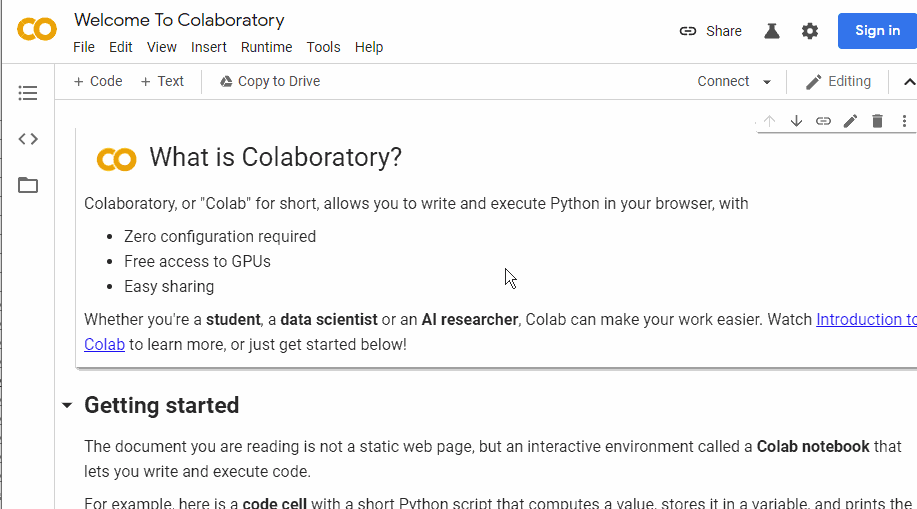
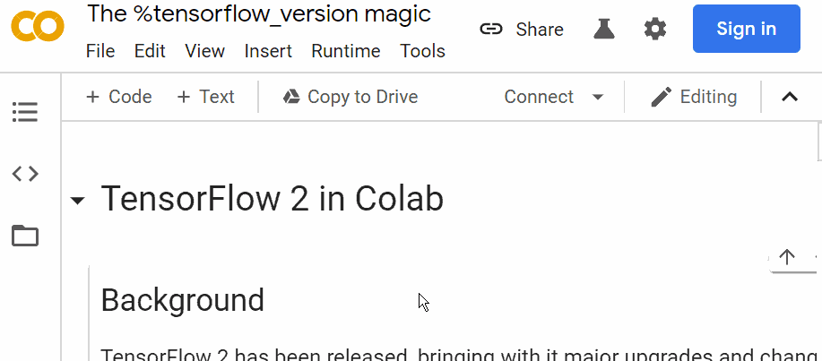
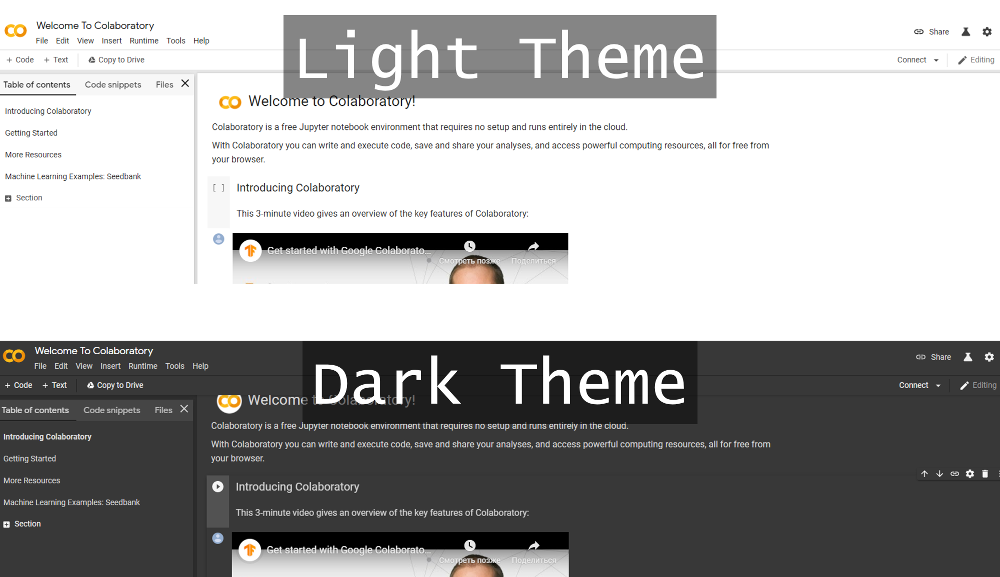
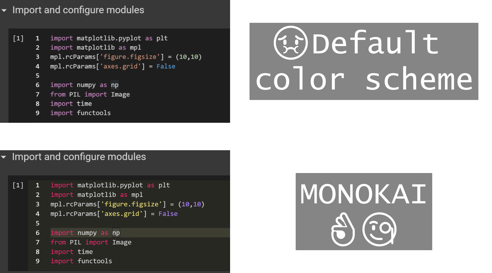
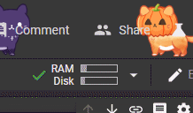

This tutorial will highlight some 

This tool perfectly fits 90% of your tasks.
* Fast prototyping
* Sharing and simultaneous work

## Github features
### Running any jupyter notebook from github
If you want to open any notebook, that is already stored in any public github repository, it is enough to paste user/repo name in the field below and just open it. Modified notebook could be downloaded locally or saved to your google drive storage. 

### Commiting to github from colab
However, you can save any changes directly to the github through the commits. In order to do this, you'll need to authorize colab to work with your github account. It's up to you to provide this access or not. All these things work even with private repos.

## Using different accelerators (CPU/GPU/TPU)

`Runtime -> Change runtime type -> `

## Customization

### Dark theme

`Tools -> Settings -> Site -> Theme -> Dark`

### Monokai 

`Tools -> Settings -> Site -> Editor -> Editor colorization`

### Bonus

`Tools -> Settings -> Miscellaneous -> Kitty mode`

## References
* [Official guide](https://colab.research.google.com/notebooks/intro.ipynb#scrollTo=GJBs_flRovLc)
