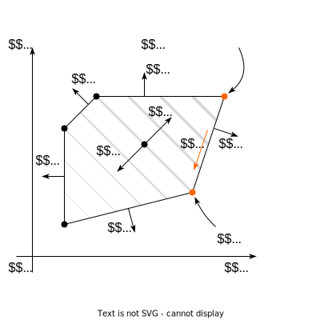

# Linear Programming and simplex algorithm

## What is Linear Programming?

Generally speaking, all problems with linear objective and linear
equalities/inequalities constraints could be considered as Linear
Programming. However, there are some widely accepted formulations.

$$
\tag{LP.Basic}
\begin{align*}
&\min_{x \in \mathbb{R}^n} c^{\top}x \\
\text{s.t. } & Ax \leq b\\
\end{align*}
$$

for some vectors $c \in \mathbb{R}^n$, $b \in \mathbb{R}^m$ and matrix
$A \in \mathbb{R}^{m \times n}$. Where the inequalities are interpreted
component-wise.

**Standard form.** This form seems to be the most intuitive and
geometric in terms of visualization. Let us have vectors
$c \in \mathbb{R}^n$, $b \in \mathbb{R}^m$ and matrix
$A \in \mathbb{R}^{m \times n}$.

$$
\tag{LP.Standard}
\begin{align*}
&\min_{x \in \mathbb{R}^n} c^{\top}x \\
\text{s.t. } & Ax = b\\
& x_i \geq 0, \; i = 1,\dots, n
\end{align*}
$$

## Examples of LP problems

> [!EXAMPLE]
>
> ### Diet problem
>
> 

>
> 

>
> Imagine, that you have to construct a diet plan from some set of
> products: 🍌🍰🍗🥚🐟. Each of the products has its own vector of
> nutrients. Thus, all the food information could be processed through
> the matrix $W$. Let also assume, that we have the vector of
> requirements for each of nutrients $r \in \mathbb{R}^n$. We need to
> find the cheapest configuration of the diet, which meets all the
> requirements:
>
> $$
> \begin{align*}
> &\min_{x \in \mathbb{R}^p} c^{\top}x \\
> \text{s.t. } & Wx \geq r\\
> & x_i \geq 0, \; i = 1,\dots, n
> \end{align*}
> $$
>
> 
>
> 

>
> 

> [!EXAMPLE]
>
> ### Transportation problem
>
> 

>
> 

>
> [Source](https://jckantor.github.io/ND-Pyomo-Cookbook/notebooks/03.01-Transportation-Networks.html)
>
> The prototypical transportation problem deals with the distribution of
> a commodity from a set of sources to a set of destinations. The object
> is to minimize total transportation costs while satisfying constraints
> on the supplies available at each of the sources, and satisfying
> demand requirements at each of the destinations.
>
> Here we illustrate the transportation problem using an example from
> Chapter 5 of Johannes Bisschop, “AIMMS Optimization Modeling”, Paragon
> Decision Sciences, 1999. In this example there are two factories and
> six customer sites located in 8 European cities as shown in the
> following map. The customer sites are labeled in red, the factories
> are labeled in blue.
>
> 
>
> |      Customer       | Arnhem \[€/ton\] | Gouda \[€/ton\] | Demand \[tons\] |
> |:-------------------:|:----------------:|:---------------:|:---------------:|
> |       London        |       n/a        |       2.5       |       125       |
> |       Berlin        |       2.5        |       n/a       |       175       |
> |     Maastricht      |       1.6        |       2.0       |       225       |
> |      Amsterdam      |       1.4        |       1.0       |       250       |
> |       Utrecht       |       0.8        |       1.0       |       225       |
> |      The Hague      |       1.4        |       0.8       |       200       |
> | **Supply \[tons\]** |     550 tons     |    700 tons     |                 |
>
> This can be represented as the following graph:
>
> 
>
> For each link we can have a parameter $T[c,s]$ denoting the cost of
> shipping a ton of goods over the link. What we need to determine is
> the amount of goods to be shipped over each link, which we will
> represent as a non-negative decision variable $x[c,s]$.
>
> The problem objective is to minimize the total shipping cost to all
> customers from all sources.
>
> $$\text{minimize:}\quad \text{Cost} = \sum_{c \in Customers}\sum_{s \in Sources} T[c,s] x[c,s]$$
>
> Shipments from all sources can not exceed the manufacturing capacity
> of the source.
>
> $$\sum_{c \in Customers} x[c,s] \leq \text{Supply}[s] \qquad \forall s \in Sources$$
>
> Shipments to each customer must satisfy their demand.
>
> $$\sum_{s\in Sources} x[c,s] = \text{Demand}[c] \qquad \forall c \in Customers$$
>
> The code for the problem is available here:
> [💻](https://colab.research.google.com/github/MerkulovDaniil/optim/blob/master/assets/Notebooks/LP_transport.ipynb)
>
> 

>
> 

> [!EXAMPLE]
>
> ### Blending problem
>
> 

>
> 

>
> [Source](https://jckantor.github.io/ND-Pyomo-Cookbook/notebooks/02.03-Linear-Blending-Problem.html)
>
> A brewery receives an order for 100 gallons of 4% ABV (alchohol by
> volume) beer. The brewery has on hand beer Okhota that is 4.5% ABV
> that cost USD 0.32 per gallon to make, and beer Baltos that is 3.7%
> ABV and cost USD 0.25 per gallon. Water could also be used as a
> blending agent at a cost of USD 0.05 per gallon. Find the minimum cost
> blend that meets the customer requirements.
>
> #### Model Formulation
>
> ##### Objective Function
>
> If we let subscript $c$ denote a blending component from the set of
> blending components $C$, and denote the volume of $c$ used in the
> blend as $x_c$, the cost of the blend is
>
> $$
> \text{cost}  = \sum_{c\in C} x_c P_c
> $$
>
> where $P_c$ is the price per unit volume of $c$. Using the Python data
> dictionary defined above, the price $P_c$ is given by
> `data[c]['cost']`.
>
> ##### Volume Constraint
>
> The customer requirement is produce a total volume $V$. Assuming ideal
> solutions, the constraint is given by
>
> $$
> V  = \sum_{c\in C} x_c
> $$
>
> where $x_c$ denotes the volume of component $c$ used in the blend.
>
> ##### Product Composition Constraint
>
> The product composition is specified as 4% alchohol by volume.
> Denoting this as $\bar{A}$, the constraint may be written as
>
> $$
> \bar{A} = \frac{\sum_{c\in C}x_c A_c}{\sum_{c\in C} x_c}
> $$
>
> where $A_c$ is the alcohol by volume for component $c$. As written,
> this is a nonlinear constraint. Multiplying both sides of the equation
> by the denominator yields a linear constraint
>
> $$
> \bar{A}\sum_{c\in C} x_c  = \sum_{c\in C}x_c A_c
> $$
>
> A final form for this constraint can be given in either of two
> versions. In the first version we subtract the left-hand side from the
> right to give
>
> $$
> 0  = \sum_{c\in C}x_c \left(A_c - \bar{A}\right)  \text{ Version 1 of the linear blending constraint}
> $$
>
> Alternatively, the summation on the left-hand side corresponds to
> total volume. Since that is known as part of the problem
> specification, the blending constraint could also be written as
>
> $$
> \bar{A}V  = \sum_{c\in C}x_c A_c   \text{ Version 2 of the linear blending constraint}
> $$
>
> Which should you use? Either will generally work well. The advantage
> of version 1 is that it is fully specified by a product requirement
> $\bar{A}$, which is sometimes helpful in writing elegant Python code.
>
> The code for the problem is available here:
> [💻](https://colab.research.google.com/github/MerkulovDaniil/optim/blob/master/assets/Notebooks/LP_blending.ipynb)
>
> 

>
> 

## Basic transformations

Inequality to equality by increasing the dimension of the problem by
$m$.

$$
Ax \leq b \leftrightarrow 
\begin{cases}
Ax + z =  b\\
z \geq 0
\end{cases}
$$

unsigned variables to nonnegative variables.

$$
x \leftrightarrow 
\begin{cases}
x = x_+ - x_-\\
x_+ \geq 0 \\
x_- \geq 0
\end{cases}
$$

> [!EXAMPLE]
>
> ### Chebyshev approximation problem
>
> 

>
> 

>
> $$
> \min_{x \in \mathbb{R}^n} \|Ax - b\|_\infty \leftrightarrow \min_{x \in \mathbb{R}^n} \max_{i} |a_i^\top x - b_i|
> $$
>
> Could be equivalently written as a LP with thre replacement of maximum
> coordinate of a vector:
>
> $$
> \begin{align*}
> &\min_{t \in \mathbb{R}, x \in \mathbb{R}^n} t \\
> \text{s.t. } & a_i^\top x - b_i \leq t, \; i = 1,\dots, n\\
> & -a_i^\top x + b_i \leq t, \; i = 1,\dots, n
> \end{align*}
> $$
>
> 

>
> 

> [!EXAMPLE]
>
> ### l_1 approximation problem
>
> 

>
> 

>
> $$
> \min_{x \in \mathbb{R}^n} \|Ax - b\|_1 \leftrightarrow \min_{x \in \mathbb{R}^n} \sum_{i=1}^n |a_i^\top x - b_i|
> $$
>
> Could be equivalently written as a LP with thre replacement of the sum
> of coordinates of a vector:
>
> $$
> \begin{align*}
> &\min_{t \in \mathbb{R}^n, x \in \mathbb{R}^n} \mathbf{1}^\top t \\
> \text{s.t. } & a_i^\top x - b_i \leq t_i, \; i = 1,\dots, n\\
> & -a_i^\top x + b_i \leq t_i, \; i = 1,\dots, n
> \end{align*}
> $$
>
> 

>
> 

## Duality

There are four possibilities:

- Both the primal and the dual are infeasible.
- The primal is infeasible and the dual is unbounded.
- The primal is unbounded and the dual is infeasible.
- Both the primal and the dual are feasible and their optimal values are
  equal.

> [!EXAMPLE]
>
> ### Example
>
> 

>
> 

>
> Ensure, that the following standard form LP:
>
> $$
> \begin{align*}
> &\min_{x \in \mathbb{R}^n} c^{\top}x \\
> \text{s.t. } & Ax = b\\
> & x_i \geq 0, \; i = 1,\dots, n
> \end{align*}
> $$
>
> Has the following dual:
>
> $$
> \begin{align*}
> &\max_{y \in \mathbb{R}^n} b^{\top}y \\
> \text{s.t. } & A^Ty \preceq c\\
> \end{align*}
> $$
>
> Find the dual problem to the problem above (it should be the original
> LP).
>
> 

>
> 

## Idea of simplex algorithm

- The Simplex Algorithm walks along the edges of the polytope, at every
  corner choosing the edge that decreases $c^\top x$ most
- This either terminates at a corner, or leads to an unconstrained edge
  ($-\infty$ optimum)

We will illustrate simplex algorithm for the simple inequality form of
LP:

$$
\tag{LP.Inequality}
\begin{align*}
&\min_{x \in \mathbb{R}^n} c^{\top}x \\
\text{s.t. } & Ax \leq b
\end{align*}
$$

Definition: a **basis** $B$ is a subset of $n$ (integer) numbers between
$1$ and $m$, so that $\text{rank} A_B = n$. Note, that we can associate
submatrix $A_B$ and corresponding right-hand side $b_B$ with the basis
$B$. Also, we can derive a point of intersection of all these
hyperplanes from basis: $x_B = A^{-1}_B b_B$.

If $A x_B \leq b$, then basis $B$ is **feasible**.

A basis $B$ is optimal if $x_B$ is an optimum of the
$\text{LP.Inequality}$.

> [!THEOREM]
>
> ### Theorem
>
> 

>
> 

>
> 1.  If Standartd LP has a nonempty feasible region, then there is at
>     least one basic feasible point
> 2.  If Standartd LP has solutions, then at least one such solution is
>     a basic optimal point.
> 3.  If Standartd LP is feasible and bounded, then it has an optimal
>     solution.
>
> 

>
> 

Since we have a basis, we can decompose our objective vector $c$ in this
basis and find the scalar coefficients $\lambda_B$:

$$
\lambda^\top_B A_B = c^\top \leftrightarrow \lambda^\top_B = c^\top A_B^{-1}
$$

> [!THEOREM]
>
> ### Theorem
>
> 

>
> 

>
> If all components of $\lambda_B$ are non-positive and $B$ is feasible,
> then $B$ is optimal.
>
> > [!PROOF]
> >
> > ### Proof
> >
> > 

> >
> > 

> >
> > $$
> > \begin{align*}
> > \exists x^*: Ax^* &\leq b, c^\top x^* < c^\top x_B \\
> > A_B x^* &\leq b_B \\
> > \lambda_B^\top A_B x^* &\geq \lambda_B^\top b_B \\
> > c^\top x^* & \geq \lambda_B^\top A_B x_B \\
> > c^\top x^* & \geq c^\top  x_B \\
> > \end{align*}
> > $$
> >
> > 

> >
> > 

>
> 

>
> 

### Changing basis

Suppose, some of the coefficients of $\lambda_B$ are positive. Then we
need to go through the edge of the polytope to the new vertex (i.e.,
switch the basis)

$$
x_{B'} = x_B + \mu d = A^{-1}_{B'} b_{B'}
$$

### Finding an initial basic feasible solution

Let us consider $\text{LP.Canonical}$.

$$
\begin{align*}
&\min_{x \in \mathbb{R}^n} c^{\top}x \\
\text{s.t. } & Ax = b\\
& x_i \geq 0, \; i = 1,\dots, n
\end{align*}
$$

The proposed algorithm requires an initial basic feasible solution and
corresponding basis. To compute this solution and basis, we start by
multiplying by $−1$ any row $i$ of $Ax = b$ such that $b_i < 0$. This
ensures that $b \geq 0$. We then introduce artificial variables
$z \in \mathbb{R}^m$ and consider the following LP:

$$
\tag{LP.Phase 1}
\begin{align*}
&\min_{x \in \mathbb{R}^n, z \in \mathbb{R}^m} 1^{\top}z \\
\text{s.t. } & Ax + Iz = b\\
& x_i, z_j \geq 0, \; i = 1,\dots, n \; j = 1,\dots, m
\end{align*}
$$

which can be written in canonical form
$\min\{\tilde{c}^\top \tilde{x} \mid \tilde{A}\tilde{x} = \tilde{b}, \tilde{x} \geq 0\}$
by setting

$$
\tilde{x} = \begin{bmatrix}x\\z\end{bmatrix}, \quad \tilde{A} = [A \; I], \quad \tilde{b} = b, \quad \tilde{c} = \begin{bmatrix}0_n\\1_m\end{bmatrix}
$$

An initial basis for $\text{LP.Phase 1}$ is
$\tilde{A}_B = I, \tilde{A}_N = A$ with corresponding basic feasible
solution
$\tilde{x}_N = 0, \tilde{x}_B = \tilde{A}^{-1}_B \tilde{b} = \tilde{b} \geq 0$.
We can therefore run the simplex method on $\text{LP.Phase 1}$, which
will converge to an optimum $\tilde{x}^*$.
$\tilde{x} = (\tilde{x}_N \; \tilde{x}_B)$. There are several possible
outcomes:

- $\tilde{c}^\top \tilde{x} > 0$. Original primal is infeasible.
- $\tilde{c}^\top \tilde{x} = 0 \to 1^\top z^* = 0$. The obtained
  solution is a start point for the original problem (probably with
  slight modification).

## Convergence

Since the number of edge point is finite, algorithm should converge
(except some degenerate cases, which are not covered here). However, the
convergence could be exponentially slow, due to the high number of
edges. There is the following iconic example, when simplex algorithm
should perform exactly all vertexes.

### [Klee Minty](https://en.wikipedia.org/wiki/Klee%E2%80%93Minty_cube) example

In the following problem simplex algorithm needs to check $2^n - 1$
vertexes with $x_0 = 0$.

$$
\begin{align*} & \max_{x \in \mathbb{R}^n} 2^{n-1}x_1 + 2^{n-2}x_2 + \dots + 2x_{n-1} + x_n\\
\text{s.t. } & x_1 \leq 5\\
& 4x_1 + x_2 \leq 25\\
& 8x_1 + 4x_2 + x_3 \leq 125\\
& \ldots\\
& 2^n x_1 + 2^{n-1}x_2 + 2^{n-2}x_3 + \ldots + x_n \leq 5^n\\ 
& x \geq 0 
\end{align*}
$$

## Summary

- A wide variety of applications could be formulated as the linear
  programming.
- Simplex algorithm is simple, but could work exponentially long.
- Khachiyan’s ellipsoid method is the first to be proved running at
  polynomial complexity for LPs. However, it is usually slower than
  simplex in real problems.
- Interior point methods are the last word in this area. However, good
  implementations of simplex-based methods and interior point methods
  are similar for routine applications of linear programming.

## Code

[Open In
Colab](https://colab.research.google.com/github/MerkulovDaniil/optim/blob/master/assets/Notebooks/LP.ipynb)

## Materials

- [Linear Programming.](https://yadi.sk/i/uhmarI88kCRfw) in V. Lempitsky
  optimization course.
- [Simplex method.](https://yadi.sk/i/lzCxOVbnkFfZc) in V. Lempitsky
  optimization course.
- [Overview of different LP
  solvers](https://medium.com/opex-analytics/optimization-modeling-in-python-pulp-gurobi-and-cplex-83a62129807a)
- [TED talks watching
  optimization](https://www.analyticsvidhya.com/blog/2017/10/linear-optimization-in-python/)
- [Overview of ellipsoid
  method](https://www.stat.cmu.edu/~ryantibs/convexopt-F13/scribes/lec15.pdf)
- [Comprehensive overview of linear
  programming](http://www.mit.edu/~kircher/lp.pdf)
- [Converting LP to a standard
  form](https://sites.math.washington.edu/~burke/crs/407/lectures/L4-lp_standard_form.pdf)
