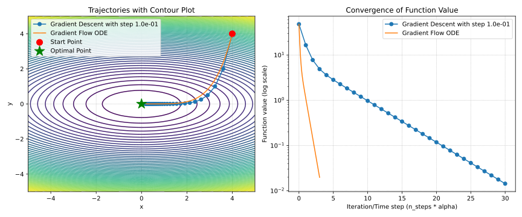

::: {.panel-tabset}

### 📝 File 
[Original Cauchy paper](/assets/files/GD.pdf)

### 📚 bibtex
```bibtex
@article{cauchy1847methode,
  title={M{\'e}thode g{\'e}n{\'e}rale pour la r{\'e}solution des systemes d’{\'e}quations simultan{\'e}es}, author={Cauchy, Augustin},
  journal={Comp. Rend. Sci. Paris},
  volume={25},
  number={1847},
  pages={536--538},
  year={1847}
  }
```
:::

## Summary

A classical problem of function minimization is considered. 

$$
\tag{GD}
x_{k+1} = x_k - \eta_k\nabla f(x_k)
$$

* The bottleneck (for almost all gradient methods) is choosing step-size, which can lead to the dramatic difference in method's behavior. 
* One of the theoretical suggestions: choosing stepsize inversly proportional to the gradient Lipschitz constant $\eta_k = \dfrac{1}{L}$.
* In huge-scale applications the cost of iteration is usually defined by the cost of gradient calculation (at least $\mathcal{O}(p)$).
* If function has Lipschitz-continious gradient, then method could be rewritten as follows:

$$
\begin{align*}x_{k+1} &= x_{k}-\dfrac{1}{L} \nabla f\left(x_{k}\right)= \\
&= \arg \min\limits_{x \in \mathbb{R}^{n}}\left\{f\left(x_{k}\right)+\left\langle\nabla f\left(x_{k}\right), x-x_{k}\right\rangle+\frac{L}{2}\left\|x-x_{k}\right\|_{2}^{2}\right\} \end{align*}
$$

## Intuition
### Direction of local steepest descent
Let's consider a linear approximation of the differentiable function $f$ along some direction $h, \|h\|_2 = 1$:

$$
f(x + \eta h) = f(x) + \eta \langle f'(x), h \rangle + o(\eta)
$$

We want $h$ to be a decreasing direction:

$$
f(x + \eta h) < f(x)
$$

$$
f(x) + \eta \langle f'(x), h \rangle + o(\eta) < f(x)
$$

and going to the limit at $\eta \rightarrow 0$:

$$
\langle f'(x), h \rangle \leq 0
$$

Also from Cauchy–Bunyakovsky–Schwarz inequality:

$$
|\langle f'(x), h \rangle | \leq \| f'(x) \|_2 \| h \|_2 \;\;\;\to\;\;\; \langle f'(x), h \rangle \geq -\| f'(x) \|_2 \| h \|_2 = -\| f'(x) \|_2
$$

Thus, the direction of the antigradient

$$
h = -\dfrac{f'(x)}{\|f'(x)\|_2}
$$

gives the direction of the **steepest local** decreasing of the function $f$.

The result of this method is

$$
x_{k+1} = x_k - \eta f'(x_k)
$$

### Gradient flow ODE

Let's consider the following ODE, which is referred as Gradient Flow equation.

$$
\tag{GF}
\frac{dx}{dt} = -f'(x(t))
$$

and discretize it on a uniform grid with $\eta$ step:

$$
\frac{x_{k+1} - x_k}{\eta} = -f'(x_k),
$$

where $x_k \equiv x(t_k)$ and $\eta = t_{k+1} - t_k$ - is the grid step.

From here we get the expression for $x_{k+1}$

$$
x_{k+1} = x_k - \eta f'(x_k),
$$

which is exactly gradient descent.

{width=100%}

[Open In Colab $\clubsuit$](https://colab.research.google.com/github/MerkulovDaniil/optim/blob/master/assets/Notebooks/GD_vs_GF.ipynb)


### Necessary local minimum condition

$$
\begin{align*}
& f'(x) = 0\\
& -\eta f'(x) = 0\\
& x - \eta f'(x) = x\\
& x_k - \eta f'(x_k) = x_{k+1}
\end{align*}
$$

This is, surely, not a proof at all, but some kind of intuitive explanation.

### Minimizer of Lipschitz parabola

Some general highlights about Lipschitz properties are needed for explanation. If a function $f: \mathbb{R}^n \to \mathbb{R}$ is  continuously differentiable and its gradient satisfies Lipschitz conditions with constant $L$, then $\forall x,y \in \mathbb{R}^n$:

$$
|f(y) - f(x) - \langle \nabla f(x), y-x \rangle| \leq \frac{L}{2} \|y-x\|^2,
$$

which geometrically means, that if we'll fix some point $x_0 \in \mathbb{R}^n$ and define two parabolas:

$$
\phi_1(x) = f(x_0) + \langle \nabla f(x_0), x - x_0 \rangle - \frac{L}{2} \|x-x_0\|^2,
$$

$$
\phi_2(x) = f(x_0) + \langle \nabla f(x_0), x - x_0 \rangle + \frac{L}{2} \|x-x_0\|^2.
$$

Then 

$$
\phi_1(x) \leq f(x) \leq \phi_2(x) \quad \forall x \in \mathbb{R}^n.
$$

Now, if we have global upper bound on the function, in a form of parabola, we can try to go directly to its minimum.

$$
\begin{align*}
& \nabla \phi_2(x) = 0 \\
& \nabla f(x_0) + L (x^* - x_0) = 0 \\
& x^* = x_0 - \frac{1}{L}\nabla f(x_0) \\
& x_{k+1} = x_k - \frac{1}{L} \nabla f(x_k)
\end{align*}
$$

{fig-align="center" width=80%}

This way leads to the $\frac{1}{L}$ stepsize choosing. However, often the $L$ constant is not known.

But if the function is twice continuously differentiable and its gradient has Lipschitz constant $L$, we can derive a way to estimate this constant $\forall x \in \mathbb{R}^n$:

$$
\|\nabla^2 f(x) \| \leq L
$$

or

$$
-L I_n \preceq \nabla^2 f(x) \preceq L I_n
$$

## Stepsize choosing strategies

Stepsize choosing strategy $\eta_k$ significantly affects convergence. General line search algorithms might help in choosing scalar parameter. 

### Constant stepsize

For $f \in C_L^{1,1}$:

$$
\eta_k = \eta
$$

$$
f(x_k) - f(x_{k+1}) \geq \eta \left(1 - \frac{1}{2}L\eta \right) \|\nabla f(x_k)\|^2
$$

With choosing $\eta = \frac{1}{L}$, we have:

$$
f(x_k) - f(x_{k+1}) \geq \dfrac{1}{2L}\|\nabla f(x_k)\|^2
$$

### Fixed sequence

$$
\eta_k = \dfrac{1}{\sqrt{k+1}}
$$

The latter 2 strategies are the simplest in terms of implementation and analytical analysis. It is clear that this approach does not often work very well in practice (the function geometry is not known in advance).

### Exact line search aka steepest descent

$$
\eta_k = \text{arg}\min_{\eta \in \mathbb{R^+}} f(x_{k+1}) = \text{arg}\min_{\eta \in \mathbb{R^+}} f(x_k - \eta \nabla f(x_k))
$$

More theoretical than practical approach. It also allows you to analyze the convergence, but often exact line search can be difficult if the function calculation takes too long or costs a lot.

Interesting theoretical property of this method is that each following iteration is orthogonal to the previous one:

$$
\eta_k = \text{arg}\min_{\eta \in \mathbb{R^+}} f(x_k - \eta \nabla f(x_k))
$$

Optimality conditions:

$$
\nabla f(x_{k+1})^\top \nabla f(x_k) = 0
$$

{width=100%}

[Open In Colab $\clubsuit$](https://colab.research.google.com/github/MerkulovDaniil/optim/blob/master/assets/Notebooks/Steepest_descent.ipynb)

## Convergence analysis

### Strongly convex quadratics

#### Coordinate shift

Consider the following quadratic optimization problem:
$$
\min\limits_{x \in \mathbb{R}^d} f(x) =  \min\limits_{x \in \mathbb{R}^d} \dfrac{1}{2} x^\top  A x - b^\top  x + c, \text{ where }A \in \mathbb{S}^d_{++}.
$$

* Firstly, without loss of generality we can set $c = 0$, which will or affect optimization process.
* Secondly, we have a spectral decomposition of the matrix $A = Q \Lambda Q^T$.
* Let's show, that we can switch coordinates to make an analysis a little bit easier. Let $\hat{x} = Q^T(x - x^*)$, where $x^*$ is the minimum point of initial function, defined by $Ax^* = b$. At the same time $x = Q\hat{x} + x^*$.

$$
\begin{align*}
f(\hat{x}) 
&= \frac{1}{2} (Q\hat{x} + x^*)^\top A (Q\hat{x} + x^*) - b^\top (Q\hat{x} + x^*) \\
&= \frac{1}{2} \hat{x}^\top Q^\top A Q \hat{x} + \frac{1}{2} (x^*)^\top A x^* + (x^*)^\top A Q\hat{x} - b^\top Q\hat{x} - b^\top x^* \\
&= \frac{1}{2} \hat{x}^\top \Lambda \hat{x} + \frac{1}{2} (x^*)^\top A x^* + (x^*)^\top A Q\hat{x} - (x^*)^\top A^\top Q\hat{x} - (x^*)^\top A x^* \\
&= \frac{1}{2} \hat{x}^\top \Lambda \hat{x} - \frac{1}{2} (x^*)^\top A x^* \\
&\simeq \frac{1}{2} \hat{x}^\top \Lambda \hat{x}
\end{align*}
$$


#### Convergence analysis

Now we can work with the function $f(x) = \frac12 x^T \Lambda x$ with $x^* = 0$ without loss of generality (drop the hat from the $\hat{x}$)

$$
\begin{align*}
x^{k+1} &= x^k - \alpha^k \nabla f(x^k) \\
        &= x^k - \alpha^k \Lambda x^k \\
        &= (I - \alpha^k \Lambda) x^k \\
x^{k+1}_{(i)} &= (1 - \alpha^k \lambda_{(i)}) x^k_{(i)} \quad \text{(for $i$-th coordinate)} \\
x^{k}_{(i)}   &= (1 - \alpha^k \lambda_{(i)})^k x^0_{(i)}
\end{align*}
$$

Let's use constant stepsize $\alpha^k = \alpha$. Convergence condition:
$$
\rho(\alpha) = \max_{i} |1 - \alpha \lambda_{(i)}| < 1
$$
Remember, that $\lambda_{\text{min}} = \mu > 0, \lambda_{\text{max}} = L \geq \mu$.}

$$
\begin{align*}
& |1 - \alpha L| < 1 \\
& -1 < 1 - \alpha L < 1 \\
& \alpha < \frac{2}{L} \quad \alpha L > 0
\end{align*}
$$

$\alpha < \frac{2}{L}$ is needed for convergence.

$$
\begin{align*}
\rho^* &=  \min_{\alpha} \rho(\alpha) = \min_{\alpha} \max_{i} |1 - \alpha \lambda_{(i)}| \\
&=  \min_{\alpha} \left\{|1 - \alpha \mu|, |1 - \alpha L| \right\} \\
\alpha^*: & \quad  1 - \alpha^* \mu = \alpha^* L - 1 \\
& \alpha^* = \frac{2}{\mu + L} \quad \rho^* = \frac{L - \mu}{L + \mu} \\
x^{k+1}_{(i)} &= \left( \frac{L - \mu}{L + \mu} \right)^k x^0_{(i)} \\
\|x^{k+1}\|_2 &\leq \left( \frac{L - \mu}{L + \mu} \right)^k \|x^0\|_2 \\
f(x^{k+1}) &\leq \left( \frac{L - \mu}{L + \mu} \right)^{2k} f(x^0)
\end{align*}
$$


So, we have a linear convergence in the domain with rate $\frac{\varkappa - 1}{\varkappa + 1} = 1 - \frac{2}{\varkappa + 1}$, where $\varkappa = \frac{L}{\mu}$ is sometimes called *condition number* of the quadratic problem.

| $\varkappa$ | $\rho$ | Iterations to decrease domain gap $10$ times | Iterations to decrease function gap $10$ times |
|:-:|:-:|:-----------:|:-----------:|
| $1.1$ | $0.05$ | $1$ | $1$ |
| $2$ | $0.33$ | $3$ | $2$ |
| $5$ | $0.67$ | $6$ | $3$ |
| $10$ | $0.82$ | $12$ | $6$ |
| $50$ | $0.96$ | $58$ | $29$ |
| $100$ | $0.98$ | $116$ | $58$ |
| $500$ | $0.996$ | $576$ | $288$ |
| $1000$ | $0.998$ | $1152$ | $576$ |

#### Condition number $\varkappa$

[](https://fmin.xyz/docs/visualizations/condition_number_gd.mp4){width=60%}

### Convex case

#### Lipischitz continuity of the gradient
Assume that  $f: \mathbb{R}^n \to \mathbb{R}$ is convex and differentiable, and additionally
$$
\|\nabla f(x) − \nabla f(y) \| \leq L \|x − y \| \; \forall x, y \in \mathbb{R}^n
$$

i.e. , $\nabla f$ is Lipschitz continuous with constant $L > 0$.

Since $\nabla f$ Lipschitz with constant $L$, which means $\nabla^2 f \preceq LI$, we have $\forall x, y, z$:

$$
(x − y)^\top(\nabla^2 f(z) − LI)(x − y) \leq 0
$$

$$
(x − y)^\top\nabla^2 f(z)(x − y) \leq L \|x-y\|^2
$$

Now we'll consider second order Taylor approximation of $f(y)$ and Taylor’s Remainder Theorem (we assume, that the function $f$ is continuously differentiable), we have $\forall x, y, \exists z ∈ [x, y]:$

$$
\begin{align*}
f(y) &= f(x) + \nabla f(x)^\top(y − x) + \frac{1}{2}(x − y)^\top \nabla^2 f(z)(x − y) \\
& \leq f(x) + \nabla f(x)^\top(y − x) + \frac{L}{2} \|x-y\|^2
\end{align*}
$$

For the gradient descent we have $x = x_k, y = x_{k+1}, x_{k+1} = x_k - \eta_k\nabla f(x_k)$:

$$
\begin{align*}
f(x_{k+1}) &\leq  f(x_k) + \nabla f(x_k)^\top(-\eta_k\nabla f(x_k)) + \frac{L}{2} \| \eta_k\nabla f(x_k) \|^2  \\
& \leq f(x_k) - \left( 1 - \dfrac{L\eta}{2}\right)\eta \|\nabla f(x_k)\|^2
\end{align*}
$$

#### Optimal constant stepsize
Now, if we'll consider constant stepsize strategy and will maximize $\left( 1 - \dfrac{L\eta}{2}\right)\eta \to \max\limits_{\eta}$, we'll get $\eta = \dfrac{1}{L}$.

$$
f(x_{k+1}) \leq f(x_k) -  \dfrac{1}{2L}\|\nabla f(x_k)\|^2
$$

#### Convexity
$$
f(x_{k}) \leq f(x^*) + \nabla f(x_k)^\top (x_k − x^*) 
$$

That's why we have:

$$
\begin{align*}
f(x_{k+1}) & \leq  f(x^*) + \nabla f(x_k)^\top (x_k − x^*) -  \dfrac{1}{2L}\|\nabla f(x_k)\|^2 \\
& = f(x^*) + \dfrac{L}{2}\left(\|x_k − x^*\|^2 − \|x_k − x^* − \dfrac{1}{L}\nabla f(x_k)\|^2\right) \\ 
& =  f(x^*) + \dfrac{L}{2}\left(\|x_k − x^*\|^2 − \|x_{k+1} − x^*\|^2\right)
\end{align*}
$$

Thus, summing over all iterations, we have:

$$
\begin{align*}
\sum\limits_{i=1}^k (f(x_i) - f(x^*)) &\leq \dfrac{L}{2} \left(\|x_0 − x^*\|^2 − \|x_{k} − x^*\|^2\right) \\
& \leq  \dfrac{L}{2} \|x_0 − x^*\|^2 =  \dfrac{LR^2}{2},
\end{align*}
$$

where $R = \|x_0 - x^*\|$. And due to function monotonicity:

$$
f(x_k) - f(x^*) \leq \dfrac{1}{k}\sum\limits_{i=1}^k (f(x_i) - f(x^*)) \leq \dfrac{LR^2}{2k} = \dfrac{R^2}{2\eta k} 
$$

### Strongly convex case

If the function is strongly convex:

$$
f(y) \geq f(x) + \nabla f(x)^\top (y − x) + \dfrac{\mu}{2}\|y − x \|^2 \; \forall x, y \in \mathbb{R}^n
$$

$$
f(x^*) \geq f(x) + \nabla f(x)^\top (x^* - x) + \frac{\mu}{2}\|x^* - x\|^2
$$

$$
f(x^*) \leq f(x)
$$

$$
\nabla f(x)^\top (x - x^*) \geq f(x) - f(x^*) + \frac{\mu}{2}\|x - x^*\|^2
$$

Since $\nabla f$ Lipschitz with constant $L$ and we proved that 

$$
f(x_{k}) - f(x^{k + 1}) \geq \frac{1}{2L} \|\nabla f(x_k)\|^2 
$$

We get

$$
f(x_k) - f(x^*) \geq f(x_k) - f(x^{k + 1}) \geq \frac{1}{2L} \|\nabla f(x_k)\|^2 
$$

$$
\nabla f(x_k)^\top (x_k - x^*) \geq \frac{1}{2L}\|\nabla f(x_k)\|^2 + \frac{\mu}{2}\|x_k - x^*\|^2 \quad (1)
$$

Then we break down $\|x_{k+1} - x^*\|^2$

$$
\begin{align*}
\|x_{k+1} - x^*\|^2 &= \|(x_k - \eta \nabla f(x_k)) - x^*\|^2 \\
&= \|(x_k - x^*) - \eta \nabla f(x_k)\|^2 \\
\end{align*}
$$

Using $\|a-b\|^2 = \|a\|^2 - 2a^\top b + \|b\|^2$:

$$
\begin{align*}
\|x_{k+1} - x^*\|^2 &= \|x_k - x^*\|^2 - 2\eta \nabla f(x_k)^\top (x_k - x^*) + \eta^2 \|\nabla f(x_k)\|^2 \quad (2)
\end{align*}
$$

Multipling by $-2\eta$ inequality (1):

$$
-2\eta \nabla f(x_k)^\top (x_k - x^*) \leq -2\eta \left( \frac{1}{2L}\|\nabla f(x_k)\|^2 + \frac{\mu}{2}\|x_k - x^*\|^2 \right)
$$

$$
-2\eta \nabla f(x_k)^\top (x_k - x^*) \leq -\frac{\eta}{L}\|\nabla f(x_k)\|^2 - \eta\mu\|x_k - x^*\|^2
$$

And then plug into (2):

$$
\begin{align*}
\|x_{k+1} - x^*\|^2 &\leq \|x_k - x^*\|^2 - \left(\frac{\eta}{L}\|\nabla f(x_k)\|^2 + \eta\mu\|x_k - x^*\|^2\right) + \eta^2 \|\nabla f(x_k)\|^2 \\
&= \|x_k - x^*\|^2 - \eta\mu\|x_k - x^*\|^2 - \frac{\eta}{L}\|\nabla f(x_k)\|^2 + \eta^2 \|\nabla f(x_k)\|^2 \\
&= (1 - \eta\mu)\|x_k - x^*\|^2 - \eta\left(\frac{1}{L} - \eta\right)\|\nabla f(x_k)\|^2
\end{align*}
$$

Since we choose $\eta \leq \frac{1}{L}$
$$
\frac{1}{L} - \eta \geq 0
$$

$$
-\eta\left(\frac{1}{L} - \eta\right)\|\nabla f(x_k)\|^2 \leq 0
$$

So, we can drop it and get:


$$
\|x_{k+1} − x^*\|^2 \leq (1 − \eta \mu)\|x_k − x^* \|^2
$$


### Polyak-Lojasiewicz smooth case

#### Polyak-Lojasiewicz condition. Linear convergence of gradient descent without convexity

PL inequality holds if the following condition is satisfied for some $\mu > 0$,
$$
\Vert \nabla f(x) \Vert^2 \geq 2 \mu (f(x) - f^*) \quad \forall x
$$
It is interesting, that the Gradient Descent algorithm might converge linearly even without convexity.

The following functions satisfy the PL condition but are not convex. [\faPython Link to the code](https://colab.research.google.com/github/MerkulovDaniil/optim/blob/master/assets/Notebooks/PL_function.ipynb)


$$
f(x) = x^2 + 3\sin^2(x)
$$

{width=65%}


$$
f(x,y) = \dfrac{(y - \sin x)^2}{2}
$$

{width=80%}

#### Convergence analysis

:::{.callout-theorem}
Consider the Problem 

$$
f(x) \to \min_{x \in \mathbb{R}^d}
$$

and assume that $f$ is $\mu$-Polyak-Lojasiewicz and $L$-smooth, for some $L\geq \mu >0$.

Consider $(x^k)_{k \in \mathbb{N}}$ a sequence generated by the gradient descent constant stepsize algorithm, with a stepsize satisfying $0<\alpha \leq \frac{1}{L}$. Then:

$$
f(x^{k})-f^* \leq (1-\alpha \mu)^k (f(x^0)-f^*).
$$
:::

We can use $L$-smoothness, together with the update rule of the algorithm, to write

$$
\begin{split}
f(x^{k+1}) &\leq f(x^{k}) + \langle \nabla f(x^{k}), x^{k+1}-x^{k} \rangle +\frac{L}{2} \| x^{k+1}-x^{k}\|^2\\
&= f(x^{k})-\alpha\Vert \nabla f(x^{k}) \Vert^2 +\frac{L \alpha^2}{2} \| \nabla f(x^{k})\|^2 \\
&= f(x^{k}) - \frac{\alpha}{2} \left(2 - L \alpha \right)\Vert \nabla f(x^{k}) \Vert^2 \\
& \leq f(x^{k}) - \frac{\alpha}{2}\Vert \nabla f(x^{k})\Vert^2,
\end{split}
$$


where in the last inequality we used our hypothesis on the stepsize that $\alpha L \leq 1$.

We can now use the Polyak-Lojasiewicz property to write:

$$
f(x^{k+1}) \leq f(x^{k}) - \alpha \mu (f(x^{k}) - f^*).
$$

The conclusion follows after subtracting $f^*$ on both sides of this inequality and using recursion.

#### Any $\mu$-strongly convex differentiable function is a PL-function

:::{.callout-theorem}
If a function $f(x)$ is differentiable and $\mu$-strongly convex, then it is a PL function.
:::

**Proof**

By first order strong convexity criterion:
$$
f(y) \geq f(x) + \nabla f(x)^T(y-x) + \dfrac{\mu}{2}\|y-x\|_2^2
$$
Putting $y = x^*$:
$$
\begin{split}
f(x^*) &\geq f(x) + \nabla f(x)^T(x^*-x) + \dfrac{\mu}{2}\|x^*-x\|_2^2 \\
f(x) - f(x^*) &\leq \nabla f(x)^T(x-x^*) - \dfrac{\mu}{2}\|x^*-x\|_2^2 \\
&= \left(\nabla f(x)^T - \dfrac{\mu}{2}(x^*-x)\right)^T (x-x^*) \\
&= \frac12 \left(\frac{2}{\sqrt{\mu}}\nabla f(x)^T - \sqrt{\mu}(x^*-x)\right)^T \sqrt{\mu}(x-x^*)
\end{split}
$$

Let $a = \frac{1}{\sqrt{\mu}}\nabla f(x)$ and $b =\sqrt{\mu}(x-x^*) -\frac{1}{\sqrt{\mu}}\nabla f(x)$ 

Then $a+b = \sqrt{\mu}(x-x^*)$ and $a-b=\frac{2}{\sqrt{\mu}}\nabla f(x)-\sqrt{\mu}(x-x^*)$, which leads to

$$
\begin{split}
f(x) - f(x^*) &\leq \frac12 \left(\frac{1}{\mu}\|\nabla f(x)\|^2_2 - \left\|\sqrt{\mu}(x-x^*) -\frac{1}{\sqrt{\mu}}\nabla f(x)\right\|_2^2\right) \\
f(x) - f(x^*) &\leq \frac{1}{2\mu}\|\nabla f(x)\|^2_2,
\end{split}
$$

<!-- which is exactly the PL condition. It means, that we already have linear convergence proof for any strongly convex function.

### $\mu$-strongly convex differentiable case

We have already proved that $\mu$-strongly convex differentiable function is PL, but how to prove linear argument convergence? -->


## Bounds


| Problem | Bound | Iteration number | 
| ---------- | ---------------------- | ------------------- |
| Non Convex & Smooth | $\|\nabla f(x^k)\|^2 \sim \mathcal{O} \left( \dfrac{1}{k} \right)$  | $k = \mathcal{O}\left(\frac{1}{\epsilon}\right)$, Sublinear |             
| Strongly convex, quadratics | $\|x^k - x^*\|_2 \leq \left( \frac{L - \mu}{L + \mu} \right)^k \|x^0 - x^*\|_2$ | $k = \mathcal{O}\left(\log \frac{1}{\epsilon} \right)$, Linear|                      |
| Convex<br/>Lipschitz-continuous gradient($L$) |   $f(x_k) - f(x^*) \leq \dfrac{R^2L}{2k}$ | $k = \mathcal{O}\left(\frac{1}{\epsilon}\right)$, Sublinear | 
| $f$ is $\mu$-Polyak-Lojasiewicz and Lipschitz-continuous gradient($L$) | $f(x^k) - f^* \leq \left(1 - \frac{\mu}{L}\right)^k (f(x^0) - f^*)$ | $k = \mathcal{O}\left( \log\frac{1}{\epsilon} \right)$, Linear | 
| Smooth & $\mu$-Strongly Convex | $\|x^k - x^*\|^2 \leq \left(1 - \frac{\mu}{L}\right)^k R^2$ | $k = \mathcal{O}\left( \log\frac{1}{\epsilon} \right)$, Linear

* $R = \| x_0 - x^*\|$ - initial distance
<!-- * $\overline{R} = \dfrac{2\mu}{M}$ -->

## Numerical experiments 

$$
f(x) = \frac{1}{2} x^T A x - b^T x \to \min_{x \in \mathbb{R}^n}
$$


\\

$$
f(x) = \frac{1}{2} x^T A x - b^T x \to \min_{x \in \mathbb{R}^n}
$$


\\

$$
f(x) = \frac{1}{2} x^T A x - b^T x \to \min_{x \in \mathbb{R}^n}
$$


\\

$$
f(x) = \frac{1}{2} x^T A x - b^T x \to \min_{x \in \mathbb{R}^n}
$$


\\

$$
f(x) = \frac{1}{2} x^T A x - b^T x \to \min_{x \in \mathbb{R}^n}
$$


\\

$$
f(x) = \frac{1}{2} x^T A x - b^T x \to \min_{x \in \mathbb{R}^n}
$$


\\

$$
f(x) = \frac{1}{2} x^T A x - b^T x \to \min_{x \in \mathbb{R}^n}
$$


\\


$$
f(x) = \frac{\mu}{2} \|x\|_2^2 + \frac1m \sum_{i=1}^m \log (1 + \exp(- y_i \langle a_i, x \rangle)) \to \min_{x \in \mathbb{R}^n}
$$

{fig-align="center" width=95%}

\\


$$
f(x) = \frac{\mu}{2} \|x\|_2^2 + \frac1m \sum_{i=1}^m \log (1 + \exp(- y_i \langle a_i, x \rangle)) \to \min_{x \in \mathbb{R}^n}
$$

{fig-align="center" width=95%}

\\


$$
f(x) = \frac{\mu}{2} \|x\|_2^2 + \frac1m \sum_{i=1}^m \log (1 + \exp(- y_i \langle a_i, x \rangle)) \to \min_{x \in \mathbb{R}^n}
$$


\\


$$
f(x) = \frac{\mu}{2} \|x\|_2^2 + \frac1m \sum_{i=1}^m \log (1 + \exp(- y_i \langle a_i, x \rangle)) \to \min_{x \in \mathbb{R}^n}
$$


## Materials

* [The zen of gradient descent. Moritz Hardt](http://blog.mrtz.org/2013/09/07/the-zen-of-gradient-descent.html)
* [Great visualization](http://fa.bianp.net/teaching/2018/eecs227at/gradient_descent.html)
* [Cheatsheet on the different convergence theorems proofs](https://gowerrobert.github.io/pdf/M2_statistique_optimisation/grad_conv.pdf)
