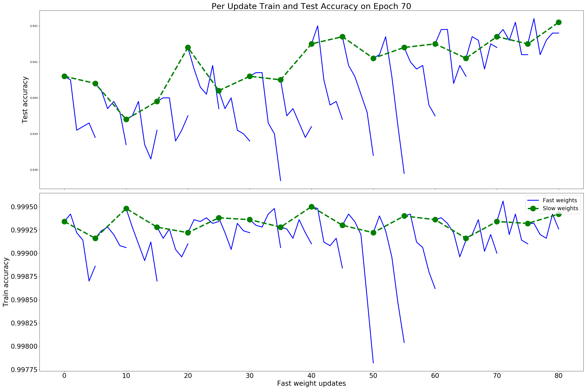

# Lookahead Optimizer: $k$ steps forward, $1$ step back

## Summary

The lookahead method provides an interesting way to accelerate and
stabilize algorithms of stochastic gradient descent family. The main
idea is quite simple:

- Set some number $k$. Take initial parameter weights $x_0 = \hat{x}_0$

- Do $k$ steps with your favorite optimization algorithm:
  $\hat{x}_1, \ldots, \hat{x}_k$

- Take some value between initial $x_0$ and $\hat{x}_k$:

  $$
    x_{t+1} = (1 - \alpha)x_{t} + \alpha\hat{x_k}
    $$

- Update $\hat{x_0}$ with the last output of the algorithm.

- Repeat ~~profit~~

Authors introduced separation on the *fast weights* and *slow weights*,
which naturally arise in the described procedure. The paper contains
proof for optimal step-size of the quadratic loss function and provides
understanding why this technique could reduce variance of  in the noisy quadratic
case. Moreover, this work compares the convergence rate in dependency of
condition number of the squared system.

It is worth to say, that author claims significant improvement in
practical huge scale settings (ImageNet, CIFAR10,CIFAR100)

## Pros

- Interesting idea, costs almost nothing, why not to try?
- Works with any SGD-like optimizer (SGD, Adam, RmsProp)
- Analytical approach to quadratic case.
- Wide set of empirical tests (Image classification, Neural Translation,
  LSTM training)

## Cons

- Lack of test loss pictures, the majority of them obtained for the
  train loss/accuracy
- Lack of pictures with different batch sizes
- Difficult to analyze the method analytically
