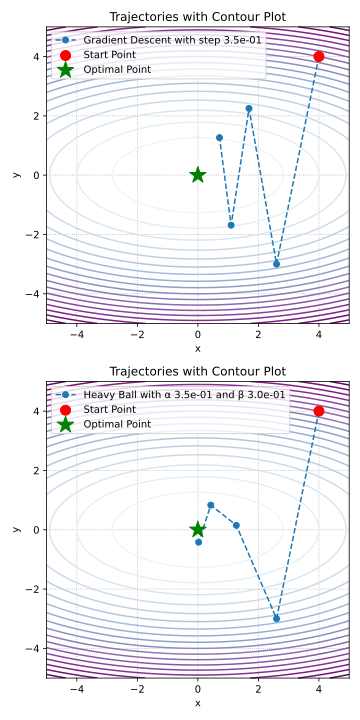

## Oscillations and acceleration

. ](GD_vs_HB_hor.svg)

## Coordinate shift

For an arbitrary strongly convex quadratic function we can introduce such new coordinates that the quadratic function matrix becomes diagonal. To do this, we turn to the spectral decomposition of the matrix $A = Q \Lambda Q^T$. Let $\hat{x} = Q^T(x - x^*)$, where $x^*$ is the minimum of the original function, defined as $Ax^* = b$. Then $x = Q\hat{x} + x^*$.
$$
\begin{split}
f(\hat{x}) &= \frac12  (Q\hat{x} + x^*)^\top  A (Q\hat{x} + x^*) - b^\top  (Q\hat{x} + x^*) \\
&= \frac12 \hat{x}^T Q^TAQ\hat{x} + \frac12 (x^*)^T A (x^*) + (x^*)^TAQ\hat{x} - b^T Q\hat{x} - b^T x^*\\
&= \frac12 \hat{x}^T \Lambda \hat{x} + \frac12 (x^*)^T A (x^*) + (x^*)^TAQ\hat{x} - (x^*)^T A^TQ\hat{x} - (x^*)^T A x^*\\
&= \frac12 \hat{x}^T \Lambda \hat{x} \underbrace{- \frac12 (x^*)^T A x^*}_{f(x^*)} \simeq \frac12 \hat{x}^T \Lambda \hat{x} 
\end{split}
$$
In the last transition, we discarded the constant term, which is exactly equal to $f(x^*)$. It is needed to make the values of the function in the new coordinates equal to the values of the function in the original coordinates, but it does not affect the method.

{fig-align="center" width="70%"}


## Polyak Heavy ball method

:::: {.columns}

::: {.column width="25%"}

:::

::: {.column width="75%"}
Let's introduce the idea of momentum, proposed by Polyak in 1964. Recall that the momentum update is
$$
x^{k+1} = x^k - \alpha \nabla f(x^k) + \beta (x^k - x^{k-1}).
$$
Which is in our (quadratics) case is
$$
\hat{x}_{k+1} = \hat{x}_k - \alpha \Lambda \hat{x}_k + \beta (\hat{x}_k - \hat{x}_{k-1}) = (I - \alpha \Lambda + \beta I) \hat{x}_k - \beta \hat{x}_{k-1}
$$
This can be rewritten as follows
$$
\begin{split}
&\hat{x}_{k+1} = (I - \alpha \Lambda + \beta I) \hat{x}_k - \beta \hat{x}_{k-1}, \\
&\hat{x}_{k} = \hat{x}_k.
\end{split}
$$
Let's use the following notation $\hat{z}_k = \begin{bmatrix} 
\hat{x}_{k+1} \\
\hat{x}_{k}
\end{bmatrix}$. Therefore $\hat{z}_{k+1} = M \hat{z}_k$, where the iteration matrix $M$ is:
$$
M = \begin{bmatrix} 
I - \alpha \Lambda + \beta I & - \beta I \\
I & 0_{d}
\end{bmatrix}.
$$

:::
::::

## Reduction to a scalar case

Note, that $M$ is $2d \times 2d$ matrix with 4 block-diagonal matrices of size $d \times d$ inside. It means, that we can rearrange the order of coordinates to make $M$ block-diagonal in the following form. Note that in the equation below, the matrix $M$ denotes the same as in the notation above, except for the described permutation of rows and columns. We use this slight abuse of notation for the sake of clarity. 

:::: {.columns}

::: {.column width="40%"}


:::
:::{.column width="60%"}
$$
\begin{aligned}
\begin{bmatrix} 
\hat{x}_{k}^{(1)} \\
\vdots \\
\hat{x}_{k}^{(d)} \\[0.5em]
\hat{x}_{k-1}^{(1)} \\
\vdots \\
\hat{x}_{k-1}^{(d)}
\end{bmatrix} \to 
\begin{bmatrix} 
\hat{x}_{k}^{(1)} \\[0.5em]
\hat{x}_{k-1}^{(1)} \\
\vdots \\
\hat{x}_{k}^{(d)} \\[0.5em]
\hat{x}_{k-1}^{(d)}
\end{bmatrix} \quad M = \begin{bmatrix}
M_1\\
&M_2\\
&&\ldots\\
&&&M_d
\end{bmatrix}
\end{aligned}
$$
:::
::::

where $\hat{x}_{k}^{(i)}$ is $i$-th coordinate of vector $\hat{x}_{k} \in \mathbb{R}^d$ and $M_i$ stands for $2 \times 2$ matrix. This rearrangement allows us to study the dynamics of the method independently for each dimension. One may observe, that the asymptotic convergence rate of the $2d$-dimensional vector sequence of $\hat{z}_k$ is defined by the worst convergence rate among its block of coordinates. Thus, it is enough to study the optimization in a one-dimensional case.

For $i$-th coordinate with $\lambda_i$ as an $i$-th eigenvalue of matrix $W$ we have: 
$$
M_i = \begin{bmatrix} 
1 - \alpha \lambda_i + \beta & -\beta \\
1 & 0
\end{bmatrix}.
$$
The method will be convergent if $\rho(M) < 1$, and the optimal parameters can be computed by optimizing the spectral radius
$$
\alpha^*, \beta^* = \arg \min_{\alpha, \beta} \max_{i} \rho(M_i) \quad \alpha^* = \dfrac{4}{(\sqrt{L} + \sqrt{\mu})^2}; \quad \beta^* = \left(\dfrac{\sqrt{L} - \sqrt{\mu}}{\sqrt{L} + \sqrt{\mu}}\right)^2.
$$
It can be shown, that for such parameters the matrix $M$ has complex eigenvalues, which forms a conjugate pair, so the distance to the optimum (in this case, $\Vert z_k \Vert$), generally, will not go to zero monotonically. 

## Heavy ball quadratic convergence

We can explicitly calculate the eigenvalues of $M_i$:
$$
\lambda^M_1, \lambda^M_2 = \lambda \left( \begin{bmatrix} 
1 - \alpha \lambda_i + \beta & -\beta \\
1 & 0
\end{bmatrix}\right) = \dfrac{1+\beta - \alpha \lambda_i \pm \sqrt{(1+\beta - \alpha\lambda_i)^2 - 4\beta}}{2}.
$$
When $\alpha$ and $\beta$ are optimal ($\alpha^*, \beta^*$), the eigenvalues are complex-conjugated pair $(1+\beta - \alpha\lambda_i)^2 - 4\beta \leq 0$, i.e. $\beta \geq (1 - \sqrt{\alpha \lambda_i})^2$.
$$
\text{Re}(\lambda^M) = \dfrac{L + \mu - 2\lambda_i}{(\sqrt{L} + \sqrt{\mu})^2}; \quad \text{Im}(\lambda^M) = \dfrac{\pm 2\sqrt{(L - \lambda_i)(\lambda_i - \mu)}}{(\sqrt{L} + \sqrt{\mu})^2}; \quad \vert \lambda^M \vert = \dfrac{L - \mu}{(\sqrt{L} + \sqrt{\mu})^2}.
$$
And the convergence rate does not depend on the stepsize and equals to $\sqrt{\beta^*}$.

:::{.callout-theorem}
Assume that $f$ is quadratic $\mu$-strongly convex $L$-smooth quadratics, then Heavy Ball method with parameters
$$
\alpha = \dfrac{4}{(\sqrt{L} + \sqrt{\mu})^2}, \beta = \left(\dfrac{\sqrt{L} - \sqrt{\mu}}{\sqrt{L} + \sqrt{\mu}}\right)^2
$$

converges linearly:

$$
\|x_k - x^*\|_2 \leq \left( \dfrac{\sqrt{\kappa} - 1}{\sqrt{\kappa} + 1} \right)^k \|x_0 - x^*\|
$$

:::


:::{.plotly}
heavy_ball_spectral_radius.html
:::

## Heavy Ball Global Convergence ^[[Global convergence of the Heavy-ball method for convex optimization, Euhanna Ghadimi et.al.](https://arxiv.org/abs/1412.7457)]

:::{.callout-theorem}
Assume that $f$ is smooth and convex and that

$$
\beta\in[0,1),\quad \alpha\in\biggl(0,\dfrac{2(1-\beta)}{L}\biggr).
$$

Then, the sequence $\{x_k\}$ generated by Heavy-ball iteration satisfies

$$
f(\overline{x}_T)-f^{\star} \leq  \begin{cases}
\frac{\Vert x_{0}-x^\star\Vert^2}{2(T+1)}\biggl(\frac{L\beta}{1-\beta}+\frac{1-\beta}{\alpha}\biggr) & \;\;\textup{if}\;\;
\alpha\in\left(0,\dfrac{1-\beta}{L}\right],\\[0.5em]
\frac{\Vert x_{0}-x^\star\Vert^2}{2(T+1)(2(1-\beta)-\alpha L)}\biggl({L\beta}+\frac{(1-\beta)^2}{\alpha}\biggr) & \;\;\textup{if}\;\;
\alpha\in\left[\dfrac{1-\beta}{L},\dfrac{2(1-\beta)}{L}\right),
\end{cases}
$$

where $\overline{x}_T$ is the Cesaro average of the iterates, i.e., 

$$
\overline{x}_T = \frac{1}{T+1}\sum_{k=0}^T x_k.
$$
:::

:::{.callout-theorem}
Assume that $f$ is smooth and strongly convex and that

$$
\alpha\in\left(0,\dfrac{2}{L}\right),\quad 0\leq  \beta<\dfrac{1}{2}\biggl( \dfrac{\mu \alpha}{2}+\sqrt{\dfrac{\mu^2\alpha^2}{4}+4(1-\frac{\alpha L}{2})} \biggr) .
$$

Then, the sequence $\{x_k\}$ generated by Heavy-ball iteration converges linearly to a unique optimizer $x^\star$. In particular,

$$
f(x_{k})-f^\star \leq q^k (f(x_0)-f^\star),
$$

where $q\in[0,1)$.
:::

## Heavy ball method summary

* Ensures accelerated convergence for strongly convex quadratic problems
* Local accelerated convergence was proved in the original paper.
* Recently ^[[Provable non-accelerations of the heavy-ball method](https://arxiv.org/pdf/2307.11291)] was proved, that there is no global accelerated convergence for the method.
* Method was not extremely popular until the ML boom
* Nowadays, it is de-facto standard for practical acceleration of gradient methods, even for the non-convex problems (neural network training)

::: {.panel-tabset}

### 📚 bibtex
```bibtex
@article{polyak1964some,
  title={Some methods of speeding up the convergence of iteration methods},
  journal={Ussr computational mathematics and mathematical physics},
  volume={4},
  number={5},
  pages={1--17},
  year={1964},
  publisher={Elsevier}
}
```
:::