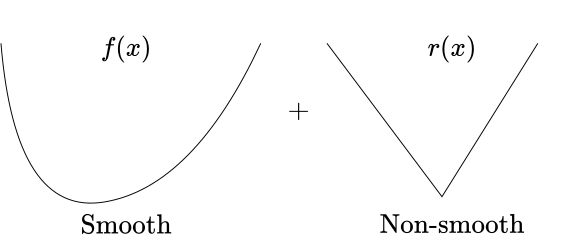
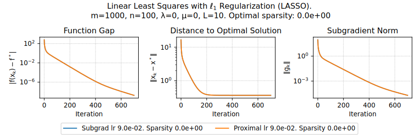
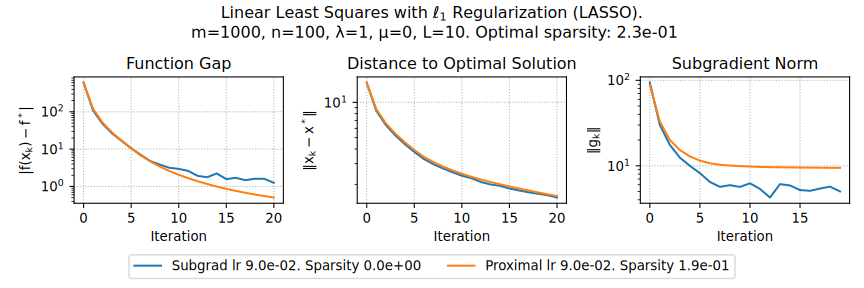
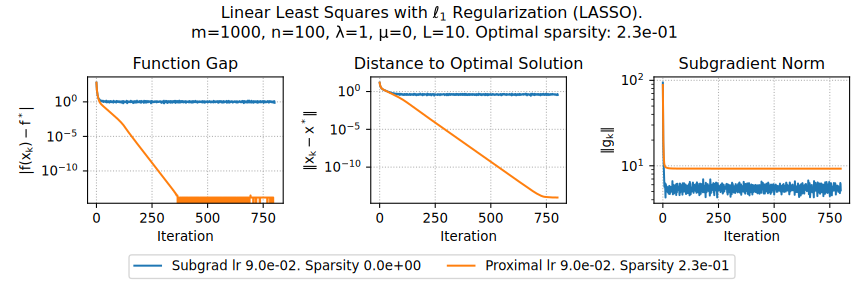
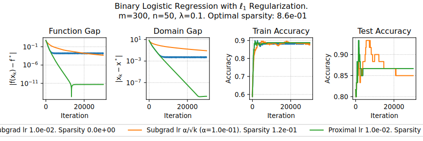
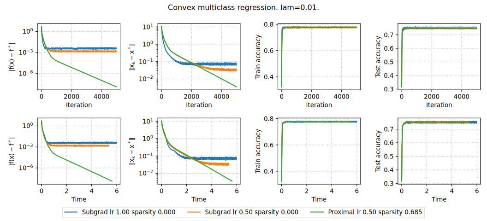

# Proximal operator

## Proximal mapping intuition

Consider Gradient Flow ODE:
$$
\dfrac{dx}{dt} = - \nabla f(x)
$$

**Explicit Euler discretization:**
$$
\frac{x_{k+1} - x_k}{\alpha} = -\nabla f(x_k)
$$
Leads to ordinary Gradient Descent method

**Implicit Euler discretization:**
$$
\begin{aligned}
\frac{x_{k+1} - x_k}{\alpha} = -\nabla f(x_{k+1}) \\
\frac{x_{k+1} - x_k}{\alpha} + \nabla f(x_{k+1}) = 0 \\
\left. \frac{x - x_k}{\alpha} + \nabla f(x)\right|_{x = x_{k+1}} = 0 \\
\left. \nabla \left[ \frac{1}{2\alpha} \|x - x_k\|^2_2 + f(x) \right]\right|_{x = x_{k+1}} = 0 \\
x_{k+1} = \text{arg}\min_{x\in \mathbb{R}^n} \left[ f(x) +  \frac{1}{2\alpha} \|x - x_k\|^2_2 \right]
\end{aligned}
$$

:::{.callout-important}
### Proximal operator
$$
\text{prox}_{f, \alpha}(x_k) = \text{arg}\min_{x\in \mathbb{R}^n} \left[ f(x) +  \frac{1}{2\alpha} \|x - x_k\|^2_2 \right]
$$
:::

## Proximal operator visualization

](prox_vis.jpeg){width=63%}

## Proximal mapping intuition

* **GD from proximal method.** Back to the discretization:
   $$
   \begin{aligned}
   x_{k+1} + \alpha \nabla f(x_{k+1}) &= x_k \\
   (I + \alpha \nabla f ) (x_{k+1}) &= x_k \\
   x_{k+1} = (I + \alpha \nabla f )^{-1} x_k &\stackrel{\alpha \to 0}{\approx} (I - \alpha \nabla f) x_k
   \end{aligned}
   $$
   Thus, we have a usual gradient descent with $\alpha \to 0$: $x_{k+1} = x_k - \alpha \nabla f(x_k)$

* **Newton from proximal method.** Now let's consider proximal mapping of a second order Taylor approximation of the function $f^{II}_{x_k}(x)$:
   $$
   \begin{aligned}
   x_{k+1} = \text{prox}_{f^{II}_{x_k}, \alpha}(x_k) &=  \text{arg}\min_{x\in \mathbb{R}^n} \left[ f(x_k) + \langle \nabla f(x_k), x - x_k\rangle + \frac{1}{2} \langle \nabla^2 f(x_k)(x-x_k), x-x_k \rangle +  \frac{1}{2\alpha} \|x - x_k\|^2_2 \right] & \\
   & \left. \nabla f(x_{k}) + \nabla^2 f(x_k)(x - x_k) + \frac{1}{\alpha}(x - x_k)\right|_{x = x_{k+1}} = 0 & \\
   & x_{k+1} = x_k - \left[\nabla^2 f(x_k) + \frac{1}{\alpha} I\right]^{-1} \nabla f(x_{k}) &
   \end{aligned}
   $$

## From projections to proximity

Let $\mathbb{I}_S$ be the indicator function for closed, convex $S$. Recall orthogonal projection $\pi_S(y)$

$$
\pi_S(y) := \arg\min_{x \in S} \frac{1}{2}\|x-y\|_2^2.
$$

With the following notation of indicator function
$$
\mathbb{I}_S(x) = \begin{cases} 0, &x \in S, \\ \infty, &x \notin S, \end{cases}
$$

Rewrite orthogonal projection $\pi_S(y)$ as
$$
\pi_S(y) := \arg\min_{x \in \mathbb{R}^n} \frac{1}{2} \|x - y\|^2 + \mathbb{I}_S (x).
$$

Proximity: Replace $\mathbb{I}_S$ by some convex function!
$$
\text{prox}_{r} (y) = \text{prox}_{r, 1} (y) := \arg\min \frac{1}{2} \|x - y\|^2 + r(x)
$$

# Composite optimization

## Regularized / Composite Objectives

Many nonsmooth problems take the form
$$
\min_{x \in \mathbb{R}^n} \varphi(x) = f(x) + r(x)
$$

* **Lasso, L1-LS, compressed sensing** 
    $$
    f(x) = \frac12 \|Ax - b\|_2^2, r(x) = \lambda \|x\|_1
    $$
* **L1-Logistic regression, sparse LR**
    $$
    f(x) = -y \log h(x) - (1-y)\log(1-h(x)), r(x) = \lambda \|x\|_1
    $$

## Proximal mapping intuition

Optimality conditions:
$$
\begin{aligned}
0 &\in \nabla f(x^*) + \partial r(x^*) \\
0 &\in \alpha \nabla f(x^*) + \alpha \partial r(x^*) \\
x^* &\in \alpha \nabla f(x^*) + (I + \alpha \partial r)(x^*) \\
x^* - \alpha \nabla f(x^*) &\in (I + \alpha \partial r)(x^*) \\
x^* &= (I + \alpha \partial r)^{-1}(x^* - \alpha \nabla f(x^*)) \\
x^* &= \text{prox}_{r, \alpha}(x^* - \alpha \nabla f(x^*))
\end{aligned}
$$

Which leads to the proximal gradient method:
$$
x_{k+1} = \text{prox}_{r, \alpha}(x_k - \alpha \nabla f(x_k))
$$
And this method converges at a rate of $\mathcal{O}(\frac{1}{k})$!

:::{.callout-note}
## Another form of proximal operator
$$
\text{prox}_{f, \alpha}(x_k) = \text{prox}_{\alpha f}(x_k) = \text{arg}\min_{x\in \mathbb{R}^n} \left[ \alpha f(x) +  \frac{1}{2} \|x - x_k\|^2_2 \right] \qquad \text{prox}_{f}(x_k) = \text{arg}\min_{x\in \mathbb{R}^n} \left[ f(x) +  \frac{1}{2} \|x - x_k\|^2_2 \right] 
$$
:::

## Proximal operators examples

* $r(x) = \lambda \|x\|_1$, $\lambda > 0$
    $$
    [\text{prox}_r(x)]_i = \left[ |x_i| - \lambda \right]_+ \cdot \text{sign}(x_i),
    $$
    which is also known as soft-thresholding operator.
* $r(x) = \frac{\lambda}{2} \|x\|_2^2$, $\lambda > 0$
    $$
    \text{prox}_{r}(x) =  \frac{x}{1 + \lambda}.
    $$
* $r(x) = \mathbb{I}_S(x)$.
    $$
    \text{prox}_{r}(x_k - \alpha \nabla f(x_k)) = \text{proj}_{r}(x_k - \alpha \nabla f(x_k))
    $$

## Proximal operator properties

:::{.callout-theorem}
Let $r: \mathbb{R}^n \to \mathbb{R} \cup \{+\infty\}$ be a convex function for which $\text{prox}_r$ is defined. If there exists such an $\hat{x} \in \mathbb{R}^n$ that $r(x) < +\infty$. Then, the proximal operator is uniquely defined (i.e., it always returns a single unique value).
:::
**Proof**: 

The proximal operator returns the minimum of some optimization problem. 

Question: What can be said about this problem? 

It is strongly convex, meaning it has exactly one unique minimum (the existence of $\hat{x}$ is necessary for $r(\tilde{x}) + \frac{1}{2} \| x - \tilde{x} \|_2^2$ to take a finite value somewhere).

## Proximal operator properties

:::{.callout-theorem}
Let $r : \mathbb{R}^n \rightarrow \mathbb{R} \cup \{+\infty\}$ be a convex function for which $\text{prox}_r$ is defined. Then, for any $x, y \in \mathbb{R}^n$, the following three conditions are equivalent:

* $\text{prox}_r(x) = y$,
* $x - y \in \partial r(y)$,
* $\langle x - y, z - y \rangle \leq r(z) - r(y)$ for any $z \in \mathbb{R}^n$.
:::

**Proof**

1. Let's establish the equivalence between the first and second conditions.The first condition can be rewritten as
    $$
    y = \arg \min_{\tilde{x} \in \mathbb{R}^d} \left( r(\tilde{x}) + \frac{1}{2} \| x - \tilde{x} \|^2 \right).
    $$
    From the optimality condition for the convex function $r$, this is equivalent to:
    $$
    0 \in \left.\partial \left( r(\tilde{x}) + \frac{1}{2} \| x - \tilde{x} \|^2 \right)\right|_{\tilde{x} = y} = \partial r(y) + y - x.
    $$

2. From the definition of the subdifferential, for any subgradient $g \in \partial f(y)$ and for any $z \in \mathbb{R}^d$:
    $$
    \langle g, z - y \rangle \leq r(z) - r(y).
    $$
    In particular, this holds true for $g = x - y$. Conversely, it is also clear: for $g = x - y$, the above relationship holds, which means $g \in \partial r(y)$.

## Proximal operator properties

:::{.callout-theorem}
The operator $\text{prox}_{r}(x)$ is firmly nonexpansive (FNE) 
$$
\|\text{prox}_{r}(x) -\text{prox}_{r}(y)\|_2^2 \leq \langle\text{prox}_{r}(x)-\text{prox}_{r}(y), x-y\rangle
$$
and nonexpansive:
$$
\|\text{prox}_{r}(x) -\text{prox}_{r}(y)\|_2 \leq \|x-y \|_2
$$
:::

**Proof**

1. Let $u = \text{prox}_r(x)$, and $v = \text{prox}_r(y)$. Then, from the previous property:
    $$
    \begin{aligned}
    \langle x - u, z_1 - u \rangle \leq r(z_1) - r(u) \\
    \langle y - v, z_2 - v \rangle \leq r(z_2) - r(v).
    \end{aligned}
    $$

2. Substitute $z_1 = v$ and $z_2 = u$. Summing up, we get:
    $$
    \begin{aligned}
    \langle x - u, v - u \rangle + \langle y - v, u - v \rangle \leq 0,\\
    \langle x - y, v - u \rangle + \|v - u\|^2_2 \leq 0.
    \end{aligned}
    $$

3. Which is exactly what we need to prove after substitution of $u,v$. 
    $$
    \|u -v\|_2^2 \leq \langle x - y, u - v \rangle 
    $$

4. The last point comes from simple Cauchy-Bunyakovsky-Schwarz for the last inequality.

## Proximal operator properties

:::{.callout-theorem}
Let $f: \mathbb{R}^n \rightarrow \mathbb{R} \cup \{+\infty\}$ and $r: \mathbb{R}^n \rightarrow \mathbb{R} \cup \{+\infty\}$ be convex functions. Additionally, assume that $f$ is continuously differentiable and $L$-smooth, and for $r$, $\text{prox}_r$ is defined. Then, $x^*$ is a solution to the composite optimization problem if and only if, for any $\alpha > 0$, it satisfies:
$$
x^* = \text{prox}_{r, \alpha}(x^* - \alpha \nabla f(x^*))
$$
:::

**Proof**

1. Optimality conditions:
    $$
    \begin{aligned}
     0 \in & \nabla f(x^*) + \partial r(x^*) \\ 
     - \alpha \nabla f(x^*) \in & \alpha \partial r(x^*) \\ 
     x^* - \alpha \nabla f(x^*) - x^* \in & \alpha \partial r(x^*) 
    \end{aligned}
    $$
2. Recall from the previous lemma: 
    $$
    \text{prox}_r(x) = y \Leftrightarrow x - y \in \partial r(y)
    $$
3. Finally, 
    $$
    x^* = \text{prox}_{\alpha r}(x^* - \alpha \nabla f(x^*)) = \text{prox}_{r, \alpha}(x^* - \alpha \nabla f(x^*))
    $$

# Theoretical tools for convergence analysis

## Convergence tools \faGem \ \faGem[regular] \faGem[regular] \faGem[regular]

:::{.callout-theorem}
Let $f: \mathbb{R}^n \rightarrow \mathbb{R}$ be an $L$-smooth convex function. Then, for any $x, y \in \mathbb{R}^n$, the following inequality holds:

$$
\begin{aligned}
f(x) + \langle \nabla f(x), y - x \rangle + \frac{1}{2L} & \|\nabla f(x) - \nabla f(y)\|^2_2 \leq f(y) \text{ or, equivalently, }\\
\|\nabla f(y)-\nabla f (x)\|_2^2 = & \|\nabla f(x)-\nabla f (y)\|_2^2 \leq 2L\left(f(x)-f(y)-\langle\nabla f (y),x -y\rangle \right)
\end{aligned}
$$
:::

**Proof**

1. To prove this, we'll consider another function $\varphi(y) = f(y) - \langle \nabla f(x), y\rangle$. It is obviously a convex function (as a sum of convex functions). And it is easy to verify, that it is an $L$-smooth function by definition, since $\nabla \varphi(y) = \nabla f(y) - \nabla f(x)$ and $\|\nabla \varphi(y_1) - \nabla \varphi(y_2)\| = \|\nabla f(y_1) - \nabla f(y_2)\| \leq L\|y_1 - y_2\|$.
2. Now let's consider the smoothness parabolic property for the $\varphi(y)$ function:
  $$
  \begin{aligned}
  \varphi(y) & \leq  \varphi(x) + \langle \nabla \varphi(x), y-x \rangle + \frac{L}{2}\|y-x\|_2^2 \\ 
  \stackrel{x := y, y := y - \frac1L \nabla\varphi(y)}{ }\;\;\varphi\left(y - \frac1L \nabla\varphi(y)\right) &  \leq \varphi(y) + \left\langle \nabla \varphi(y), - \frac1L \nabla\varphi(y)\right\rangle + \frac{1}{2L}\|\nabla\varphi(y)\|_2^2 \\ 
  \varphi\left(y - \frac1L \nabla\varphi(y)\right) &  \leq \varphi(y) - \frac{1}{2L}\|\nabla\varphi(y)\|_2^2 
  \end{aligned}
  $$

## Convergence tools \faGem \ \faGem \ \faGem[regular] \faGem[regular]

3. From the first order optimality conditions for the convex function $\nabla \varphi (y) =\nabla f(y) - \nabla f(x) = 0$. We can conclude, that for any $x$, the minimum of the function $\varphi(y)$ is at the point $y=x$. Therefore:
  $$
  \varphi(x) \leq \varphi\left(y - \frac1L \nabla\varphi(y)\right) \leq \varphi(y) - \frac{1}{2L}\|\nabla\varphi(y)\|_2^2
  $$
4. Now, substitute $\varphi(y) = f(y) - \langle \nabla f(x), y\rangle$:
  $$
  \begin{aligned}
  & f(x) - \langle \nabla f(x), x\rangle \leq f(y) - \langle \nabla f(x), y\rangle - \frac{1}{2L}\|\nabla f(y) - \nabla f(x)\|_2^2 \\
  & f(x) + \langle \nabla f(x), y - x \rangle + \frac{1}{2L} \|\nabla f(x) - \nabla f(y)\|^2_2 \leq f(y) \\ 
  & \|\nabla f(y) - \nabla f(x)\|^2_2 \leq 2L \left( f(y) - f(x) - \langle \nabla f(x), y - x \rangle \right) \\ 
  {\scriptsize \text{switch x and y}} \quad & \|\nabla f(x)-\nabla f (y)\|_2^2 \leq 2L\left(f(x)-f(y)-\langle\nabla f (y),x -y\rangle \right)
  \end{aligned}
  $$

The lemma has been proved. From the first view it does not make a lot of geometrical sense, but we will use it as a convenient tool to bound the difference between gradients.

## Convergence tools \faGem \ \faGem \ \faGem \ \faGem[regular]

:::{.callout-theorem}
Let $f: \mathbb{R}^n \rightarrow \mathbb{R}$ be continuously differentiable on $\mathbb{R}^n$. Then, the function $f$ is $\mu$-strongly convex if and only if for any $x, y \in \mathbb{R}^d$ the following holds:
$$
\begin{aligned}
\text{Strongly convex case } \mu >0 & &\langle \nabla f(x) - \nabla f(y), x - y \rangle &\geq \mu \|x - y\|^2 \\
\text{Convex case } \mu = 0 & &\langle \nabla f(x) - \nabla f(y), x - y \rangle &\geq 0
\end{aligned}
$$
:::

**Proof**

1. We will only give the proof for the strongly convex case, the convex one follows from it with setting $\mu=0$. We start from necessity. For the strongly convex function
  $$
  \begin{aligned}
  & f(y) \geq f(x) + \langle \nabla f(x), y-x\rangle + \frac{\mu}{2}\|x-y\|_2^2 \\
  & f(x) \geq f(y) + \langle \nabla f(y), x-y\rangle + \frac{\mu}{2}\|x-y\|_2^2 \\
  {\scriptsize \text{sum}} \;\; & \langle \nabla f(x) - \nabla f(y), x - y \rangle \geq \mu \|x - y\|^2
  \end{aligned}
  $$

## Convergence tools \faGem \ \faGem \ \faGem \ \faGem

2. For the sufficiency we assume, that $\langle \nabla f(x) - \nabla f(y), x - y \rangle \geq \mu \|x - y\|^2$. Using Newton-Leibniz theorem $f(x) = f(y) + \int_{0}^{1} \langle \nabla f(y + t(x - y)), x - y \rangle dt$:
  $$
  \begin{aligned}
   f(x) - f(y) - \langle \nabla f(y), x - y \rangle &= \int_{0}^{1} \langle \nabla f(y + t(x - y)), x - y \rangle dt - \langle \nabla f(y), x - y \rangle \\ 
   \stackrel{ \langle \nabla f(y), x - y \rangle = \int_{0}^{1}\langle \nabla f(y), x - y \rangle dt}{ }\qquad &= \int_{0}^{1} \langle \nabla f(y + t(x - y)) - \nabla f(y), (x - y) \rangle dt \\ 
   \stackrel{ y + t(x - y) - y = t(x - y)}{ }\qquad&= \int_{0}^{1} t^{-1} \langle \nabla f(y + t(x - y)) - \nabla f(y), t(x - y) \rangle dt \\ 
   & \geq \int_{0}^{1} t^{-1} \mu \| t(x - y) \|^2 dt   = \mu \| x - y \|^2 \int_{0}^{1} t dt = \frac{\mu}{2} \| x - y \|^2_2 
  \end{aligned}
  $$

  

  Thus, we have a strong convexity criterion satisfied
  $$
  \begin{aligned}
   & f(x) \geq f(y) + \langle \nabla f(y), x - y \rangle + \frac{\mu}{2} \| x - y \|^2_2  \text{ or, equivivalently: }\\ 
   {\scriptsize \text{switch x and y}} \quad & - \langle \nabla f(x), x - y \rangle \leq - \left(f(x) - f(y) + \frac{\mu}{2} \| x - y \|^2_2 \right) 
  \end{aligned}
  $$

# Proximal Gradient Method. Convex case

## Convergence

:::{.callout-theorem}

Consider the proximal gradient method
$$
x_{k+1} = \text{prox}_{\alpha r}\left(x_k - \alpha \nabla f(x_k)\right)
$$
For the criterion $\varphi(x) = f(x) + r(x)$, we assume:

::: {.nonincremental}
* $f$ is convex, differentiable, $\text{dom}(f) = \mathbb{R}^n$, and $\nabla f$ is Lipschitz continuous with constant $L > 0$.
* $r$ is convex, and $\text{prox}_{\alpha r}(x_k) = \text{arg}\min\limits_{x\in \mathbb{R}^n} \left[ \alpha r(x) +  \frac{1}{2} \|x - x_k\|^2_2 \right]$ can be evaluated.
:::

Proximal gradient descent with fixed step size $\alpha = 1/L$ satisfies
$$
\varphi(x_k) - \varphi^* \leq \frac{L \|x_0 - x^*\|^2}{2 k},
$$
:::

Proximal gradient descent has a convergence rate of $O(1/k)$ or $O(1/\varepsilon)$. This matches the gradient descent rate! (But remember the proximal operation cost)

## Convergence \faGem \ \faGem[regular] \faGem[regular] \faGem[regular] \faGem[regular]

**Proof**

1. Let's introduce the **gradient mapping**, denoted as $G_{\alpha}(x)$, acts as a "gradient-like object":
  $$
  \begin{aligned}
  x_{k+1} &= \text{prox}_{\alpha r}(x_k - \alpha \nabla f(x_k))\\
  x_{k+1} &= x_k - \alpha G_{\alpha}(x_k).
  \end{aligned}
  $$
  
  where $G_{\alpha}(x)$ is:
  $$
  G_{\alpha}(x) = \frac{1}{\alpha} \left( x - \text{prox}_{\alpha r}\left(x - \alpha \nabla f\left(x\right)\right) \right)
  $$

  Observe that $G_{\alpha}(x) = 0$ if and only if $x$ is optimal. Therefore, $G_{\alpha}$ is analogous to $\nabla f$. If $x$ is locally optimal, then $G_{\alpha}(x) = 0$ even for nonconvex $f$. This demonstrates that the proximal gradient method effectively combines gradient descent on $f$ with the proximal operator of $r$, allowing it to handle non-differentiable components effectively.

2. We will use smoothness and convexity of $f$ for some arbitrary point $x$:
  $$
  \begin{aligned}
   {\scriptsize \text{smoothness}} \;\; f(x_{k+1}) &\leq  f(x_k) + \langle \nabla f(x_k), x_{k+1}-x_k \rangle + \frac{L}{2}\|x_{k+1}-x_k\|_2^2 \\ 
   \stackrel{\text{convexity } f(x) \geq f(x_k) + \langle \nabla f(x_k), x-x_k \rangle}{ } \;\;   &\leq f(x) - \langle \nabla f(x_k), x-x_k \rangle + \langle \nabla f(x_k), x_{k+1}-x_k \rangle + \frac{\alpha^2 L}{2}\|G_{\alpha}(x_k)\|_2^2 \\ 
   &\leq f(x) + \langle \nabla f(x_k), x_{k+1}-x \rangle + \frac{\alpha^2 L}{2}\|G_{\alpha}(x_k)\|_2^2 
  \end{aligned}
  $$

## Convergence \faGem \ \faGem \ \faGem[regular] \faGem[regular] \faGem[regular]

3. Now we will use a proximal map property, which was proven before:
  $$
  \begin{aligned}
   x_{k+1} = \text{prox}_{\alpha r}\left(x_k - \alpha \nabla f(x_k)\right) \qquad  \Leftrightarrow \qquad x_k - \alpha \nabla f(x_k) - x_{k+1} \in \partial \alpha r (x_{k+1}) \\ 
   \text{Since } x_{k+1} - x_k = - \alpha G_{\alpha}(x_k) \qquad \Rightarrow \qquad  \alpha G_{\alpha}(x_k) - \alpha \nabla f(x_k) \in \partial \alpha r (x_{k+1}) \\ 
   G_{\alpha}(x_k) - \nabla f(x_k) \in \partial r (x_{k+1}) 
  \end{aligned}
  $$
4. By the definition of the subgradient of convex function $r$ for any point $x$:
  $$
  \begin{aligned}
   & r(x) \geq r(x_{k+1}) + \langle g, x - x_{k+1} \rangle, \quad g \in \partial r (x_{k+1}) \\ 
   {\scriptsize \text{substitute specific subgradient}} \qquad & r(x) \geq r(x_{k+1}) + \langle G_{\alpha}(x_k) - \nabla f(x), x - x_{k+1} \rangle \\ 
   & r(x) \geq r(x_{k+1}) + \langle G_{\alpha}(x_k), x - x_{k+1} \rangle - \langle \nabla f(x), x - x_{k+1} \rangle \\ 
   & \langle \nabla f(x),x_{k+1} - x \rangle \leq r(x) - r(x_{k+1}) - \langle G_{\alpha}(x_k), x - x_{k+1} \rangle 
  \end{aligned}
  $$
5. Taking into account the above bound we return back to the smoothness and convexity:
  $$
  \begin{aligned}
   f(x_{k+1}) &\leq f(x) + \langle \nabla f(x_k), x_{k+1}-x \rangle + \frac{\alpha^2 L}{2}\|G_{\alpha}(x_k)\|_2^2 \\ 
   f(x_{k+1}) &\leq f(x) + r(x) - r(x_{k+1}) - \langle G_{\alpha}(x_k), x - x_{k+1} \rangle + \frac{\alpha^2 L}{2}\|G_{\alpha}(x_k)\|_2^2 \\ 
   f(x_{k+1}) + r(x_{k+1}) &\leq f(x) + r(x) - \langle G_{\alpha}(x_k), x - x_k + \alpha G_{\alpha}(x_k) \rangle + \frac{\alpha^2 L}{2}\|G_{\alpha}(x_k)\|_2^2 
  \end{aligned}
  $$

## Convergence \faGem \ \faGem \ \faGem \ \faGem[regular] \faGem[regular]

6. Using $\varphi(x) = f(x) + r(x)$ we can now prove extremely useful inequality, which will allow us to demonstrate monotonic decrease of the iteration:
  $$
  \begin{aligned}
   & \varphi(x_{k+1}) \leq \varphi(x) - \langle G_{\alpha}(x_k), x - x_k \rangle - \langle G_{\alpha}(x_k), \alpha G_{\alpha}(x_k) \rangle + \frac{\alpha^2 L}{2}\|G_{\alpha}(x_k)\|_2^2 \\ 
   & \varphi(x_{k+1}) \leq \varphi(x) + \langle G_{\alpha}(x_k), x_k - x \rangle + \frac{\alpha}{2} \left( \alpha L - 2 \right) \|G_{\alpha}(x_k) \|_2^2 \\ 
   \stackrel{\alpha \leq \frac1L \Rightarrow \frac{\alpha}{2} \left( \alpha L - 2 \right) \leq  -\frac{\alpha}{2}}{ } \quad   & \varphi(x_{k+1}) \leq \varphi(x) + \langle G_{\alpha}(x_k), x_k - x \rangle - \frac{\alpha}{2} \|G_{\alpha}(x_k) \|_2^2 
  \end{aligned}
  $$
7. Now it is easy to verify, that when $x = x_k$ we have monotonic decrease for the proximal gradient algorithm:
  $$
  \varphi(x_{k+1}) \leq \varphi(x_k) - \frac{\alpha}{2} \|G_{\alpha}(x_k) \|_2^2
  $$

## Convergence \faGem \ \faGem \ \faGem \ \faGem \ \faGem[regular]

8. When $x = x^*$:
  $$
  \begin{aligned}
   \varphi(x_{k+1}) &\leq \varphi(x^*) + \langle G_{\alpha}(x_k), x_k - x^* \rangle - \frac{\alpha}{2} \|G_{\alpha}(x_k) \|_2^2 \\ 
   \varphi(x_{k+1}) - \varphi(x^*) &\leq \langle G_{\alpha}(x_k), x_k - x^* \rangle - \frac{\alpha}{2} \|G_{\alpha}(x_k) \|_2^2 \\ 
   &\leq \frac{1}{2\alpha}\left[2 \langle \alpha G_{\alpha}(x_k), x_k - x^* \rangle - \|\alpha G_{\alpha}(x_k) \|_2^2\right] \\ 
   &\leq \frac{1}{2\alpha}\left[2 \langle \alpha G_{\alpha}(x_k), x_k - x^* \rangle - \|\alpha G_{\alpha}(x_k) \|_2^2 - \|x_k - x^* \|_2^2 + \|x_k - x^* \|_2^2\right] \\ 
   &\leq \frac{1}{2\alpha}\left[- \|x_k - x^* -  \alpha G_{\alpha}(x_k)\|_2^2 + \|x_k - x^* \|_2^2\right] \\ 
   &\leq \frac{1}{2\alpha}\left[\|x_k - x^* \|_2^2 - \|x_{k+1} - x^* \|_2^2\right] 
  \end{aligned}
  $$

## Convergence \faGem \ \faGem \ \faGem \ \faGem \ \faGem

9. Now we write the bound above for all iterations $i \in 0, k-1$ and sum them:
  $$
  \begin{aligned}
   \sum\limits_{i=0}^{k-1}\left[ \varphi(x_{i+1}) - \varphi(x^*) \right] & \leq \frac{1}{2\alpha}\left[\|x_0 - x^* \|_2^2 - \|x_{k} - x^* \|_2^2\right] \\ 
   & \leq \frac{1}{2\alpha} \|x_0 - x^* \|_2^2 
  \end{aligned}
  $$

10. Since $\varphi(x_{k})$ is a decreasing sequence, it follows that:
  $$
  \begin{aligned}
   \sum\limits_{i=0}^{k-1} \varphi(x_{k})= k \varphi(x_{k}) &\leq \sum\limits_{i=0}^{k-1} \varphi(x_{i+1}) \\ 
   \varphi(x_{k}) &\leq \frac1k \sum\limits_{i=0}^{k-1} \varphi(x_{i+1}) \\ 
   \varphi(x_{k})  - \varphi(x^*) &\leq \frac1k \sum\limits_{i=0}^{k-1}\left[ \varphi(x_{i+1}) - \varphi(x^*)\right] \leq \frac{\|x_0 - x^* \|_2^2}{2\alpha k} 
  \end{aligned}
  $$

  

  Which is a standard $\frac{L \|x_0 - x^* \|_2^2}{2 k}$ with $\alpha = \frac1L$, or, $\mathcal{O}\left( \frac1k \right)$ rate for smooth convex problems with Gradient Descent!

# Proximal Gradient Method. Strongly convex case

## Convergence

:::{.callout-theorem}

Consider the proximal gradient method
$$
x_{k+1} = \text{prox}_{\alpha r}\left(x_k - \alpha \nabla f(x_k)\right)
$$
For the criterion $\varphi(x) = f(x) + r(x)$, we assume:

::: {.nonincremental}
* $f$ is $\mu$-strongly convex, differentiable, $\text{dom}(f) = \mathbb{R}^n$, and $\nabla f$ is Lipschitz continuous with constant $L > 0$.
* $r$ is convex, and $\text{prox}_{\alpha r}(x_k) = \text{arg}\min\limits_{x\in \mathbb{R}^n} \left[ \alpha r(x) +  \frac{1}{2} \|x - x_k\|^2_2 \right]$ can be evaluated.
:::

Proximal gradient descent with fixed step size $\alpha \leq 1/L$ satisfies
$$
\|x_{k} - x^*\|_2^2 \leq \left(1 - \alpha \mu\right)^k \|x_{0} - x^*\|_2^2
$$
:::

This is exactly gradient descent convergence rate. Note, that the original problem is even non-smooth!

## Convergence \faGem \ \faGem[regular]

**Proof**

1. Considering the distance to the solution and using the stationary point lemm:
  $$
  \begin{aligned}
   \|x_{k+1} - x^*\|^2_2 &= \|\text{prox}_{\alpha f} (x_k - \alpha \nabla f (x_k)) - x^*\|^2_2 \\ 
   {\scriptsize \text{stationary point lemm}}  & = \|\text{prox}_{\alpha f} (x_k - \alpha \nabla f (x_k)) - \text{prox}_{\alpha f} (x^* - \alpha \nabla f (x^*)) \|^2_2 \\ 
   {\scriptsize \text{nonexpansiveness}}   & \leq \|x_k - \alpha \nabla f (x_k) - x^* + \alpha \nabla f (x^*) \|^2_2 \\ 
   & =  \|x_k - x^*\|^2 - 2\alpha \langle \nabla f(x_k) - \nabla f(x^*), x_k - x^* \rangle + \alpha^2 \|\nabla f(x_k) - \nabla f(x^*)\|^2_2 
  \end{aligned}
  $$

2. Now we use smoothness from the convergence tools and strong convexity: 
  $$
  \begin{aligned}
   \text{smoothness} \;\; &\|\nabla f(x_k)-\nabla f (x^*)\|_2^2 \leq 2L\left(f(x_k)-f(x^*)-\langle\nabla f (x^*),x_k -x^*\rangle \right) \\ 
   \text{strong convexity} \;\; & - \langle \nabla f(x_k) -  \nabla f(x^*), x_k - x^* \rangle \leq - \left(f(x_k) - f(x^*) + \frac{\mu}{2} \| x_k - x^* \|^2_2 \right) - \langle \nabla f(x^*), x_k - x^* \rangle 
  \end{aligned}
  $$

## Convergence \faGem \ \faGem

3. Substitute it:
  $$
  \begin{aligned}
   \|x_{k+1} - x^*\|^2_2 &\leq \|x_k - x^*\|^2 - 2\alpha \left(f(x_k) - f(x^*) + \frac{\mu}{2} \| x_k - x^* \|^2_2 \right) - 2\alpha \langle \nabla f(x^*), x_k - x^* \rangle + \\ 
  & + \alpha^2 2L\left(f(x_k)-f(x^*)-\langle\nabla f (x^*),x_k -x^*\rangle \right)  \\ 
   &\leq (1 - \alpha \mu)\|x_k - x^*\|^2 + 2\alpha (\alpha L - 1) \left( f(x_k) - f(x^*) - \langle \nabla f(x^*), x_k - x^* \rangle \right)
  \end{aligned}
  $$

4. Due to convexity of $f$: $f(x_k) - f(x^*) - \langle \nabla f(x^*), x_k - x^* \rangle \geq 0$. Therefore, if we use $\alpha \leq \frac1L$:
  $$
  \|x_{k+1} - x^*\|^2_2 \leq (1 - \alpha \mu)\|x_k - x^*\|^2,
  $$
  which is exactly linear convergence of the method with up to $1 - \frac{\mu}{L}$ convergence rate.

## Accelerated Proximal Gradient ‒ *convex* objective

:::{.callout-theorem}

### Accelerated Proximal Gradient Method

Let $f:\mathbb{R}^n\!\to\!\mathbb{R}$ be **convex** and **$L$‑smooth**, $r:\mathbb{R}^n\!\to\!\mathbb{R}\cup\{+\infty\}$ be proper, closed and convex, $\varphi(x)=f(x)+r(x)$ admit a minimiser $x^\star$, and suppose $\operatorname{prox}_{\alpha r}$ is easy to evaluate for $\alpha>0$. With any $x_0\in\operatorname{dom}r$ define the sequence  
$$
\begin{aligned}
t_0 &= 1,\qquad y_0 = x_0,\\
x_k &= \operatorname{prox}_{\tfrac1L r}\!\bigl(y_{k-1}-\tfrac1L\nabla f(y_{k-1})\bigr),\\
t_k &= \frac{1+\sqrt{1+4t_{k-1}^2}}{2},\\
y_k &= x_k+\frac{t_{k-1}-1}{t_k}\,(x_k-x_{k-1}), \qquad k\ge 1.
\end{aligned}
$$
Then for every $k\ge 1$
$$
\boxed{\;
\varphi(x_k)-\varphi(x^\star)\;\le\;
\frac{2L\,\|x_0-x^\star\|_2^{\,2}}{(k+1)^2}
\;}
$$ 
:::

## Accelerated Proximal Gradient ‒ *$\mu$‑strongly convex* objective

:::{.callout-theorem}

### Accelerated Proximal Gradient Method

Assume in addition that $f$ is **$\mu$‑strongly convex** ($\mu>0$).  
Set the step $\alpha=\tfrac1L$ and the fixed momentum parameter  
$$
\beta\;=\;\frac{\sqrt{L/\mu}-1}{\sqrt{L/\mu}+1}.
$$
Generate the iterates for $k\ge 0$ (take $x_{-1}=x_0$):
$$
\begin{aligned}
y_k &= x_k+\beta\,(x_k-x_{k-1}),\\
x_{k+1} &= \operatorname{prox}_{\alpha r}\!\bigl(y_k-\alpha\nabla f(y_k)\bigr).
\end{aligned}
$$
Then for every $k\ge 0$
$$
\boxed{\;
\varphi(x_k)-\varphi(x^\star)\;\le\;\Bigl(1-\sqrt{\tfrac{\mu}{L}}\Bigr)^{k} \left( \varphi(x_0) - \varphi(x^\star) + \frac{\mu}{2} \|x_0 - x^\star\|_2^2 \right)
\;}
$$
:::

# Numerical experiments

## Quadratic case

$$
f(x) = \frac{1}{2m}\|Ax - b\|_2^2 + \lambda \|x\|_1 \to \min_{x \in \mathbb{R}^n}, \qquad A \in \mathbb{R}^{m \times n}, \quad \lambda\left(\tfrac{1}{m} A^TA\right) \in [\mu; L].
$$

## Quadratic case

$$
f(x) = \frac{1}{2m}\|Ax - b\|_2^2 + \lambda \|x\|_1 \to \min_{x \in \mathbb{R}^n}, \qquad A \in \mathbb{R}^{m \times n}, \quad \lambda\left(\tfrac{1}{m} A^TA\right) \in [\mu; L].
$$

## Quadratic case

$$
f(x) = \frac{1}{2m}\|Ax - b\|_2^2 + \lambda \|x\|_1 \to \min_{x \in \mathbb{R}^n}, \qquad A \in \mathbb{R}^{m \times n}, \quad \lambda\left(\tfrac{1}{m} A^TA\right) \in [\mu; L].
$$

## Binary logistic regression

$$
f(x) = \frac{1}{m}\sum_{i=1}^{m} \log(1 + \exp(-b_i(A_i x))) + \lambda \|x\|_1 \to \min_{x \in \mathbb{R}^n}, \qquad A_i \in \mathbb{R}^n, \quad b_i \in \{-1,1\}
$$

## Softmax multiclass regression

## Example: ISTA

### Iterative Shrinkage-Thresholding Algorithm (ISTA)

ISTA is a popular method for solving optimization problems involving L1 regularization, such as Lasso. It combines gradient descent with a shrinkage operator to handle the non-smooth L1 penalty effectively.

* **Algorithm**:
  - Given $x_0$, for $k \geq 0$, repeat:
    $$
    x_{k+1} = \text{prox}_{\lambda \alpha \|\cdot\|_1} \left(x_k - \alpha \nabla f(x_k)\right),
    $$
  where $\text{prox}_{\lambda \alpha \|\cdot\|_1}(v)$ applies soft thresholding to each component of $v$.

* **Convergence**:
  - Converges at a rate of $O(1/k)$ for suitable step size $\alpha$.

* **Application**:
  - Efficient for sparse signal recovery, image processing, and compressed sensing.

## Example: FISTA

### Fast Iterative Shrinkage-Thresholding Algorithm (FISTA)

FISTA improves upon ISTA's convergence rate by incorporating a momentum term, inspired by Nesterov's accelerated gradient method.

* **Algorithm**:
  - Initialize $x_0 = y_0$, $t_0 = 1$.
  - For $k \geq 1$, update:
    $$
    \begin{aligned}
    x_{k} &= \text{prox}_{\lambda \alpha \|\cdot\|_1} \left(y_{k-1} - \alpha \nabla f(y_{k-1})\right), \\
    t_{k} &= \frac{1 + \sqrt{1 + 4t_{k-1}^2}}{2}, \\
    y_{k} &= x_{k} + \frac{t_{k-1} - 1}{t_{k}}(x_{k} - x_{k-1}).
    \end{aligned}
    $$
  
* **Convergence**:
  - Improves the convergence rate to $O(1/k^2)$.
  
* **Application**:
  - Especially useful for large-scale problems in machine learning and signal processing where the L1 penalty induces sparsity.

## Example: Matrix Completion

### Solving the Matrix Completion Problem

Matrix completion problems seek to fill in the missing entries of a partially observed matrix under certain assumptions, typically low-rank. This can be formulated as a minimization problem involving the nuclear norm (sum of singular values), which promotes low-rank solutions.

* **Problem Formulation**:
  $$
  \min_{X} \frac{1}{2} \|P_{\Omega}(X) - P_{\Omega}(M)\|_F^2 + \lambda \|X\|_*,
  $$
  where $P_{\Omega}$ projects onto the observed set $\Omega$, and $\|\cdot\|_*$ denotes the nuclear norm.

* **Proximal Operator**:
  - The proximal operator for the nuclear norm involves singular value decomposition (SVD) and soft-thresholding of the singular values.
  
* **Algorithm**:
  - Similar proximal gradient or accelerated proximal gradient methods can be applied, where the main computational effort lies in performing partial SVDs.

* **Application**:
  - Widely used in recommender systems, image recovery, and other domains where data is naturally matrix-formed but partially observed.

## Summary

* If we exploit the structure of the problem, we may beat the lower bounds for the unstructured problem.
* Proximal gradient method for a composite problem with an $L$-smooth convex function $f$ and a convex proximal friendly function $r$ has the same convergence as the gradient descent method for the function $f$. The smoothness/non-smoothness properties of $r$ do not affect convergence.
* It seems that by putting $f = 0$, any nonsmooth problem can be solved using such a method. Question: is this true? 
    
    

    If we allow the proximal operator to be inexact (numerically), then it is true that we can solve any nonsmooth optimization problem. But this is not better from the point of view of theory than solving the problem by subgradient descent, because some auxiliary method (for example, the same subgradient descent) is used to solve the proximal subproblem.
* Proximal method is a general modern framework for many numerical methods. Further development includes accelerated, stochastic, primal-dual modifications and etc.
* Further reading: Proximal operator splitting, Douglas-Rachford splitting, Best approximation problem, Three operator splitting.