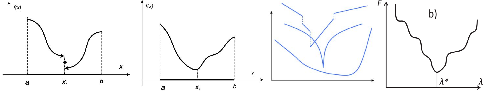
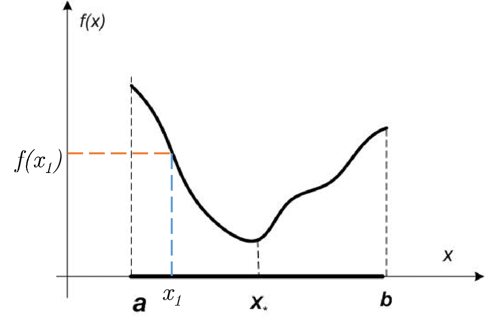

## Problem

Suppose, we have a problem of minimization of a function $f(x): \mathbb{R} \to \mathbb{R}$ of scalar variable:

$$
f(x) \to \min_{x \in \mathbb{R}}
$$

Sometimes, we refer to a similar problem of finding the minimum on the line segment $[a,b]$:

$$
f(x) \to \min_{x \in [a,b]}
$$

Line search is one of the simplest formal optimization problems. However, it is an important link in solving more complex tasks, so it is very important to solve it effectively. Let's restrict the class of problems under consideration to the cases where $f(x)$ is a *unimodal function*.

Function $f(x)$ is called **unimodal** on $[a, b]$, if there is $x_* \in [a, b]$, that $f(x_1) > f(x_2) \;\;\; \forall a \le x_1 < x_2 < x_*$ and $f(x_1) < f(x_2) \;\;\; \forall x_* < x_1 < x_2 \leq b$

## Key property of unimodal functions

Let $f(x)$ be a unimodal function on $[a, b]$. Then if $x_1 < x_2 \in [a, b]$:

* if $f(x_1) \leq f(x_2) \to x_* \in [a, x_2]$
* if $f(x_1) \geq f(x_2) \to x_* \in [x_1, b]$

## Code
[Open In Colab](https://colab.research.google.com/github/MerkulovDaniil/optim/blob/master/assets/Notebooks/Line_search.ipynb)

:::{#ls}
:::

## References

* [CMC seminars (ru)](http://www.machinelearning.ru/wiki/images/4/4d/MOMO16_min1d.pdf)
