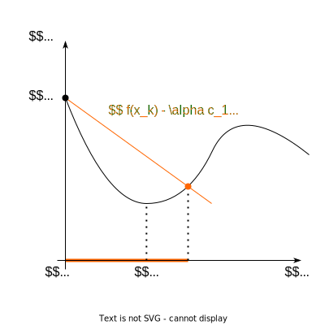
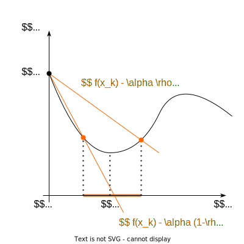
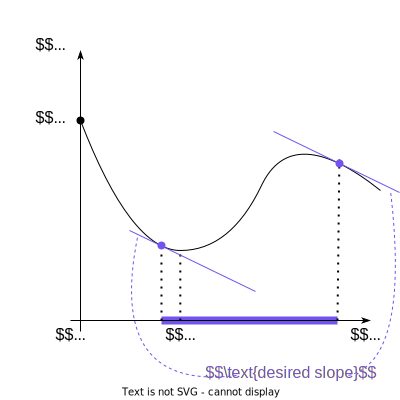
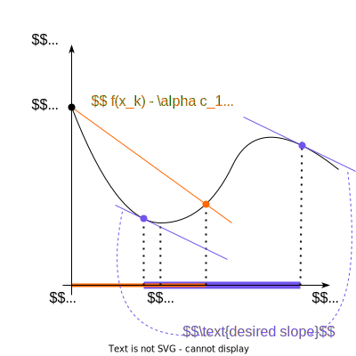

The strategy of inexact line search is practical and has a significant geometric interpretation:

## Sufficient Decrease

Consider a scalar function $\phi(\alpha)$ at a point $x_k$: 

$$
\phi(\alpha) = f(x_k - \alpha\nabla f(x_k)), \alpha \geq 0
$$

The first-order approximation of $\phi(\alpha)$ near $\alpha = 0$ is:

$$
\phi(\alpha) \approx f(x_k) - \alpha\nabla f(x_k)^\top \nabla f(x_k)
$$

The inexact line search condition, known as the Armijo condition, states that $\alpha$ should provide sufficient decrease in the function $f$, satisfying:

$$
f(x_k - \alpha \nabla f (x_k)) \leq f(x_k) - c_1 \cdot \alpha\nabla f(x_k)^\top \nabla f(x_k)
$$

for some constant $c_1 \in (0,1)$. Note that setting $c_1 = 1$ corresponds to the first-order Taylor approximation of $\phi(\alpha)$. However, this condition can accept very small values of $\alpha$, potentially slowing down the solution process. Typically, $c_1 \approx 10^{−4}$ is used in practice.

:::{.callout-example}
If $f(x)$ represents a cost function in an optimization problem, choosing an appropriate $c_1$ value is crucial. For instance, in a machine learning model training scenario, an improper $c_1$ might lead to either very slow convergence or missing the minimum.
:::

:::{.callout-question}
How does the choice of $c_1$ affect the convergence speed in optimization problems?
:::

## Goldstein Conditions

Consider two linear scalar functions $\phi_1(\alpha)$ and $\phi_2(\alpha)$:

$$
\phi_1(\alpha) = f(x_k) - c_1 \alpha \|\nabla f(x_k)\|^2
$$

$$
\phi_2(\alpha) = f(x_k) - c_2 \alpha \|\nabla f(x_k)\|^2
$$

The Goldstein-Armijo conditions locate the function $\phi(\alpha)$ between $\phi_1(\alpha)$ and $\phi_2(\alpha)$. Typically, $c_1 = \rho$ and $c_2 = 1 - \rho$, with $ \rho \in (0.5, 1)$.

## Curvature Condition

To avoid excessively short steps, we introduce a second criterion:

$$
-\nabla f (x_k - \alpha \nabla f(x_k))^\top \nabla f(x_k) \geq c_2 \nabla f(x_k)^\top(- \nabla f(x_k))
$$

for some $c_2 \in (c_1,1)$. Here, $c_1$ is from the Armijo condition. The left-hand side is the derivative $\nabla_\alpha \phi(\alpha)$, ensuring that the slope of $\phi(\alpha)$ at the target point is at least $c_2$ times the initial slope $\nabla_\alpha \phi(\alpha)(0)$. Commonly, $c_2 \approx 0.9$ is used for Newton or quasi-Newton methods. Together, the sufficient decrease and curvature conditions form the Wolfe conditions.

:::{.callout-example}
In gradient descent algorithms, applying the curvature condition can prevent the algorithm from taking steps that are too small, thus enhancing the efficiency of finding the minimum.
:::

:::{.callout-question}
Why is it important to have a balance between the sufficient decrease and curvature conditions in optimization algorithms?
:::

## Backtracking Line Search

Backtracking line search is a technique to find a step size that satisfies the Armijo condition, Goldstein conditions, or other criteria of inexact line search. It begins with a relatively large step size and iteratively scales it down until a condition is met.

### Algorithm:

1. Choose an initial step size, $\alpha_0$, and parameters $\beta \in (0, 1)$ and $c_1 \in (0, 1)$.
2. Check if the chosen step size satisfies the chosen condition (e.g., Armijo condition).
3. If the condition is satisfied, stop; else, set $\alpha := \beta \alpha$ and repeat step 2.

The step size $\alpha$ is updated as 

$$
\alpha_{k+1} := \beta \alpha_k
$$

in each iteration until the chosen condition is satisfied.

:::{.callout-example}
In machine learning model training, the backtracking line search can be used to adjust the learning rate. If the loss doesn't decrease sufficiently, the learning rate is reduced multiplicatively until the Armijo condition is met.
:::

:::{.callout-question}
Why is it crucial to carefully choose the initial step size and the reduction factor $\beta$ in backtracking line search algorithms?
:::

## References

* Numerical Optimization by J.Nocedal and S.J.Wright.
* [Interactive Wolfe Line Search Example](./wolfe_fmin.html) by [fmin](https://github.com/benfred/fmin) library.
---