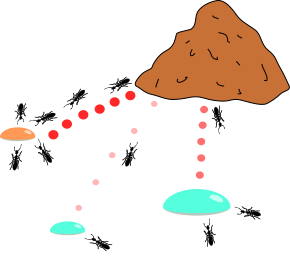
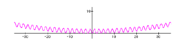
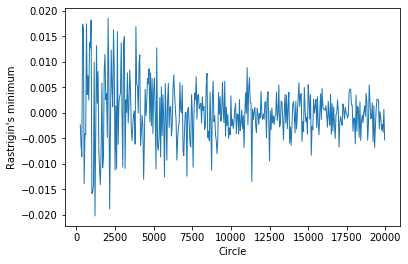

# Application of the Ant Colony Optimization Algorithm for Finding the Minimum of Rastrigin Function
## Intro
The ant colony optimization algorithm (ACO) is one of the stochastic optimization methods used for solving tasks for finding minimum of any functions. This algorithm inspired by the behavior of real ants, which choose the best way relying on instincts.

## Biololgical process
  
In the real world at a new place of a ant-heap ants walk in random order and after finding food return to the colony leaving pheromones along their path. When other ants feel such path, they go along it, so the smell from that path become stronger. As a result ants have a lot of paths marked pheromones. Which ones are the most successful? The fact is that pheromones evaporate over time, it makes short paths smell stronger because ants takes less time to go along it. Therefore after the passage of time all ants will go along the most optimal path. The evaporation of pheromones excludes the desire for a locally optimal solution. If pheromones don't evaporate, the path chosen first will be the most attractive.

## Algorithm
This behaviour can be replicated in code in the following steps:
Populate the simulation with a colony of ants.
For each ant, send the ant at any point x, where x - random coordinate at the beginning. After the first run, the next point selection becomes gradually more influenced by the amount of pheromone.
Once all ants have completed a first step, deposit pheromone on each point. The amount of pheromone deposited by each ant is proportional to the distance to the minimum detected at a given moment.
In subsequent iterations, a probability distribution for next point selection from a list of possibilities is generated according to the following formula:  
 $$ \large P_i = \frac{l_i^q \cdot f_i^p}  {\sum_{k=0}^{N}l_l^q \cdot f_k^p}, $$  
 where
$P_i$ — probability of transition along the path $i$,
$l_i$ —  the reciprocal of the weight (length) of the $i$-th transition,
$f_i$ — the amount of pheromone on the $i$-th transition,
$q$ — the value that determines the "greed" of the algorithm,
$p$ — the value that determines the "herd" of the algorithm.
Feromone update:
$$ f_i = (1 - \rho) \cdot f_i + \Delta f_i, $$  
where
$f_i$  - the amount of pheromone on the $i$-th transition,
$\rho$ - pheromone evaporation rate,
$\Delta f_i$ - the amount of pheromone deposited, usually defined as $$1/L_k$$, where  $L_k$ - the cost of the path (usually - length).
 
## Rastrigin function
$$  f(x) = An + \sum_{1}^{n}(x_i^2 - Acos(2\pi x_i),$$ 
where $$A = 10$$ and $$x \in [-5.12, 5.12]$$.  
It has a global minimum at $$\textbf x = 0$$ where $$f(\textbf x) = 0$$.  

## Testing
For testing the library [inspired](https://pythonhosted.org/inspyred/index.html) was used.
The algorythm Ant Colony Optimization was applied to the finding the minimum Rastrigin function. The code you can see [here](https://colab.research.google.com/drive/1OtNLm2e8ACRs1E6OTJ-GhPatb9LdVYo3#scrollTo=lobtGNTWdRjn).
It is possible to see the result of this algorithm at the graph:

The axis X shows the number of iterations, and the the axis Y - the minimum found by ants. It is important to see that Ant Colony Optimization Algorythm does not always give an optimal result.
