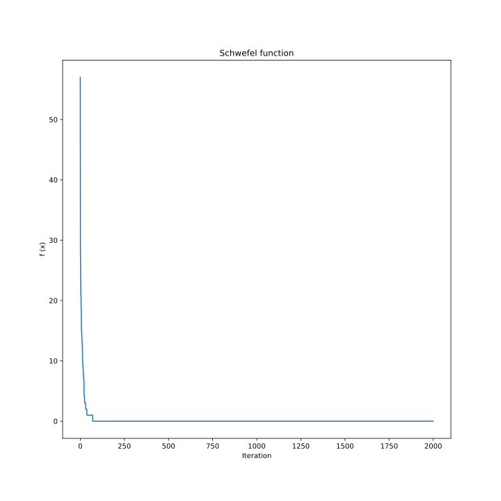
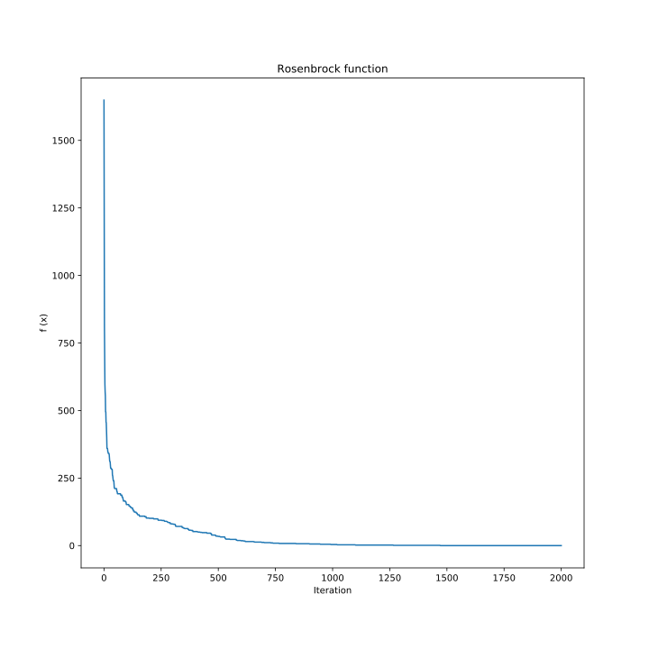
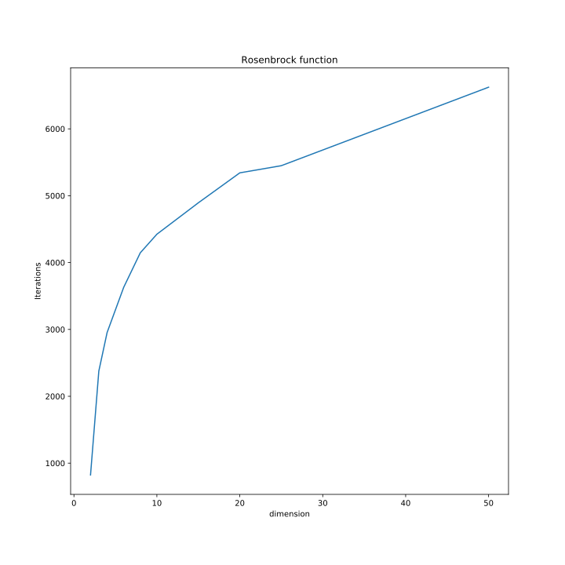

## Algorithm

The Bee Algorithm was mathematically first described relatively recently. It is one of the representatives of a large family of algorithms that allow modeling swarm intelligence. This article will provide an example of the application of the Bee Algorithm to search for the global extremum of the function. The two-dimensional Schwefel function, having a large number of local minima, and the Rosenbrock function, whose global minimum lies in a narrow, parabolic valley, were chosen as the target functions.

### Intuition

A colony of honey bees can spread over long distances (more than 10 km) and in several directions, while using a huge number of food sources. A colony can only be successful by deploying its foragers to good fields. The main idea is that flower fields that provide large amounts of nectar or pollen that are easy to collect with less energy consumption should be visited by more bees, whereas areas with less nectar or pollen should receive fewer bees.

The search for food begins with the sending of scout bees in search of honey flower fields. Scout bees search randomly through their journey from one patch to another. Also throughout the harvest season, the colony continues its research, keeping a percentage of the entire population as bee scouts.

When the bees return to the hive, those who found a source which is above a certain threshold (a combination of some constituents, such as sugar percentage regarding the source) deposit their nectar or pollen and go to the dance floor to perform their waggle dance. This mysterious dance is essential for colony communication and contains three vital pieces of information about flower spots: direction, distance, and source quality.

The nectar search process is described in more detail [here](https://www.researchgate.net/publication/260985621_The_Bees_Algorithm_Technical_Note).

### Mathematical interpretation

And now imagine that the location of the global extremum is the site where the most nectar, and this site is the only one, that is, in other places there is nectar, but less. And bees do not live on a plane, where it is enough to know two coordinates to determine the location of sites, but in a multidimensional space, where each coordinate represents one parameter of a function that needs to be optimized. The amount of nectar found is the value of the target function at this point.

The list below shows the pseudocode for a simple Bee Algorithm.

1. Initialize the set of parameters: number of scout bees - **n**, number of elite bees - **e**, number of selected regions out of n points - **m**, number of recruited around elite regions - **nep**, number of recruited around other selected (**m-e**) regions - **nsp**, and stopping criteria.
2. Every bee evaluates the value of target function
3. While (stopping criteria not met):    //*Forming new population*
   1. Elite bees (**e**) that have better fitness are selected and saved for the next population
   2. Select sites for neighbourhood search (**m-e**)
   3. Recruit bees around selected sites and evaluate fitness. More bees will be recruited around elite points(**nep**) and fewer bees will be recruited around the remaining selected points(**nsp**).
   4. Select the bee with the highest fitness from each site.
   5. Assign remaining bees (**n-m-e**) to search randomly and evaluate their fitness.
4. End While

### Examples

Two standard functions problems were selected to test the bee algorithm. Code implementation of The Bee Algorithm in Python is described [here](https://jenyay.net/Programming/Bees)

The following parameters were set for this test: 

- population **n** = 300 
- number of elite bees **e** = 5
- selected sites **m** = 15
- bees round elite points **nep** = 30
- bees around selected points **nsp** = 10
- stopping criteria: **max_iteration** = 2000

A random point is selected from the definition area to initialize the algorithm.

####  SCHWEFEL FUNCTION

The Schwefel function is complex, with many local minima. The plot shows the two-dimensional form of the function.

The function is usually evaluated on the hypercube $x_i \in [-500, 500]$ for all $i = 1, ..., d$.

$$
f(x_1 \cdots x_d) = 418.9829 \cdot d -\sum_{i=1}^d (x_i sin(\sqrt{|x_i|}))
$$

The function has one global minimum: 

$$
f(x_1 \cdots x_d) = 0, \quad x_i = 420.9687
$$

The plot below shows drop of the objective function averaged over 100 runs of the algorithm can be observed in the following graph.

#### ROSENBROCK FUNCTION

The Rosenbrock function, also referred to as the Valley or Banana function, is a popular test problem for gradient-based optimization algorithms. It is shown in the plot below in its two-dimensional form.

The function is unimodal, and the global minimum lies in a narrow, parabolic valley. However, even though this valley is easy to find, convergence to the minimum is difficult.

The function is usually evaluated on the hypercube $x_i \in [-5, 10]$  for all $i = 1, ..., d$, although it may be restricted to the hypercube $x_i \in [-2.048, 2.048]$  for all $i = 1, ..., d$.

$$
f(x_1 \cdots x_d) = \sum_{i=1}^{d-1} (100(x_i^2 - x_{i+1})^2 + (1-x_i)^2) \\-2.048 \leq x_i \leq 2.048
$$

The function global minimum: 

$$
f(x_1 \cdots x_d) = 0, \quad x_i = 1
$$

To test the algorithm the four-dimensional Rosenbrock function was chosen. The fall of the objective function averaged over 100 runs of the algorithm can be observed in the following graph.

Moreover, the number of iterations required to find the point at which the value of the target function differs from the optimal one by no more than 0.2%(new stopping criteria) has also been tested for some dimensions of the Rosenbrock function. One can see the results at the chart below.

## References

* [METAHEURISTICS FROM DESIGN TO IMPLEMENTATION](http://ie.sharif.edu/~so/Metaheuristics.pdf)
* [Yang X.S. Nature-inspired Metaheuristic Algorithms](https://pdfs.semanticscholar.org/a965/845f1dce0d0755f8c04d8ef8b7b1a3280503.pdf)
* [Honey Bees Inspired Optimization Method: The Bees Algorithm](https://www.ncbi.nlm.nih.gov/pmc/articles/PMC4553508/)
* [The Bees Algorithm Technical Note](https://www.researchgate.net/publication/260985621_The_Bees_Algorithm_Technical_Note)
* [Алгоритм пчел для оптимизации функции](https://jenyay.net/Programming/Bees)
* [An Idea Based on Honey Bee Swarm for Numerical Optimization, Technical Report - TR06](https://www.researchgate.net/publication/255638348_An_Idea_Based_on_Honey_Bee_Swarm_for_Numerical_Optimization_Technical_Report_-_TR06)
* [Grouped Bees Algorithm: A Grouped Version of the Bees Algorithm](https://www.researchgate.net/publication/313111267_Grouped_Bees_Algorithm_A_Grouped_Version_of_the_Bees_Algorithm)
* [The Bees Algorithm – A Novel Tool for Complex Optimisation Problems](https://www.researchgate.net/publication/253611651_The_Bees_Algorithm_-_A_Novel_Tool_for_Complex_Optimisation_Problems)
* [МЕТОД ПЧЕЛИНОГО РОЯ ДЛЯ РЕШЕНИЯ ЗАДАЧ НА ПОИСК ЭКСТРЕМУМА ФУНКЦИИ](http://scientificjournal.ru/images/PDF/2018/VNO-40/metod-pchelinogo.pdf)
* [A comparative study of the Bees Algorithm as a tool for function optimisation](https://www.tandfonline.com/doi/pdf/10.1080/23311916.2015.1091540?needAccess=true)
