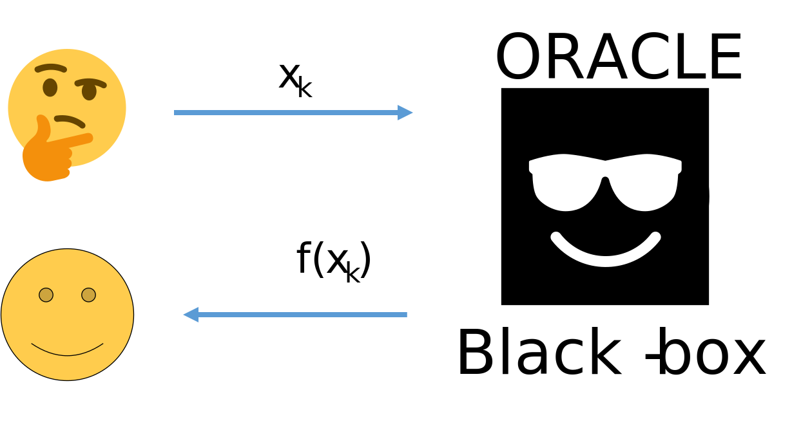

# Zero order methods

Now we have only zero order information from the oracle. Typical speed
of convergence of these methods is sublinear. A lot of methods are
referred both to zero order methods and global optimization.

## Code

- Global optimization illustration - [Open In
  Colab](https://colab.research.google.com/github/MerkulovDaniil/optim/blob/master/assets/Notebooks/Global_optimization_illustration.ipynb){:
  .btn }
- Nevergrad library - [Open In
  Colab](https://colab.research.google.com/github/MerkulovDaniil/optim/blob/master/assets/Notebooks/Nevergrad.ipynb){:
  .btn }
- Optuna quickstart [Open In
  Colab](https://colab.research.google.com/github/optuna/optuna-examples/blob/main/quickstart.ipynb)
