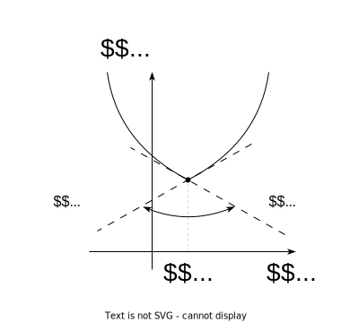
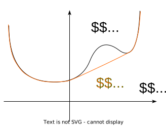

# Conjugate function

## Conjugate (dual) function

Let $f: \mathbb{R}^n \to \mathbb{R}$. The function
$f^*: \mathbb{R}^n \to \mathbb{R}$ is called convex conjugate (Fenchel’s
conjugate, dual, Legendre transform) $f(x)$ and is defined as follows:

$$
f^*(y) = \sup\limits_{x \in \mathbf{dom} \; f} \left( \langle y,x\rangle - f(x)\right).
$$

Let’s notice, that the domain of the function $f^*$ is the set of those
$y$, where the supremum is finite.

Figure 1: Illustration of conjugate function

### Properties

Figure 2: Nice intuition behind the conjugate function. On the left, we
have a slow parabola (say, $f(x) = \frac{x^2}{10}$, which implies a
small magnitude of the slope with a large magnitude of $x_0$. On the
right, we have the conjugate function $f^*(y) = 2.5 y^2$, which has a
large slope with the small value of $y_0$.)

> [!QUESTION]
>
> ### Question
>
> 

>
> 

>
> Using the geometric intuition above, draw the conjugate function to
> the function below:
>
> 

>
> 
>
> Figure 3: You can use geometric inution from above to draw $f^{*}(y)$.
>
> 

>
> > [!SOLUTION]
> >
> > ### Solution
> >
> > 

> >
> > 

> >
> > 

> >
> > 
> >
> > Figure 4: Take a look at the constant slope $x_0$ from the $y_1$ to
> > $y_2$.
> >
> > 

> >
> > 

> >
> > 

>
> 

>
> 

- Straightforward from the definition:
  $\inf\limits_{x \in \mathbf{dom} \; f} f(x) = -f^*(0)$

- $f^*(y)$ - is always a closed convex function (a point-wise supremum
  of closed convex functions) on $y$. (Function $f:X\rightarrow R$ is
  called closed if $\mathbf{epi}(f)$ is a closed set in $X\times R$.)

- Fenchel–Young inequality:

  $$
    f(x) + f^*(y) \ge \langle y,x \rangle
    $$

- Let the functions $f(x), f^\star(y), f^{\star\star}(x)$ be defined on
  the $\mathbb{R}^n$. Then $f^{\star\star}(x) = f(x)$ if and only if
  $f(x)$ - is a proper convex function (Fenchel - Moreau theorem).
  (proper convex function = closed convex function)

- Consequence from Fenchel–Young inequality:
  $f(x) \ge f^{\star\star}(x)$.

Figure 5

- In case of differentiable function, $f(x)$ - convex and
  differentiable, $\mathbf{dom}\; f = \mathbb{R}^n$. Then
  $x^\star = \underset{x}{\operatorname{argmin}} \langle x,y\rangle - f(x)$.
  Therefore $y = \nabla f(x^\star)$. That’s why:

  $$
    f^\star(y) = \langle \nabla f(x^\star), x^\star \rangle - f(x^\star)
    $$

  $$
    f^\star(y) = \langle \nabla f(z), z \rangle - f(z), \;\;\;\;\;\; y = \nabla f(z), \;\; z \in \mathbb{R}^n
    $$

- Let $f(x,y) = f_1(x) + f_2(y)$, where $f_1, f_2$ - convex functions,
  then

  $$
    f^*(p,q) = f_1^*(p) + f_2^*(q)
    $$

- Let $f(x) \le g(x)\;\; \forall x \in X$. Let also
  $f^\star(y), g^\star(y)$ be defined on $Y$. Then
  $\forall x \in X, \forall y \in Y$

  $$
    f^\star(y) \ge g^\star(y) \;\;\;\;\;\; f^{\star\star}(x) \le g^{\star\star}(x)
    $$

### Examples

The scheme of recovering the convex conjugate is pretty algorithmic: 1.
Write down the definition
$f^\star(y) = \sup\limits_{x \in \mathbf{dom} \; f} \left( \langle y,x\rangle - f(x)\right)  = \sup\limits_{x \in \mathbf{dom} \; g} g(x,y)$. 1.
Find those $y$, where $\sup\limits_{x \in \mathbf{dom} \; g} g(x,y)$ is
finite. That’s the domain of the dual function $f^\star(y)$. 1. Find
$x^\star$, which maximize $g(x,y)$ as a function on $x$.
$f^\star(y) = g(x^\star, y)$.

> [!EXAMPLE]
>
> ### Example
>
> 

>
> 

>
> Find $f^*(y)$, if $f(x) = ax + b$.
>
> > [!SOLUTION]
> >
> > ### Solution
> >
> > 

> >
> > 

> >
> > 1.  By definition: $$
> >     f^*(y) = \sup\limits_{x \in \mathbb{R}} [ yx - f(x) ]=\sup\limits_{x \in \mathbb{R}} g(x,y) \quad \mathbf{dom} \; f^* = \{y \in \mathbb{R} : \sup\limits_{x \in \mathbb{R}} g(x,y) \text{ is finite}\}
> >     $$
> > 2.  Consider the function whose supremum is the conjugate: $$
> >     g(x,y) =  yx - f(x) = yx - ax - b = x(y - a) - b.
> >     $$
> > 3.  Let’s determine the domain of the function (i.e. those $y$ for
> >     which $\sup$ is finite). This is a single point, $y = a$.
> >     Otherwise one may choose such $x$
> > 4.  Thus, we have: $\mathbf{dom} \; f^* = \{a\}; f^*(a) = -b$
> >
> > 

> >
> > 

>
> 

>
> 

> [!QUESTION]
>
> ### Question
>
> 

>
> 

>
> Find $f^*(y)$, if $f(x) = \dfrac{1}{x}, \;\; x\in \mathbb{R}_{++}$.
>
> 

>
> 

> [!EXAMPLE]
>
> ### Example
>
> 

>
> 

>
> Find $f^*(y)$, if $f(x) = -\log x, \;\; x\in \mathbb{R}_{++}$.
>
> > [!SOLUTION]
> >
> > ### Solution
> >
> > 

> >
> > 

> >
> > 1.  Consider the function whose supremum defines the conjugate: $$
> >     g(x,y) = \langle y,x\rangle - f(x) = yx + \log x.
> >     $$
> > 2.  This function is unbounded above when $y \ge 0$. Therefore, the
> >     domain of $f^*$ is $\mathbf{dom} \; f^* = \{y < 0\}$.
> > 3.  This function is concave and its maximum is achieved at the
> >     point with zero gradient: $$
> >     \dfrac{\partial}{\partial x} (yx + \log x) = \dfrac{1}{x} + y = 0.
> >     $$ Thus, we have $x = -\dfrac1y$ and the conjugate function is:
> >     $$
> >     f^*(y) = -\log(-y) - 1.
> >     $$
> >
> > 

> >
> > 

>
> 

>
> 

> [!EXAMPLE]
>
> ### Example
>
> 

>
> 

>
> Find $f^*(y)$, if $f(x) = e^x$.
>
> > [!SOLUTION]
> >
> > ### Solution
> >
> > 

> >
> > 

> >
> > 1.  Consider the function whose supremum defines the conjugate: $$
> >     g(x,y) = \langle y,x\rangle - f(x) = yx - e^x.
> >     $$
> > 2.  This function is unbounded above when $y < 0$. Thus, the domain
> >     of $f^*$ is $\mathbf{dom} \; f^* = \{y \ge 0\}$.
> > 3.  The maximum of this function is achieved when $x = \log y$.
> >     Hence: $$
> >     f^*(y) = y \log y - y,
> >     $$ assuming $0 \log 0 = 0$.
> >
> > 

> >
> > 

>
> 

>
> 

> [!EXAMPLE]
>
> ### Example
>
> 

>
> 

>
> Find $f^*(y)$, if $f(x) = x \log x, x \neq 0,$ and
> $f(0) = 0, \;\;\; x \in \mathbb{R}_+$.
>
> > [!SOLUTION]
> >
> > ### Solution
> >
> > 

> >
> > 

> >
> > 1.  Consider the function whose supremum defines the conjugate: $$
> >     g(x,y) = \langle y,x\rangle - f(x) = xy - x \log x.
> >     $$
> > 2.  This function is upper bounded for all $y$. Therefore,
> >     $\mathbf{dom} \; f^* = \mathbb{R}$.
> > 3.  The maximum of this function is achieved when $x = e^{y-1}$.
> >     Hence: $$
> >     f^*(y) = e^{y-1}.
> >     $$
> >
> > 

> >
> > 

>
> 

>
> 

> [!EXAMPLE]
>
> ### Example
>
> 

>
> 

>
> Find $f^*(y)$, if
> $f(x) =\frac{1}{2} x^T A x, \;\;\; A \in \mathbb{S}^n_{++}$.
>
> > [!SOLUTION]
> >
> > ### Solution
> >
> > 

> >
> > 

> >
> > 1.  Consider the function whose supremum defines the conjugate: $$
> >     g(x,y) = \langle y,x\rangle - f(x) = y^T x - \frac{1}{2} x^T A x.
> >     $$
> > 2.  This function is upper bounded for all $y$. Thus,
> >     $\mathbf{dom} \; f^* = \mathbb{R}$.
> > 3.  The maximum of this function is achieved when $x = A^{-1}y$.
> >     Hence: $$
> >     f^*(y) =  \frac{1}{2} y^T A^{-1} y.
> >     $$
> >
> > 

> >
> > 

>
> 

>
> 

> [!EXAMPLE]
>
> ### Example
>
> 

>
> 

>
> Find $f^*(y)$, if
> $f(x) = \max\limits_{i} x_i, \;\;\; x \in \mathbb{R}^n$.
>
> > [!SOLUTION]
> >
> > ### Solution
> >
> > 

> >
> > 

> >
> > 1.  Consider the function whose supremum defines the conjugate: $$
> >     g(x,y) = \langle y,x\rangle - f(x) = y^T x - \max\limits_{i} x_i.
> >     $$
> > 2.  Observe that if vector $y$ has at least one negative component,
> >     this function is not bounded by $x$.
> > 3.  If $y \succeq 0$ and $1^T y > 1$, then
> >     $y \notin \mathbf{dom} \; f^*(y)$.
> > 4.  If $y \succeq 0$ and $1^T y < 1$, then
> >     $y \notin \mathbf{dom} \; f^*(y)$.
> > 5.  Only left with $y \succeq 0$ and $1^T y = 1$. In this case,
> >     $x^T y \le \max\limits_i x_i$.
> > 6.  Hence, $f^*(y) = 0$.
> >
> > 

> >
> > 

>
> 

>
> 

> [!EXAMPLE]
>
> ### Example
>
> 

>
> 

>
> **Revenue and profit functions.** We consider a business or enterprise
> that consumes $n$ resources and produces a product that can be sold.
> We let $r = (r_1, \ldots , r_n)$ denote the vector of resource
> quantities consumed, and $S(r)$ denote the sales revenue derived from
> the product produced (as a function of the resources consumed). Now
> let $p_i$ denote the price (per unit) of resource $i$, so the total
> amount paid for resources by the enterprise is $p^\top r$. The profit
> derived by the firm is then $S(r) − p^\top r$. Let us fix the prices
> of the resources, and ask what is the maximum profit that can be made,
> by wisely choosing the quantities of resources consumed. This maximum
> profit is given by
>
> $$
> M(p) = \sup\limits_{r}\left( S(r) - p^\top r \right)
> $$
>
> The function $M(p)$ gives the maximum profit attainable, as a function
> of the resource prices. In terms of conjugate functions, we can
> express $M$ as $$
> M(p) = (−S)^*(−p).
> $$ Thus the maximum profit (as a function of resource prices) is
> closely related to the conjugate of gross sales (as a function of
> resources consumed).
>
> 

>
> 

## References

- Great
  [intuition](https://www.ise.ncsu.edu/fuzzy-neural/wp-content/uploads/sites/9/2019/01/or706-LF-transform-1.pdf)
  behind the Legendre-Fenchel transform.
