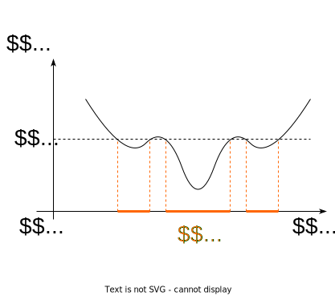
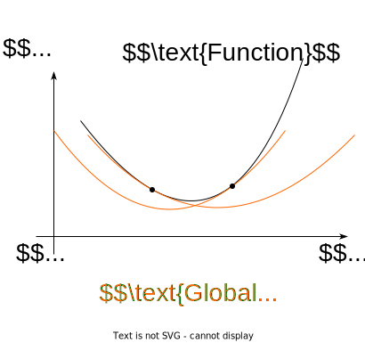

# Convex function

## Convexity definitions

### Jensen’s inequality

The function $f(x)$, **which is defined on the convex set**
$S \subseteq \mathbb{R}^n$, is called **convex** on $S$, if:

$$
f(\lambda x_1 + (1 - \lambda)x_2) \le \lambda f(x_1) + (1 - \lambda)f(x_2)
$$

for any $x_1, x_2 \in S$ and $0 \le \lambda \le 1$.  
If the above inequality holds as strict inequality $x_1 \neq x_2$ and
$0 < \lambda < 1$, then the function is called strictly convex on $S$.

Figure 1: Difference between convex and non-convex function

> [!THEOREM]
>
> ### Jensen’s inequality
>
> 

>
> 

>
> Let $f(x)$ be a convex function on a convex set
> $X \subseteq \mathbb{R}^n$ and let $x_i \in X, 1 \leq i \leq m$, be
> arbitrary points from $X$. Then
>
> $$
> f\left( \sum_{i=1}^{m} \lambda_i x_i \right) \leq \sum_{i=1}^{m} \lambda_i f(x_i)
> $$
>
> for any $\lambda = [\lambda_1, \ldots, \lambda_m] \in \Delta_m$ -
> probability simplex.
>
> > [!PROOF]
> >
> > ### Proof
> >
> > 

> >
> > 

> >
> > 1.  First, note that the point $\sum_{i=1}^{m} \lambda_i x_i$ as a
> >     convex combination of points from the convex set $X$ belongs to
> >     $X$.
> >
> > 2.  We will prove this by induction. For $m = 1$, the statement is
> >     obviously true, and for $m = 2$, it follows from the definition
> >     of a convex function.
> >
> > 3.  Assume it is true for all $m$ up to $m = k$, and we will prove
> >     it for $m = k + 1$. Let $\lambda \in \Delta{k+1}$ and
> >
> >     $$
> >      x = \sum_{i=1}^{k+1} \lambda_i x_i = \sum_{i=1}^{k} \lambda_i x_i + \lambda_{k+1} x_{k+1}.
> >      $$
> >
> >     Assuming $0 < \lambda_{k+1} < 1$, as otherwise, it reduces to
> >     previously considered cases, we have
> >
> >     $$
> >      x = \lambda_{k+1} x_{k+1} + (1 - \lambda_{k+1}) \bar{x}, 
> >      $$
> >
> >     where $\bar{x} = \sum_{i=1}^{k} \gamma_i x_i$ and
> >     $\gamma_i = \frac{\lambda_i}{1-\lambda_{k+1}} \geq 0, 1 \leq i \leq k$.
> >
> > 4.  Since $\lambda \in \Delta_{k+1}$, then
> >     $\gamma = [\gamma_1, \ldots, \gamma_k] \in \Delta_k$. Therefore
> >     $\bar{x} \in X$ and by the convexity of $f(x)$ and the induction
> >     hypothesis:
> >
> >     $$
> >      \begin{split}
> >      f\left( \sum_{i=1}^{k+1} \lambda_i x_i \right) = f\left( \lambda_{k+1} x_{k+1} + (1 - \lambda_{k+1})\bar{x} \right) &\leq \\ 
> >      \lambda_{k+1}f(x_{k+1}) + (1 - \lambda_{k+1})f(\bar{x}) \leq \sum_{i=1}^{k+1} \lambda_i f(x_i)&
> >      \end{split}
> >      $$
> >
> >     Thus, initial inequality is satisfied for $m = k + 1$ as well.
> >
> > 

> >
> > 

>
> 

>
> 

> [!EXAMPLE]
>
> ### Example
>
> 

>
> 

>
> - $f(x) = x^p, \;  p > 1,\;  x \in \mathbb{R}_+$
> - $f(x) = \|x\|^p,\;  p > 1, x \in \mathbb{R}^n$
> - $f(x) = e^{cx},\;  c \in \mathbb{R}, x \in \mathbb{R}$
> - $f(x) = -\ln x,\;  x \in \mathbb{R}_{++}$
> - $f(x) = x\ln x,\;  x \in \mathbb{R}_{++}$
> - The sum of the largest $k$ coordinates
>   $f(x) = x_{(1)} + \ldots + x_{(k)},\; x \in \mathbb{R}^n$
> - $f(X) = \lambda_{max}(X),\;  X = X^T$
> - $f(X) = - \log \det X, \;  X \in S^n_{++}$
>
> 

>
> 

### Epigraph

For the function $f(x)$, defined on $S \subseteq \mathbb{R}^n$, the
following set:

$$
\text{epi } f = \left\{[x,\mu] \in S \times \mathbb{R}: f(x) \le \mu\right\}
$$

is called **epigraph** of the function $f(x)$.

Figure 2: Epigraph of a function

> [!THEOREM]
>
> ### Convexity of the epigraph is the convexity of the function
>
> 

>
> 

>
> For a function $f(x)$, defined on a convex set $X$, to be convex on
> $X$, it is necessary and sufficient that the epigraph of $f$ is a
> convex set.
>
> > [!PROOF]
> >
> > ### Proof
> >
> > 

> >
> > 

> >
> > 1.  **Necessity**: Assume $f(x)$ is convex on $X$. Take any two
> >     arbitrary points $[x_1, \mu_1] \in \text{epi}f$ and
> >     $[x_2, \mu_2] \in \text{epi}f$. Also take
> >     $0 \leq \lambda \leq 1$ and denote
> >     $x_{\lambda} = \lambda x_1 + (1 - \lambda) x_2, \mu_{\lambda} = \lambda \mu_1 + (1 - \lambda) \mu_2$.
> >     Then,
> >
> >     $$
> >      \lambda\begin{bmatrix}x_1\\ \mu_1\end{bmatrix} + (1 - \lambda)\begin{bmatrix}x_2\\ \mu_2\end{bmatrix} = \begin{bmatrix}x_{\lambda}\\ \mu_{\lambda}\end{bmatrix}.
> >      $$
> >
> >     From the convexity of the set $X$, it follows that
> >     $x_{\lambda} \in X$. Moreover, since $f(x)$ is a convex
> >     function,
> >
> >     $$
> >      f(x_{\lambda}) \leq \lambda f(x_1) + (1 - \lambda) f(x_2) \leq \lambda \mu_1 + (1 - \lambda) \mu_2 = \mu_{\lambda}
> >      $$
> >
> >     Inequality above indicates that
> >     $\begin{bmatrix}x_{\lambda}\\ \mu_{\lambda}\end{bmatrix} \in \text{epi}f$.
> >     Thus, the epigraph of $f$ is a convex set.
> >
> > 2.  **Sufficiency**: Assume the epigraph of $f$, $\text{epi}f$, is a
> >     convex set. Then, from the membership of the points
> >     $[x_1, \mu_1]$ and $[x_2, \mu_2]$ in the epigraph of $f$, it
> >     follows that
> >
> >     $$
> >       \begin{bmatrix}x_{\lambda}\\ \mu_{\lambda}\end{bmatrix} =  \lambda\begin{bmatrix}x_1\\ \mu_1\end{bmatrix} + (1 - \lambda)\begin{bmatrix}x_2\\ \mu_2\end{bmatrix} \in \text{epi}f
> >      $$
> >
> >     for any $0 \leq \lambda \leq 1$, i.e.,
> >     $f(x_{\lambda}) \leq \mu_{\lambda} = \lambda \mu_1 + (1 - \lambda) \mu_2$.
> >     But this is true for all $\mu_1 \geq f(x_1)$ and
> >     $\mu_2 \geq f(x_2)$, particularly when $\mu_1 = f(x_1)$ and
> >     $\mu_2 = f(x_2)$. Hence we arrive at the inequality
> >
> >     $$
> >      f(x_{\lambda}) = f (\lambda x_1 + (1 - \lambda) x_2) \leq \lambda f(x_1) + (1 - \lambda) f(x_2).
> >      $$
> >
> >     Since points $x_1 \in X$ and $x_2 \in X$ can be arbitrarily
> >     chosen, $f(x)$ is a convex function on $X$.
> >
> > 

> >
> > 

>
> 

>
> 

### Sublevel set

For the function $f(x)$, defined on $S \subseteq \mathbb{R}^n$, the
following set:

$$
\mathcal{L}_\beta = \left\{ x\in S : f(x) \le \beta\right\}
$$

is called **sublevel set** or Lebesgue set of the function $f(x)$.

Figure 3: Sublevel set of a function with respect to level $\beta$

## Criteria of convexity

### First-order differential criterion of convexity

The differentiable function $f(x)$ defined on the convex set
$S \subseteq \mathbb{R}^n$ is convex if and only if $\forall x,y \in S$:

$$
f(y) \ge f(x) + \nabla f^T(x)(y-x)
$$

Let $y = x + \Delta x$, then the criterion will become more tractable:

$$
f(x + \Delta x) \ge f(x) + \nabla f^T(x)\Delta x
$$

Figure 4: Convex function is greater or equal than Taylor linear
approximation at any point

### Second-order differential criterion of convexity

Twice differentiable function $f(x)$ defined on the convex set
$S \subseteq \mathbb{R}^n$ is convex if and only if
$\forall x \in \mathbf{int}(S) \neq \emptyset$:

$$
\nabla^2 f(x) \succeq 0
$$

In other words, $\forall y \in \mathbb{R}^n$:

$$
\langle y, \nabla^2f(x)y\rangle \geq 0
$$

### Connection with epigraph

The function is convex if and only if its epigraph is a convex set.

> [!EXAMPLE]
>
> ### Example
>
> 

>
> 

>
> Let a norm $\Vert \cdot \Vert$ be defined in the space $U$. Consider
> the set:
>
> $$
> K := \{(x,t) \in U \times \mathbb{R}^+ : \Vert x \Vert \leq t \}
> $$
>
> which represents the epigraph of the function
> $x \mapsto \Vert x \Vert$. This set is called the cone norm. According
> to the statement above, the set $K$ is convex.
>
> In the case where $U = \mathbb{R}^n$ and
> $\Vert x \Vert = \Vert x \Vert_2$ (Euclidean norm), the abstract set
> $K$ transitions into the set:
>
> $$
> \{(x,t) \in \mathbb{R}^n \times \mathbb{R}^+ : \Vert x \Vert_2 \leq t \}
> $$
>
> 

>
> 

### Connection with sublevel set

If $f(x)$ - is a convex function defined on the convex set
$S \subseteq \mathbb{R}^n$, then for any $\beta$ sublevel set
$\mathcal{L}_\beta$ is convex.

The function $f(x)$ defined on the convex set $S \subseteq \mathbb{R}^n$
is closed if and only if for any $\beta$ sublevel set
$\mathcal{L}_\beta$ is closed.

### Reduction to a line

$f: S \to \mathbb{R}$ is convex if and only if $S$ is a convex set and
the function $g(t) = f(x + tv)$ defined on
$\left\{ t \mid x + tv \in S \right\}$ is convex for any
$x \in S, v \in \mathbb{R}^n$, which allows checking convexity of the
scalar function to establish convexity of the vector function.

## Strong convexity

$f(x)$, **defined on the convex set** $S \subseteq \mathbb{R}^n$, is
called $\mu$-strongly convex (strongly convex) on $S$, if:

$$
f(\lambda x_1 + (1 - \lambda)x_2) \le \lambda f(x_1) + (1 - \lambda)f(x_2) - \frac{\mu}{2} \lambda (1 - \lambda)\|x_1 - x_2\|^2
$$

for any $x_1, x_2 \in S$ and $0 \le \lambda \le 1$ for some $\mu > 0$.

Figure 5: Strongly convex function is greater or equal than Taylor
quadratic approximation at any point

### Criteria of strong convexity

#### First-order differential criterion of strong convexity

Differentiable $f(x)$ defined on the convex set
$S \subseteq \mathbb{R}^n$ is $\mu$-strongly convex if and only if
$\forall x,y \in S$:

$$
f(y) \ge f(x) + \nabla f^T(x)(y-x) + \dfrac{\mu}{2}\|y-x\|^2
$$

Let $y = x + \Delta x$, then the criterion will become more tractable:

$$
f(x + \Delta x) \ge f(x) + \nabla f^T(x)\Delta x + \dfrac{\mu}{2}\|\Delta x\|^2
$$

#### Second-order differential criterion of strong convexity

Twice differentiable function $f(x)$ defined on the convex set
$S \subseteq \mathbb{R}^n$ is called $\mu$-strongly convex if and only
if $\forall x \in \mathbf{int}(S) \neq \emptyset$:

$$
\nabla^2 f(x) \succeq \mu I
$$

In other words:

$$
\langle y, \nabla^2f(x)y\rangle \geq \mu \|y\|^2
$$

> [!THEOREM]
>
> ### Theorem
>
> 

>
> 

>
> Let $f(x)$ be a differentiable function on a convex set
> $X \subseteq \mathbb{R}^n$. Then $f(x)$ is strongly convex on $X$ with
> a constant $\mu > 0$ if and only if
>
> $$ 
> f(x) - f(x_0) \geq \langle \nabla f(x_0), x - x_0 \rangle + \frac{\mu}{2} \| x - x_0 \|^2
> $$
>
> for all $x, x_0 \in X$.
>
> > [!PROOF]
> >
> > ### Proof
> >
> > 

> >
> > 

> >
> > **Necessity**: Let $0 < \lambda \leq 1$. According to the definition
> > of a strongly convex function,
> >
> > $$ 
> > f(\lambda x + (1 - \lambda) x_0) \leq \lambda f(x) + (1 - \lambda) f(x_0) - \frac{\mu}{2} \lambda (1 - \lambda) \| x - x_0 \|^2 
> > $$
> >
> > or equivalently,
> >
> > $$ 
> > f(x) - f(x_0) - \frac{\mu}{2} (1 - \lambda) \| x - x_0 \|^2 \geq \frac{1}{\lambda} [f(\lambda x + (1 - \lambda) x_0) - f(x_0)] = 
> > $$
> >
> > $$ 
> > = \frac{1}{\lambda} [f(x_0 + \lambda(x - x_0)) - f(x_0)] = \frac{1}{\lambda} [\lambda \langle \nabla f(x_0), x - x_0 \rangle + o(\lambda)] = 
> > $$
> >
> > $$ 
> > = \langle \nabla f(x_0), x - x_0 \rangle + \frac{o(\lambda)}{\lambda}. 
> > $$
> >
> > Thus, taking the limit as $\lambda \downarrow 0$, we arrive at the
> > initial statement.
> >
> > **Sufficiency**: Assume the inequality in the theorem is satisfied
> > for all $x, x_0 \in X$. Take
> > $x_0 = \lambda x_1 + (1 - \lambda) x_2$, where $x_1, x_2 \in X$,
> > $0 \leq \lambda \leq 1$. According to the inequality, the following
> > inequalities hold:
> >
> > $$ 
> > f(x_1) - f(x_0) \geq \langle \nabla f(x_0), x_1 - x_0 \rangle + \frac{\mu}{2} \| x_1 - x_0 \|^2, 
> > $$
> >
> > $$ 
> > f(x_2) - f(x_0) \geq \langle \nabla f(x_0), x_2 - x_0 \rangle + \frac{\mu}{2} \| x_2 - x_0 \|^2. 
> > $$
> >
> > Multiplying the first inequality by $\lambda$ and the second by
> > $1 - \lambda$ and adding them, considering that
> >
> > $$ 
> > x_1 - x_0 = (1 - \lambda)(x_1 - x_2), \quad x_2 - x_0 = \lambda(x_2 - x_1), 
> > $$
> >
> > and
> > $\lambda(1 - \lambda)^2 + \lambda^2(1 - \lambda) = \lambda(1 - \lambda)$,
> > we get
> >
> > $$ 
> > \begin{split}
> > \lambda f(x_1) + (1 - \lambda) f(x_2) - f(x_0) - \frac{\mu}{2} \lambda (1 - \lambda) \| x_1 - x_2 \|^2 \geq \\
> > \langle \nabla f(x_0), \lambda x_1 + (1 - \lambda) x_2 - x_0 \rangle = 0. 
> > \end{split}
> > $$
> >
> > Thus, inequality from the definition of a strongly convex function
> > is satisfied. It is important to mention, that $\mu = 0$ stands for
> > the convex case and corresponding differential criterion.
> >
> > 

> >
> > 

>
> 

>
> 

> [!THEOREM]
>
> ### Theorem
>
> 

>
> 

>
> Let $X \subseteq \mathbb{R}^n$ be a convex set, with
> $\text{int}X \neq \emptyset$. Furthermore, let $f(x)$ be a twice
> continuously differentiable function on $X$. Then $f(x)$ is strongly
> convex on $X$ with a constant $\mu > 0$ if and only if
>
> $$
> \langle y, \nabla^2 f(x) y \rangle \geq \mu \| y \|^2 \quad 
> $$
>
> for all $x \in X$ and $y \in \mathbb{R}^n$.
>
> > [!PROOF]
> >
> > ### Proof
> >
> > 

> >
> > 

> >
> > The target inequality is trivial when $y = \mathbf{0}_n$, hence we
> > assume $y \neq \mathbf{0}_n$.
> >
> > **Necessity**: Assume initially that $x$ is an interior point of
> > $X$. Then $x + \alpha y \in X$ for all $y \in \mathbb{R}^n$ and
> > sufficiently small $\alpha$. Since $f(x)$ is twice differentiable,
> >
> > $$
> > f(x + \alpha y) = f(x) + \alpha \langle \nabla f(x), y \rangle + \frac{\alpha^2}{2} \langle y, \nabla^2 f(x) y \rangle + o(\alpha^2).
> > $$
> >
> > Based on the first order criterion of strong convexity, we have
> >
> > $$
> > \frac{\alpha^2}{2} \langle y, \nabla^2 f(x) y \rangle + o(\alpha^2) = f(x + \alpha y) - f(x) - \alpha \langle \nabla f(x), y \rangle \geq \frac{\mu}{2} \alpha^2 \| y \|^2.
> > $$
> >
> > This inequality reduces to the target inequality after dividing both
> > sides by $\alpha^2$ and taking the limit as $\alpha \downarrow 0$.
> >
> > If $x \in X$ but $x \notin \text{int}X$, consider a sequence
> > $\{x_k\}$ such that $x_k \in \text{int}X$ and $x_k \rightarrow x$ as
> > $k \rightarrow \infty$. Then, we arrive at the target inequality
> > after taking the limit.
> >
> > **Sufficiency**: Using Taylor’s formula with the Lagrange remainder
> > and the target inequality, we obtain for $x + y \in X$:
> >
> > $$
> > f(x + y) - f(x) - \langle \nabla f(x), y \rangle = \frac{1}{2} \langle y, \nabla^2 f(x + \alpha y) y \rangle \geq \frac{\mu}{2} \| y \|^2, 
> > $$
> >
> > where $0 \leq \alpha \leq 1$. Therefore,
> >
> > $$
> > f(x + y) - f(x) \geq \langle \nabla f(x), y \rangle + \frac{\mu}{2} \| y \|^2.
> > $$
> >
> > Consequently, by the first order criterion of strong convexity, the
> > function $f(x)$ is strongly convex with a constant $\mu$. It is
> > important to mention, that $\mu = 0$ stands for the convex case and
> > corresponding differential criterion.
> >
> > 

> >
> > 

>
> 

>
> 

## Facts

- $f(x)$ is called (strictly) concave, if the function $-f(x)$ - is
  (strictly) convex.

- Jensen’s inequality for the convex functions:

  $$
    f \left( \sum\limits_{i=1}^n \alpha_i x_i \right) \leq \sum\limits_{i=1}^n \alpha_i f(x_i)
    $$

  for $\alpha_i \geq 0; \quad \sum\limits_{i=1}^n \alpha_i = 1$
  (probability simplex)  
  For the infinite dimension case:

  $$
    f \left( \int\limits_{S} x p(x)dx \right) \leq \int\limits_{S} f(x)p(x)dx
    $$

  If the integrals exist and
  $p(x) \geq 0, \quad \int\limits_{S} p(x)dx = 1$.

- If the function $f(x)$ and the set $S$ are convex, then any local
  minimum $x^* = \text{arg}\min\limits_{x \in S} f(x)$ will be the
  global one. Strong convexity guarantees the uniqueness of the
  solution.

- Let $f(x)$ - be a convex function on a convex set
  $S \subseteq \mathbb{R}^n$. Then $f(x)$ is continuous
  $\forall x \in \textbf{ri}(S)$.

## Operations that preserve convexity

- Non-negative sum of the convex functions:
  $\alpha f(x) + \beta g(x), (\alpha \geq 0 , \beta \geq 0)$.
- Composition with affine function $f(Ax + b)$ is convex, if $f(x)$ is
  convex.
- Pointwise maximum (supremum) of any number of functions: If
  $f_1(x), \ldots, f_m(x)$ are convex, then
  $f(x) = \max \{f_1(x), \ldots, f_m(x)\}$ is convex.
- If $f(x,y)$ is convex on $x$ for any $y \in Y$:
  $g(x) = \underset{y \in Y}{\operatorname{sup}}f(x,y)$ is convex.
- If $f(x)$ is convex on $S$, then $g(x,t) = t f(x/t)$ - is convex with
  $x/t \in S, t > 0$.
- Let $f_1: S_1 \to \mathbb{R}$ and $f_2: S_2 \to \mathbb{R}$, where
  $\operatorname{range}(f_1) \subseteq S_2$. If $f_1$ and $f_2$ are
  convex, and $f_2$ is increasing, then $f_2 \circ f_1$ is convex on
  $S_1$.

## Other forms of convexity

- Log-convex: $\log f$ is convex; Log convexity implies convexity.
- Log-concavity: $\log f$ concave; **not** closed under addition!
- Exponentially convex: $[f(x_i + x_j )] \succeq 0$, for
  $x_1, \ldots , x_n$
- Operator convex:
  $f(\lambda X + (1 − \lambda )Y ) \preceq \lambda f(X) + (1 − \lambda )f(Y)$
- Quasiconvex:
  $$f(\lambda x + (1 − \lambda) y) \leq \max \{f(x), f(y)\}$$
- Pseudoconvex:
  $\langle \nabla f(y), x − y \rangle \geq 0 \longrightarrow f(x) \geq f(y)$
- Discrete convexity: $f : \mathbb{Z}^n \to \mathbb{Z}$; “convexity +
  matroid theory.”

> [!EXAMPLE]
>
> ### Example
>
> 

>
> 

>
> Show, that $f(x) = c^\top x + b$ is convex and concave.
>
> > [!SOLUTION]
> >
> > ### Solution
> >
> > 

> >
> > 

> >
> >         
> >
> > 

> >
> > 

>
> 

>
> 

> [!EXAMPLE]
>
> ### Example
>
> 

>
> 

>
> Show, that $f(x) = x^\top Ax$, where $A\succeq 0$ - is convex on
> $\mathbb{R}^n$.
>
> > [!SOLUTION]
> >
> > ### Solution
> >
> > 

> >
> > 

> >
> >         
> >
> > 

> >
> > 

>
> 

>
> 

> [!EXAMPLE]
>
> ### Example
>
> 

>
> 

>
> Show, that $f(A) = \lambda_{max}(A)$ - is convex, if $A \in S^n$.
>
> > [!SOLUTION]
> >
> > ### Solution
> >
> > 

> >
> > 

> >
> >         
> >
> > 

> >
> > 

>
> 

>
> 

> [!EXAMPLE]
>
> ### Example
>
> 

>
> 

>
> PL inequality holds if the following condition is satisfied for some
> \$ \> 0 $,$\$ f(x) ^2 (f(x) - f^\*) x $$
> The example of a function, that satisfies the PL-condition, but is not convex.
> $$ f(x,y) = \$\$
>
> 
                        
>                         

                    

>
> 

>
> 

## References

- [Steven Boyd
  lectures](http://web.stanford.edu/class/ee364a/lectures/functions.pdf)
- [Suvrit Sra lectures](http://suvrit.de/teach/ee227a/lect3.pdf)
- [Martin Jaggi
  lectures](https://github.com/epfml/OptML_course/raw/master/slides/lecture01.pdf)
- Example of Pl non-convex function [Open in
  Colab](https://colab.research.google.com/github/MerkulovDaniil/optim/blob/master/assets/Notebooks/PL_function.ipynb)
