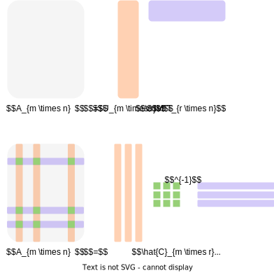

# Matrix calculus

## Basic linear algebra background

### Vectors and matrices

We will treat all vectors as column vectors by default. The space of
real vectors of length $n$ is denoted by $\mathbb{R}^n$, while the space
of real-valued $m \times n$ matrices is denoted by
$\mathbb{R}^{m \times n}$. That’s it: [^1]

$$
x = \begin{bmatrix}
x_1 \\
x_2 \\
\vdots \\
x_n
\end{bmatrix} \quad x^T = \begin{bmatrix}
x_1 & x_2 & \dots & x_n
\end{bmatrix} \quad x \in \mathbb{R}^n, x_i \in \mathbb{R}
 \qquad(1)$$ Similarly, if $A \in \mathbb{R}^{m \times n}$ we
denote transposition as $A^T \in \mathbb{R}^{n \times m}$: $$
A = \begin{bmatrix}
a_{11} & a_{12} & \dots & a_{1n} \\
a_{21} & a_{22} & \dots & a_{2n} \\
\vdots & \vdots & \ddots & \vdots \\
a_{m1} & a_{m2} & \dots & a_{mn}
\end{bmatrix} \quad A^T = \begin{bmatrix}
a_{11} & a_{21} & \dots & a_{m1} \\
a_{12} & a_{22} & \dots & a_{m2} \\
\vdots & \vdots & \ddots & \vdots \\
a_{1n} & a_{2n} & \dots & a_{mn}
\end{bmatrix} \quad A \in \mathbb{R}^{m \times n}, a_{ij} \in \mathbb{R}
$$ We will write $x \geq 0$ and $x \neq 0$ to indicate componentwise
relationships

Figure 1: Equivivalent representations of a vector

A matrix is symmetric if $A = A^T$. It is denoted as
$A \in \mathbb{S}^n$ (set of square symmetric matrices of dimension
$n$). Note, that only a square matrix could be symmetric by definition.

A matrix $A \in \mathbb{S}^n$ is called **positive (negative) definite**
if for all $x \neq 0 : x^T Ax > (<) 0$. We denote this as
$A \succ (\prec) 0$. The set of such matrices is denoted as
$\mathbb{S}^n_{++} (\mathbb{S}^n_{- -})$

A matrix $A \in \mathbb{S}^n$ is called **positive (negative)
semidefinite** if for all $x : x^T Ax \geq (\leq) 0$. We denote this as
$A \succeq (\preceq) 0$. The set of such matrices is denoted as
$\mathbb{S}^n_{+} (\mathbb{S}^n_{-})$

> [!QUESTION]
>
> ### Question
>
> 

>
> 

>
> Is it correct, that a positive semidefinite matrix has all
> non-negative positive entries?
>
> > [!SOLUTION]
> >
> > ### Solution
> >
> > 

> >
> > 

> >
> > **Answer: No.**  
> > A positive semidefinite matrix does not necessarily have all
> > non-negative entries. The definition of a positive semidefinite
> > matrix is that for any non-zero vector $x$, the quadratic form
> > $x^\top A x > 0$. This implies that the matrix has non-negative
> > eigenvalues, but the individual entries of the matrix could be
> > negative. For example, the matrix $$
> > A = \begin{pmatrix} 1 & -1 \\ -1 & 1 \end{pmatrix}
> > $$ is positive semidefinite, because
> > $x^\top A x = x_1^2 + x_2^2 - 2x_1x_2 \geq 0$ but it contains
> > negative entries.
> >
> > 

> >
> > 

>
> 

>
> 

> [!QUESTION]
>
> ### Question
>
> 

>
> 

>
> Is it correct, that if a matrix is symmetric it should be positive
> definite?
>
> > [!SOLUTION]
> >
> > ### Solution
> >
> > 

> >
> > 

> >
> > **Answer: No.**  
> > A matrix being symmetric does not necessarily mean it is positive
> > definite. A symmetric matrix can have negative or zero eigenvalues,
> > in which case it would be either negative definite, indefinite, or
> > positive semidefinite. A matrix is positive definite only if all its
> > eigenvalues are positive. For instance, the matrix $$
> > A = \begin{pmatrix} 1 & 0 \\ 0 & -1 \end{pmatrix}
> > $$ is symmetric but not positive definite because it has a negative
> > eigenvalue.
> >
> > 

> >
> > 

>
> 

>
> 

> [!QUESTION]
>
> ### Question
>
> 

>
> 

>
> Is it correct, that if a matrix is positive definite it should be
> symmetric?
>
> > [!SOLUTION]
> >
> > ### Solution
> >
> > 

> >
> > 

> >
> > It is a tricky question. By definition a matrix is called positive
> > definite only if it is symmetric. But in fact, if we talk about the
> > real field $x \in \mathbb{R}^n$, it is easy to imagine a
> > non-symmetric matrix for which $x^T A x \geq 0$ is satisfied, but
> > the matrix will not be symmetric: $$
> > A = \begin{pmatrix} 1 & 0 \\ -3 & 1 \end{pmatrix}
> > $$ However, the reader will not be able to come up with such a
> > matrix if we allow the vector $x \in \mathbb{C}^n$ to have complex
> > entries and replace the transpose in the definition with a complex
> > conjugation.
> >
> > 

> >
> > 

>
> 

>
> 

### Matrix and vector product

Let $A$ be a matrix of size $m \times n$, and $B$ be a matrix of size
$n \times p$, and let the product $AB$ be: $$
C = AB
$$ then $C$ is a $m \times p$ matrix, with element $(i, j)$ given by: $$
c_{ij} = \sum_{k=1}^n a_{ik}b_{kj}.
$$

This operation in a naive form requires $\mathcal{O}(n^3)$ arithmetical
operations, where $n$ is usually assumed as the largest dimension of
matrices.

> [!QUESTION]
>
> ### Question
>
> 

>
> 

>
> Is it possible to multiply two matrices faster, than
> $\mathcal{O}(n^3)$? How about $\mathcal{O}(n^2)$, $\mathcal{O}(n)$?
>
> 

>
> 

Let $A$ be a matrix of shape $m \times n$, and $x$ be $n \times 1$
vector, then the $i$-th component of the product: $$
z = Ax
$$ is given by: $$
z_i = \sum_{k=1}^n a_{ik}x_k
$$

This operation in a naive form requires $\mathcal{O}(n^2)$ arithmetical
operations, where $n$ is usually assumed as the largest dimension of
matrices.

Remember, that:

- $C = AB \quad C^T = B^T A^T$
- $AB \neq BA$
- $e^{A} =\sum\limits_{k=0}^{\infty }{1 \over k!}A^{k}$
- $e^{A+B} \neq e^{A} e^{B}$ (but if $A$ and $B$ are commuting matrices,
  which means that $AB = BA$, $e^{A+B} = e^{A} e^{B}$)
- $\langle x, Ay\rangle = \langle A^T x, y\rangle$

> [!EXAMPLE]
>
> ### Simple yet important idea on matrix computations.
>
> 

>
> 

>
> Suppose, you have the following expression
>
> $$
> b = A_1 A_2 A_3 x,
> $$
>
> where the $A_1, A_2, A_3 \in \mathbb{R}^{3 \times 3}$ - random square
> dense matrices and $x \in \mathbb{R}^n$ - vector. You need to compute
> b.
>
> Which one way is the best to do it?
>
> 1.  $A_1 A_2 A_3 x$ (from left to right)
> 2.  $\left(A_1 \left(A_2 \left(A_3 x\right)\right)\right)$ (from right
>     to left)
> 3.  It does not matter
> 4.  The results of the first two options will not be the same.
>
> Check the simple [code
> snippet](https://colab.research.google.com/github/MerkulovDaniil/optim/blob/master/assets/Notebooks/stupid_important_idea_on_mm.ipynb)
> after all.
>
> 

>
> 

### Norms and scalar products

Norm is a **qualitative measure of the smallness of a vector** and is
typically denoted as $\Vert x \Vert$.

The norm should satisfy certain properties:

1.  $\Vert \alpha x \Vert = \vert \alpha\vert \Vert x \Vert$,
    $\alpha \in \mathbb{R}$
2.  $\Vert x + y \Vert \leq \Vert x \Vert + \Vert y \Vert$ (triangle
    inequality)
3.  If $\Vert x \Vert = 0$ then $x = 0$

The distance between two vectors is then defined as $$ 
d(x, y) = \Vert x - y \Vert. 
$$ The most well-known and widely used norm is **Euclidean norm**: $$
\Vert x \Vert_2 = \sqrt{\sum_{i=1}^n |x_i|^2},
$$ which corresponds to the distance in our real life. If the vectors
have complex elements, we use their modulus.

Euclidean norm, or $2$-norm, is a subclass of an important class of
$p$-norms:

$$
\Vert x \Vert_p = \Big(\sum_{i=1}^n |x_i|^p\Big)^{1/p}. 
$$ There are two very important special cases. The infinity norm, or
Chebyshev norm is defined as the element of the maximal absolute value:
$$
\Vert x \Vert_{\infty} = \max_i | x_i| 
$$ $L_1$ norm (or **Manhattan distance**) which is defined as the sum of
modules of the elements of $x$:

$$
\Vert x \Vert_1 = \sum_i |x_i| 
$$

$L_1$ norm plays a very important role: it all relates to the
**compressed sensing** methods that emerged in the mid-00s as one of the
most popular research topics. The code for the picture below is
available here:
[👨‍💻](https://colab.research.google.com/github/MerkulovDaniil/optim/blob/master/assets/Notebooks/Balls_p_norm.ipynb)

Figure 2: Balls in different norms on a plane

In some sense there is no big difference between matrices and vectors
(you can vectorize the matrix), and here comes the simplest matrix norm
**Frobenius** norm: $$
\Vert A \Vert_F = \left(\sum_{i=1}^m \sum_{j=1}^n |a_{ij}|^2\right)^{1/2}
$$ Spectral norm, $\Vert A \Vert_2$ is one of the most used matrix norms
(along with the Frobenius norm).

$$
\Vert A \Vert_2 = \sup_{x \ne 0} \frac{\Vert A x \Vert_2}{\Vert x \Vert_{2}},
$$ It can not be computed directly from the entries using a simple
formula, like the Frobenius norm, however, there are efficient
algorithms to compute it. It is directly related to the **singular value
decomposition** (SVD) of the matrix. It holds

$$
\Vert A \Vert_2 = \sigma_1(A) = \sqrt{\lambda_{\max}(A^TA)}
$$

where $\sigma_1(A)$ is the largest singular value of the matrix $A$.

> [!QUESTION]
>
> ### Question
>
> 

>
> 

>
> Is it true, that all matrix norms satisfy the submultiplicativity
> property: $\Vert AB \Vert \leq \Vert A \Vert \Vert B \Vert$? Hint:
> consider Chebyshev matrix norm
> $\Vert A \Vert_C = \max\limits_{i,j} \vert a_{ij}\vert$.
>
> 

>
> 

The standard **scalar (inner) product** between vectors $x$ and $y$ from
$\mathbb{R}^n$ is given by $$
\langle x, y \rangle = x^T y = \sum\limits_{i=1}^n x_i y_i = y^T x =  \langle y, x \rangle
$$

Here $x_i$ and $y_i$ are the scalar $i$-th components of corresponding
vectors.

> [!QUESTION]
>
> ### Question
>
> 

>
> 

>
> Is there any connection between the norm $\Vert \cdot \Vert$ and
> scalar product $\langle \cdot, \cdot \rangle$?
>
> 

>
> 

> [!EXAMPLE]
>
> ### Example
>
> 

>
> 

>
> Prove, that you can switch the position of a matrix inside a scalar
> product with transposition:
> $\langle x, Ay\rangle = \langle A^Tx, y\rangle$ and
> $\langle x, yB\rangle = \langle xB^T, y\rangle$
>
> 

>
> 

The standard **scalar (inner) product** between matrices $X$ and $Y$
from $\mathbb{R}^{m \times n}$ is given by

$$
\langle X, Y \rangle = \text{tr}(X^T Y) = \sum\limits_{i=1}^m\sum\limits_{j=1}^n X_{ij} Y_{ij} =  \text{tr}(Y^T X) =  \langle Y, X \rangle
$$

> [!QUESTION]
>
> ### Question
>
> 

>
> 

>
> Is there any connection between the Frobenious norm
> $\Vert \cdot \Vert_F$ and scalar product between matrices
> $\langle \cdot, \cdot \rangle$?
>
> 

>
> 

> [!EXAMPLE]
>
> ### Example
>
> 

>
> 

>
> Simplify the following expression: $$
> \sum\limits_{i=1}^n \langle S^{-1} a_i, a_i \rangle,
> $$ where
> $S = \sum\limits_{i=1}^n a_ia_i^T, a_i \in \mathbb{R}^n, \det(S) \neq 0$
>
> > [!SOLUTION]
> >
> > ### Solution
> >
> > 

> >
> > 

> >
> > 1.  Let $A$ be the matrix of columns vector $a_i$, therefore matrix
> >     $A^T$ contains rows $a_i^T$
> >
> > 2.  Note, that, $S = A A^T$ - it is the skeleton decomposition from
> >     vectors $a_i$. Also note, that $A$ is not symmetric, while $S$,
> >     clearly, is.
> >
> > 3.  The target sum is $\sum\limits_{i=1}^n a_i^T S^{-1} a_i$.
> >
> > 4.  The most important part of this exercise lies here: we’ll
> >     present this sum as the trace of some matrix $M$ to use trace
> >     cyclic property. $$
> >     \sum\limits_{i=1}^n a_i^T S^{-1} a_i = \sum\limits_{i=1}^n m_{ii},
> >     $$ where $m_{ii}$ - i-th diagonal element of some matrix $M$.
> >
> > 5.  Note, that $M = A^T \left( S^{-1} A \right)$ is the product of 2
> >     matrices, because $i$-th diagonal element of $M$ is the scalar
> >     product of $i$-th row of the first matrix $A^T$ and $i$-th
> >     column of the second matrix $S^{-1} A$. $i$-th row of matrix
> >     $A^T$, by definition, is $a_i^T$, while $i$-th column of the
> >     matrix $S^{-1} A$ is clearly $S^>{-1} a_i$.
> >
> >     Indeed, $m_{ii} = a_i^T S^{-1} a_i$, then we can finish the
> >     exercise: $$
> >      \begin{split}
> >      \sum\limits_{i=1}^n a_i^T S^{-1} a_i &= \sum\limits_{i=1}^n m_{ii} = \text{tr} M \\
> >      &= \text{tr} \left( A^T S^{-1} A\right) =  \text{tr} \left( AA^T S^{-1} \right) \\
> >      &=  \text{tr } \left( SS^{-1} \right) =  \text{tr} \left( I\right) = n
> >      \end{split}
> >      $$
> >
> > 

> >
> > 

>
> 

>
> 

### Eigenvalues, eigenvectors, and the singular-value decomposition

#### Eigenvalues

A scalar value $\lambda$ is an eigenvalue of the $n \times n$ matrix $A$
if there is a nonzero vector $q$ such that $$ 
Aq = \lambda q. 
$$

> [!EXAMPLE]
>
> ### Example
>
> 

>
> 

>
> Consider a 2x2 matrix: $$
> A = \begin{bmatrix}
> 2 & 1 \\
> 1 & 2 \\
> \end{bmatrix}
> $$ The eigenvalues of this matrix can be found by solving the
> characteristic equation: $$
> \text{det}(A - \lambda I) = 0
> $$ For this matrix, the eigenvalues are $\lambda_1 = 1$ and
> $\lambda_2 = 3$. These eigenvalues tell us about the scaling factors
> of the matrix along its principal axes.
>
> 

>
> 

The vector $q$ is called an eigenvector of $A$. The matrix $A$ is
nonsingular if none of its eigenvalues are zero. The eigenvalues of
symmetric matrices are all real numbers, while nonsymmetric matrices may
have imaginary eigenvalues. If the matrix is positive definite as well
as symmetric, its eigenvalues are all positive real numbers.

> [!THEOREM]
>
> ### Theorem
>
> 

>
> 

>
> $$
> A \succeq 0 \Leftrightarrow \text{all eigenvalues of } A \text{ are } \geq 0 
> $$ $$
> A \succ 0 \Leftrightarrow \text{all eigenvalues of } A \text{ are } > 0
> $$
>
> > [!PROOF]
> >
> > ### Proof
> >
> > 

> >
> > 

> >
> > We will just prove the first point here. The second one can be
> > proved analogously.
> >
> > 1.  $\rightarrow$ Suppose some eigenvalue $\lambda$ is negative and
> >     let $x$ denote its corresponding eigenvector. Then $$
> >     Ax = \lambda x \rightarrow x^T Ax = \lambda x^T x < 0
> >     $$ which contradicts the condition of $A \succeq 0$.
> > 2.  $\leftarrow$ For any symmetric matrix, we can pick a set of
> >     eigenvectors $v_1, \dots, v_n$ that form an orthogonal basis of
> >     $\mathbb{R}^n$. Pick any $x \in \mathbb{R}^n$. $$
> >     \begin{split}
> >     x^T A x &= (\alpha_1 v_1 + \ldots + \alpha_n v_n)^T A (\alpha_1 v_1 + \ldots + \alpha_n v_n)\\
> >     &= \sum \alpha_i^2 v_i^T A v_i = \sum \alpha_i^2 \lambda_i v_i^T v_i \geq 0
> >     \end{split}
> >     $$ here we have used the fact that $v_i^T v_j = 0$, for
> >     $i \neq j$.
> >
> > 

> >
> > 

>
> 

>
> 

> [!QUESTION]
>
> ### Question
>
> 

>
> 

>
> If a matrix has all positive eigenvalues, what can we infer about the
> matrix’s definiteness?
>
> 

>
> 

Suppose $A \in S_n$, i.e., $A$ is a real symmetric $n \times n$ matrix.
Then $A$ can be factorized as

$$ 
A = Q\Lambda Q^T,
$$

where $Q \in \mathbb{R}^{n \times n}$ is orthogonal, i.e., satisfies
$Q^T Q = I$, and $\Lambda = \text{diag}(\lambda_1, \ldots , \lambda_n)$.
The (real) numbers $\lambda_i$ are the eigenvalues of $A$ and are the
roots of the characteristic polynomial $\text{det}(A - \lambda I)$. The
columns of $Q$ form an orthonormal set of eigenvectors of $A$. The
factorization is called the spectral decomposition or (symmetric)
eigenvalue decomposition of $A$. [^2]

We usually order the eigenvalues as
$\lambda_1 \geq \lambda_2 \geq \ldots \geq \lambda_n$. We use the
notation $\lambda_i(A)$ to refer to the $i$-th largest eigenvalue of
$A \in S$. We usually write the largest or maximum eigenvalue as
$\lambda_1(A) = \lambda_{\text{max}}(A)$, and the least or minimum
eigenvalue as $\lambda_n(A) = \lambda_{\text{min}}(A)$.

The largest and smallest eigenvalues satisfy

$$
\lambda_{\text{min}} (A) = \inf_{x \neq 0} \dfrac{x^T Ax}{x^T x}, \qquad \lambda_{\text{max}} (A) = \sup_{x \neq 0} \dfrac{x^T Ax}{x^T x}
$$

and consequently $\forall x \in \mathbb{R}^n$ (Rayleigh quotient):

$$
\lambda_{\text{min}} (A) x^T x \leq x^T Ax \leq \lambda_{\text{max}} (A) x^T x
$$

The **condition number** of a nonsingular matrix is defined as

$$
\kappa(A) = \|A\|\|A^{-1}\|
$$

If we use spectral matrix norm, we can get:

$$
\kappa(A) = \dfrac{\sigma_{\text{max}}(A)}{\sigma _{\text{min}}(A)}
$$

If, moreover, $A \in \mathbb{S}^n_{++}$:
$\kappa(A) = \dfrac{\lambda_{\text{max}}(A)}{\lambda_{\text{min}}(A)}$

#### Singular value decomposition

Suppose $A \in \mathbb{R}^{m \times n}$ with rank $A = r$. Then $A$ can
be factored as

$$
A = U \Sigma V^T , \quad
$$

Figure 3: Usual form of SVD

Figure 4: Economic form of SVD

where $U \in \mathbb{R}^{m \times r}$ satisfies $U^T U = I$,
$V \in \mathbb{R}^{n \times r}$ satisfies $V^T V = I$, and $\Sigma$ is a
diagonal matrix with $\Sigma = \text{diag}(\sigma_1, ..., \sigma_r)$,
such that

$$
\sigma_1 \geq \sigma_2 \geq \ldots \geq \sigma_r > 0. 
$$

This factorization is called the **singular value decomposition (SVD)**
of $A$. The columns of $U$ are called left singular vectors of $A$, the
columns of $V$ are right singular vectors, and the numbers $\sigma_i$
are the singular values. The singular value decomposition can be written
as

$$
A = \sum_{i=1}^{r} \sigma_i u_i v_i^T,
$$

where $u_i \in \mathbb{R}^m$ are the left singular vectors, and
$v_i \in \mathbb{R}^n$ are the right singular vectors.

> [!EXAMPLE]
>
> ### Example
>
> 

>
> 

>
> Consider a 2x2 matrix: $$
> B = \begin{bmatrix}
> 4 & 0 \\
> 0 & 2 \\
> \end{bmatrix}
> $$ The singular value decomposition of this matrix can be represented
> as: $$
> B = U \Sigma V^T.
> $$ Where $U$ and $V$ are orthogonal matrices and $\Sigma$ is a
> diagonal matrix with the singular values on its diagonal. For this
> matrix, the singular values are 4 and 2, which are also the
> eigenvalues of the matrix.
>
> 

>
> 

> [!EXAMPLE]
>
> ### Example
>
> 

>
> 

>
> Let $A \in \mathbb{R}^{m \times n}$, and let $q := \min\{m, n\}$. Show
> that  
> $$
> \|A\|_F^2 = \sum_{i=1}^{q} \sigma_i^2(A),
> $$ where $\sigma_1(A) \geq \ldots \geq \sigma_q(A) \geq 0$ are the
> singular values of matrix $A$. Hint: use the connection between
> Frobenius norm and scalar product and SVD.
>
> > [!SOLUTION]
> >
> > ### Solution
> >
> > 

> >
> > 

> >
> > 1.  $\|A\|_F^2 = \langle A, A\rangle = \text{tr }(A^T A)$
> > 2.  Using SVD: $A = U \Sigma V^T \quad A^T = V \Sigma U^T$
> > 3.  $\|A\|_F^2 = \text{tr }(V \Sigma U^T U \Sigma V^T) = \text{tr }(V \Sigma^2 V^T) = \text{tr }(V^T V \Sigma^2) = \text{tr }(\Sigma^2) = \sum\limits_{1}^q \sigma_i^2$
> >
> > 

> >
> > 

>
> 

>
> 

> [!QUESTION]
>
> ### Question
>
> 

>
> 

>
> Suppose, matrix $A \in \mathbb{S}^n_{++}$. What can we say about the
> connection between its eigenvalues and singular values?
>
> > [!SOLUTION]
> >
> > ### Solution
> >
> > 

> >
> > 

> >
> > $$
> > \sigma(A) = \lambda(A) > 0
> > $$
> >
> > 

> >
> > 

>
> 

>
> 

> [!QUESTION]
>
> ### Question
>
> 

>
> 

>
> How do the singular values of a matrix relate to its eigenvalues,
> especially for a symmetric matrix?
>
> > [!SOLUTION]
> >
> > ### Solution
> >
> > 

> >
> > 

> >
> > $$
> > \sigma(A) = \sqrt{\lambda(A^TA)} = |\lambda(A)|
> > $$
> >
> > 

> >
> > 

>
> 

>
> 

#### Skeleton decomposition

Simple, yet very interesting decomposition is Skeleton decomposition,
which can be written in two forms:

$$
A = U V^T \quad A = \hat{C}\hat{A}^{-1}\hat{R}
$$

The latter expression refers to the fun fact: you can randomly choose
$r$ linearly independent columns of a matrix and any $r$ linearly
independent rows of a matrix and store only them with the ability to
reconstruct the whole matrix exactly.

Figure 5: Illustration of Skeleton decomposition

> [!QUESTION]
>
> ### Question
>
> 

>
> 

>
> How does the choice of columns and rows in the Skeleton decomposition
> affect the accuracy of the matrix reconstruction?
>
> 

>
> 

Use cases for Skeleton decomposition are:

- Model reduction, data compression, and speedup of computations in
  numerical analysis: given rank-$r$ matrix with $r \ll n, m$ one needs
  to store $\mathcal{O}((n + m)r) \ll nm$ elements.
- Feature extraction in machine learning, where it is also known as
  matrix factorization
- All applications where SVD applies, since Skeleton decomposition can
  be transformed into truncated SVD form.

### Canonical tensor decomposition

One can consider the generalization of Skeleton decomposition to the
higher order data structure, like tensors, which implies representing
the tensor as a sum of $r$ primitive tensors.

Figure 6: Illustration of Canonical Polyadic decomposition

> [!EXAMPLE]
>
> ### Example
>
> 

>
> 

>
> Note, that there are many tensor decompositions: Canonical, Tucker,
> Tensor Train (TT), Tensor Ring (TR), and others. In the tensor case,
> we do not have a straightforward definition of *rank* for all types of
> decompositions. For example, for TT decomposition rank is not a
> scalar, but a vector.
>
> 

>
> 

> [!QUESTION]
>
> ### Question
>
> 

>
> 

>
> How does the choice of rank in the Canonical tensor decomposition
> affect the accuracy and interpretability of the decomposed tensor?
>
> 

>
> 

### Determinant and trace

The determinant and trace can be expressed in terms of the eigenvalues

$$
\text{det} A = \prod\limits_{i=1}^n \lambda_i, \qquad \text{tr} A = \sum\limits_{i=1}^n \lambda_i
$$

The determinant has several appealing (and revealing) properties. For
instance,

- $\text{det} A = 0$ if and only if $A$ is singular;
- $\text{det}  AB = (\text{det} A)(\text{det}  B)$;
- $\text{det}  A^{-1} = \frac{1}{\text{det} \ A}$.

Don’t forget about the cyclic property of a trace for arbitrary matrices
$A, B, C, D$ (assuming, that all dimensions are consistent):

$$
\text{tr} (ABCD) = \text{tr} (DABC) = \text{tr} (CDAB) = \text{tr} (BCDA)
$$

> [!EXAMPLE]
>
> ### Example
>
> 

>
> 

>
> For the matrix:  
> $$
> C = \begin{bmatrix}
> 2 & 1 \\
> 1 & 3 \\
> \end{bmatrix}
> $$ The determinant is $\text{det}(C) = 6 - 1 = 5$, and the trace is
> $\text{tr}(C) = 2 + 3 = 5$. The determinant gives us a measure of the
> volume scaling factor of the matrix, while the trace provides the sum
> of the eigenvalues.
>
> 

>
> 

> [!QUESTION]
>
> ### Question
>
> 

>
> 

>
> How does the determinant of a matrix relate to its invertibility?
>
> 

>
> 

> [!QUESTION]
>
> ### Question
>
> 

>
> 

>
> What can you say about the determinant value of a positive definite
> matrix?
>
> 

>
> 

## Optimization bingo

### Gradient

Let $f(x):\mathbb{R}^n→\mathbb{R}$, then vector, which contains all
first-order partial derivatives:

$$
\nabla f(x) = \dfrac{df}{dx} = \begin{pmatrix}
    \frac{\partial f}{\partial x_1} \\
    \frac{\partial f}{\partial x_2} \\
    \vdots \\
    \frac{\partial f}{\partial x_n}
\end{pmatrix}
$$

named gradient of $f(x)$. This vector indicates the direction of the
steepest ascent. Thus, vector $−\nabla f(x)$ means the direction of the
steepest descent of the function in the point. Moreover, the gradient
vector is always orthogonal to the contour line in the point.

> [!EXAMPLE]
>
> ### Example
>
> 

>
> 

>
> For the function $f(x, y) = x^2 + y^2$, the gradient is: $$
> \nabla f(x, y) =
> \begin{bmatrix}
> 2x \\
> 2y \\
> \end{bmatrix}
> $$ This gradient points in the direction of the steepest ascent of the
> function.
>
> 

>
> 

> [!QUESTION]
>
> ### Question
>
> 

>
> 

>
> How does the magnitude of the gradient relate to the steepness of the
> function?
>
> 

>
> 

### Hessian

Let $f(x):\mathbb{R}^n→\mathbb{R}$, then matrix, containing all the
second order partial derivatives:

$$
f''(x) = \nabla^2 f(x) = \dfrac{\partial^2 f}{\partial x_i \partial x_j} = \begin{pmatrix}
    \frac{\partial^2 f}{\partial x_1 \partial x_1} & \frac{\partial^2 f}{\partial x_1 \partial x_2} & \dots  & \frac{\partial^2 f}{\partial x_1\partial x_n} \\
    \frac{\partial^2 f}{\partial x_2 \partial x_1} & \frac{\partial^2 f}{\partial x_2 \partial x_2} & \dots  & \frac{\partial^2 f}{\partial x_2 \partial x_n} \\
    \vdots & \vdots & \ddots & \vdots \\
    \frac{\partial^2 f}{\partial x_n \partial x_1} & \frac{\partial^2 f}{\partial x_n \partial x_2} & \dots  & \frac{\partial^2 f}{\partial x_n \partial x_n}
\end{pmatrix}
$$

In fact, Hessian could be a tensor in such a way:
$\left(f(x): \mathbb{R}^n \to \mathbb{R}^m \right)$ is just 3d tensor,
every slice is just hessian of corresponding scalar function
$\left( \nabla^2f_1(x), \ldots, \nabla^2f_m(x)\right)$.

> [!EXAMPLE]
>
> ### Example
>
> 

>
> 

>
> For the function $f(x, y) = x^2 + y^2$, the Hessian is:
>
> $$
> H_f(x, y) = \begin{bmatrix} 2 & 0 \\
> 0 & 2 \\
> \end{bmatrix}
> $$
>
> 

>
> 

This matrix provides information about the curvature of the function in
different directions.

> [!QUESTION]
>
> ### Question
>
> 

>
> 

>
> How can the Hessian matrix be used to determine the concavity or
> convexity of a function?
>
> 

>
> 

> [!THEOREM]
>
> ### Schwartz theorem
>
> 

>
> 

>
> Let $f: \mathbb{R}^n \rightarrow \mathbb{R}$ be a function. If the
> mixed partial derivatives
> $\frac{\partial^2 f}{\partial x_i \partial x_j}$ and
> $\frac{\partial^2 f}{\partial x_j \partial x_i}$ are both continuous
> on an open set containing a point $a$, then they are equal at the
> point $a$. That is, $$
> \frac{\partial^2 f}{\partial x_i \partial x_j} (a) = \frac{\partial^2 f}{\partial x_j \partial x_i} (a)
> $$
>
> Given the Schwartz theorem, if the mixed partials are continuous on an
> open set, the Hessian matrix is symmetric. That means the entries
> above the main diagonal mirror those below the main diagonal:
>
> $$
> \frac{\partial^2 f}{\partial x_i \partial x_j} = \frac{\partial^2 f}{\partial x_j \partial x_i} \quad \nabla^2 f(x)  =(\nabla^2 f(x))^T
> $$
>
> This symmetry simplifies computations and analysis involving the
> Hessian matrix in various applications, particularly in optimization.
>
> 

>
> 

> [!EXAMPLE]
>
> ### Schwartz counterexample
>
> 

>
> 

>
> $$
> f(x,y) = 
> \begin{cases}
>     \frac{xy\left(x^2 - y^2\right)}{x^2 + y^2} & \text{ for } (x,\, y) \ne (0,\, 0),\\
>     0 & \text{ for } (x, y) = (0, 0).
> \end{cases}
> $$
>
> 
                        
>                         

            <script type="text/javascript">                                    window.PLOTLYENV=window.PLOTLYENV || {};                                    if (document.getElementById("3afd610c-fa0f-49c0-8684-aa6a997f7b0e")) {                    Plotly.newPlot(                        "3afd610c-fa0f-49c0-8684-aa6a997f7b0e",                        [{"colorscale":[[0.0,"rgb(243, 231, 155)"],[0.16666666666666666,"rgb(250, 196, 132)"],[0.3333333333333333,"rgb(248, 160, 126)"],[0.5,"rgb(235, 127, 134)"],[0.6666666666666666,"rgb(206, 102, 147)"],[0.8333333333333334,"rgb(160, 89, 160)"],[1.0,"rgb(92, 83, 165)"]],"x":[[-3.1,-2.9949152542372883,-2.889830508474576,-2.7847457627118644,-2.6796610169491526,-2.574576271186441,-2.469491525423729,-2.364406779661017,-2.259322033898305,-2.1542372881355933,-2.049152542372881,-1.9440677966101694,-1.8389830508474576,-1.7338983050847459,-1.6288135593220339,-1.5237288135593219,-1.4186440677966101,-1.3135593220338984,-1.2084745762711864,-1.1033898305084744,-0.9983050847457626,-0.8932203389830509,-0.7881355932203387,-0.6830508474576269,-0.5779661016949151,-0.4728813559322034,-0.3677966101694916,-0.2627118644067794,-0.15762711864406764,-0.05254237288135588,0.052542372881356325,0.1576271186440681,0.26271186440677985,0.3677966101694916,0.4728813559322034,0.5779661016949156,0.6830508474576273,0.7881355932203391,0.8932203389830513,0.9983050847457631,1.1033898305084748,1.2084745762711866,1.3135593220338984,1.4186440677966101,1.5237288135593228,1.6288135593220345,1.7338983050847463,1.838983050847458,1.9440677966101698,2.0491525423728816,2.1542372881355933,2.259322033898305,2.364406779661017,2.4694915254237295,2.5745762711864413,2.679661016949153,2.784745762711865,2.8898305084745766,2.9949152542372883,3.1],[-3.1,-2.9949152542372883,-2.889830508474576,-2.7847457627118644,-2.6796610169491526,-2.574576271186441,-2.469491525423729,-2.364406779661017,-2.259322033898305,-2.1542372881355933,-2.049152542372881,-1.9440677966101694,-1.8389830508474576,-1.7338983050847459,-1.6288135593220339,-1.5237288135593219,-1.4186440677966101,-1.3135593220338984,-1.2084745762711864,-1.1033898305084744,-0.9983050847457626,-0.8932203389830509,-0.7881355932203387,-0.6830508474576269,-0.5779661016949151,-0.4728813559322034,-0.3677966101694916,-0.2627118644067794,-0.15762711864406764,-0.05254237288135588,0.052542372881356325,0.1576271186440681,0.26271186440677985,0.3677966101694916,0.4728813559322034,0.5779661016949156,0.6830508474576273,0.7881355932203391,0.8932203389830513,0.9983050847457631,1.1033898305084748,1.2084745762711866,1.3135593220338984,1.4186440677966101,1.5237288135593228,1.6288135593220345,1.7338983050847463,1.838983050847458,1.9440677966101698,2.0491525423728816,2.1542372881355933,2.259322033898305,2.364406779661017,2.4694915254237295,2.5745762711864413,2.679661016949153,2.784745762711865,2.8898305084745766,2.9949152542372883,3.1],[-3.1,-2.9949152542372883,-2.889830508474576,-2.7847457627118644,-2.6796610169491526,-2.574576271186441,-2.469491525423729,-2.364406779661017,-2.259322033898305,-2.1542372881355933,-2.049152542372881,-1.9440677966101694,-1.8389830508474576,-1.7338983050847459,-1.6288135593220339,-1.5237288135593219,-1.4186440677966101,-1.3135593220338984,-1.2084745762711864,-1.1033898305084744,-0.9983050847457626,-0.8932203389830509,-0.7881355932203387,-0.6830508474576269,-0.5779661016949151,-0.4728813559322034,-0.3677966101694916,-0.2627118644067794,-0.15762711864406764,-0.05254237288135588,0.052542372881356325,0.1576271186440681,0.26271186440677985,0.3677966101694916,0.4728813559322034,0.5779661016949156,0.6830508474576273,0.7881355932203391,0.8932203389830513,0.9983050847457631,1.1033898305084748,1.2084745762711866,1.3135593220338984,1.4186440677966101,1.5237288135593228,1.6288135593220345,1.7338983050847463,1.838983050847458,1.9440677966101698,2.0491525423728816,2.1542372881355933,2.259322033898305,2.364406779661017,2.4694915254237295,2.5745762711864413,2.679661016949153,2.784745762711865,2.8898305084745766,2.9949152542372883,3.1],[-3.1,-2.9949152542372883,-2.889830508474576,-2.7847457627118644,-2.6796610169491526,-2.574576271186441,-2.469491525423729,-2.364406779661017,-2.259322033898305,-2.1542372881355933,-2.049152542372881,-1.9440677966101694,-1.8389830508474576,-1.7338983050847459,-1.6288135593220339,-1.5237288135593219,-1.4186440677966101,-1.3135593220338984,-1.2084745762711864,-1.1033898305084744,-0.9983050847457626,-0.8932203389830509,-0.7881355932203387,-0.6830508474576269,-0.5779661016949151,-0.4728813559322034,-0.3677966101694916,-0.2627118644067794,-0.15762711864406764,-0.05254237288135588,0.052542372881356325,0.1576271186440681,0.26271186440677985,0.3677966101694916,0.4728813559322034,0.5779661016949156,0.6830508474576273,0.7881355932203391,0.8932203389830513,0.9983050847457631,1.1033898305084748,1.2084745762711866,1.3135593220338984,1.4186440677966101,1.5237288135593228,1.6288135593220345,1.7338983050847463,1.838983050847458,1.9440677966101698,2.0491525423728816,2.1542372881355933,2.259322033898305,2.364406779661017,2.4694915254237295,2.5745762711864413,2.679661016949153,2.784745762711865,2.8898305084745766,2.9949152542372883,3.1],[-3.1,-2.9949152542372883,-2.889830508474576,-2.7847457627118644,-2.6796610169491526,-2.574576271186441,-2.469491525423729,-2.364406779661017,-2.259322033898305,-2.1542372881355933,-2.049152542372881,-1.9440677966101694,-1.8389830508474576,-1.7338983050847459,-1.6288135593220339,-1.5237288135593219,-1.4186440677966101,-1.3135593220338984,-1.2084745762711864,-1.1033898305084744,-0.9983050847457626,-0.8932203389830509,-0.7881355932203387,-0.6830508474576269,-0.5779661016949151,-0.4728813559322034,-0.3677966101694916,-0.2627118644067794,-0.15762711864406764,-0.05254237288135588,0.052542372881356325,0.1576271186440681,0.26271186440677985,0.3677966101694916,0.4728813559322034,0.5779661016949156,0.6830508474576273,0.7881355932203391,0.8932203389830513,0.9983050847457631,1.1033898305084748,1.2084745762711866,1.3135593220338984,1.4186440677966101,1.5237288135593228,1.6288135593220345,1.7338983050847463,1.838983050847458,1.9440677966101698,2.0491525423728816,2.1542372881355933,2.259322033898305,2.364406779661017,2.4694915254237295,2.5745762711864413,2.679661016949153,2.784745762711865,2.8898305084745766,2.9949152542372883,3.1],[-3.1,-2.9949152542372883,-2.889830508474576,-2.7847457627118644,-2.6796610169491526,-2.574576271186441,-2.469491525423729,-2.364406779661017,-2.259322033898305,-2.1542372881355933,-2.049152542372881,-1.9440677966101694,-1.8389830508474576,-1.7338983050847459,-1.6288135593220339,-1.5237288135593219,-1.4186440677966101,-1.3135593220338984,-1.2084745762711864,-1.1033898305084744,-0.9983050847457626,-0.8932203389830509,-0.7881355932203387,-0.6830508474576269,-0.5779661016949151,-0.4728813559322034,-0.3677966101694916,-0.2627118644067794,-0.15762711864406764,-0.05254237288135588,0.052542372881356325,0.1576271186440681,0.26271186440677985,0.3677966101694916,0.4728813559322034,0.5779661016949156,0.6830508474576273,0.7881355932203391,0.8932203389830513,0.9983050847457631,1.1033898305084748,1.2084745762711866,1.3135593220338984,1.4186440677966101,1.5237288135593228,1.6288135593220345,1.7338983050847463,1.838983050847458,1.9440677966101698,2.0491525423728816,2.1542372881355933,2.259322033898305,2.364406779661017,2.4694915254237295,2.5745762711864413,2.679661016949153,2.784745762711865,2.8898305084745766,2.9949152542372883,3.1],[-3.1,-2.9949152542372883,-2.889830508474576,-2.7847457627118644,-2.6796610169491526,-2.574576271186441,-2.469491525423729,-2.364406779661017,-2.259322033898305,-2.1542372881355933,-2.049152542372881,-1.9440677966101694,-1.8389830508474576,-1.7338983050847459,-1.6288135593220339,-1.5237288135593219,-1.4186440677966101,-1.3135593220338984,-1.2084745762711864,-1.1033898305084744,-0.9983050847457626,-0.8932203389830509,-0.7881355932203387,-0.6830508474576269,-0.5779661016949151,-0.4728813559322034,-0.3677966101694916,-0.2627118644067794,-0.15762711864406764,-0.05254237288135588,0.052542372881356325,0.1576271186440681,0.26271186440677985,0.3677966101694916,0.4728813559322034,0.5779661016949156,0.6830508474576273,0.7881355932203391,0.8932203389830513,0.9983050847457631,1.1033898305084748,1.2084745762711866,1.3135593220338984,1.4186440677966101,1.5237288135593228,1.6288135593220345,1.7338983050847463,1.838983050847458,1.9440677966101698,2.0491525423728816,2.1542372881355933,2.259322033898305,2.364406779661017,2.4694915254237295,2.5745762711864413,2.679661016949153,2.784745762711865,2.8898305084745766,2.9949152542372883,3.1],[-3.1,-2.9949152542372883,-2.889830508474576,-2.7847457627118644,-2.6796610169491526,-2.574576271186441,-2.469491525423729,-2.364406779661017,-2.259322033898305,-2.1542372881355933,-2.049152542372881,-1.9440677966101694,-1.8389830508474576,-1.7338983050847459,-1.6288135593220339,-1.5237288135593219,-1.4186440677966101,-1.3135593220338984,-1.2084745762711864,-1.1033898305084744,-0.9983050847457626,-0.8932203389830509,-0.7881355932203387,-0.6830508474576269,-0.5779661016949151,-0.4728813559322034,-0.3677966101694916,-0.2627118644067794,-0.15762711864406764,-0.05254237288135588,0.052542372881356325,0.1576271186440681,0.26271186440677985,0.3677966101694916,0.4728813559322034,0.5779661016949156,0.6830508474576273,0.7881355932203391,0.8932203389830513,0.9983050847457631,1.1033898305084748,1.2084745762711866,1.3135593220338984,1.4186440677966101,1.5237288135593228,1.6288135593220345,1.7338983050847463,1.838983050847458,1.9440677966101698,2.0491525423728816,2.1542372881355933,2.259322033898305,2.364406779661017,2.4694915254237295,2.5745762711864413,2.679661016949153,2.784745762711865,2.8898305084745766,2.9949152542372883,3.1],[-3.1,-2.9949152542372883,-2.889830508474576,-2.7847457627118644,-2.6796610169491526,-2.574576271186441,-2.469491525423729,-2.364406779661017,-2.259322033898305,-2.1542372881355933,-2.049152542372881,-1.9440677966101694,-1.8389830508474576,-1.7338983050847459,-1.6288135593220339,-1.5237288135593219,-1.4186440677966101,-1.3135593220338984,-1.2084745762711864,-1.1033898305084744,-0.9983050847457626,-0.8932203389830509,-0.7881355932203387,-0.6830508474576269,-0.5779661016949151,-0.4728813559322034,-0.3677966101694916,-0.2627118644067794,-0.15762711864406764,-0.05254237288135588,0.052542372881356325,0.1576271186440681,0.26271186440677985,0.3677966101694916,0.4728813559322034,0.5779661016949156,0.6830508474576273,0.7881355932203391,0.8932203389830513,0.9983050847457631,1.1033898305084748,1.2084745762711866,1.3135593220338984,1.4186440677966101,1.5237288135593228,1.6288135593220345,1.7338983050847463,1.838983050847458,1.9440677966101698,2.0491525423728816,2.1542372881355933,2.259322033898305,2.364406779661017,2.4694915254237295,2.5745762711864413,2.679661016949153,2.784745762711865,2.8898305084745766,2.9949152542372883,3.1],[-3.1,-2.9949152542372883,-2.889830508474576,-2.7847457627118644,-2.6796610169491526,-2.574576271186441,-2.469491525423729,-2.364406779661017,-2.259322033898305,-2.1542372881355933,-2.049152542372881,-1.9440677966101694,-1.8389830508474576,-1.7338983050847459,-1.6288135593220339,-1.5237288135593219,-1.4186440677966101,-1.3135593220338984,-1.2084745762711864,-1.1033898305084744,-0.9983050847457626,-0.8932203389830509,-0.7881355932203387,-0.6830508474576269,-0.5779661016949151,-0.4728813559322034,-0.3677966101694916,-0.2627118644067794,-0.15762711864406764,-0.05254237288135588,0.052542372881356325,0.1576271186440681,0.26271186440677985,0.3677966101694916,0.4728813559322034,0.5779661016949156,0.6830508474576273,0.7881355932203391,0.8932203389830513,0.9983050847457631,1.1033898305084748,1.2084745762711866,1.3135593220338984,1.4186440677966101,1.5237288135593228,1.6288135593220345,1.7338983050847463,1.838983050847458,1.9440677966101698,2.0491525423728816,2.1542372881355933,2.259322033898305,2.364406779661017,2.4694915254237295,2.5745762711864413,2.679661016949153,2.784745762711865,2.8898305084745766,2.9949152542372883,3.1],[-3.1,-2.9949152542372883,-2.889830508474576,-2.7847457627118644,-2.6796610169491526,-2.574576271186441,-2.469491525423729,-2.364406779661017,-2.259322033898305,-2.1542372881355933,-2.049152542372881,-1.9440677966101694,-1.8389830508474576,-1.7338983050847459,-1.6288135593220339,-1.5237288135593219,-1.4186440677966101,-1.3135593220338984,-1.2084745762711864,-1.1033898305084744,-0.9983050847457626,-0.8932203389830509,-0.7881355932203387,-0.6830508474576269,-0.5779661016949151,-0.4728813559322034,-0.3677966101694916,-0.2627118644067794,-0.15762711864406764,-0.05254237288135588,0.052542372881356325,0.1576271186440681,0.26271186440677985,0.3677966101694916,0.4728813559322034,0.5779661016949156,0.6830508474576273,0.7881355932203391,0.8932203389830513,0.9983050847457631,1.1033898305084748,1.2084745762711866,1.3135593220338984,1.4186440677966101,1.5237288135593228,1.6288135593220345,1.7338983050847463,1.838983050847458,1.9440677966101698,2.0491525423728816,2.1542372881355933,2.259322033898305,2.364406779661017,2.4694915254237295,2.5745762711864413,2.679661016949153,2.784745762711865,2.8898305084745766,2.9949152542372883,3.1],[-3.1,-2.9949152542372883,-2.889830508474576,-2.7847457627118644,-2.6796610169491526,-2.574576271186441,-2.469491525423729,-2.364406779661017,-2.259322033898305,-2.1542372881355933,-2.049152542372881,-1.9440677966101694,-1.8389830508474576,-1.7338983050847459,-1.6288135593220339,-1.5237288135593219,-1.4186440677966101,-1.3135593220338984,-1.2084745762711864,-1.1033898305084744,-0.9983050847457626,-0.8932203389830509,-0.7881355932203387,-0.6830508474576269,-0.5779661016949151,-0.4728813559322034,-0.3677966101694916,-0.2627118644067794,-0.15762711864406764,-0.05254237288135588,0.052542372881356325,0.1576271186440681,0.26271186440677985,0.3677966101694916,0.4728813559322034,0.5779661016949156,0.6830508474576273,0.7881355932203391,0.8932203389830513,0.9983050847457631,1.1033898305084748,1.2084745762711866,1.3135593220338984,1.4186440677966101,1.5237288135593228,1.6288135593220345,1.7338983050847463,1.838983050847458,1.9440677966101698,2.0491525423728816,2.1542372881355933,2.259322033898305,2.364406779661017,2.4694915254237295,2.5745762711864413,2.679661016949153,2.784745762711865,2.8898305084745766,2.9949152542372883,3.1],[-3.1,-2.9949152542372883,-2.889830508474576,-2.7847457627118644,-2.6796610169491526,-2.574576271186441,-2.469491525423729,-2.364406779661017,-2.259322033898305,-2.1542372881355933,-2.049152542372881,-1.9440677966101694,-1.8389830508474576,-1.7338983050847459,-1.6288135593220339,-1.5237288135593219,-1.4186440677966101,-1.3135593220338984,-1.2084745762711864,-1.1033898305084744,-0.9983050847457626,-0.8932203389830509,-0.7881355932203387,-0.6830508474576269,-0.5779661016949151,-0.4728813559322034,-0.3677966101694916,-0.2627118644067794,-0.15762711864406764,-0.05254237288135588,0.052542372881356325,0.1576271186440681,0.26271186440677985,0.3677966101694916,0.4728813559322034,0.5779661016949156,0.6830508474576273,0.7881355932203391,0.8932203389830513,0.9983050847457631,1.1033898305084748,1.2084745762711866,1.3135593220338984,1.4186440677966101,1.5237288135593228,1.6288135593220345,1.7338983050847463,1.838983050847458,1.9440677966101698,2.0491525423728816,2.1542372881355933,2.259322033898305,2.364406779661017,2.4694915254237295,2.5745762711864413,2.679661016949153,2.784745762711865,2.8898305084745766,2.9949152542372883,3.1],[-3.1,-2.9949152542372883,-2.889830508474576,-2.7847457627118644,-2.6796610169491526,-2.574576271186441,-2.469491525423729,-2.364406779661017,-2.259322033898305,-2.1542372881355933,-2.049152542372881,-1.9440677966101694,-1.8389830508474576,-1.7338983050847459,-1.6288135593220339,-1.5237288135593219,-1.4186440677966101,-1.3135593220338984,-1.2084745762711864,-1.1033898305084744,-0.9983050847457626,-0.8932203389830509,-0.7881355932203387,-0.6830508474576269,-0.5779661016949151,-0.4728813559322034,-0.3677966101694916,-0.2627118644067794,-0.15762711864406764,-0.05254237288135588,0.052542372881356325,0.1576271186440681,0.26271186440677985,0.3677966101694916,0.4728813559322034,0.5779661016949156,0.6830508474576273,0.7881355932203391,0.8932203389830513,0.9983050847457631,1.1033898305084748,1.2084745762711866,1.3135593220338984,1.4186440677966101,1.5237288135593228,1.6288135593220345,1.7338983050847463,1.838983050847458,1.9440677966101698,2.0491525423728816,2.1542372881355933,2.259322033898305,2.364406779661017,2.4694915254237295,2.5745762711864413,2.679661016949153,2.784745762711865,2.8898305084745766,2.9949152542372883,3.1],[-3.1,-2.9949152542372883,-2.889830508474576,-2.7847457627118644,-2.6796610169491526,-2.574576271186441,-2.469491525423729,-2.364406779661017,-2.259322033898305,-2.1542372881355933,-2.049152542372881,-1.9440677966101694,-1.8389830508474576,-1.7338983050847459,-1.6288135593220339,-1.5237288135593219,-1.4186440677966101,-1.3135593220338984,-1.2084745762711864,-1.1033898305084744,-0.9983050847457626,-0.8932203389830509,-0.7881355932203387,-0.6830508474576269,-0.5779661016949151,-0.4728813559322034,-0.3677966101694916,-0.2627118644067794,-0.15762711864406764,-0.05254237288135588,0.052542372881356325,0.1576271186440681,0.26271186440677985,0.3677966101694916,0.4728813559322034,0.5779661016949156,0.6830508474576273,0.7881355932203391,0.8932203389830513,0.9983050847457631,1.1033898305084748,1.2084745762711866,1.3135593220338984,1.4186440677966101,1.5237288135593228,1.6288135593220345,1.7338983050847463,1.838983050847458,1.9440677966101698,2.0491525423728816,2.1542372881355933,2.259322033898305,2.364406779661017,2.4694915254237295,2.5745762711864413,2.679661016949153,2.784745762711865,2.8898305084745766,2.9949152542372883,3.1],[-3.1,-2.9949152542372883,-2.889830508474576,-2.7847457627118644,-2.6796610169491526,-2.574576271186441,-2.469491525423729,-2.364406779661017,-2.259322033898305,-2.1542372881355933,-2.049152542372881,-1.9440677966101694,-1.8389830508474576,-1.7338983050847459,-1.6288135593220339,-1.5237288135593219,-1.4186440677966101,-1.3135593220338984,-1.2084745762711864,-1.1033898305084744,-0.9983050847457626,-0.8932203389830509,-0.7881355932203387,-0.6830508474576269,-0.5779661016949151,-0.4728813559322034,-0.3677966101694916,-0.2627118644067794,-0.15762711864406764,-0.05254237288135588,0.052542372881356325,0.1576271186440681,0.26271186440677985,0.3677966101694916,0.4728813559322034,0.5779661016949156,0.6830508474576273,0.7881355932203391,0.8932203389830513,0.9983050847457631,1.1033898305084748,1.2084745762711866,1.3135593220338984,1.4186440677966101,1.5237288135593228,1.6288135593220345,1.7338983050847463,1.838983050847458,1.9440677966101698,2.0491525423728816,2.1542372881355933,2.259322033898305,2.364406779661017,2.4694915254237295,2.5745762711864413,2.679661016949153,2.784745762711865,2.8898305084745766,2.9949152542372883,3.1],[-3.1,-2.9949152542372883,-2.889830508474576,-2.7847457627118644,-2.6796610169491526,-2.574576271186441,-2.469491525423729,-2.364406779661017,-2.259322033898305,-2.1542372881355933,-2.049152542372881,-1.9440677966101694,-1.8389830508474576,-1.7338983050847459,-1.6288135593220339,-1.5237288135593219,-1.4186440677966101,-1.3135593220338984,-1.2084745762711864,-1.1033898305084744,-0.9983050847457626,-0.8932203389830509,-0.7881355932203387,-0.6830508474576269,-0.5779661016949151,-0.4728813559322034,-0.3677966101694916,-0.2627118644067794,-0.15762711864406764,-0.05254237288135588,0.052542372881356325,0.1576271186440681,0.26271186440677985,0.3677966101694916,0.4728813559322034,0.5779661016949156,0.6830508474576273,0.7881355932203391,0.8932203389830513,0.9983050847457631,1.1033898305084748,1.2084745762711866,1.3135593220338984,1.4186440677966101,1.5237288135593228,1.6288135593220345,1.7338983050847463,1.838983050847458,1.9440677966101698,2.0491525423728816,2.1542372881355933,2.259322033898305,2.364406779661017,2.4694915254237295,2.5745762711864413,2.679661016949153,2.784745762711865,2.8898305084745766,2.9949152542372883,3.1],[-3.1,-2.9949152542372883,-2.889830508474576,-2.7847457627118644,-2.6796610169491526,-2.574576271186441,-2.469491525423729,-2.364406779661017,-2.259322033898305,-2.1542372881355933,-2.049152542372881,-1.9440677966101694,-1.8389830508474576,-1.7338983050847459,-1.6288135593220339,-1.5237288135593219,-1.4186440677966101,-1.3135593220338984,-1.2084745762711864,-1.1033898305084744,-0.9983050847457626,-0.8932203389830509,-0.7881355932203387,-0.6830508474576269,-0.5779661016949151,-0.4728813559322034,-0.3677966101694916,-0.2627118644067794,-0.15762711864406764,-0.05254237288135588,0.052542372881356325,0.1576271186440681,0.26271186440677985,0.3677966101694916,0.4728813559322034,0.5779661016949156,0.6830508474576273,0.7881355932203391,0.8932203389830513,0.9983050847457631,1.1033898305084748,1.2084745762711866,1.3135593220338984,1.4186440677966101,1.5237288135593228,1.6288135593220345,1.7338983050847463,1.838983050847458,1.9440677966101698,2.0491525423728816,2.1542372881355933,2.259322033898305,2.364406779661017,2.4694915254237295,2.5745762711864413,2.679661016949153,2.784745762711865,2.8898305084745766,2.9949152542372883,3.1],[-3.1,-2.9949152542372883,-2.889830508474576,-2.7847457627118644,-2.6796610169491526,-2.574576271186441,-2.469491525423729,-2.364406779661017,-2.259322033898305,-2.1542372881355933,-2.049152542372881,-1.9440677966101694,-1.8389830508474576,-1.7338983050847459,-1.6288135593220339,-1.5237288135593219,-1.4186440677966101,-1.3135593220338984,-1.2084745762711864,-1.1033898305084744,-0.9983050847457626,-0.8932203389830509,-0.7881355932203387,-0.6830508474576269,-0.5779661016949151,-0.4728813559322034,-0.3677966101694916,-0.2627118644067794,-0.15762711864406764,-0.05254237288135588,0.052542372881356325,0.1576271186440681,0.26271186440677985,0.3677966101694916,0.4728813559322034,0.5779661016949156,0.6830508474576273,0.7881355932203391,0.8932203389830513,0.9983050847457631,1.1033898305084748,1.2084745762711866,1.3135593220338984,1.4186440677966101,1.5237288135593228,1.6288135593220345,1.7338983050847463,1.838983050847458,1.9440677966101698,2.0491525423728816,2.1542372881355933,2.259322033898305,2.364406779661017,2.4694915254237295,2.5745762711864413,2.679661016949153,2.784745762711865,2.8898305084745766,2.9949152542372883,3.1],[-3.1,-2.9949152542372883,-2.889830508474576,-2.7847457627118644,-2.6796610169491526,-2.574576271186441,-2.469491525423729,-2.364406779661017,-2.259322033898305,-2.1542372881355933,-2.049152542372881,-1.9440677966101694,-1.8389830508474576,-1.7338983050847459,-1.6288135593220339,-1.5237288135593219,-1.4186440677966101,-1.3135593220338984,-1.2084745762711864,-1.1033898305084744,-0.9983050847457626,-0.8932203389830509,-0.7881355932203387,-0.6830508474576269,-0.5779661016949151,-0.4728813559322034,-0.3677966101694916,-0.2627118644067794,-0.15762711864406764,-0.05254237288135588,0.052542372881356325,0.1576271186440681,0.26271186440677985,0.3677966101694916,0.4728813559322034,0.5779661016949156,0.6830508474576273,0.7881355932203391,0.8932203389830513,0.9983050847457631,1.1033898305084748,1.2084745762711866,1.3135593220338984,1.4186440677966101,1.5237288135593228,1.6288135593220345,1.7338983050847463,1.838983050847458,1.9440677966101698,2.0491525423728816,2.1542372881355933,2.259322033898305,2.364406779661017,2.4694915254237295,2.5745762711864413,2.679661016949153,2.784745762711865,2.8898305084745766,2.9949152542372883,3.1],[-3.1,-2.9949152542372883,-2.889830508474576,-2.7847457627118644,-2.6796610169491526,-2.574576271186441,-2.469491525423729,-2.364406779661017,-2.259322033898305,-2.1542372881355933,-2.049152542372881,-1.9440677966101694,-1.8389830508474576,-1.7338983050847459,-1.6288135593220339,-1.5237288135593219,-1.4186440677966101,-1.3135593220338984,-1.2084745762711864,-1.1033898305084744,-0.9983050847457626,-0.8932203389830509,-0.7881355932203387,-0.6830508474576269,-0.5779661016949151,-0.4728813559322034,-0.3677966101694916,-0.2627118644067794,-0.15762711864406764,-0.05254237288135588,0.052542372881356325,0.1576271186440681,0.26271186440677985,0.3677966101694916,0.4728813559322034,0.5779661016949156,0.6830508474576273,0.7881355932203391,0.8932203389830513,0.9983050847457631,1.1033898305084748,1.2084745762711866,1.3135593220338984,1.4186440677966101,1.5237288135593228,1.6288135593220345,1.7338983050847463,1.838983050847458,1.9440677966101698,2.0491525423728816,2.1542372881355933,2.259322033898305,2.364406779661017,2.4694915254237295,2.5745762711864413,2.679661016949153,2.784745762711865,2.8898305084745766,2.9949152542372883,3.1],[-3.1,-2.9949152542372883,-2.889830508474576,-2.7847457627118644,-2.6796610169491526,-2.574576271186441,-2.469491525423729,-2.364406779661017,-2.259322033898305,-2.1542372881355933,-2.049152542372881,-1.9440677966101694,-1.8389830508474576,-1.7338983050847459,-1.6288135593220339,-1.5237288135593219,-1.4186440677966101,-1.3135593220338984,-1.2084745762711864,-1.1033898305084744,-0.9983050847457626,-0.8932203389830509,-0.7881355932203387,-0.6830508474576269,-0.5779661016949151,-0.4728813559322034,-0.3677966101694916,-0.2627118644067794,-0.15762711864406764,-0.05254237288135588,0.052542372881356325,0.1576271186440681,0.26271186440677985,0.3677966101694916,0.4728813559322034,0.5779661016949156,0.6830508474576273,0.7881355932203391,0.8932203389830513,0.9983050847457631,1.1033898305084748,1.2084745762711866,1.3135593220338984,1.4186440677966101,1.5237288135593228,1.6288135593220345,1.7338983050847463,1.838983050847458,1.9440677966101698,2.0491525423728816,2.1542372881355933,2.259322033898305,2.364406779661017,2.4694915254237295,2.5745762711864413,2.679661016949153,2.784745762711865,2.8898305084745766,2.9949152542372883,3.1],[-3.1,-2.9949152542372883,-2.889830508474576,-2.7847457627118644,-2.6796610169491526,-2.574576271186441,-2.469491525423729,-2.364406779661017,-2.259322033898305,-2.1542372881355933,-2.049152542372881,-1.9440677966101694,-1.8389830508474576,-1.7338983050847459,-1.6288135593220339,-1.5237288135593219,-1.4186440677966101,-1.3135593220338984,-1.2084745762711864,-1.1033898305084744,-0.9983050847457626,-0.8932203389830509,-0.7881355932203387,-0.6830508474576269,-0.5779661016949151,-0.4728813559322034,-0.3677966101694916,-0.2627118644067794,-0.15762711864406764,-0.05254237288135588,0.052542372881356325,0.1576271186440681,0.26271186440677985,0.3677966101694916,0.4728813559322034,0.5779661016949156,0.6830508474576273,0.7881355932203391,0.8932203389830513,0.9983050847457631,1.1033898305084748,1.2084745762711866,1.3135593220338984,1.4186440677966101,1.5237288135593228,1.6288135593220345,1.7338983050847463,1.838983050847458,1.9440677966101698,2.0491525423728816,2.1542372881355933,2.259322033898305,2.364406779661017,2.4694915254237295,2.5745762711864413,2.679661016949153,2.784745762711865,2.8898305084745766,2.9949152542372883,3.1],[-3.1,-2.9949152542372883,-2.889830508474576,-2.7847457627118644,-2.6796610169491526,-2.574576271186441,-2.469491525423729,-2.364406779661017,-2.259322033898305,-2.1542372881355933,-2.049152542372881,-1.9440677966101694,-1.8389830508474576,-1.7338983050847459,-1.6288135593220339,-1.5237288135593219,-1.4186440677966101,-1.3135593220338984,-1.2084745762711864,-1.1033898305084744,-0.9983050847457626,-0.8932203389830509,-0.7881355932203387,-0.6830508474576269,-0.5779661016949151,-0.4728813559322034,-0.3677966101694916,-0.2627118644067794,-0.15762711864406764,-0.05254237288135588,0.052542372881356325,0.1576271186440681,0.26271186440677985,0.3677966101694916,0.4728813559322034,0.5779661016949156,0.6830508474576273,0.7881355932203391,0.8932203389830513,0.9983050847457631,1.1033898305084748,1.2084745762711866,1.3135593220338984,1.4186440677966101,1.5237288135593228,1.6288135593220345,1.7338983050847463,1.838983050847458,1.9440677966101698,2.0491525423728816,2.1542372881355933,2.259322033898305,2.364406779661017,2.4694915254237295,2.5745762711864413,2.679661016949153,2.784745762711865,2.8898305084745766,2.9949152542372883,3.1],[-3.1,-2.9949152542372883,-2.889830508474576,-2.7847457627118644,-2.6796610169491526,-2.574576271186441,-2.469491525423729,-2.364406779661017,-2.259322033898305,-2.1542372881355933,-2.049152542372881,-1.9440677966101694,-1.8389830508474576,-1.7338983050847459,-1.6288135593220339,-1.5237288135593219,-1.4186440677966101,-1.3135593220338984,-1.2084745762711864,-1.1033898305084744,-0.9983050847457626,-0.8932203389830509,-0.7881355932203387,-0.6830508474576269,-0.5779661016949151,-0.4728813559322034,-0.3677966101694916,-0.2627118644067794,-0.15762711864406764,-0.05254237288135588,0.052542372881356325,0.1576271186440681,0.26271186440677985,0.3677966101694916,0.4728813559322034,0.5779661016949156,0.6830508474576273,0.7881355932203391,0.8932203389830513,0.9983050847457631,1.1033898305084748,1.2084745762711866,1.3135593220338984,1.4186440677966101,1.5237288135593228,1.6288135593220345,1.7338983050847463,1.838983050847458,1.9440677966101698,2.0491525423728816,2.1542372881355933,2.259322033898305,2.364406779661017,2.4694915254237295,2.5745762711864413,2.679661016949153,2.784745762711865,2.8898305084745766,2.9949152542372883,3.1],[-3.1,-2.9949152542372883,-2.889830508474576,-2.7847457627118644,-2.6796610169491526,-2.574576271186441,-2.469491525423729,-2.364406779661017,-2.259322033898305,-2.1542372881355933,-2.049152542372881,-1.9440677966101694,-1.8389830508474576,-1.7338983050847459,-1.6288135593220339,-1.5237288135593219,-1.4186440677966101,-1.3135593220338984,-1.2084745762711864,-1.1033898305084744,-0.9983050847457626,-0.8932203389830509,-0.7881355932203387,-0.6830508474576269,-0.5779661016949151,-0.4728813559322034,-0.3677966101694916,-0.2627118644067794,-0.15762711864406764,-0.05254237288135588,0.052542372881356325,0.1576271186440681,0.26271186440677985,0.3677966101694916,0.4728813559322034,0.5779661016949156,0.6830508474576273,0.7881355932203391,0.8932203389830513,0.9983050847457631,1.1033898305084748,1.2084745762711866,1.3135593220338984,1.4186440677966101,1.5237288135593228,1.6288135593220345,1.7338983050847463,1.838983050847458,1.9440677966101698,2.0491525423728816,2.1542372881355933,2.259322033898305,2.364406779661017,2.4694915254237295,2.5745762711864413,2.679661016949153,2.784745762711865,2.8898305084745766,2.9949152542372883,3.1],[-3.1,-2.9949152542372883,-2.889830508474576,-2.7847457627118644,-2.6796610169491526,-2.574576271186441,-2.469491525423729,-2.364406779661017,-2.259322033898305,-2.1542372881355933,-2.049152542372881,-1.9440677966101694,-1.8389830508474576,-1.7338983050847459,-1.6288135593220339,-1.5237288135593219,-1.4186440677966101,-1.3135593220338984,-1.2084745762711864,-1.1033898305084744,-0.9983050847457626,-0.8932203389830509,-0.7881355932203387,-0.6830508474576269,-0.5779661016949151,-0.4728813559322034,-0.3677966101694916,-0.2627118644067794,-0.15762711864406764,-0.05254237288135588,0.052542372881356325,0.1576271186440681,0.26271186440677985,0.3677966101694916,0.4728813559322034,0.5779661016949156,0.6830508474576273,0.7881355932203391,0.8932203389830513,0.9983050847457631,1.1033898305084748,1.2084745762711866,1.3135593220338984,1.4186440677966101,1.5237288135593228,1.6288135593220345,1.7338983050847463,1.838983050847458,1.9440677966101698,2.0491525423728816,2.1542372881355933,2.259322033898305,2.364406779661017,2.4694915254237295,2.5745762711864413,2.679661016949153,2.784745762711865,2.8898305084745766,2.9949152542372883,3.1],[-3.1,-2.9949152542372883,-2.889830508474576,-2.7847457627118644,-2.6796610169491526,-2.574576271186441,-2.469491525423729,-2.364406779661017,-2.259322033898305,-2.1542372881355933,-2.049152542372881,-1.9440677966101694,-1.8389830508474576,-1.7338983050847459,-1.6288135593220339,-1.5237288135593219,-1.4186440677966101,-1.3135593220338984,-1.2084745762711864,-1.1033898305084744,-0.9983050847457626,-0.8932203389830509,-0.7881355932203387,-0.6830508474576269,-0.5779661016949151,-0.4728813559322034,-0.3677966101694916,-0.2627118644067794,-0.15762711864406764,-0.05254237288135588,0.052542372881356325,0.1576271186440681,0.26271186440677985,0.3677966101694916,0.4728813559322034,0.5779661016949156,0.6830508474576273,0.7881355932203391,0.8932203389830513,0.9983050847457631,1.1033898305084748,1.2084745762711866,1.3135593220338984,1.4186440677966101,1.5237288135593228,1.6288135593220345,1.7338983050847463,1.838983050847458,1.9440677966101698,2.0491525423728816,2.1542372881355933,2.259322033898305,2.364406779661017,2.4694915254237295,2.5745762711864413,2.679661016949153,2.784745762711865,2.8898305084745766,2.9949152542372883,3.1],[-3.1,-2.9949152542372883,-2.889830508474576,-2.7847457627118644,-2.6796610169491526,-2.574576271186441,-2.469491525423729,-2.364406779661017,-2.259322033898305,-2.1542372881355933,-2.049152542372881,-1.9440677966101694,-1.8389830508474576,-1.7338983050847459,-1.6288135593220339,-1.5237288135593219,-1.4186440677966101,-1.3135593220338984,-1.2084745762711864,-1.1033898305084744,-0.9983050847457626,-0.8932203389830509,-0.7881355932203387,-0.6830508474576269,-0.5779661016949151,-0.4728813559322034,-0.3677966101694916,-0.2627118644067794,-0.15762711864406764,-0.05254237288135588,0.052542372881356325,0.1576271186440681,0.26271186440677985,0.3677966101694916,0.4728813559322034,0.5779661016949156,0.6830508474576273,0.7881355932203391,0.8932203389830513,0.9983050847457631,1.1033898305084748,1.2084745762711866,1.3135593220338984,1.4186440677966101,1.5237288135593228,1.6288135593220345,1.7338983050847463,1.838983050847458,1.9440677966101698,2.0491525423728816,2.1542372881355933,2.259322033898305,2.364406779661017,2.4694915254237295,2.5745762711864413,2.679661016949153,2.784745762711865,2.8898305084745766,2.9949152542372883,3.1],[-3.1,-2.9949152542372883,-2.889830508474576,-2.7847457627118644,-2.6796610169491526,-2.574576271186441,-2.469491525423729,-2.364406779661017,-2.259322033898305,-2.1542372881355933,-2.049152542372881,-1.9440677966101694,-1.8389830508474576,-1.7338983050847459,-1.6288135593220339,-1.5237288135593219,-1.4186440677966101,-1.3135593220338984,-1.2084745762711864,-1.1033898305084744,-0.9983050847457626,-0.8932203389830509,-0.7881355932203387,-0.6830508474576269,-0.5779661016949151,-0.4728813559322034,-0.3677966101694916,-0.2627118644067794,-0.15762711864406764,-0.05254237288135588,0.052542372881356325,0.1576271186440681,0.26271186440677985,0.3677966101694916,0.4728813559322034,0.5779661016949156,0.6830508474576273,0.7881355932203391,0.8932203389830513,0.9983050847457631,1.1033898305084748,1.2084745762711866,1.3135593220338984,1.4186440677966101,1.5237288135593228,1.6288135593220345,1.7338983050847463,1.838983050847458,1.9440677966101698,2.0491525423728816,2.1542372881355933,2.259322033898305,2.364406779661017,2.4694915254237295,2.5745762711864413,2.679661016949153,2.784745762711865,2.8898305084745766,2.9949152542372883,3.1],[-3.1,-2.9949152542372883,-2.889830508474576,-2.7847457627118644,-2.6796610169491526,-2.574576271186441,-2.469491525423729,-2.364406779661017,-2.259322033898305,-2.1542372881355933,-2.049152542372881,-1.9440677966101694,-1.8389830508474576,-1.7338983050847459,-1.6288135593220339,-1.5237288135593219,-1.4186440677966101,-1.3135593220338984,-1.2084745762711864,-1.1033898305084744,-0.9983050847457626,-0.8932203389830509,-0.7881355932203387,-0.6830508474576269,-0.5779661016949151,-0.4728813559322034,-0.3677966101694916,-0.2627118644067794,-0.15762711864406764,-0.05254237288135588,0.052542372881356325,0.1576271186440681,0.26271186440677985,0.3677966101694916,0.4728813559322034,0.5779661016949156,0.6830508474576273,0.7881355932203391,0.8932203389830513,0.9983050847457631,1.1033898305084748,1.2084745762711866,1.3135593220338984,1.4186440677966101,1.5237288135593228,1.6288135593220345,1.7338983050847463,1.838983050847458,1.9440677966101698,2.0491525423728816,2.1542372881355933,2.259322033898305,2.364406779661017,2.4694915254237295,2.5745762711864413,2.679661016949153,2.784745762711865,2.8898305084745766,2.9949152542372883,3.1],[-3.1,-2.9949152542372883,-2.889830508474576,-2.7847457627118644,-2.6796610169491526,-2.574576271186441,-2.469491525423729,-2.364406779661017,-2.259322033898305,-2.1542372881355933,-2.049152542372881,-1.9440677966101694,-1.8389830508474576,-1.7338983050847459,-1.6288135593220339,-1.5237288135593219,-1.4186440677966101,-1.3135593220338984,-1.2084745762711864,-1.1033898305084744,-0.9983050847457626,-0.8932203389830509,-0.7881355932203387,-0.6830508474576269,-0.5779661016949151,-0.4728813559322034,-0.3677966101694916,-0.2627118644067794,-0.15762711864406764,-0.05254237288135588,0.052542372881356325,0.1576271186440681,0.26271186440677985,0.3677966101694916,0.4728813559322034,0.5779661016949156,0.6830508474576273,0.7881355932203391,0.8932203389830513,0.9983050847457631,1.1033898305084748,1.2084745762711866,1.3135593220338984,1.4186440677966101,1.5237288135593228,1.6288135593220345,1.7338983050847463,1.838983050847458,1.9440677966101698,2.0491525423728816,2.1542372881355933,2.259322033898305,2.364406779661017,2.4694915254237295,2.5745762711864413,2.679661016949153,2.784745762711865,2.8898305084745766,2.9949152542372883,3.1],[-3.1,-2.9949152542372883,-2.889830508474576,-2.7847457627118644,-2.6796610169491526,-2.574576271186441,-2.469491525423729,-2.364406779661017,-2.259322033898305,-2.1542372881355933,-2.049152542372881,-1.9440677966101694,-1.8389830508474576,-1.7338983050847459,-1.6288135593220339,-1.5237288135593219,-1.4186440677966101,-1.3135593220338984,-1.2084745762711864,-1.1033898305084744,-0.9983050847457626,-0.8932203389830509,-0.7881355932203387,-0.6830508474576269,-0.5779661016949151,-0.4728813559322034,-0.3677966101694916,-0.2627118644067794,-0.15762711864406764,-0.05254237288135588,0.052542372881356325,0.1576271186440681,0.26271186440677985,0.3677966101694916,0.4728813559322034,0.5779661016949156,0.6830508474576273,0.7881355932203391,0.8932203389830513,0.9983050847457631,1.1033898305084748,1.2084745762711866,1.3135593220338984,1.4186440677966101,1.5237288135593228,1.6288135593220345,1.7338983050847463,1.838983050847458,1.9440677966101698,2.0491525423728816,2.1542372881355933,2.259322033898305,2.364406779661017,2.4694915254237295,2.5745762711864413,2.679661016949153,2.784745762711865,2.8898305084745766,2.9949152542372883,3.1],[-3.1,-2.9949152542372883,-2.889830508474576,-2.7847457627118644,-2.6796610169491526,-2.574576271186441,-2.469491525423729,-2.364406779661017,-2.259322033898305,-2.1542372881355933,-2.049152542372881,-1.9440677966101694,-1.8389830508474576,-1.7338983050847459,-1.6288135593220339,-1.5237288135593219,-1.4186440677966101,-1.3135593220338984,-1.2084745762711864,-1.1033898305084744,-0.9983050847457626,-0.8932203389830509,-0.7881355932203387,-0.6830508474576269,-0.5779661016949151,-0.4728813559322034,-0.3677966101694916,-0.2627118644067794,-0.15762711864406764,-0.05254237288135588,0.052542372881356325,0.1576271186440681,0.26271186440677985,0.3677966101694916,0.4728813559322034,0.5779661016949156,0.6830508474576273,0.7881355932203391,0.8932203389830513,0.9983050847457631,1.1033898305084748,1.2084745762711866,1.3135593220338984,1.4186440677966101,1.5237288135593228,1.6288135593220345,1.7338983050847463,1.838983050847458,1.9440677966101698,2.0491525423728816,2.1542372881355933,2.259322033898305,2.364406779661017,2.4694915254237295,2.5745762711864413,2.679661016949153,2.784745762711865,2.8898305084745766,2.9949152542372883,3.1],[-3.1,-2.9949152542372883,-2.889830508474576,-2.7847457627118644,-2.6796610169491526,-2.574576271186441,-2.469491525423729,-2.364406779661017,-2.259322033898305,-2.1542372881355933,-2.049152542372881,-1.9440677966101694,-1.8389830508474576,-1.7338983050847459,-1.6288135593220339,-1.5237288135593219,-1.4186440677966101,-1.3135593220338984,-1.2084745762711864,-1.1033898305084744,-0.9983050847457626,-0.8932203389830509,-0.7881355932203387,-0.6830508474576269,-0.5779661016949151,-0.4728813559322034,-0.3677966101694916,-0.2627118644067794,-0.15762711864406764,-0.05254237288135588,0.052542372881356325,0.1576271186440681,0.26271186440677985,0.3677966101694916,0.4728813559322034,0.5779661016949156,0.6830508474576273,0.7881355932203391,0.8932203389830513,0.9983050847457631,1.1033898305084748,1.2084745762711866,1.3135593220338984,1.4186440677966101,1.5237288135593228,1.6288135593220345,1.7338983050847463,1.838983050847458,1.9440677966101698,2.0491525423728816,2.1542372881355933,2.259322033898305,2.364406779661017,2.4694915254237295,2.5745762711864413,2.679661016949153,2.784745762711865,2.8898305084745766,2.9949152542372883,3.1],[-3.1,-2.9949152542372883,-2.889830508474576,-2.7847457627118644,-2.6796610169491526,-2.574576271186441,-2.469491525423729,-2.364406779661017,-2.259322033898305,-2.1542372881355933,-2.049152542372881,-1.9440677966101694,-1.8389830508474576,-1.7338983050847459,-1.6288135593220339,-1.5237288135593219,-1.4186440677966101,-1.3135593220338984,-1.2084745762711864,-1.1033898305084744,-0.9983050847457626,-0.8932203389830509,-0.7881355932203387,-0.6830508474576269,-0.5779661016949151,-0.4728813559322034,-0.3677966101694916,-0.2627118644067794,-0.15762711864406764,-0.05254237288135588,0.052542372881356325,0.1576271186440681,0.26271186440677985,0.3677966101694916,0.4728813559322034,0.5779661016949156,0.6830508474576273,0.7881355932203391,0.8932203389830513,0.9983050847457631,1.1033898305084748,1.2084745762711866,1.3135593220338984,1.4186440677966101,1.5237288135593228,1.6288135593220345,1.7338983050847463,1.838983050847458,1.9440677966101698,2.0491525423728816,2.1542372881355933,2.259322033898305,2.364406779661017,2.4694915254237295,2.5745762711864413,2.679661016949153,2.784745762711865,2.8898305084745766,2.9949152542372883,3.1],[-3.1,-2.9949152542372883,-2.889830508474576,-2.7847457627118644,-2.6796610169491526,-2.574576271186441,-2.469491525423729,-2.364406779661017,-2.259322033898305,-2.1542372881355933,-2.049152542372881,-1.9440677966101694,-1.8389830508474576,-1.7338983050847459,-1.6288135593220339,-1.5237288135593219,-1.4186440677966101,-1.3135593220338984,-1.2084745762711864,-1.1033898305084744,-0.9983050847457626,-0.8932203389830509,-0.7881355932203387,-0.6830508474576269,-0.5779661016949151,-0.4728813559322034,-0.3677966101694916,-0.2627118644067794,-0.15762711864406764,-0.05254237288135588,0.052542372881356325,0.1576271186440681,0.26271186440677985,0.3677966101694916,0.4728813559322034,0.5779661016949156,0.6830508474576273,0.7881355932203391,0.8932203389830513,0.9983050847457631,1.1033898305084748,1.2084745762711866,1.3135593220338984,1.4186440677966101,1.5237288135593228,1.6288135593220345,1.7338983050847463,1.838983050847458,1.9440677966101698,2.0491525423728816,2.1542372881355933,2.259322033898305,2.364406779661017,2.4694915254237295,2.5745762711864413,2.679661016949153,2.784745762711865,2.8898305084745766,2.9949152542372883,3.1],[-3.1,-2.9949152542372883,-2.889830508474576,-2.7847457627118644,-2.6796610169491526,-2.574576271186441,-2.469491525423729,-2.364406779661017,-2.259322033898305,-2.1542372881355933,-2.049152542372881,-1.9440677966101694,-1.8389830508474576,-1.7338983050847459,-1.6288135593220339,-1.5237288135593219,-1.4186440677966101,-1.3135593220338984,-1.2084745762711864,-1.1033898305084744,-0.9983050847457626,-0.8932203389830509,-0.7881355932203387,-0.6830508474576269,-0.5779661016949151,-0.4728813559322034,-0.3677966101694916,-0.2627118644067794,-0.15762711864406764,-0.05254237288135588,0.052542372881356325,0.1576271186440681,0.26271186440677985,0.3677966101694916,0.4728813559322034,0.5779661016949156,0.6830508474576273,0.7881355932203391,0.8932203389830513,0.9983050847457631,1.1033898305084748,1.2084745762711866,1.3135593220338984,1.4186440677966101,1.5237288135593228,1.6288135593220345,1.7338983050847463,1.838983050847458,1.9440677966101698,2.0491525423728816,2.1542372881355933,2.259322033898305,2.364406779661017,2.4694915254237295,2.5745762711864413,2.679661016949153,2.784745762711865,2.8898305084745766,2.9949152542372883,3.1],[-3.1,-2.9949152542372883,-2.889830508474576,-2.7847457627118644,-2.6796610169491526,-2.574576271186441,-2.469491525423729,-2.364406779661017,-2.259322033898305,-2.1542372881355933,-2.049152542372881,-1.9440677966101694,-1.8389830508474576,-1.7338983050847459,-1.6288135593220339,-1.5237288135593219,-1.4186440677966101,-1.3135593220338984,-1.2084745762711864,-1.1033898305084744,-0.9983050847457626,-0.8932203389830509,-0.7881355932203387,-0.6830508474576269,-0.5779661016949151,-0.4728813559322034,-0.3677966101694916,-0.2627118644067794,-0.15762711864406764,-0.05254237288135588,0.052542372881356325,0.1576271186440681,0.26271186440677985,0.3677966101694916,0.4728813559322034,0.5779661016949156,0.6830508474576273,0.7881355932203391,0.8932203389830513,0.9983050847457631,1.1033898305084748,1.2084745762711866,1.3135593220338984,1.4186440677966101,1.5237288135593228,1.6288135593220345,1.7338983050847463,1.838983050847458,1.9440677966101698,2.0491525423728816,2.1542372881355933,2.259322033898305,2.364406779661017,2.4694915254237295,2.5745762711864413,2.679661016949153,2.784745762711865,2.8898305084745766,2.9949152542372883,3.1],[-3.1,-2.9949152542372883,-2.889830508474576,-2.7847457627118644,-2.6796610169491526,-2.574576271186441,-2.469491525423729,-2.364406779661017,-2.259322033898305,-2.1542372881355933,-2.049152542372881,-1.9440677966101694,-1.8389830508474576,-1.7338983050847459,-1.6288135593220339,-1.5237288135593219,-1.4186440677966101,-1.3135593220338984,-1.2084745762711864,-1.1033898305084744,-0.9983050847457626,-0.8932203389830509,-0.7881355932203387,-0.6830508474576269,-0.5779661016949151,-0.4728813559322034,-0.3677966101694916,-0.2627118644067794,-0.15762711864406764,-0.05254237288135588,0.052542372881356325,0.1576271186440681,0.26271186440677985,0.3677966101694916,0.4728813559322034,0.5779661016949156,0.6830508474576273,0.7881355932203391,0.8932203389830513,0.9983050847457631,1.1033898305084748,1.2084745762711866,1.3135593220338984,1.4186440677966101,1.5237288135593228,1.6288135593220345,1.7338983050847463,1.838983050847458,1.9440677966101698,2.0491525423728816,2.1542372881355933,2.259322033898305,2.364406779661017,2.4694915254237295,2.5745762711864413,2.679661016949153,2.784745762711865,2.8898305084745766,2.9949152542372883,3.1],[-3.1,-2.9949152542372883,-2.889830508474576,-2.7847457627118644,-2.6796610169491526,-2.574576271186441,-2.469491525423729,-2.364406779661017,-2.259322033898305,-2.1542372881355933,-2.049152542372881,-1.9440677966101694,-1.8389830508474576,-1.7338983050847459,-1.6288135593220339,-1.5237288135593219,-1.4186440677966101,-1.3135593220338984,-1.2084745762711864,-1.1033898305084744,-0.9983050847457626,-0.8932203389830509,-0.7881355932203387,-0.6830508474576269,-0.5779661016949151,-0.4728813559322034,-0.3677966101694916,-0.2627118644067794,-0.15762711864406764,-0.05254237288135588,0.052542372881356325,0.1576271186440681,0.26271186440677985,0.3677966101694916,0.4728813559322034,0.5779661016949156,0.6830508474576273,0.7881355932203391,0.8932203389830513,0.9983050847457631,1.1033898305084748,1.2084745762711866,1.3135593220338984,1.4186440677966101,1.5237288135593228,1.6288135593220345,1.7338983050847463,1.838983050847458,1.9440677966101698,2.0491525423728816,2.1542372881355933,2.259322033898305,2.364406779661017,2.4694915254237295,2.5745762711864413,2.679661016949153,2.784745762711865,2.8898305084745766,2.9949152542372883,3.1],[-3.1,-2.9949152542372883,-2.889830508474576,-2.7847457627118644,-2.6796610169491526,-2.574576271186441,-2.469491525423729,-2.364406779661017,-2.259322033898305,-2.1542372881355933,-2.049152542372881,-1.9440677966101694,-1.8389830508474576,-1.7338983050847459,-1.6288135593220339,-1.5237288135593219,-1.4186440677966101,-1.3135593220338984,-1.2084745762711864,-1.1033898305084744,-0.9983050847457626,-0.8932203389830509,-0.7881355932203387,-0.6830508474576269,-0.5779661016949151,-0.4728813559322034,-0.3677966101694916,-0.2627118644067794,-0.15762711864406764,-0.05254237288135588,0.052542372881356325,0.1576271186440681,0.26271186440677985,0.3677966101694916,0.4728813559322034,0.5779661016949156,0.6830508474576273,0.7881355932203391,0.8932203389830513,0.9983050847457631,1.1033898305084748,1.2084745762711866,1.3135593220338984,1.4186440677966101,1.5237288135593228,1.6288135593220345,1.7338983050847463,1.838983050847458,1.9440677966101698,2.0491525423728816,2.1542372881355933,2.259322033898305,2.364406779661017,2.4694915254237295,2.5745762711864413,2.679661016949153,2.784745762711865,2.8898305084745766,2.9949152542372883,3.1],[-3.1,-2.9949152542372883,-2.889830508474576,-2.7847457627118644,-2.6796610169491526,-2.574576271186441,-2.469491525423729,-2.364406779661017,-2.259322033898305,-2.1542372881355933,-2.049152542372881,-1.9440677966101694,-1.8389830508474576,-1.7338983050847459,-1.6288135593220339,-1.5237288135593219,-1.4186440677966101,-1.3135593220338984,-1.2084745762711864,-1.1033898305084744,-0.9983050847457626,-0.8932203389830509,-0.7881355932203387,-0.6830508474576269,-0.5779661016949151,-0.4728813559322034,-0.3677966101694916,-0.2627118644067794,-0.15762711864406764,-0.05254237288135588,0.052542372881356325,0.1576271186440681,0.26271186440677985,0.3677966101694916,0.4728813559322034,0.5779661016949156,0.6830508474576273,0.7881355932203391,0.8932203389830513,0.9983050847457631,1.1033898305084748,1.2084745762711866,1.3135593220338984,1.4186440677966101,1.5237288135593228,1.6288135593220345,1.7338983050847463,1.838983050847458,1.9440677966101698,2.0491525423728816,2.1542372881355933,2.259322033898305,2.364406779661017,2.4694915254237295,2.5745762711864413,2.679661016949153,2.784745762711865,2.8898305084745766,2.9949152542372883,3.1],[-3.1,-2.9949152542372883,-2.889830508474576,-2.7847457627118644,-2.6796610169491526,-2.574576271186441,-2.469491525423729,-2.364406779661017,-2.259322033898305,-2.1542372881355933,-2.049152542372881,-1.9440677966101694,-1.8389830508474576,-1.7338983050847459,-1.6288135593220339,-1.5237288135593219,-1.4186440677966101,-1.3135593220338984,-1.2084745762711864,-1.1033898305084744,-0.9983050847457626,-0.8932203389830509,-0.7881355932203387,-0.6830508474576269,-0.5779661016949151,-0.4728813559322034,-0.3677966101694916,-0.2627118644067794,-0.15762711864406764,-0.05254237288135588,0.052542372881356325,0.1576271186440681,0.26271186440677985,0.3677966101694916,0.4728813559322034,0.5779661016949156,0.6830508474576273,0.7881355932203391,0.8932203389830513,0.9983050847457631,1.1033898305084748,1.2084745762711866,1.3135593220338984,1.4186440677966101,1.5237288135593228,1.6288135593220345,1.7338983050847463,1.838983050847458,1.9440677966101698,2.0491525423728816,2.1542372881355933,2.259322033898305,2.364406779661017,2.4694915254237295,2.5745762711864413,2.679661016949153,2.784745762711865,2.8898305084745766,2.9949152542372883,3.1],[-3.1,-2.9949152542372883,-2.889830508474576,-2.7847457627118644,-2.6796610169491526,-2.574576271186441,-2.469491525423729,-2.364406779661017,-2.259322033898305,-2.1542372881355933,-2.049152542372881,-1.9440677966101694,-1.8389830508474576,-1.7338983050847459,-1.6288135593220339,-1.5237288135593219,-1.4186440677966101,-1.3135593220338984,-1.2084745762711864,-1.1033898305084744,-0.9983050847457626,-0.8932203389830509,-0.7881355932203387,-0.6830508474576269,-0.5779661016949151,-0.4728813559322034,-0.3677966101694916,-0.2627118644067794,-0.15762711864406764,-0.05254237288135588,0.052542372881356325,0.1576271186440681,0.26271186440677985,0.3677966101694916,0.4728813559322034,0.5779661016949156,0.6830508474576273,0.7881355932203391,0.8932203389830513,0.9983050847457631,1.1033898305084748,1.2084745762711866,1.3135593220338984,1.4186440677966101,1.5237288135593228,1.6288135593220345,1.7338983050847463,1.838983050847458,1.9440677966101698,2.0491525423728816,2.1542372881355933,2.259322033898305,2.364406779661017,2.4694915254237295,2.5745762711864413,2.679661016949153,2.784745762711865,2.8898305084745766,2.9949152542372883,3.1],[-3.1,-2.9949152542372883,-2.889830508474576,-2.7847457627118644,-2.6796610169491526,-2.574576271186441,-2.469491525423729,-2.364406779661017,-2.259322033898305,-2.1542372881355933,-2.049152542372881,-1.9440677966101694,-1.8389830508474576,-1.7338983050847459,-1.6288135593220339,-1.5237288135593219,-1.4186440677966101,-1.3135593220338984,-1.2084745762711864,-1.1033898305084744,-0.9983050847457626,-0.8932203389830509,-0.7881355932203387,-0.6830508474576269,-0.5779661016949151,-0.4728813559322034,-0.3677966101694916,-0.2627118644067794,-0.15762711864406764,-0.05254237288135588,0.052542372881356325,0.1576271186440681,0.26271186440677985,0.3677966101694916,0.4728813559322034,0.5779661016949156,0.6830508474576273,0.7881355932203391,0.8932203389830513,0.9983050847457631,1.1033898305084748,1.2084745762711866,1.3135593220338984,1.4186440677966101,1.5237288135593228,1.6288135593220345,1.7338983050847463,1.838983050847458,1.9440677966101698,2.0491525423728816,2.1542372881355933,2.259322033898305,2.364406779661017,2.4694915254237295,2.5745762711864413,2.679661016949153,2.784745762711865,2.8898305084745766,2.9949152542372883,3.1],[-3.1,-2.9949152542372883,-2.889830508474576,-2.7847457627118644,-2.6796610169491526,-2.574576271186441,-2.469491525423729,-2.364406779661017,-2.259322033898305,-2.1542372881355933,-2.049152542372881,-1.9440677966101694,-1.8389830508474576,-1.7338983050847459,-1.6288135593220339,-1.5237288135593219,-1.4186440677966101,-1.3135593220338984,-1.2084745762711864,-1.1033898305084744,-0.9983050847457626,-0.8932203389830509,-0.7881355932203387,-0.6830508474576269,-0.5779661016949151,-0.4728813559322034,-0.3677966101694916,-0.2627118644067794,-0.15762711864406764,-0.05254237288135588,0.052542372881356325,0.1576271186440681,0.26271186440677985,0.3677966101694916,0.4728813559322034,0.5779661016949156,0.6830508474576273,0.7881355932203391,0.8932203389830513,0.9983050847457631,1.1033898305084748,1.2084745762711866,1.3135593220338984,1.4186440677966101,1.5237288135593228,1.6288135593220345,1.7338983050847463,1.838983050847458,1.9440677966101698,2.0491525423728816,2.1542372881355933,2.259322033898305,2.364406779661017,2.4694915254237295,2.5745762711864413,2.679661016949153,2.784745762711865,2.8898305084745766,2.9949152542372883,3.1],[-3.1,-2.9949152542372883,-2.889830508474576,-2.7847457627118644,-2.6796610169491526,-2.574576271186441,-2.469491525423729,-2.364406779661017,-2.259322033898305,-2.1542372881355933,-2.049152542372881,-1.9440677966101694,-1.8389830508474576,-1.7338983050847459,-1.6288135593220339,-1.5237288135593219,-1.4186440677966101,-1.3135593220338984,-1.2084745762711864,-1.1033898305084744,-0.9983050847457626,-0.8932203389830509,-0.7881355932203387,-0.6830508474576269,-0.5779661016949151,-0.4728813559322034,-0.3677966101694916,-0.2627118644067794,-0.15762711864406764,-0.05254237288135588,0.052542372881356325,0.1576271186440681,0.26271186440677985,0.3677966101694916,0.4728813559322034,0.5779661016949156,0.6830508474576273,0.7881355932203391,0.8932203389830513,0.9983050847457631,1.1033898305084748,1.2084745762711866,1.3135593220338984,1.4186440677966101,1.5237288135593228,1.6288135593220345,1.7338983050847463,1.838983050847458,1.9440677966101698,2.0491525423728816,2.1542372881355933,2.259322033898305,2.364406779661017,2.4694915254237295,2.5745762711864413,2.679661016949153,2.784745762711865,2.8898305084745766,2.9949152542372883,3.1],[-3.1,-2.9949152542372883,-2.889830508474576,-2.7847457627118644,-2.6796610169491526,-2.574576271186441,-2.469491525423729,-2.364406779661017,-2.259322033898305,-2.1542372881355933,-2.049152542372881,-1.9440677966101694,-1.8389830508474576,-1.7338983050847459,-1.6288135593220339,-1.5237288135593219,-1.4186440677966101,-1.3135593220338984,-1.2084745762711864,-1.1033898305084744,-0.9983050847457626,-0.8932203389830509,-0.7881355932203387,-0.6830508474576269,-0.5779661016949151,-0.4728813559322034,-0.3677966101694916,-0.2627118644067794,-0.15762711864406764,-0.05254237288135588,0.052542372881356325,0.1576271186440681,0.26271186440677985,0.3677966101694916,0.4728813559322034,0.5779661016949156,0.6830508474576273,0.7881355932203391,0.8932203389830513,0.9983050847457631,1.1033898305084748,1.2084745762711866,1.3135593220338984,1.4186440677966101,1.5237288135593228,1.6288135593220345,1.7338983050847463,1.838983050847458,1.9440677966101698,2.0491525423728816,2.1542372881355933,2.259322033898305,2.364406779661017,2.4694915254237295,2.5745762711864413,2.679661016949153,2.784745762711865,2.8898305084745766,2.9949152542372883,3.1],[-3.1,-2.9949152542372883,-2.889830508474576,-2.7847457627118644,-2.6796610169491526,-2.574576271186441,-2.469491525423729,-2.364406779661017,-2.259322033898305,-2.1542372881355933,-2.049152542372881,-1.9440677966101694,-1.8389830508474576,-1.7338983050847459,-1.6288135593220339,-1.5237288135593219,-1.4186440677966101,-1.3135593220338984,-1.2084745762711864,-1.1033898305084744,-0.9983050847457626,-0.8932203389830509,-0.7881355932203387,-0.6830508474576269,-0.5779661016949151,-0.4728813559322034,-0.3677966101694916,-0.2627118644067794,-0.15762711864406764,-0.05254237288135588,0.052542372881356325,0.1576271186440681,0.26271186440677985,0.3677966101694916,0.4728813559322034,0.5779661016949156,0.6830508474576273,0.7881355932203391,0.8932203389830513,0.9983050847457631,1.1033898305084748,1.2084745762711866,1.3135593220338984,1.4186440677966101,1.5237288135593228,1.6288135593220345,1.7338983050847463,1.838983050847458,1.9440677966101698,2.0491525423728816,2.1542372881355933,2.259322033898305,2.364406779661017,2.4694915254237295,2.5745762711864413,2.679661016949153,2.784745762711865,2.8898305084745766,2.9949152542372883,3.1],[-3.1,-2.9949152542372883,-2.889830508474576,-2.7847457627118644,-2.6796610169491526,-2.574576271186441,-2.469491525423729,-2.364406779661017,-2.259322033898305,-2.1542372881355933,-2.049152542372881,-1.9440677966101694,-1.8389830508474576,-1.7338983050847459,-1.6288135593220339,-1.5237288135593219,-1.4186440677966101,-1.3135593220338984,-1.2084745762711864,-1.1033898305084744,-0.9983050847457626,-0.8932203389830509,-0.7881355932203387,-0.6830508474576269,-0.5779661016949151,-0.4728813559322034,-0.3677966101694916,-0.2627118644067794,-0.15762711864406764,-0.05254237288135588,0.052542372881356325,0.1576271186440681,0.26271186440677985,0.3677966101694916,0.4728813559322034,0.5779661016949156,0.6830508474576273,0.7881355932203391,0.8932203389830513,0.9983050847457631,1.1033898305084748,1.2084745762711866,1.3135593220338984,1.4186440677966101,1.5237288135593228,1.6288135593220345,1.7338983050847463,1.838983050847458,1.9440677966101698,2.0491525423728816,2.1542372881355933,2.259322033898305,2.364406779661017,2.4694915254237295,2.5745762711864413,2.679661016949153,2.784745762711865,2.8898305084745766,2.9949152542372883,3.1],[-3.1,-2.9949152542372883,-2.889830508474576,-2.7847457627118644,-2.6796610169491526,-2.574576271186441,-2.469491525423729,-2.364406779661017,-2.259322033898305,-2.1542372881355933,-2.049152542372881,-1.9440677966101694,-1.8389830508474576,-1.7338983050847459,-1.6288135593220339,-1.5237288135593219,-1.4186440677966101,-1.3135593220338984,-1.2084745762711864,-1.1033898305084744,-0.9983050847457626,-0.8932203389830509,-0.7881355932203387,-0.6830508474576269,-0.5779661016949151,-0.4728813559322034,-0.3677966101694916,-0.2627118644067794,-0.15762711864406764,-0.05254237288135588,0.052542372881356325,0.1576271186440681,0.26271186440677985,0.3677966101694916,0.4728813559322034,0.5779661016949156,0.6830508474576273,0.7881355932203391,0.8932203389830513,0.9983050847457631,1.1033898305084748,1.2084745762711866,1.3135593220338984,1.4186440677966101,1.5237288135593228,1.6288135593220345,1.7338983050847463,1.838983050847458,1.9440677966101698,2.0491525423728816,2.1542372881355933,2.259322033898305,2.364406779661017,2.4694915254237295,2.5745762711864413,2.679661016949153,2.784745762711865,2.8898305084745766,2.9949152542372883,3.1],[-3.1,-2.9949152542372883,-2.889830508474576,-2.7847457627118644,-2.6796610169491526,-2.574576271186441,-2.469491525423729,-2.364406779661017,-2.259322033898305,-2.1542372881355933,-2.049152542372881,-1.9440677966101694,-1.8389830508474576,-1.7338983050847459,-1.6288135593220339,-1.5237288135593219,-1.4186440677966101,-1.3135593220338984,-1.2084745762711864,-1.1033898305084744,-0.9983050847457626,-0.8932203389830509,-0.7881355932203387,-0.6830508474576269,-0.5779661016949151,-0.4728813559322034,-0.3677966101694916,-0.2627118644067794,-0.15762711864406764,-0.05254237288135588,0.052542372881356325,0.1576271186440681,0.26271186440677985,0.3677966101694916,0.4728813559322034,0.5779661016949156,0.6830508474576273,0.7881355932203391,0.8932203389830513,0.9983050847457631,1.1033898305084748,1.2084745762711866,1.3135593220338984,1.4186440677966101,1.5237288135593228,1.6288135593220345,1.7338983050847463,1.838983050847458,1.9440677966101698,2.0491525423728816,2.1542372881355933,2.259322033898305,2.364406779661017,2.4694915254237295,2.5745762711864413,2.679661016949153,2.784745762711865,2.8898305084745766,2.9949152542372883,3.1],[-3.1,-2.9949152542372883,-2.889830508474576,-2.7847457627118644,-2.6796610169491526,-2.574576271186441,-2.469491525423729,-2.364406779661017,-2.259322033898305,-2.1542372881355933,-2.049152542372881,-1.9440677966101694,-1.8389830508474576,-1.7338983050847459,-1.6288135593220339,-1.5237288135593219,-1.4186440677966101,-1.3135593220338984,-1.2084745762711864,-1.1033898305084744,-0.9983050847457626,-0.8932203389830509,-0.7881355932203387,-0.6830508474576269,-0.5779661016949151,-0.4728813559322034,-0.3677966101694916,-0.2627118644067794,-0.15762711864406764,-0.05254237288135588,0.052542372881356325,0.1576271186440681,0.26271186440677985,0.3677966101694916,0.4728813559322034,0.5779661016949156,0.6830508474576273,0.7881355932203391,0.8932203389830513,0.9983050847457631,1.1033898305084748,1.2084745762711866,1.3135593220338984,1.4186440677966101,1.5237288135593228,1.6288135593220345,1.7338983050847463,1.838983050847458,1.9440677966101698,2.0491525423728816,2.1542372881355933,2.259322033898305,2.364406779661017,2.4694915254237295,2.5745762711864413,2.679661016949153,2.784745762711865,2.8898305084745766,2.9949152542372883,3.1],[-3.1,-2.9949152542372883,-2.889830508474576,-2.7847457627118644,-2.6796610169491526,-2.574576271186441,-2.469491525423729,-2.364406779661017,-2.259322033898305,-2.1542372881355933,-2.049152542372881,-1.9440677966101694,-1.8389830508474576,-1.7338983050847459,-1.6288135593220339,-1.5237288135593219,-1.4186440677966101,-1.3135593220338984,-1.2084745762711864,-1.1033898305084744,-0.9983050847457626,-0.8932203389830509,-0.7881355932203387,-0.6830508474576269,-0.5779661016949151,-0.4728813559322034,-0.3677966101694916,-0.2627118644067794,-0.15762711864406764,-0.05254237288135588,0.052542372881356325,0.1576271186440681,0.26271186440677985,0.3677966101694916,0.4728813559322034,0.5779661016949156,0.6830508474576273,0.7881355932203391,0.8932203389830513,0.9983050847457631,1.1033898305084748,1.2084745762711866,1.3135593220338984,1.4186440677966101,1.5237288135593228,1.6288135593220345,1.7338983050847463,1.838983050847458,1.9440677966101698,2.0491525423728816,2.1542372881355933,2.259322033898305,2.364406779661017,2.4694915254237295,2.5745762711864413,2.679661016949153,2.784745762711865,2.8898305084745766,2.9949152542372883,3.1],[-3.1,-2.9949152542372883,-2.889830508474576,-2.7847457627118644,-2.6796610169491526,-2.574576271186441,-2.469491525423729,-2.364406779661017,-2.259322033898305,-2.1542372881355933,-2.049152542372881,-1.9440677966101694,-1.8389830508474576,-1.7338983050847459,-1.6288135593220339,-1.5237288135593219,-1.4186440677966101,-1.3135593220338984,-1.2084745762711864,-1.1033898305084744,-0.9983050847457626,-0.8932203389830509,-0.7881355932203387,-0.6830508474576269,-0.5779661016949151,-0.4728813559322034,-0.3677966101694916,-0.2627118644067794,-0.15762711864406764,-0.05254237288135588,0.052542372881356325,0.1576271186440681,0.26271186440677985,0.3677966101694916,0.4728813559322034,0.5779661016949156,0.6830508474576273,0.7881355932203391,0.8932203389830513,0.9983050847457631,1.1033898305084748,1.2084745762711866,1.3135593220338984,1.4186440677966101,1.5237288135593228,1.6288135593220345,1.7338983050847463,1.838983050847458,1.9440677966101698,2.0491525423728816,2.1542372881355933,2.259322033898305,2.364406779661017,2.4694915254237295,2.5745762711864413,2.679661016949153,2.784745762711865,2.8898305084745766,2.9949152542372883,3.1],[-3.1,-2.9949152542372883,-2.889830508474576,-2.7847457627118644,-2.6796610169491526,-2.574576271186441,-2.469491525423729,-2.364406779661017,-2.259322033898305,-2.1542372881355933,-2.049152542372881,-1.9440677966101694,-1.8389830508474576,-1.7338983050847459,-1.6288135593220339,-1.5237288135593219,-1.4186440677966101,-1.3135593220338984,-1.2084745762711864,-1.1033898305084744,-0.9983050847457626,-0.8932203389830509,-0.7881355932203387,-0.6830508474576269,-0.5779661016949151,-0.4728813559322034,-0.3677966101694916,-0.2627118644067794,-0.15762711864406764,-0.05254237288135588,0.052542372881356325,0.1576271186440681,0.26271186440677985,0.3677966101694916,0.4728813559322034,0.5779661016949156,0.6830508474576273,0.7881355932203391,0.8932203389830513,0.9983050847457631,1.1033898305084748,1.2084745762711866,1.3135593220338984,1.4186440677966101,1.5237288135593228,1.6288135593220345,1.7338983050847463,1.838983050847458,1.9440677966101698,2.0491525423728816,2.1542372881355933,2.259322033898305,2.364406779661017,2.4694915254237295,2.5745762711864413,2.679661016949153,2.784745762711865,2.8898305084745766,2.9949152542372883,3.1],[-3.1,-2.9949152542372883,-2.889830508474576,-2.7847457627118644,-2.6796610169491526,-2.574576271186441,-2.469491525423729,-2.364406779661017,-2.259322033898305,-2.1542372881355933,-2.049152542372881,-1.9440677966101694,-1.8389830508474576,-1.7338983050847459,-1.6288135593220339,-1.5237288135593219,-1.4186440677966101,-1.3135593220338984,-1.2084745762711864,-1.1033898305084744,-0.9983050847457626,-0.8932203389830509,-0.7881355932203387,-0.6830508474576269,-0.5779661016949151,-0.4728813559322034,-0.3677966101694916,-0.2627118644067794,-0.15762711864406764,-0.05254237288135588,0.052542372881356325,0.1576271186440681,0.26271186440677985,0.3677966101694916,0.4728813559322034,0.5779661016949156,0.6830508474576273,0.7881355932203391,0.8932203389830513,0.9983050847457631,1.1033898305084748,1.2084745762711866,1.3135593220338984,1.4186440677966101,1.5237288135593228,1.6288135593220345,1.7338983050847463,1.838983050847458,1.9440677966101698,2.0491525423728816,2.1542372881355933,2.259322033898305,2.364406779661017,2.4694915254237295,2.5745762711864413,2.679661016949153,2.784745762711865,2.8898305084745766,2.9949152542372883,3.1],[-3.1,-2.9949152542372883,-2.889830508474576,-2.7847457627118644,-2.6796610169491526,-2.574576271186441,-2.469491525423729,-2.364406779661017,-2.259322033898305,-2.1542372881355933,-2.049152542372881,-1.9440677966101694,-1.8389830508474576,-1.7338983050847459,-1.6288135593220339,-1.5237288135593219,-1.4186440677966101,-1.3135593220338984,-1.2084745762711864,-1.1033898305084744,-0.9983050847457626,-0.8932203389830509,-0.7881355932203387,-0.6830508474576269,-0.5779661016949151,-0.4728813559322034,-0.3677966101694916,-0.2627118644067794,-0.15762711864406764,-0.05254237288135588,0.052542372881356325,0.1576271186440681,0.26271186440677985,0.3677966101694916,0.4728813559322034,0.5779661016949156,0.6830508474576273,0.7881355932203391,0.8932203389830513,0.9983050847457631,1.1033898305084748,1.2084745762711866,1.3135593220338984,1.4186440677966101,1.5237288135593228,1.6288135593220345,1.7338983050847463,1.838983050847458,1.9440677966101698,2.0491525423728816,2.1542372881355933,2.259322033898305,2.364406779661017,2.4694915254237295,2.5745762711864413,2.679661016949153,2.784745762711865,2.8898305084745766,2.9949152542372883,3.1],[-3.1,-2.9949152542372883,-2.889830508474576,-2.7847457627118644,-2.6796610169491526,-2.574576271186441,-2.469491525423729,-2.364406779661017,-2.259322033898305,-2.1542372881355933,-2.049152542372881,-1.9440677966101694,-1.8389830508474576,-1.7338983050847459,-1.6288135593220339,-1.5237288135593219,-1.4186440677966101,-1.3135593220338984,-1.2084745762711864,-1.1033898305084744,-0.9983050847457626,-0.8932203389830509,-0.7881355932203387,-0.6830508474576269,-0.5779661016949151,-0.4728813559322034,-0.3677966101694916,-0.2627118644067794,-0.15762711864406764,-0.05254237288135588,0.052542372881356325,0.1576271186440681,0.26271186440677985,0.3677966101694916,0.4728813559322034,0.5779661016949156,0.6830508474576273,0.7881355932203391,0.8932203389830513,0.9983050847457631,1.1033898305084748,1.2084745762711866,1.3135593220338984,1.4186440677966101,1.5237288135593228,1.6288135593220345,1.7338983050847463,1.838983050847458,1.9440677966101698,2.0491525423728816,2.1542372881355933,2.259322033898305,2.364406779661017,2.4694915254237295,2.5745762711864413,2.679661016949153,2.784745762711865,2.8898305084745766,2.9949152542372883,3.1]],"y":[[-3.1,-3.1,-3.1,-3.1,-3.1,-3.1,-3.1,-3.1,-3.1,-3.1,-3.1,-3.1,-3.1,-3.1,-3.1,-3.1,-3.1,-3.1,-3.1,-3.1,-3.1,-3.1,-3.1,-3.1,-3.1,-3.1,-3.1,-3.1,-3.1,-3.1,-3.1,-3.1,-3.1,-3.1,-3.1,-3.1,-3.1,-3.1,-3.1,-3.1,-3.1,-3.1,-3.1,-3.1,-3.1,-3.1,-3.1,-3.1,-3.1,-3.1,-3.1,-3.1,-3.1,-3.1,-3.1,-3.1,-3.1,-3.1,-3.1,-3.1],[-2.9949152542372883,-2.9949152542372883,-2.9949152542372883,-2.9949152542372883,-2.9949152542372883,-2.9949152542372883,-2.9949152542372883,-2.9949152542372883,-2.9949152542372883,-2.9949152542372883,-2.9949152542372883,-2.9949152542372883,-2.9949152542372883,-2.9949152542372883,-2.9949152542372883,-2.9949152542372883,-2.9949152542372883,-2.9949152542372883,-2.9949152542372883,-2.9949152542372883,-2.9949152542372883,-2.9949152542372883,-2.9949152542372883,-2.9949152542372883,-2.9949152542372883,-2.9949152542372883,-2.9949152542372883,-2.9949152542372883,-2.9949152542372883,-2.9949152542372883,-2.9949152542372883,-2.9949152542372883,-2.9949152542372883,-2.9949152542372883,-2.9949152542372883,-2.9949152542372883,-2.9949152542372883,-2.9949152542372883,-2.9949152542372883,-2.9949152542372883,-2.9949152542372883,-2.9949152542372883,-2.9949152542372883,-2.9949152542372883,-2.9949152542372883,-2.9949152542372883,-2.9949152542372883,-2.9949152542372883,-2.9949152542372883,-2.9949152542372883,-2.9949152542372883,-2.9949152542372883,-2.9949152542372883,-2.9949152542372883,-2.9949152542372883,-2.9949152542372883,-2.9949152542372883,-2.9949152542372883,-2.9949152542372883,-2.9949152542372883],[-2.889830508474576,-2.889830508474576,-2.889830508474576,-2.889830508474576,-2.889830508474576,-2.889830508474576,-2.889830508474576,-2.889830508474576,-2.889830508474576,-2.889830508474576,-2.889830508474576,-2.889830508474576,-2.889830508474576,-2.889830508474576,-2.889830508474576,-2.889830508474576,-2.889830508474576,-2.889830508474576,-2.889830508474576,-2.889830508474576,-2.889830508474576,-2.889830508474576,-2.889830508474576,-2.889830508474576,-2.889830508474576,-2.889830508474576,-2.889830508474576,-2.889830508474576,-2.889830508474576,-2.889830508474576,-2.889830508474576,-2.889830508474576,-2.889830508474576,-2.889830508474576,-2.889830508474576,-2.889830508474576,-2.889830508474576,-2.889830508474576,-2.889830508474576,-2.889830508474576,-2.889830508474576,-2.889830508474576,-2.889830508474576,-2.889830508474576,-2.889830508474576,-2.889830508474576,-2.889830508474576,-2.889830508474576,-2.889830508474576,-2.889830508474576,-2.889830508474576,-2.889830508474576,-2.889830508474576,-2.889830508474576,-2.889830508474576,-2.889830508474576,-2.889830508474576,-2.889830508474576,-2.889830508474576,-2.889830508474576],[-2.7847457627118644,-2.7847457627118644,-2.7847457627118644,-2.7847457627118644,-2.7847457627118644,-2.7847457627118644,-2.7847457627118644,-2.7847457627118644,-2.7847457627118644,-2.7847457627118644,-2.7847457627118644,-2.7847457627118644,-2.7847457627118644,-2.7847457627118644,-2.7847457627118644,-2.7847457627118644,-2.7847457627118644,-2.7847457627118644,-2.7847457627118644,-2.7847457627118644,-2.7847457627118644,-2.7847457627118644,-2.7847457627118644,-2.7847457627118644,-2.7847457627118644,-2.7847457627118644,-2.7847457627118644,-2.7847457627118644,-2.7847457627118644,-2.7847457627118644,-2.7847457627118644,-2.7847457627118644,-2.7847457627118644,-2.7847457627118644,-2.7847457627118644,-2.7847457627118644,-2.7847457627118644,-2.7847457627118644,-2.7847457627118644,-2.7847457627118644,-2.7847457627118644,-2.7847457627118644,-2.7847457627118644,-2.7847457627118644,-2.7847457627118644,-2.7847457627118644,-2.7847457627118644,-2.7847457627118644,-2.7847457627118644,-2.7847457627118644,-2.7847457627118644,-2.7847457627118644,-2.7847457627118644,-2.7847457627118644,-2.7847457627118644,-2.7847457627118644,-2.7847457627118644,-2.7847457627118644,-2.7847457627118644,-2.7847457627118644],[-2.6796610169491526,-2.6796610169491526,-2.6796610169491526,-2.6796610169491526,-2.6796610169491526,-2.6796610169491526,-2.6796610169491526,-2.6796610169491526,-2.6796610169491526,-2.6796610169491526,-2.6796610169491526,-2.6796610169491526,-2.6796610169491526,-2.6796610169491526,-2.6796610169491526,-2.6796610169491526,-2.6796610169491526,-2.6796610169491526,-2.6796610169491526,-2.6796610169491526,-2.6796610169491526,-2.6796610169491526,-2.6796610169491526,-2.6796610169491526,-2.6796610169491526,-2.6796610169491526,-2.6796610169491526,-2.6796610169491526,-2.6796610169491526,-2.6796610169491526,-2.6796610169491526,-2.6796610169491526,-2.6796610169491526,-2.6796610169491526,-2.6796610169491526,-2.6796610169491526,-2.6796610169491526,-2.6796610169491526,-2.6796610169491526,-2.6796610169491526,-2.6796610169491526,-2.6796610169491526,-2.6796610169491526,-2.6796610169491526,-2.6796610169491526,-2.6796610169491526,-2.6796610169491526,-2.6796610169491526,-2.6796610169491526,-2.6796610169491526,-2.6796610169491526,-2.6796610169491526,-2.6796610169491526,-2.6796610169491526,-2.6796610169491526,-2.6796610169491526,-2.6796610169491526,-2.6796610169491526,-2.6796610169491526,-2.6796610169491526],[-2.574576271186441,-2.574576271186441,-2.574576271186441,-2.574576271186441,-2.574576271186441,-2.574576271186441,-2.574576271186441,-2.574576271186441,-2.574576271186441,-2.574576271186441,-2.574576271186441,-2.574576271186441,-2.574576271186441,-2.574576271186441,-2.574576271186441,-2.574576271186441,-2.574576271186441,-2.574576271186441,-2.574576271186441,-2.574576271186441,-2.574576271186441,-2.574576271186441,-2.574576271186441,-2.574576271186441,-2.574576271186441,-2.574576271186441,-2.574576271186441,-2.574576271186441,-2.574576271186441,-2.574576271186441,-2.574576271186441,-2.574576271186441,-2.574576271186441,-2.574576271186441,-2.574576271186441,-2.574576271186441,-2.574576271186441,-2.574576271186441,-2.574576271186441,-2.574576271186441,-2.574576271186441,-2.574576271186441,-2.574576271186441,-2.574576271186441,-2.574576271186441,-2.574576271186441,-2.574576271186441,-2.574576271186441,-2.574576271186441,-2.574576271186441,-2.574576271186441,-2.574576271186441,-2.574576271186441,-2.574576271186441,-2.574576271186441,-2.574576271186441,-2.574576271186441,-2.574576271186441,-2.574576271186441,-2.574576271186441],[-2.469491525423729,-2.469491525423729,-2.469491525423729,-2.469491525423729,-2.469491525423729,-2.469491525423729,-2.469491525423729,-2.469491525423729,-2.469491525423729,-2.469491525423729,-2.469491525423729,-2.469491525423729,-2.469491525423729,-2.469491525423729,-2.469491525423729,-2.469491525423729,-2.469491525423729,-2.469491525423729,-2.469491525423729,-2.469491525423729,-2.469491525423729,-2.469491525423729,-2.469491525423729,-2.469491525423729,-2.469491525423729,-2.469491525423729,-2.469491525423729,-2.469491525423729,-2.469491525423729,-2.469491525423729,-2.469491525423729,-2.469491525423729,-2.469491525423729,-2.469491525423729,-2.469491525423729,-2.469491525423729,-2.469491525423729,-2.469491525423729,-2.469491525423729,-2.469491525423729,-2.469491525423729,-2.469491525423729,-2.469491525423729,-2.469491525423729,-2.469491525423729,-2.469491525423729,-2.469491525423729,-2.469491525423729,-2.469491525423729,-2.469491525423729,-2.469491525423729,-2.469491525423729,-2.469491525423729,-2.469491525423729,-2.469491525423729,-2.469491525423729,-2.469491525423729,-2.469491525423729,-2.469491525423729,-2.469491525423729],[-2.364406779661017,-2.364406779661017,-2.364406779661017,-2.364406779661017,-2.364406779661017,-2.364406779661017,-2.364406779661017,-2.364406779661017,-2.364406779661017,-2.364406779661017,-2.364406779661017,-2.364406779661017,-2.364406779661017,-2.364406779661017,-2.364406779661017,-2.364406779661017,-2.364406779661017,-2.364406779661017,-2.364406779661017,-2.364406779661017,-2.364406779661017,-2.364406779661017,-2.364406779661017,-2.364406779661017,-2.364406779661017,-2.364406779661017,-2.364406779661017,-2.364406779661017,-2.364406779661017,-2.364406779661017,-2.364406779661017,-2.364406779661017,-2.364406779661017,-2.364406779661017,-2.364406779661017,-2.364406779661017,-2.364406779661017,-2.364406779661017,-2.364406779661017,-2.364406779661017,-2.364406779661017,-2.364406779661017,-2.364406779661017,-2.364406779661017,-2.364406779661017,-2.364406779661017,-2.364406779661017,-2.364406779661017,-2.364406779661017,-2.364406779661017,-2.364406779661017,-2.364406779661017,-2.364406779661017,-2.364406779661017,-2.364406779661017,-2.364406779661017,-2.364406779661017,-2.364406779661017,-2.364406779661017,-2.364406779661017],[-2.259322033898305,-2.259322033898305,-2.259322033898305,-2.259322033898305,-2.259322033898305,-2.259322033898305,-2.259322033898305,-2.259322033898305,-2.259322033898305,-2.259322033898305,-2.259322033898305,-2.259322033898305,-2.259322033898305,-2.259322033898305,-2.259322033898305,-2.259322033898305,-2.259322033898305,-2.259322033898305,-2.259322033898305,-2.259322033898305,-2.259322033898305,-2.259322033898305,-2.259322033898305,-2.259322033898305,-2.259322033898305,-2.259322033898305,-2.259322033898305,-2.259322033898305,-2.259322033898305,-2.259322033898305,-2.259322033898305,-2.259322033898305,-2.259322033898305,-2.259322033898305,-2.259322033898305,-2.259322033898305,-2.259322033898305,-2.259322033898305,-2.259322033898305,-2.259322033898305,-2.259322033898305,-2.259322033898305,-2.259322033898305,-2.259322033898305,-2.259322033898305,-2.259322033898305,-2.259322033898305,-2.259322033898305,-2.259322033898305,-2.259322033898305,-2.259322033898305,-2.259322033898305,-2.259322033898305,-2.259322033898305,-2.259322033898305,-2.259322033898305,-2.259322033898305,-2.259322033898305,-2.259322033898305,-2.259322033898305],[-2.1542372881355933,-2.1542372881355933,-2.1542372881355933,-2.1542372881355933,-2.1542372881355933,-2.1542372881355933,-2.1542372881355933,-2.1542372881355933,-2.1542372881355933,-2.1542372881355933,-2.1542372881355933,-2.1542372881355933,-2.1542372881355933,-2.1542372881355933,-2.1542372881355933,-2.1542372881355933,-2.1542372881355933,-2.1542372881355933,-2.1542372881355933,-2.1542372881355933,-2.1542372881355933,-2.1542372881355933,-2.1542372881355933,-2.1542372881355933,-2.1542372881355933,-2.1542372881355933,-2.1542372881355933,-2.1542372881355933,-2.1542372881355933,-2.1542372881355933,-2.1542372881355933,-2.1542372881355933,-2.1542372881355933,-2.1542372881355933,-2.1542372881355933,-2.1542372881355933,-2.1542372881355933,-2.1542372881355933,-2.1542372881355933,-2.1542372881355933,-2.1542372881355933,-2.1542372881355933,-2.1542372881355933,-2.1542372881355933,-2.1542372881355933,-2.1542372881355933,-2.1542372881355933,-2.1542372881355933,-2.1542372881355933,-2.1542372881355933,-2.1542372881355933,-2.1542372881355933,-2.1542372881355933,-2.1542372881355933,-2.1542372881355933,-2.1542372881355933,-2.1542372881355933,-2.1542372881355933,-2.1542372881355933,-2.1542372881355933],[-2.049152542372881,-2.049152542372881,-2.049152542372881,-2.049152542372881,-2.049152542372881,-2.049152542372881,-2.049152542372881,-2.049152542372881,-2.049152542372881,-2.049152542372881,-2.049152542372881,-2.049152542372881,-2.049152542372881,-2.049152542372881,-2.049152542372881,-2.049152542372881,-2.049152542372881,-2.049152542372881,-2.049152542372881,-2.049152542372881,-2.049152542372881,-2.049152542372881,-2.049152542372881,-2.049152542372881,-2.049152542372881,-2.049152542372881,-2.049152542372881,-2.049152542372881,-2.049152542372881,-2.049152542372881,-2.049152542372881,-2.049152542372881,-2.049152542372881,-2.049152542372881,-2.049152542372881,-2.049152542372881,-2.049152542372881,-2.049152542372881,-2.049152542372881,-2.049152542372881,-2.049152542372881,-2.049152542372881,-2.049152542372881,-2.049152542372881,-2.049152542372881,-2.049152542372881,-2.049152542372881,-2.049152542372881,-2.049152542372881,-2.049152542372881,-2.049152542372881,-2.049152542372881,-2.049152542372881,-2.049152542372881,-2.049152542372881,-2.049152542372881,-2.049152542372881,-2.049152542372881,-2.049152542372881,-2.049152542372881],[-1.9440677966101694,-1.9440677966101694,-1.9440677966101694,-1.9440677966101694,-1.9440677966101694,-1.9440677966101694,-1.9440677966101694,-1.9440677966101694,-1.9440677966101694,-1.9440677966101694,-1.9440677966101694,-1.9440677966101694,-1.9440677966101694,-1.9440677966101694,-1.9440677966101694,-1.9440677966101694,-1.9440677966101694,-1.9440677966101694,-1.9440677966101694,-1.9440677966101694,-1.9440677966101694,-1.9440677966101694,-1.9440677966101694,-1.9440677966101694,-1.9440677966101694,-1.9440677966101694,-1.9440677966101694,-1.9440677966101694,-1.9440677966101694,-1.9440677966101694,-1.9440677966101694,-1.9440677966101694,-1.9440677966101694,-1.9440677966101694,-1.9440677966101694,-1.9440677966101694,-1.9440677966101694,-1.9440677966101694,-1.9440677966101694,-1.9440677966101694,-1.9440677966101694,-1.9440677966101694,-1.9440677966101694,-1.9440677966101694,-1.9440677966101694,-1.9440677966101694,-1.9440677966101694,-1.9440677966101694,-1.9440677966101694,-1.9440677966101694,-1.9440677966101694,-1.9440677966101694,-1.9440677966101694,-1.9440677966101694,-1.9440677966101694,-1.9440677966101694,-1.9440677966101694,-1.9440677966101694,-1.9440677966101694,-1.9440677966101694],[-1.8389830508474576,-1.8389830508474576,-1.8389830508474576,-1.8389830508474576,-1.8389830508474576,-1.8389830508474576,-1.8389830508474576,-1.8389830508474576,-1.8389830508474576,-1.8389830508474576,-1.8389830508474576,-1.8389830508474576,-1.8389830508474576,-1.8389830508474576,-1.8389830508474576,-1.8389830508474576,-1.8389830508474576,-1.8389830508474576,-1.8389830508474576,-1.8389830508474576,-1.8389830508474576,-1.8389830508474576,-1.8389830508474576,-1.8389830508474576,-1.8389830508474576,-1.8389830508474576,-1.8389830508474576,-1.8389830508474576,-1.8389830508474576,-1.8389830508474576,-1.8389830508474576,-1.8389830508474576,-1.8389830508474576,-1.8389830508474576,-1.8389830508474576,-1.8389830508474576,-1.8389830508474576,-1.8389830508474576,-1.8389830508474576,-1.8389830508474576,-1.8389830508474576,-1.8389830508474576,-1.8389830508474576,-1.8389830508474576,-1.8389830508474576,-1.8389830508474576,-1.8389830508474576,-1.8389830508474576,-1.8389830508474576,-1.8389830508474576,-1.8389830508474576,-1.8389830508474576,-1.8389830508474576,-1.8389830508474576,-1.8389830508474576,-1.8389830508474576,-1.8389830508474576,-1.8389830508474576,-1.8389830508474576,-1.8389830508474576],[-1.7338983050847459,-1.7338983050847459,-1.7338983050847459,-1.7338983050847459,-1.7338983050847459,-1.7338983050847459,-1.7338983050847459,-1.7338983050847459,-1.7338983050847459,-1.7338983050847459,-1.7338983050847459,-1.7338983050847459,-1.7338983050847459,-1.7338983050847459,-1.7338983050847459,-1.7338983050847459,-1.7338983050847459,-1.7338983050847459,-1.7338983050847459,-1.7338983050847459,-1.7338983050847459,-1.7338983050847459,-1.7338983050847459,-1.7338983050847459,-1.7338983050847459,-1.7338983050847459,-1.7338983050847459,-1.7338983050847459,-1.7338983050847459,-1.7338983050847459,-1.7338983050847459,-1.7338983050847459,-1.7338983050847459,-1.7338983050847459,-1.7338983050847459,-1.7338983050847459,-1.7338983050847459,-1.7338983050847459,-1.7338983050847459,-1.7338983050847459,-1.7338983050847459,-1.7338983050847459,-1.7338983050847459,-1.7338983050847459,-1.7338983050847459,-1.7338983050847459,-1.7338983050847459,-1.7338983050847459,-1.7338983050847459,-1.7338983050847459,-1.7338983050847459,-1.7338983050847459,-1.7338983050847459,-1.7338983050847459,-1.7338983050847459,-1.7338983050847459,-1.7338983050847459,-1.7338983050847459,-1.7338983050847459,-1.7338983050847459],[-1.6288135593220339,-1.6288135593220339,-1.6288135593220339,-1.6288135593220339,-1.6288135593220339,-1.6288135593220339,-1.6288135593220339,-1.6288135593220339,-1.6288135593220339,-1.6288135593220339,-1.6288135593220339,-1.6288135593220339,-1.6288135593220339,-1.6288135593220339,-1.6288135593220339,-1.6288135593220339,-1.6288135593220339,-1.6288135593220339,-1.6288135593220339,-1.6288135593220339,-1.6288135593220339,-1.6288135593220339,-1.6288135593220339,-1.6288135593220339,-1.6288135593220339,-1.6288135593220339,-1.6288135593220339,-1.6288135593220339,-1.6288135593220339,-1.6288135593220339,-1.6288135593220339,-1.6288135593220339,-1.6288135593220339,-1.6288135593220339,-1.6288135593220339,-1.6288135593220339,-1.6288135593220339,-1.6288135593220339,-1.6288135593220339,-1.6288135593220339,-1.6288135593220339,-1.6288135593220339,-1.6288135593220339,-1.6288135593220339,-1.6288135593220339,-1.6288135593220339,-1.6288135593220339,-1.6288135593220339,-1.6288135593220339,-1.6288135593220339,-1.6288135593220339,-1.6288135593220339,-1.6288135593220339,-1.6288135593220339,-1.6288135593220339,-1.6288135593220339,-1.6288135593220339,-1.6288135593220339,-1.6288135593220339,-1.6288135593220339],[-1.5237288135593219,-1.5237288135593219,-1.5237288135593219,-1.5237288135593219,-1.5237288135593219,-1.5237288135593219,-1.5237288135593219,-1.5237288135593219,-1.5237288135593219,-1.5237288135593219,-1.5237288135593219,-1.5237288135593219,-1.5237288135593219,-1.5237288135593219,-1.5237288135593219,-1.5237288135593219,-1.5237288135593219,-1.5237288135593219,-1.5237288135593219,-1.5237288135593219,-1.5237288135593219,-1.5237288135593219,-1.5237288135593219,-1.5237288135593219,-1.5237288135593219,-1.5237288135593219,-1.5237288135593219,-1.5237288135593219,-1.5237288135593219,-1.5237288135593219,-1.5237288135593219,-1.5237288135593219,-1.5237288135593219,-1.5237288135593219,-1.5237288135593219,-1.5237288135593219,-1.5237288135593219,-1.5237288135593219,-1.5237288135593219,-1.5237288135593219,-1.5237288135593219,-1.5237288135593219,-1.5237288135593219,-1.5237288135593219,-1.5237288135593219,-1.5237288135593219,-1.5237288135593219,-1.5237288135593219,-1.5237288135593219,-1.5237288135593219,-1.5237288135593219,-1.5237288135593219,-1.5237288135593219,-1.5237288135593219,-1.5237288135593219,-1.5237288135593219,-1.5237288135593219,-1.5237288135593219,-1.5237288135593219,-1.5237288135593219],[-1.4186440677966101,-1.4186440677966101,-1.4186440677966101,-1.4186440677966101,-1.4186440677966101,-1.4186440677966101,-1.4186440677966101,-1.4186440677966101,-1.4186440677966101,-1.4186440677966101,-1.4186440677966101,-1.4186440677966101,-1.4186440677966101,-1.4186440677966101,-1.4186440677966101,-1.4186440677966101,-1.4186440677966101,-1.4186440677966101,-1.4186440677966101,-1.4186440677966101,-1.4186440677966101,-1.4186440677966101,-1.4186440677966101,-1.4186440677966101,-1.4186440677966101,-1.4186440677966101,-1.4186440677966101,-1.4186440677966101,-1.4186440677966101,-1.4186440677966101,-1.4186440677966101,-1.4186440677966101,-1.4186440677966101,-1.4186440677966101,-1.4186440677966101,-1.4186440677966101,-1.4186440677966101,-1.4186440677966101,-1.4186440677966101,-1.4186440677966101,-1.4186440677966101,-1.4186440677966101,-1.4186440677966101,-1.4186440677966101,-1.4186440677966101,-1.4186440677966101,-1.4186440677966101,-1.4186440677966101,-1.4186440677966101,-1.4186440677966101,-1.4186440677966101,-1.4186440677966101,-1.4186440677966101,-1.4186440677966101,-1.4186440677966101,-1.4186440677966101,-1.4186440677966101,-1.4186440677966101,-1.4186440677966101,-1.4186440677966101],[-1.3135593220338984,-1.3135593220338984,-1.3135593220338984,-1.3135593220338984,-1.3135593220338984,-1.3135593220338984,-1.3135593220338984,-1.3135593220338984,-1.3135593220338984,-1.3135593220338984,-1.3135593220338984,-1.3135593220338984,-1.3135593220338984,-1.3135593220338984,-1.3135593220338984,-1.3135593220338984,-1.3135593220338984,-1.3135593220338984,-1.3135593220338984,-1.3135593220338984,-1.3135593220338984,-1.3135593220338984,-1.3135593220338984,-1.3135593220338984,-1.3135593220338984,-1.3135593220338984,-1.3135593220338984,-1.3135593220338984,-1.3135593220338984,-1.3135593220338984,-1.3135593220338984,-1.3135593220338984,-1.3135593220338984,-1.3135593220338984,-1.3135593220338984,-1.3135593220338984,-1.3135593220338984,-1.3135593220338984,-1.3135593220338984,-1.3135593220338984,-1.3135593220338984,-1.3135593220338984,-1.3135593220338984,-1.3135593220338984,-1.3135593220338984,-1.3135593220338984,-1.3135593220338984,-1.3135593220338984,-1.3135593220338984,-1.3135593220338984,-1.3135593220338984,-1.3135593220338984,-1.3135593220338984,-1.3135593220338984,-1.3135593220338984,-1.3135593220338984,-1.3135593220338984,-1.3135593220338984,-1.3135593220338984,-1.3135593220338984],[-1.2084745762711864,-1.2084745762711864,-1.2084745762711864,-1.2084745762711864,-1.2084745762711864,-1.2084745762711864,-1.2084745762711864,-1.2084745762711864,-1.2084745762711864,-1.2084745762711864,-1.2084745762711864,-1.2084745762711864,-1.2084745762711864,-1.2084745762711864,-1.2084745762711864,-1.2084745762711864,-1.2084745762711864,-1.2084745762711864,-1.2084745762711864,-1.2084745762711864,-1.2084745762711864,-1.2084745762711864,-1.2084745762711864,-1.2084745762711864,-1.2084745762711864,-1.2084745762711864,-1.2084745762711864,-1.2084745762711864,-1.2084745762711864,-1.2084745762711864,-1.2084745762711864,-1.2084745762711864,-1.2084745762711864,-1.2084745762711864,-1.2084745762711864,-1.2084745762711864,-1.2084745762711864,-1.2084745762711864,-1.2084745762711864,-1.2084745762711864,-1.2084745762711864,-1.2084745762711864,-1.2084745762711864,-1.2084745762711864,-1.2084745762711864,-1.2084745762711864,-1.2084745762711864,-1.2084745762711864,-1.2084745762711864,-1.2084745762711864,-1.2084745762711864,-1.2084745762711864,-1.2084745762711864,-1.2084745762711864,-1.2084745762711864,-1.2084745762711864,-1.2084745762711864,-1.2084745762711864,-1.2084745762711864,-1.2084745762711864],[-1.1033898305084744,-1.1033898305084744,-1.1033898305084744,-1.1033898305084744,-1.1033898305084744,-1.1033898305084744,-1.1033898305084744,-1.1033898305084744,-1.1033898305084744,-1.1033898305084744,-1.1033898305084744,-1.1033898305084744,-1.1033898305084744,-1.1033898305084744,-1.1033898305084744,-1.1033898305084744,-1.1033898305084744,-1.1033898305084744,-1.1033898305084744,-1.1033898305084744,-1.1033898305084744,-1.1033898305084744,-1.1033898305084744,-1.1033898305084744,-1.1033898305084744,-1.1033898305084744,-1.1033898305084744,-1.1033898305084744,-1.1033898305084744,-1.1033898305084744,-1.1033898305084744,-1.1033898305084744,-1.1033898305084744,-1.1033898305084744,-1.1033898305084744,-1.1033898305084744,-1.1033898305084744,-1.1033898305084744,-1.1033898305084744,-1.1033898305084744,-1.1033898305084744,-1.1033898305084744,-1.1033898305084744,-1.1033898305084744,-1.1033898305084744,-1.1033898305084744,-1.1033898305084744,-1.1033898305084744,-1.1033898305084744,-1.1033898305084744,-1.1033898305084744,-1.1033898305084744,-1.1033898305084744,-1.1033898305084744,-1.1033898305084744,-1.1033898305084744,-1.1033898305084744,-1.1033898305084744,-1.1033898305084744,-1.1033898305084744],[-0.9983050847457626,-0.9983050847457626,-0.9983050847457626,-0.9983050847457626,-0.9983050847457626,-0.9983050847457626,-0.9983050847457626,-0.9983050847457626,-0.9983050847457626,-0.9983050847457626,-0.9983050847457626,-0.9983050847457626,-0.9983050847457626,-0.9983050847457626,-0.9983050847457626,-0.9983050847457626,-0.9983050847457626,-0.9983050847457626,-0.9983050847457626,-0.9983050847457626,-0.9983050847457626,-0.9983050847457626,-0.9983050847457626,-0.9983050847457626,-0.9983050847457626,-0.9983050847457626,-0.9983050847457626,-0.9983050847457626,-0.9983050847457626,-0.9983050847457626,-0.9983050847457626,-0.9983050847457626,-0.9983050847457626,-0.9983050847457626,-0.9983050847457626,-0.9983050847457626,-0.9983050847457626,-0.9983050847457626,-0.9983050847457626,-0.9983050847457626,-0.9983050847457626,-0.9983050847457626,-0.9983050847457626,-0.9983050847457626,-0.9983050847457626,-0.9983050847457626,-0.9983050847457626,-0.9983050847457626,-0.9983050847457626,-0.9983050847457626,-0.9983050847457626,-0.9983050847457626,-0.9983050847457626,-0.9983050847457626,-0.9983050847457626,-0.9983050847457626,-0.9983050847457626,-0.9983050847457626,-0.9983050847457626,-0.9983050847457626],[-0.8932203389830509,-0.8932203389830509,-0.8932203389830509,-0.8932203389830509,-0.8932203389830509,-0.8932203389830509,-0.8932203389830509,-0.8932203389830509,-0.8932203389830509,-0.8932203389830509,-0.8932203389830509,-0.8932203389830509,-0.8932203389830509,-0.8932203389830509,-0.8932203389830509,-0.8932203389830509,-0.8932203389830509,-0.8932203389830509,-0.8932203389830509,-0.8932203389830509,-0.8932203389830509,-0.8932203389830509,-0.8932203389830509,-0.8932203389830509,-0.8932203389830509,-0.8932203389830509,-0.8932203389830509,-0.8932203389830509,-0.8932203389830509,-0.8932203389830509,-0.8932203389830509,-0.8932203389830509,-0.8932203389830509,-0.8932203389830509,-0.8932203389830509,-0.8932203389830509,-0.8932203389830509,-0.8932203389830509,-0.8932203389830509,-0.8932203389830509,-0.8932203389830509,-0.8932203389830509,-0.8932203389830509,-0.8932203389830509,-0.8932203389830509,-0.8932203389830509,-0.8932203389830509,-0.8932203389830509,-0.8932203389830509,-0.8932203389830509,-0.8932203389830509,-0.8932203389830509,-0.8932203389830509,-0.8932203389830509,-0.8932203389830509,-0.8932203389830509,-0.8932203389830509,-0.8932203389830509,-0.8932203389830509,-0.8932203389830509],[-0.7881355932203387,-0.7881355932203387,-0.7881355932203387,-0.7881355932203387,-0.7881355932203387,-0.7881355932203387,-0.7881355932203387,-0.7881355932203387,-0.7881355932203387,-0.7881355932203387,-0.7881355932203387,-0.7881355932203387,-0.7881355932203387,-0.7881355932203387,-0.7881355932203387,-0.7881355932203387,-0.7881355932203387,-0.7881355932203387,-0.7881355932203387,-0.7881355932203387,-0.7881355932203387,-0.7881355932203387,-0.7881355932203387,-0.7881355932203387,-0.7881355932203387,-0.7881355932203387,-0.7881355932203387,-0.7881355932203387,-0.7881355932203387,-0.7881355932203387,-0.7881355932203387,-0.7881355932203387,-0.7881355932203387,-0.7881355932203387,-0.7881355932203387,-0.7881355932203387,-0.7881355932203387,-0.7881355932203387,-0.7881355932203387,-0.7881355932203387,-0.7881355932203387,-0.7881355932203387,-0.7881355932203387,-0.7881355932203387,-0.7881355932203387,-0.7881355932203387,-0.7881355932203387,-0.7881355932203387,-0.7881355932203387,-0.7881355932203387,-0.7881355932203387,-0.7881355932203387,-0.7881355932203387,-0.7881355932203387,-0.7881355932203387,-0.7881355932203387,-0.7881355932203387,-0.7881355932203387,-0.7881355932203387,-0.7881355932203387],[-0.6830508474576269,-0.6830508474576269,-0.6830508474576269,-0.6830508474576269,-0.6830508474576269,-0.6830508474576269,-0.6830508474576269,-0.6830508474576269,-0.6830508474576269,-0.6830508474576269,-0.6830508474576269,-0.6830508474576269,-0.6830508474576269,-0.6830508474576269,-0.6830508474576269,-0.6830508474576269,-0.6830508474576269,-0.6830508474576269,-0.6830508474576269,-0.6830508474576269,-0.6830508474576269,-0.6830508474576269,-0.6830508474576269,-0.6830508474576269,-0.6830508474576269,-0.6830508474576269,-0.6830508474576269,-0.6830508474576269,-0.6830508474576269,-0.6830508474576269,-0.6830508474576269,-0.6830508474576269,-0.6830508474576269,-0.6830508474576269,-0.6830508474576269,-0.6830508474576269,-0.6830508474576269,-0.6830508474576269,-0.6830508474576269,-0.6830508474576269,-0.6830508474576269,-0.6830508474576269,-0.6830508474576269,-0.6830508474576269,-0.6830508474576269,-0.6830508474576269,-0.6830508474576269,-0.6830508474576269,-0.6830508474576269,-0.6830508474576269,-0.6830508474576269,-0.6830508474576269,-0.6830508474576269,-0.6830508474576269,-0.6830508474576269,-0.6830508474576269,-0.6830508474576269,-0.6830508474576269,-0.6830508474576269,-0.6830508474576269],[-0.5779661016949151,-0.5779661016949151,-0.5779661016949151,-0.5779661016949151,-0.5779661016949151,-0.5779661016949151,-0.5779661016949151,-0.5779661016949151,-0.5779661016949151,-0.5779661016949151,-0.5779661016949151,-0.5779661016949151,-0.5779661016949151,-0.5779661016949151,-0.5779661016949151,-0.5779661016949151,-0.5779661016949151,-0.5779661016949151,-0.5779661016949151,-0.5779661016949151,-0.5779661016949151,-0.5779661016949151,-0.5779661016949151,-0.5779661016949151,-0.5779661016949151,-0.5779661016949151,-0.5779661016949151,-0.5779661016949151,-0.5779661016949151,-0.5779661016949151,-0.5779661016949151,-0.5779661016949151,-0.5779661016949151,-0.5779661016949151,-0.5779661016949151,-0.5779661016949151,-0.5779661016949151,-0.5779661016949151,-0.5779661016949151,-0.5779661016949151,-0.5779661016949151,-0.5779661016949151,-0.5779661016949151,-0.5779661016949151,-0.5779661016949151,-0.5779661016949151,-0.5779661016949151,-0.5779661016949151,-0.5779661016949151,-0.5779661016949151,-0.5779661016949151,-0.5779661016949151,-0.5779661016949151,-0.5779661016949151,-0.5779661016949151,-0.5779661016949151,-0.5779661016949151,-0.5779661016949151,-0.5779661016949151,-0.5779661016949151],[-0.4728813559322034,-0.4728813559322034,-0.4728813559322034,-0.4728813559322034,-0.4728813559322034,-0.4728813559322034,-0.4728813559322034,-0.4728813559322034,-0.4728813559322034,-0.4728813559322034,-0.4728813559322034,-0.4728813559322034,-0.4728813559322034,-0.4728813559322034,-0.4728813559322034,-0.4728813559322034,-0.4728813559322034,-0.4728813559322034,-0.4728813559322034,-0.4728813559322034,-0.4728813559322034,-0.4728813559322034,-0.4728813559322034,-0.4728813559322034,-0.4728813559322034,-0.4728813559322034,-0.4728813559322034,-0.4728813559322034,-0.4728813559322034,-0.4728813559322034,-0.4728813559322034,-0.4728813559322034,-0.4728813559322034,-0.4728813559322034,-0.4728813559322034,-0.4728813559322034,-0.4728813559322034,-0.4728813559322034,-0.4728813559322034,-0.4728813559322034,-0.4728813559322034,-0.4728813559322034,-0.4728813559322034,-0.4728813559322034,-0.4728813559322034,-0.4728813559322034,-0.4728813559322034,-0.4728813559322034,-0.4728813559322034,-0.4728813559322034,-0.4728813559322034,-0.4728813559322034,-0.4728813559322034,-0.4728813559322034,-0.4728813559322034,-0.4728813559322034,-0.4728813559322034,-0.4728813559322034,-0.4728813559322034,-0.4728813559322034],[-0.3677966101694916,-0.3677966101694916,-0.3677966101694916,-0.3677966101694916,-0.3677966101694916,-0.3677966101694916,-0.3677966101694916,-0.3677966101694916,-0.3677966101694916,-0.3677966101694916,-0.3677966101694916,-0.3677966101694916,-0.3677966101694916,-0.3677966101694916,-0.3677966101694916,-0.3677966101694916,-0.3677966101694916,-0.3677966101694916,-0.3677966101694916,-0.3677966101694916,-0.3677966101694916,-0.3677966101694916,-0.3677966101694916,-0.3677966101694916,-0.3677966101694916,-0.3677966101694916,-0.3677966101694916,-0.3677966101694916,-0.3677966101694916,-0.3677966101694916,-0.3677966101694916,-0.3677966101694916,-0.3677966101694916,-0.3677966101694916,-0.3677966101694916,-0.3677966101694916,-0.3677966101694916,-0.3677966101694916,-0.3677966101694916,-0.3677966101694916,-0.3677966101694916,-0.3677966101694916,-0.3677966101694916,-0.3677966101694916,-0.3677966101694916,-0.3677966101694916,-0.3677966101694916,-0.3677966101694916,-0.3677966101694916,-0.3677966101694916,-0.3677966101694916,-0.3677966101694916,-0.3677966101694916,-0.3677966101694916,-0.3677966101694916,-0.3677966101694916,-0.3677966101694916,-0.3677966101694916,-0.3677966101694916,-0.3677966101694916],[-0.2627118644067794,-0.2627118644067794,-0.2627118644067794,-0.2627118644067794,-0.2627118644067794,-0.2627118644067794,-0.2627118644067794,-0.2627118644067794,-0.2627118644067794,-0.2627118644067794,-0.2627118644067794,-0.2627118644067794,-0.2627118644067794,-0.2627118644067794,-0.2627118644067794,-0.2627118644067794,-0.2627118644067794,-0.2627118644067794,-0.2627118644067794,-0.2627118644067794,-0.2627118644067794,-0.2627118644067794,-0.2627118644067794,-0.2627118644067794,-0.2627118644067794,-0.2627118644067794,-0.2627118644067794,-0.2627118644067794,-0.2627118644067794,-0.2627118644067794,-0.2627118644067794,-0.2627118644067794,-0.2627118644067794,-0.2627118644067794,-0.2627118644067794,-0.2627118644067794,-0.2627118644067794,-0.2627118644067794,-0.2627118644067794,-0.2627118644067794,-0.2627118644067794,-0.2627118644067794,-0.2627118644067794,-0.2627118644067794,-0.2627118644067794,-0.2627118644067794,-0.2627118644067794,-0.2627118644067794,-0.2627118644067794,-0.2627118644067794,-0.2627118644067794,-0.2627118644067794,-0.2627118644067794,-0.2627118644067794,-0.2627118644067794,-0.2627118644067794,-0.2627118644067794,-0.2627118644067794,-0.2627118644067794,-0.2627118644067794],[-0.15762711864406764,-0.15762711864406764,-0.15762711864406764,-0.15762711864406764,-0.15762711864406764,-0.15762711864406764,-0.15762711864406764,-0.15762711864406764,-0.15762711864406764,-0.15762711864406764,-0.15762711864406764,-0.15762711864406764,-0.15762711864406764,-0.15762711864406764,-0.15762711864406764,-0.15762711864406764,-0.15762711864406764,-0.15762711864406764,-0.15762711864406764,-0.15762711864406764,-0.15762711864406764,-0.15762711864406764,-0.15762711864406764,-0.15762711864406764,-0.15762711864406764,-0.15762711864406764,-0.15762711864406764,-0.15762711864406764,-0.15762711864406764,-0.15762711864406764,-0.15762711864406764,-0.15762711864406764,-0.15762711864406764,-0.15762711864406764,-0.15762711864406764,-0.15762711864406764,-0.15762711864406764,-0.15762711864406764,-0.15762711864406764,-0.15762711864406764,-0.15762711864406764,-0.15762711864406764,-0.15762711864406764,-0.15762711864406764,-0.15762711864406764,-0.15762711864406764,-0.15762711864406764,-0.15762711864406764,-0.15762711864406764,-0.15762711864406764,-0.15762711864406764,-0.15762711864406764,-0.15762711864406764,-0.15762711864406764,-0.15762711864406764,-0.15762711864406764,-0.15762711864406764,-0.15762711864406764,-0.15762711864406764,-0.15762711864406764],[-0.05254237288135588,-0.05254237288135588,-0.05254237288135588,-0.05254237288135588,-0.05254237288135588,-0.05254237288135588,-0.05254237288135588,-0.05254237288135588,-0.05254237288135588,-0.05254237288135588,-0.05254237288135588,-0.05254237288135588,-0.05254237288135588,-0.05254237288135588,-0.05254237288135588,-0.05254237288135588,-0.05254237288135588,-0.05254237288135588,-0.05254237288135588,-0.05254237288135588,-0.05254237288135588,-0.05254237288135588,-0.05254237288135588,-0.05254237288135588,-0.05254237288135588,-0.05254237288135588,-0.05254237288135588,-0.05254237288135588,-0.05254237288135588,-0.05254237288135588,-0.05254237288135588,-0.05254237288135588,-0.05254237288135588,-0.05254237288135588,-0.05254237288135588,-0.05254237288135588,-0.05254237288135588,-0.05254237288135588,-0.05254237288135588,-0.05254237288135588,-0.05254237288135588,-0.05254237288135588,-0.05254237288135588,-0.05254237288135588,-0.05254237288135588,-0.05254237288135588,-0.05254237288135588,-0.05254237288135588,-0.05254237288135588,-0.05254237288135588,-0.05254237288135588,-0.05254237288135588,-0.05254237288135588,-0.05254237288135588,-0.05254237288135588,-0.05254237288135588,-0.05254237288135588,-0.05254237288135588,-0.05254237288135588,-0.05254237288135588],[0.052542372881356325,0.052542372881356325,0.052542372881356325,0.052542372881356325,0.052542372881356325,0.052542372881356325,0.052542372881356325,0.052542372881356325,0.052542372881356325,0.052542372881356325,0.052542372881356325,0.052542372881356325,0.052542372881356325,0.052542372881356325,0.052542372881356325,0.052542372881356325,0.052542372881356325,0.052542372881356325,0.052542372881356325,0.052542372881356325,0.052542372881356325,0.052542372881356325,0.052542372881356325,0.052542372881356325,0.052542372881356325,0.052542372881356325,0.052542372881356325,0.052542372881356325,0.052542372881356325,0.052542372881356325,0.052542372881356325,0.052542372881356325,0.052542372881356325,0.052542372881356325,0.052542372881356325,0.052542372881356325,0.052542372881356325,0.052542372881356325,0.052542372881356325,0.052542372881356325,0.052542372881356325,0.052542372881356325,0.052542372881356325,0.052542372881356325,0.052542372881356325,0.052542372881356325,0.052542372881356325,0.052542372881356325,0.052542372881356325,0.052542372881356325,0.052542372881356325,0.052542372881356325,0.052542372881356325,0.052542372881356325,0.052542372881356325,0.052542372881356325,0.052542372881356325,0.052542372881356325,0.052542372881356325,0.052542372881356325],[0.1576271186440681,0.1576271186440681,0.1576271186440681,0.1576271186440681,0.1576271186440681,0.1576271186440681,0.1576271186440681,0.1576271186440681,0.1576271186440681,0.1576271186440681,0.1576271186440681,0.1576271186440681,0.1576271186440681,0.1576271186440681,0.1576271186440681,0.1576271186440681,0.1576271186440681,0.1576271186440681,0.1576271186440681,0.1576271186440681,0.1576271186440681,0.1576271186440681,0.1576271186440681,0.1576271186440681,0.1576271186440681,0.1576271186440681,0.1576271186440681,0.1576271186440681,0.1576271186440681,0.1576271186440681,0.1576271186440681,0.1576271186440681,0.1576271186440681,0.1576271186440681,0.1576271186440681,0.1576271186440681,0.1576271186440681,0.1576271186440681,0.1576271186440681,0.1576271186440681,0.1576271186440681,0.1576271186440681,0.1576271186440681,0.1576271186440681,0.1576271186440681,0.1576271186440681,0.1576271186440681,0.1576271186440681,0.1576271186440681,0.1576271186440681,0.1576271186440681,0.1576271186440681,0.1576271186440681,0.1576271186440681,0.1576271186440681,0.1576271186440681,0.1576271186440681,0.1576271186440681,0.1576271186440681,0.1576271186440681],[0.26271186440677985,0.26271186440677985,0.26271186440677985,0.26271186440677985,0.26271186440677985,0.26271186440677985,0.26271186440677985,0.26271186440677985,0.26271186440677985,0.26271186440677985,0.26271186440677985,0.26271186440677985,0.26271186440677985,0.26271186440677985,0.26271186440677985,0.26271186440677985,0.26271186440677985,0.26271186440677985,0.26271186440677985,0.26271186440677985,0.26271186440677985,0.26271186440677985,0.26271186440677985,0.26271186440677985,0.26271186440677985,0.26271186440677985,0.26271186440677985,0.26271186440677985,0.26271186440677985,0.26271186440677985,0.26271186440677985,0.26271186440677985,0.26271186440677985,0.26271186440677985,0.26271186440677985,0.26271186440677985,0.26271186440677985,0.26271186440677985,0.26271186440677985,0.26271186440677985,0.26271186440677985,0.26271186440677985,0.26271186440677985,0.26271186440677985,0.26271186440677985,0.26271186440677985,0.26271186440677985,0.26271186440677985,0.26271186440677985,0.26271186440677985,0.26271186440677985,0.26271186440677985,0.26271186440677985,0.26271186440677985,0.26271186440677985,0.26271186440677985,0.26271186440677985,0.26271186440677985,0.26271186440677985,0.26271186440677985],[0.3677966101694916,0.3677966101694916,0.3677966101694916,0.3677966101694916,0.3677966101694916,0.3677966101694916,0.3677966101694916,0.3677966101694916,0.3677966101694916,0.3677966101694916,0.3677966101694916,0.3677966101694916,0.3677966101694916,0.3677966101694916,0.3677966101694916,0.3677966101694916,0.3677966101694916,0.3677966101694916,0.3677966101694916,0.3677966101694916,0.3677966101694916,0.3677966101694916,0.3677966101694916,0.3677966101694916,0.3677966101694916,0.3677966101694916,0.3677966101694916,0.3677966101694916,0.3677966101694916,0.3677966101694916,0.3677966101694916,0.3677966101694916,0.3677966101694916,0.3677966101694916,0.3677966101694916,0.3677966101694916,0.3677966101694916,0.3677966101694916,0.3677966101694916,0.3677966101694916,0.3677966101694916,0.3677966101694916,0.3677966101694916,0.3677966101694916,0.3677966101694916,0.3677966101694916,0.3677966101694916,0.3677966101694916,0.3677966101694916,0.3677966101694916,0.3677966101694916,0.3677966101694916,0.3677966101694916,0.3677966101694916,0.3677966101694916,0.3677966101694916,0.3677966101694916,0.3677966101694916,0.3677966101694916,0.3677966101694916],[0.4728813559322034,0.4728813559322034,0.4728813559322034,0.4728813559322034,0.4728813559322034,0.4728813559322034,0.4728813559322034,0.4728813559322034,0.4728813559322034,0.4728813559322034,0.4728813559322034,0.4728813559322034,0.4728813559322034,0.4728813559322034,0.4728813559322034,0.4728813559322034,0.4728813559322034,0.4728813559322034,0.4728813559322034,0.4728813559322034,0.4728813559322034,0.4728813559322034,0.4728813559322034,0.4728813559322034,0.4728813559322034,0.4728813559322034,0.4728813559322034,0.4728813559322034,0.4728813559322034,0.4728813559322034,0.4728813559322034,0.4728813559322034,0.4728813559322034,0.4728813559322034,0.4728813559322034,0.4728813559322034,0.4728813559322034,0.4728813559322034,0.4728813559322034,0.4728813559322034,0.4728813559322034,0.4728813559322034,0.4728813559322034,0.4728813559322034,0.4728813559322034,0.4728813559322034,0.4728813559322034,0.4728813559322034,0.4728813559322034,0.4728813559322034,0.4728813559322034,0.4728813559322034,0.4728813559322034,0.4728813559322034,0.4728813559322034,0.4728813559322034,0.4728813559322034,0.4728813559322034,0.4728813559322034,0.4728813559322034],[0.5779661016949156,0.5779661016949156,0.5779661016949156,0.5779661016949156,0.5779661016949156,0.5779661016949156,0.5779661016949156,0.5779661016949156,0.5779661016949156,0.5779661016949156,0.5779661016949156,0.5779661016949156,0.5779661016949156,0.5779661016949156,0.5779661016949156,0.5779661016949156,0.5779661016949156,0.5779661016949156,0.5779661016949156,0.5779661016949156,0.5779661016949156,0.5779661016949156,0.5779661016949156,0.5779661016949156,0.5779661016949156,0.5779661016949156,0.5779661016949156,0.5779661016949156,0.5779661016949156,0.5779661016949156,0.5779661016949156,0.5779661016949156,0.5779661016949156,0.5779661016949156,0.5779661016949156,0.5779661016949156,0.5779661016949156,0.5779661016949156,0.5779661016949156,0.5779661016949156,0.5779661016949156,0.5779661016949156,0.5779661016949156,0.5779661016949156,0.5779661016949156,0.5779661016949156,0.5779661016949156,0.5779661016949156,0.5779661016949156,0.5779661016949156,0.5779661016949156,0.5779661016949156,0.5779661016949156,0.5779661016949156,0.5779661016949156,0.5779661016949156,0.5779661016949156,0.5779661016949156,0.5779661016949156,0.5779661016949156],[0.6830508474576273,0.6830508474576273,0.6830508474576273,0.6830508474576273,0.6830508474576273,0.6830508474576273,0.6830508474576273,0.6830508474576273,0.6830508474576273,0.6830508474576273,0.6830508474576273,0.6830508474576273,0.6830508474576273,0.6830508474576273,0.6830508474576273,0.6830508474576273,0.6830508474576273,0.6830508474576273,0.6830508474576273,0.6830508474576273,0.6830508474576273,0.6830508474576273,0.6830508474576273,0.6830508474576273,0.6830508474576273,0.6830508474576273,0.6830508474576273,0.6830508474576273,0.6830508474576273,0.6830508474576273,0.6830508474576273,0.6830508474576273,0.6830508474576273,0.6830508474576273,0.6830508474576273,0.6830508474576273,0.6830508474576273,0.6830508474576273,0.6830508474576273,0.6830508474576273,0.6830508474576273,0.6830508474576273,0.6830508474576273,0.6830508474576273,0.6830508474576273,0.6830508474576273,0.6830508474576273,0.6830508474576273,0.6830508474576273,0.6830508474576273,0.6830508474576273,0.6830508474576273,0.6830508474576273,0.6830508474576273,0.6830508474576273,0.6830508474576273,0.6830508474576273,0.6830508474576273,0.6830508474576273,0.6830508474576273],[0.7881355932203391,0.7881355932203391,0.7881355932203391,0.7881355932203391,0.7881355932203391,0.7881355932203391,0.7881355932203391,0.7881355932203391,0.7881355932203391,0.7881355932203391,0.7881355932203391,0.7881355932203391,0.7881355932203391,0.7881355932203391,0.7881355932203391,0.7881355932203391,0.7881355932203391,0.7881355932203391,0.7881355932203391,0.7881355932203391,0.7881355932203391,0.7881355932203391,0.7881355932203391,0.7881355932203391,0.7881355932203391,0.7881355932203391,0.7881355932203391,0.7881355932203391,0.7881355932203391,0.7881355932203391,0.7881355932203391,0.7881355932203391,0.7881355932203391,0.7881355932203391,0.7881355932203391,0.7881355932203391,0.7881355932203391,0.7881355932203391,0.7881355932203391,0.7881355932203391,0.7881355932203391,0.7881355932203391,0.7881355932203391,0.7881355932203391,0.7881355932203391,0.7881355932203391,0.7881355932203391,0.7881355932203391,0.7881355932203391,0.7881355932203391,0.7881355932203391,0.7881355932203391,0.7881355932203391,0.7881355932203391,0.7881355932203391,0.7881355932203391,0.7881355932203391,0.7881355932203391,0.7881355932203391,0.7881355932203391],[0.8932203389830513,0.8932203389830513,0.8932203389830513,0.8932203389830513,0.8932203389830513,0.8932203389830513,0.8932203389830513,0.8932203389830513,0.8932203389830513,0.8932203389830513,0.8932203389830513,0.8932203389830513,0.8932203389830513,0.8932203389830513,0.8932203389830513,0.8932203389830513,0.8932203389830513,0.8932203389830513,0.8932203389830513,0.8932203389830513,0.8932203389830513,0.8932203389830513,0.8932203389830513,0.8932203389830513,0.8932203389830513,0.8932203389830513,0.8932203389830513,0.8932203389830513,0.8932203389830513,0.8932203389830513,0.8932203389830513,0.8932203389830513,0.8932203389830513,0.8932203389830513,0.8932203389830513,0.8932203389830513,0.8932203389830513,0.8932203389830513,0.8932203389830513,0.8932203389830513,0.8932203389830513,0.8932203389830513,0.8932203389830513,0.8932203389830513,0.8932203389830513,0.8932203389830513,0.8932203389830513,0.8932203389830513,0.8932203389830513,0.8932203389830513,0.8932203389830513,0.8932203389830513,0.8932203389830513,0.8932203389830513,0.8932203389830513,0.8932203389830513,0.8932203389830513,0.8932203389830513,0.8932203389830513,0.8932203389830513],[0.9983050847457631,0.9983050847457631,0.9983050847457631,0.9983050847457631,0.9983050847457631,0.9983050847457631,0.9983050847457631,0.9983050847457631,0.9983050847457631,0.9983050847457631,0.9983050847457631,0.9983050847457631,0.9983050847457631,0.9983050847457631,0.9983050847457631,0.9983050847457631,0.9983050847457631,0.9983050847457631,0.9983050847457631,0.9983050847457631,0.9983050847457631,0.9983050847457631,0.9983050847457631,0.9983050847457631,0.9983050847457631,0.9983050847457631,0.9983050847457631,0.9983050847457631,0.9983050847457631,0.9983050847457631,0.9983050847457631,0.9983050847457631,0.9983050847457631,0.9983050847457631,0.9983050847457631,0.9983050847457631,0.9983050847457631,0.9983050847457631,0.9983050847457631,0.9983050847457631,0.9983050847457631,0.9983050847457631,0.9983050847457631,0.9983050847457631,0.9983050847457631,0.9983050847457631,0.9983050847457631,0.9983050847457631,0.9983050847457631,0.9983050847457631,0.9983050847457631,0.9983050847457631,0.9983050847457631,0.9983050847457631,0.9983050847457631,0.9983050847457631,0.9983050847457631,0.9983050847457631,0.9983050847457631,0.9983050847457631],[1.1033898305084748,1.1033898305084748,1.1033898305084748,1.1033898305084748,1.1033898305084748,1.1033898305084748,1.1033898305084748,1.1033898305084748,1.1033898305084748,1.1033898305084748,1.1033898305084748,1.1033898305084748,1.1033898305084748,1.1033898305084748,1.1033898305084748,1.1033898305084748,1.1033898305084748,1.1033898305084748,1.1033898305084748,1.1033898305084748,1.1033898305084748,1.1033898305084748,1.1033898305084748,1.1033898305084748,1.1033898305084748,1.1033898305084748,1.1033898305084748,1.1033898305084748,1.1033898305084748,1.1033898305084748,1.1033898305084748,1.1033898305084748,1.1033898305084748,1.1033898305084748,1.1033898305084748,1.1033898305084748,1.1033898305084748,1.1033898305084748,1.1033898305084748,1.1033898305084748,1.1033898305084748,1.1033898305084748,1.1033898305084748,1.1033898305084748,1.1033898305084748,1.1033898305084748,1.1033898305084748,1.1033898305084748,1.1033898305084748,1.1033898305084748,1.1033898305084748,1.1033898305084748,1.1033898305084748,1.1033898305084748,1.1033898305084748,1.1033898305084748,1.1033898305084748,1.1033898305084748,1.1033898305084748,1.1033898305084748],[1.2084745762711866,1.2084745762711866,1.2084745762711866,1.2084745762711866,1.2084745762711866,1.2084745762711866,1.2084745762711866,1.2084745762711866,1.2084745762711866,1.2084745762711866,1.2084745762711866,1.2084745762711866,1.2084745762711866,1.2084745762711866,1.2084745762711866,1.2084745762711866,1.2084745762711866,1.2084745762711866,1.2084745762711866,1.2084745762711866,1.2084745762711866,1.2084745762711866,1.2084745762711866,1.2084745762711866,1.2084745762711866,1.2084745762711866,1.2084745762711866,1.2084745762711866,1.2084745762711866,1.2084745762711866,1.2084745762711866,1.2084745762711866,1.2084745762711866,1.2084745762711866,1.2084745762711866,1.2084745762711866,1.2084745762711866,1.2084745762711866,1.2084745762711866,1.2084745762711866,1.2084745762711866,1.2084745762711866,1.2084745762711866,1.2084745762711866,1.2084745762711866,1.2084745762711866,1.2084745762711866,1.2084745762711866,1.2084745762711866,1.2084745762711866,1.2084745762711866,1.2084745762711866,1.2084745762711866,1.2084745762711866,1.2084745762711866,1.2084745762711866,1.2084745762711866,1.2084745762711866,1.2084745762711866,1.2084745762711866],[1.3135593220338984,1.3135593220338984,1.3135593220338984,1.3135593220338984,1.3135593220338984,1.3135593220338984,1.3135593220338984,1.3135593220338984,1.3135593220338984,1.3135593220338984,1.3135593220338984,1.3135593220338984,1.3135593220338984,1.3135593220338984,1.3135593220338984,1.3135593220338984,1.3135593220338984,1.3135593220338984,1.3135593220338984,1.3135593220338984,1.3135593220338984,1.3135593220338984,1.3135593220338984,1.3135593220338984,1.3135593220338984,1.3135593220338984,1.3135593220338984,1.3135593220338984,1.3135593220338984,1.3135593220338984,1.3135593220338984,1.3135593220338984,1.3135593220338984,1.3135593220338984,1.3135593220338984,1.3135593220338984,1.3135593220338984,1.3135593220338984,1.3135593220338984,1.3135593220338984,1.3135593220338984,1.3135593220338984,1.3135593220338984,1.3135593220338984,1.3135593220338984,1.3135593220338984,1.3135593220338984,1.3135593220338984,1.3135593220338984,1.3135593220338984,1.3135593220338984,1.3135593220338984,1.3135593220338984,1.3135593220338984,1.3135593220338984,1.3135593220338984,1.3135593220338984,1.3135593220338984,1.3135593220338984,1.3135593220338984],[1.4186440677966101,1.4186440677966101,1.4186440677966101,1.4186440677966101,1.4186440677966101,1.4186440677966101,1.4186440677966101,1.4186440677966101,1.4186440677966101,1.4186440677966101,1.4186440677966101,1.4186440677966101,1.4186440677966101,1.4186440677966101,1.4186440677966101,1.4186440677966101,1.4186440677966101,1.4186440677966101,1.4186440677966101,1.4186440677966101,1.4186440677966101,1.4186440677966101,1.4186440677966101,1.4186440677966101,1.4186440677966101,1.4186440677966101,1.4186440677966101,1.4186440677966101,1.4186440677966101,1.4186440677966101,1.4186440677966101,1.4186440677966101,1.4186440677966101,1.4186440677966101,1.4186440677966101,1.4186440677966101,1.4186440677966101,1.4186440677966101,1.4186440677966101,1.4186440677966101,1.4186440677966101,1.4186440677966101,1.4186440677966101,1.4186440677966101,1.4186440677966101,1.4186440677966101,1.4186440677966101,1.4186440677966101,1.4186440677966101,1.4186440677966101,1.4186440677966101,1.4186440677966101,1.4186440677966101,1.4186440677966101,1.4186440677966101,1.4186440677966101,1.4186440677966101,1.4186440677966101,1.4186440677966101,1.4186440677966101],[1.5237288135593228,1.5237288135593228,1.5237288135593228,1.5237288135593228,1.5237288135593228,1.5237288135593228,1.5237288135593228,1.5237288135593228,1.5237288135593228,1.5237288135593228,1.5237288135593228,1.5237288135593228,1.5237288135593228,1.5237288135593228,1.5237288135593228,1.5237288135593228,1.5237288135593228,1.5237288135593228,1.5237288135593228,1.5237288135593228,1.5237288135593228,1.5237288135593228,1.5237288135593228,1.5237288135593228,1.5237288135593228,1.5237288135593228,1.5237288135593228,1.5237288135593228,1.5237288135593228,1.5237288135593228,1.5237288135593228,1.5237288135593228,1.5237288135593228,1.5237288135593228,1.5237288135593228,1.5237288135593228,1.5237288135593228,1.5237288135593228,1.5237288135593228,1.5237288135593228,1.5237288135593228,1.5237288135593228,1.5237288135593228,1.5237288135593228,1.5237288135593228,1.5237288135593228,1.5237288135593228,1.5237288135593228,1.5237288135593228,1.5237288135593228,1.5237288135593228,1.5237288135593228,1.5237288135593228,1.5237288135593228,1.5237288135593228,1.5237288135593228,1.5237288135593228,1.5237288135593228,1.5237288135593228,1.5237288135593228],[1.6288135593220345,1.6288135593220345,1.6288135593220345,1.6288135593220345,1.6288135593220345,1.6288135593220345,1.6288135593220345,1.6288135593220345,1.6288135593220345,1.6288135593220345,1.6288135593220345,1.6288135593220345,1.6288135593220345,1.6288135593220345,1.6288135593220345,1.6288135593220345,1.6288135593220345,1.6288135593220345,1.6288135593220345,1.6288135593220345,1.6288135593220345,1.6288135593220345,1.6288135593220345,1.6288135593220345,1.6288135593220345,1.6288135593220345,1.6288135593220345,1.6288135593220345,1.6288135593220345,1.6288135593220345,1.6288135593220345,1.6288135593220345,1.6288135593220345,1.6288135593220345,1.6288135593220345,1.6288135593220345,1.6288135593220345,1.6288135593220345,1.6288135593220345,1.6288135593220345,1.6288135593220345,1.6288135593220345,1.6288135593220345,1.6288135593220345,1.6288135593220345,1.6288135593220345,1.6288135593220345,1.6288135593220345,1.6288135593220345,1.6288135593220345,1.6288135593220345,1.6288135593220345,1.6288135593220345,1.6288135593220345,1.6288135593220345,1.6288135593220345,1.6288135593220345,1.6288135593220345,1.6288135593220345,1.6288135593220345],[1.7338983050847463,1.7338983050847463,1.7338983050847463,1.7338983050847463,1.7338983050847463,1.7338983050847463,1.7338983050847463,1.7338983050847463,1.7338983050847463,1.7338983050847463,1.7338983050847463,1.7338983050847463,1.7338983050847463,1.7338983050847463,1.7338983050847463,1.7338983050847463,1.7338983050847463,1.7338983050847463,1.7338983050847463,1.7338983050847463,1.7338983050847463,1.7338983050847463,1.7338983050847463,1.7338983050847463,1.7338983050847463,1.7338983050847463,1.7338983050847463,1.7338983050847463,1.7338983050847463,1.7338983050847463,1.7338983050847463,1.7338983050847463,1.7338983050847463,1.7338983050847463,1.7338983050847463,1.7338983050847463,1.7338983050847463,1.7338983050847463,1.7338983050847463,1.7338983050847463,1.7338983050847463,1.7338983050847463,1.7338983050847463,1.7338983050847463,1.7338983050847463,1.7338983050847463,1.7338983050847463,1.7338983050847463,1.7338983050847463,1.7338983050847463,1.7338983050847463,1.7338983050847463,1.7338983050847463,1.7338983050847463,1.7338983050847463,1.7338983050847463,1.7338983050847463,1.7338983050847463,1.7338983050847463,1.7338983050847463],[1.838983050847458,1.838983050847458,1.838983050847458,1.838983050847458,1.838983050847458,1.838983050847458,1.838983050847458,1.838983050847458,1.838983050847458,1.838983050847458,1.838983050847458,1.838983050847458,1.838983050847458,1.838983050847458,1.838983050847458,1.838983050847458,1.838983050847458,1.838983050847458,1.838983050847458,1.838983050847458,1.838983050847458,1.838983050847458,1.838983050847458,1.838983050847458,1.838983050847458,1.838983050847458,1.838983050847458,1.838983050847458,1.838983050847458,1.838983050847458,1.838983050847458,1.838983050847458,1.838983050847458,1.838983050847458,1.838983050847458,1.838983050847458,1.838983050847458,1.838983050847458,1.838983050847458,1.838983050847458,1.838983050847458,1.838983050847458,1.838983050847458,1.838983050847458,1.838983050847458,1.838983050847458,1.838983050847458,1.838983050847458,1.838983050847458,1.838983050847458,1.838983050847458,1.838983050847458,1.838983050847458,1.838983050847458,1.838983050847458,1.838983050847458,1.838983050847458,1.838983050847458,1.838983050847458,1.838983050847458],[1.9440677966101698,1.9440677966101698,1.9440677966101698,1.9440677966101698,1.9440677966101698,1.9440677966101698,1.9440677966101698,1.9440677966101698,1.9440677966101698,1.9440677966101698,1.9440677966101698,1.9440677966101698,1.9440677966101698,1.9440677966101698,1.9440677966101698,1.9440677966101698,1.9440677966101698,1.9440677966101698,1.9440677966101698,1.9440677966101698,1.9440677966101698,1.9440677966101698,1.9440677966101698,1.9440677966101698,1.9440677966101698,1.9440677966101698,1.9440677966101698,1.9440677966101698,1.9440677966101698,1.9440677966101698,1.9440677966101698,1.9440677966101698,1.9440677966101698,1.9440677966101698,1.9440677966101698,1.9440677966101698,1.9440677966101698,1.9440677966101698,1.9440677966101698,1.9440677966101698,1.9440677966101698,1.9440677966101698,1.9440677966101698,1.9440677966101698,1.9440677966101698,1.9440677966101698,1.9440677966101698,1.9440677966101698,1.9440677966101698,1.9440677966101698,1.9440677966101698,1.9440677966101698,1.9440677966101698,1.9440677966101698,1.9440677966101698,1.9440677966101698,1.9440677966101698,1.9440677966101698,1.9440677966101698,1.9440677966101698],[2.0491525423728816,2.0491525423728816,2.0491525423728816,2.0491525423728816,2.0491525423728816,2.0491525423728816,2.0491525423728816,2.0491525423728816,2.0491525423728816,2.0491525423728816,2.0491525423728816,2.0491525423728816,2.0491525423728816,2.0491525423728816,2.0491525423728816,2.0491525423728816,2.0491525423728816,2.0491525423728816,2.0491525423728816,2.0491525423728816,2.0491525423728816,2.0491525423728816,2.0491525423728816,2.0491525423728816,2.0491525423728816,2.0491525423728816,2.0491525423728816,2.0491525423728816,2.0491525423728816,2.0491525423728816,2.0491525423728816,2.0491525423728816,2.0491525423728816,2.0491525423728816,2.0491525423728816,2.0491525423728816,2.0491525423728816,2.0491525423728816,2.0491525423728816,2.0491525423728816,2.0491525423728816,2.0491525423728816,2.0491525423728816,2.0491525423728816,2.0491525423728816,2.0491525423728816,2.0491525423728816,2.0491525423728816,2.0491525423728816,2.0491525423728816,2.0491525423728816,2.0491525423728816,2.0491525423728816,2.0491525423728816,2.0491525423728816,2.0491525423728816,2.0491525423728816,2.0491525423728816,2.0491525423728816,2.0491525423728816],[2.1542372881355933,2.1542372881355933,2.1542372881355933,2.1542372881355933,2.1542372881355933,2.1542372881355933,2.1542372881355933,2.1542372881355933,2.1542372881355933,2.1542372881355933,2.1542372881355933,2.1542372881355933,2.1542372881355933,2.1542372881355933,2.1542372881355933,2.1542372881355933,2.1542372881355933,2.1542372881355933,2.1542372881355933,2.1542372881355933,2.1542372881355933,2.1542372881355933,2.1542372881355933,2.1542372881355933,2.1542372881355933,2.1542372881355933,2.1542372881355933,2.1542372881355933,2.1542372881355933,2.1542372881355933,2.1542372881355933,2.1542372881355933,2.1542372881355933,2.1542372881355933,2.1542372881355933,2.1542372881355933,2.1542372881355933,2.1542372881355933,2.1542372881355933,2.1542372881355933,2.1542372881355933,2.1542372881355933,2.1542372881355933,2.1542372881355933,2.1542372881355933,2.1542372881355933,2.1542372881355933,2.1542372881355933,2.1542372881355933,2.1542372881355933,2.1542372881355933,2.1542372881355933,2.1542372881355933,2.1542372881355933,2.1542372881355933,2.1542372881355933,2.1542372881355933,2.1542372881355933,2.1542372881355933,2.1542372881355933],[2.259322033898305,2.259322033898305,2.259322033898305,2.259322033898305,2.259322033898305,2.259322033898305,2.259322033898305,2.259322033898305,2.259322033898305,2.259322033898305,2.259322033898305,2.259322033898305,2.259322033898305,2.259322033898305,2.259322033898305,2.259322033898305,2.259322033898305,2.259322033898305,2.259322033898305,2.259322033898305,2.259322033898305,2.259322033898305,2.259322033898305,2.259322033898305,2.259322033898305,2.259322033898305,2.259322033898305,2.259322033898305,2.259322033898305,2.259322033898305,2.259322033898305,2.259322033898305,2.259322033898305,2.259322033898305,2.259322033898305,2.259322033898305,2.259322033898305,2.259322033898305,2.259322033898305,2.259322033898305,2.259322033898305,2.259322033898305,2.259322033898305,2.259322033898305,2.259322033898305,2.259322033898305,2.259322033898305,2.259322033898305,2.259322033898305,2.259322033898305,2.259322033898305,2.259322033898305,2.259322033898305,2.259322033898305,2.259322033898305,2.259322033898305,2.259322033898305,2.259322033898305,2.259322033898305,2.259322033898305],[2.364406779661017,2.364406779661017,2.364406779661017,2.364406779661017,2.364406779661017,2.364406779661017,2.364406779661017,2.364406779661017,2.364406779661017,2.364406779661017,2.364406779661017,2.364406779661017,2.364406779661017,2.364406779661017,2.364406779661017,2.364406779661017,2.364406779661017,2.364406779661017,2.364406779661017,2.364406779661017,2.364406779661017,2.364406779661017,2.364406779661017,2.364406779661017,2.364406779661017,2.364406779661017,2.364406779661017,2.364406779661017,2.364406779661017,2.364406779661017,2.364406779661017,2.364406779661017,2.364406779661017,2.364406779661017,2.364406779661017,2.364406779661017,2.364406779661017,2.364406779661017,2.364406779661017,2.364406779661017,2.364406779661017,2.364406779661017,2.364406779661017,2.364406779661017,2.364406779661017,2.364406779661017,2.364406779661017,2.364406779661017,2.364406779661017,2.364406779661017,2.364406779661017,2.364406779661017,2.364406779661017,2.364406779661017,2.364406779661017,2.364406779661017,2.364406779661017,2.364406779661017,2.364406779661017,2.364406779661017],[2.4694915254237295,2.4694915254237295,2.4694915254237295,2.4694915254237295,2.4694915254237295,2.4694915254237295,2.4694915254237295,2.4694915254237295,2.4694915254237295,2.4694915254237295,2.4694915254237295,2.4694915254237295,2.4694915254237295,2.4694915254237295,2.4694915254237295,2.4694915254237295,2.4694915254237295,2.4694915254237295,2.4694915254237295,2.4694915254237295,2.4694915254237295,2.4694915254237295,2.4694915254237295,2.4694915254237295,2.4694915254237295,2.4694915254237295,2.4694915254237295,2.4694915254237295,2.4694915254237295,2.4694915254237295,2.4694915254237295,2.4694915254237295,2.4694915254237295,2.4694915254237295,2.4694915254237295,2.4694915254237295,2.4694915254237295,2.4694915254237295,2.4694915254237295,2.4694915254237295,2.4694915254237295,2.4694915254237295,2.4694915254237295,2.4694915254237295,2.4694915254237295,2.4694915254237295,2.4694915254237295,2.4694915254237295,2.4694915254237295,2.4694915254237295,2.4694915254237295,2.4694915254237295,2.4694915254237295,2.4694915254237295,2.4694915254237295,2.4694915254237295,2.4694915254237295,2.4694915254237295,2.4694915254237295,2.4694915254237295],[2.5745762711864413,2.5745762711864413,2.5745762711864413,2.5745762711864413,2.5745762711864413,2.5745762711864413,2.5745762711864413,2.5745762711864413,2.5745762711864413,2.5745762711864413,2.5745762711864413,2.5745762711864413,2.5745762711864413,2.5745762711864413,2.5745762711864413,2.5745762711864413,2.5745762711864413,2.5745762711864413,2.5745762711864413,2.5745762711864413,2.5745762711864413,2.5745762711864413,2.5745762711864413,2.5745762711864413,2.5745762711864413,2.5745762711864413,2.5745762711864413,2.5745762711864413,2.5745762711864413,2.5745762711864413,2.5745762711864413,2.5745762711864413,2.5745762711864413,2.5745762711864413,2.5745762711864413,2.5745762711864413,2.5745762711864413,2.5745762711864413,2.5745762711864413,2.5745762711864413,2.5745762711864413,2.5745762711864413,2.5745762711864413,2.5745762711864413,2.5745762711864413,2.5745762711864413,2.5745762711864413,2.5745762711864413,2.5745762711864413,2.5745762711864413,2.5745762711864413,2.5745762711864413,2.5745762711864413,2.5745762711864413,2.5745762711864413,2.5745762711864413,2.5745762711864413,2.5745762711864413,2.5745762711864413,2.5745762711864413],[2.679661016949153,2.679661016949153,2.679661016949153,2.679661016949153,2.679661016949153,2.679661016949153,2.679661016949153,2.679661016949153,2.679661016949153,2.679661016949153,2.679661016949153,2.679661016949153,2.679661016949153,2.679661016949153,2.679661016949153,2.679661016949153,2.679661016949153,2.679661016949153,2.679661016949153,2.679661016949153,2.679661016949153,2.679661016949153,2.679661016949153,2.679661016949153,2.679661016949153,2.679661016949153,2.679661016949153,2.679661016949153,2.679661016949153,2.679661016949153,2.679661016949153,2.679661016949153,2.679661016949153,2.679661016949153,2.679661016949153,2.679661016949153,2.679661016949153,2.679661016949153,2.679661016949153,2.679661016949153,2.679661016949153,2.679661016949153,2.679661016949153,2.679661016949153,2.679661016949153,2.679661016949153,2.679661016949153,2.679661016949153,2.679661016949153,2.679661016949153,2.679661016949153,2.679661016949153,2.679661016949153,2.679661016949153,2.679661016949153,2.679661016949153,2.679661016949153,2.679661016949153,2.679661016949153,2.679661016949153],[2.784745762711865,2.784745762711865,2.784745762711865,2.784745762711865,2.784745762711865,2.784745762711865,2.784745762711865,2.784745762711865,2.784745762711865,2.784745762711865,2.784745762711865,2.784745762711865,2.784745762711865,2.784745762711865,2.784745762711865,2.784745762711865,2.784745762711865,2.784745762711865,2.784745762711865,2.784745762711865,2.784745762711865,2.784745762711865,2.784745762711865,2.784745762711865,2.784745762711865,2.784745762711865,2.784745762711865,2.784745762711865,2.784745762711865,2.784745762711865,2.784745762711865,2.784745762711865,2.784745762711865,2.784745762711865,2.784745762711865,2.784745762711865,2.784745762711865,2.784745762711865,2.784745762711865,2.784745762711865,2.784745762711865,2.784745762711865,2.784745762711865,2.784745762711865,2.784745762711865,2.784745762711865,2.784745762711865,2.784745762711865,2.784745762711865,2.784745762711865,2.784745762711865,2.784745762711865,2.784745762711865,2.784745762711865,2.784745762711865,2.784745762711865,2.784745762711865,2.784745762711865,2.784745762711865,2.784745762711865],[2.8898305084745766,2.8898305084745766,2.8898305084745766,2.8898305084745766,2.8898305084745766,2.8898305084745766,2.8898305084745766,2.8898305084745766,2.8898305084745766,2.8898305084745766,2.8898305084745766,2.8898305084745766,2.8898305084745766,2.8898305084745766,2.8898305084745766,2.8898305084745766,2.8898305084745766,2.8898305084745766,2.8898305084745766,2.8898305084745766,2.8898305084745766,2.8898305084745766,2.8898305084745766,2.8898305084745766,2.8898305084745766,2.8898305084745766,2.8898305084745766,2.8898305084745766,2.8898305084745766,2.8898305084745766,2.8898305084745766,2.8898305084745766,2.8898305084745766,2.8898305084745766,2.8898305084745766,2.8898305084745766,2.8898305084745766,2.8898305084745766,2.8898305084745766,2.8898305084745766,2.8898305084745766,2.8898305084745766,2.8898305084745766,2.8898305084745766,2.8898305084745766,2.8898305084745766,2.8898305084745766,2.8898305084745766,2.8898305084745766,2.8898305084745766,2.8898305084745766,2.8898305084745766,2.8898305084745766,2.8898305084745766,2.8898305084745766,2.8898305084745766,2.8898305084745766,2.8898305084745766,2.8898305084745766,2.8898305084745766],[2.9949152542372883,2.9949152542372883,2.9949152542372883,2.9949152542372883,2.9949152542372883,2.9949152542372883,2.9949152542372883,2.9949152542372883,2.9949152542372883,2.9949152542372883,2.9949152542372883,2.9949152542372883,2.9949152542372883,2.9949152542372883,2.9949152542372883,2.9949152542372883,2.9949152542372883,2.9949152542372883,2.9949152542372883,2.9949152542372883,2.9949152542372883,2.9949152542372883,2.9949152542372883,2.9949152542372883,2.9949152542372883,2.9949152542372883,2.9949152542372883,2.9949152542372883,2.9949152542372883,2.9949152542372883,2.9949152542372883,2.9949152542372883,2.9949152542372883,2.9949152542372883,2.9949152542372883,2.9949152542372883,2.9949152542372883,2.9949152542372883,2.9949152542372883,2.9949152542372883,2.9949152542372883,2.9949152542372883,2.9949152542372883,2.9949152542372883,2.9949152542372883,2.9949152542372883,2.9949152542372883,2.9949152542372883,2.9949152542372883,2.9949152542372883,2.9949152542372883,2.9949152542372883,2.9949152542372883,2.9949152542372883,2.9949152542372883,2.9949152542372883,2.9949152542372883,2.9949152542372883,2.9949152542372883,2.9949152542372883],[3.1,3.1,3.1,3.1,3.1,3.1,3.1,3.1,3.1,3.1,3.1,3.1,3.1,3.1,3.1,3.1,3.1,3.1,3.1,3.1,3.1,3.1,3.1,3.1,3.1,3.1,3.1,3.1,3.1,3.1,3.1,3.1,3.1,3.1,3.1,3.1,3.1,3.1,3.1,3.1,3.1,3.1,3.1,3.1,3.1,3.1,3.1,3.1,3.1,3.1,3.1,3.1,3.1,3.1,3.1,3.1,3.1,3.1,3.1,3.1]],"z":[[0.0,-0.3200509733800083,-0.6278918547155958,-0.9222865457681018,-1.201926217401725,-1.465433756533867,-1.711370647284859,-1.9382467200650144,-2.144533214615067,-2.3286795946913235,-2.4891345156852522,-2.6243712738074447,-2.732917948237735,-2.8133922783073104,-2.8645410908202895,-2.8852838061474992,-2.874759209307944,-2.83237428484153,-2.757853501838624,-2.6512865279734483,-2.513171988459401,-2.344454614935036,-2.1465530015458203,-1.9213752495936844,-1.6713200764170564,-1.3992615080082604,-1.1085160608825086,-0.8027923076179326,-0.486123840512845,-0.16278779972546445,0.16278779972546584,0.4861238405128464,0.8027923076179341,1.1085160608825086,1.3992615080082604,1.6713200764170575,1.921375249593685,2.1465530015458216,2.344454614935037,2.513171988459401,2.6512865279734483,2.7578535018386243,2.83237428484153,2.874759209307944,2.885283806147499,2.8645410908202904,2.81339227830731,2.7329179482377346,2.624371273807444,2.489134515685251,2.3286795946913235,2.144533214615067,1.9382467200650144,1.7113706472848578,1.4654337565338655,1.2019262174017236,0.9222865457681008,0.6278918547155952,0.3200509733800083,-0.0],[0.3200509733800083,0.0,-0.3090013761118821,-0.6057501036850622,-0.8889626941860215,-1.1572780194888568,-1.4092624685396276,-1.6434179500025996,-1.8581932587248002,-2.051999335715822,-2.2232289355151695,-2.370281161272809,-2.4915912257318196,-2.5856656347856357,-2.651122760066353,-2.6867384621652017,-2.6914960464109634,-2.6646393868803537,-2.6057275607476056,-2.5146888264516085,-2.391871301350187,-2.2380873055685155,-2.054648104514068,-1.8433857693415179,-1.6066591390140799,-1.3473414442882985,-1.0687880443938151,-0.7747838909784621,-0.46947168607484,-0.1572631171414048,0.15726311714140617,0.4694716860748413,0.7747838909784636,1.0687880443938151,1.3473414442882985,1.606659139014081,1.8433857693415183,2.054648104514069,2.2380873055685164,2.3918713013501876,2.514688826451609,2.605727560747606,2.6646393868803537,2.6914960464109634,2.6867384621652017,2.651122760066353,2.5856656347856357,2.491591225731819,2.3702811612728087,2.223228935515169,2.051999335715822,1.8581932587248002,1.6434179500025996,1.4092624685396262,1.1572780194888554,0.88896269418602,0.6057501036850615,0.3090013761118813,-0.0,-0.3200509733800083],[0.6278918547155958,0.3090013761118821,0.0,-0.29795127612288114,-0.5836041328616169,-0.8556239532322953,-1.1125930744517667,-1.353016801249214,-1.5753327666444616,-1.7779242620342128,-1.9591381685734626,-2.117308094386367,-2.250783243489869,-2.3579633979417673,-2.437340170631683,-2.4875443710168255,-2.5073989142979847,-2.4959761995647605,-2.452658300862128,-2.3771976899409255,-2.269775592181877,-2.131054537460621,-1.9622212891962958,-1.765016206593913,-1.5417452986542326,-1.295271821476646,-1.0289852694158848,-0.7467469777386366,-0.4528131904299388,-0.15173819619032808,0.15173819619032938,0.45281319042994006,0.7467469777386379,1.0289852694158848,1.295271821476646,1.5417452986542337,1.7650162065939137,1.9622212891962967,2.131054537460622,2.2697755921818774,2.3771976899409255,2.4526583008621285,2.4959761995647605,2.5073989142979847,2.487544371016825,2.4373401706316833,2.3579633979417673,2.250783243489868,2.1173080943863667,1.9591381685734615,1.7779242620342128,1.5753327666444616,1.353016801249214,1.1125930744517654,0.855623953232294,0.5836041328616156,0.2979512761228802,-8.881784197001252e-16,-0.3090013761118821,-0.6278918547155958],[0.9222865457681018,0.6057501036850622,0.29795127612288114,0.0,-0.2869006154880387,-0.5614534486913051,-0.8222685605591771,-1.0678669964035514,-1.29668784072131,-1.507099234853666,-1.6974141087911745,-1.8659113846362025,-2.010863363792139,-2.1305698942688074,-2.223399709068631,-2.2878390133523276,-2.3225469637403338,-2.3264171238591658,-2.298643307011666,-2.2387874607208356,-2.146846464402973,-2.0233139820725587,-1.8692329411550823,-1.6862339141639857,-1.4765547776177452,-1.243037603043313,-0.989099839999164,-0.7186784514463732,-0.43614764444681814,-0.1462130099237241,0.14621300992372532,0.4361476444468193,0.7186784514463743,0.989099839999164,1.243037603043313,1.4765547776177461,1.6862339141639864,1.8692329411550832,2.023313982072559,2.146846464402974,2.2387874607208365,2.298643307011666,2.3264171238591658,2.3225469637403338,2.287839013352327,2.22339970906863,2.130569894268807,2.0108633637921387,1.8659113846362019,1.6974141087911736,1.507099234853666,1.29668784072131,1.0678669964035514,0.8222685605591755,0.5614534486913039,0.2869006154880373,-8.881784197001252e-16,-0.29795127612288197,-0.6057501036850622,-0.9222865457681018],[1.201926217401725,0.8889626941860215,0.5836041328616169,0.2869006154880387,0.0,-0.27584932703161197,-0.5392974776646133,-0.7888944654528144,-1.0230946783340704,-1.2402652096434355,-1.4386989132521024,-1.6166330963988027,-1.7722747622708177,-1.9038332410787484,-2.009560877602824,-2.087802148660922,-2.137051142495555,-2.1560167292002124,-2.1436939882685837,-2.099439561168065,-2.0230476197496157,-1.914822177535191,-1.7756406479578855,-1.6070030251898646,-1.4110609900581323,-1.1906217645550436,-0.9491227352799294,-0.6905747291410903,-0.4194742295614613,-0.14068752717342692,0.1406875271734281,0.41947422956146246,0.6905747291410913,0.9491227352799294,1.1906217645550436,1.411060990058133,1.6070030251898657,1.7756406479578861,1.9148221775351917,2.0230476197496166,2.0994395611680656,2.1436939882685837,2.1560167292002124,2.137051142495555,2.0878021486609213,2.009560877602823,1.9038332410787475,1.7722747622708168,1.616633096398802,1.4386989132521015,1.2402652096434355,1.0230946783340704,0.7888944654528144,0.5392974776646119,0.27584932703161064,-1.3322676295501878e-15,-0.2869006154880395,-0.5836041328616177,-0.8889626941860215,-1.201926217401725],[1.465433756533867,1.1572780194888568,0.8556239532322953,0.5614534486913051,0.27584932703161197,0.0,-0.2647973324044189,-0.5171355494737235,-0.7554992676208665,-0.9782701389681593,-1.1837367593672714,-1.3701102506444616,-1.5355466354029987,-1.6781771071613485,-1.7961471819229093,-1.8876654637557442,-1.951062331066043,-1.9848582228936884,-1.9878403620629983,-1.9591457072383085,-1.8983467300818493,-1.8055353661779454,-1.6813993405174381,-1.5272842165977172,-1.3452341827995227,-1.138004977405837,-0.9090436081585753,-0.6624316718267789,-0.40279199590903036,-0.1351617116924251,0.13516171169242625,0.40279199590903153,0.6624316718267799,0.9090436081585753,1.138004977405837,1.3452341827995236,1.5272842165977176,1.6813993405174388,1.8055353661779459,1.8983467300818497,1.9591457072383087,1.9878403620629983,1.9848582228936884,1.951062331066043,1.8876654637557435,1.7961471819229087,1.6781771071613478,1.5355466354029983,1.3701102506444607,1.1837367593672705,0.9782701389681593,0.7554992676208665,0.5171355494737235,0.26479733240441755,-1.3322676295501878e-15,-0.27584932703161325,-0.5614534486913061,-0.8556239532322962,-1.1572780194888568,-1.465433756533867],[1.711370647284859,1.4092624685396276,1.1125930744517667,0.8222685605591771,0.5392974776646133,0.2647973324044189,0.0,-0.2537445396610829,-0.4949668757342016,-0.7220801397819528,-0.9333863293112444,-1.127088182449837,-1.3013079238538796,-1.454114260398954,-1.5835589649806936,-1.6877242021088723,-1.764781369797221,-1.813061610594219,-1.83113724530683,-1.8179121982947866,-1.7727180502941486,-1.6954107727434464,-1.5864616392733697,-1.4470345204497124,-1.279041043161343,-1.0851652376155527,-0.8688505410492341,-0.6342444738376403,-0.38609983501833567,-0.12963552107692558,0.1296355210769267,0.3860998350183368,0.6342444738376412,0.8688505410492341,1.0851652376155527,1.2790410431613437,1.4470345204497135,1.58646163927337,1.6954107727434464,1.7727180502941489,1.8179121982947866,1.8311372453068306,1.813061610594219,1.764781369797221,1.687724202108872,1.5835589649806927,1.454114260398953,1.3013079238538787,1.1270881824498364,0.9333863293112435,0.7220801397819528,0.4949668757342016,0.2537445396610829,-1.332267629550188e-15,-0.2647973324044202,-0.5392974776646146,-0.8222685605591779,-1.1125930744517678,-1.4092624685396276,-1.711370647284859],[1.9382467200650144,1.6434179500025996,1.353016801249214,1.0678669964035514,0.7888944654528144,0.5171355494737235,0.2537445396610829,0.0,-0.24269084017864034,-0.4727905228491166,-0.6886337288573064,-0.8884348861070371,-1.0703025213797979,-1.232262006964313,-1.3722884136311306,-1.488351098666813,-1.5784713655643237,-1.640793959662426,-1.6736722473964827,-1.6757656265399026,-1.6461460405462969,-1.5844085077729029,-1.490778511921861,-1.3662072294002832,-1.2124442821408614,-1.0320774313305194,-0.82852974834873,-0.6060075251714878,-0.36939644543196526,-0.12410890540185279,0.12410890540185385,0.3693964454319663,0.6060075251714888,0.82852974834873,1.0320774313305194,1.212444282140862,1.3662072294002845,1.4907785119218615,1.5844085077729035,1.646146040546297,1.6757656265399028,1.673672247396483,1.640793959662426,1.5784713655643237,1.4883510986668123,1.37228841363113,1.232262006964312,1.070302521379797,0.8884348861070365,0.6886337288573056,0.4727905228491166,0.24269084017864034,-0.0,-0.25374453966108423,-0.5171355494737249,-0.7888944654528156,-1.0678669964035523,-1.3530168012492154,-1.6434179500025996,-1.9382467200650144],[2.144533214615067,1.8581932587248002,1.5753327666444616,1.29668784072131,1.0230946783340704,0.7554992676208665,0.4949668757342016,0.24269084017864034,0.0,-0.23163610469786183,-0.45060537704895687,-0.6551560285802589,-0.8434058146678588,-1.0133595406279228,-1.1629369234716986,-1.2900129497463126,-1.3924727140061455,-1.4682822584409603,-1.5155760612277291,-1.5327604550717622,-1.5186303618479635,-1.472494355970632,-1.3943003997177679,-1.2847519694197207,-1.145402210987274,-0.9787128289321901,-0.7880652126597829,-0.5777142389375833,-0.35268028903019244,-0.11858180547683554,0.11858180547683654,0.35268028903019344,0.577714238937584,0.7880652126597829,0.9787128289321901,1.1454022109872743,1.2847519694197216,1.394300399717768,1.472494355970632,1.5186303618479635,1.532760455071762,1.5155760612277294,1.4682822584409603,1.3924727140061455,1.290012949746312,1.1629369234716975,1.013359540627922,0.843405814667858,0.6551560285802581,0.45060537704895604,0.23163610469786183,-0.0,-0.24269084017864034,-0.4949668757342028,-0.7554992676208676,-1.0230946783340717,-1.296687840721311,-1.5753327666444623,-1.8581932587248002,-2.144533214615067],[2.3286795946913235,2.051999335715822,1.7779242620342128,1.507099234853666,1.2402652096434355,0.9782701389681593,0.7220801397819528,0.4727905228491166,0.23163610469786183,0.0,-0.22058017818151254,-0.4284100988504344,-0.6216422134671495,-0.7982870767249133,-0.9562349173114743,-1.093290118488471,-1.2072213045090066,-1.295829447579762,-1.3570356674435626,-1.3889890481274272,-1.3901927379103747,-1.3596438155206583,-1.296979043483844,-1.202615054698479,-1.077868345714376,-0.9250385015330508,-0.7474382386298537,-0.5493568334280243,-0.3359495350074535,-0.11305415059362504,0.113054150593626,0.33594953500745445,0.5493568334280251,0.7474382386298537,0.9250385015330508,1.0778683457143763,1.2026150546984793,1.2969790434838442,1.3596438155206583,1.3901927379103747,1.3889890481274274,1.3570356674435626,1.295829447579762,1.2072213045090066,1.09329011848847,0.9562349173114733,0.7982870767249124,0.6216422134671487,0.4284100988504335,0.2205801781815117,-0.0,-0.23163610469786183,-0.4727905228491166,-0.7220801397819541,-0.9782701389681607,-1.2402652096434368,-1.5070992348536671,-1.7779242620342137,-2.051999335715822,-2.3286795946913235],[2.4891345156852522,2.2232289355151695,1.9591381685734626,1.6974141087911745,1.4386989132521024,1.1837367593672714,0.9333863293112444,0.6886337288573064,0.45060537704895687,0.22058017818151254,0.0,-0.20952287305580758,-0.40620306301213127,-0.5880864198753825,-0.7530640490879345,-0.8988991892847126,-1.0232703705831656,-1.123834272216128,-1.1983112001737652,-1.2445949044485265,-1.2608863479627221,-1.2458479036156813,-1.1987703497928368,-1.119740304510198,-1.0097911019311026,-0.8710166586509752,-0.7066269045610658,-0.5209260546905337,-0.3192019872585629,-0.10752585558320907,0.10752585558320998,0.31920198725856386,0.5209260546905343,0.7066269045610658,0.8710166586509752,1.0097911019311028,1.1197403045101983,1.1987703497928368,1.2458479036156815,1.2608863479627221,1.2445949044485265,1.1983112001737655,1.123834272216128,1.0232703705831656,0.8988991892847114,0.7530640490879335,0.5880864198753816,0.4062030630121304,0.2095228730558067,-8.881784197001252e-16,-0.22058017818151254,-0.45060537704895687,-0.6886337288573064,-0.9333863293112457,-1.1837367593672725,-1.4386989132521038,-1.6974141087911754,-1.9591381685734632,-2.2232289355151695,-2.4891345156852522],[2.6243712738074447,2.370281161272809,2.117308094386367,1.8659113846362025,1.6166330963988027,1.3701102506444616,1.127088182449837,0.8884348861070371,0.6551560285802589,0.4284100988504344,0.20952287305580758,0.0,-0.19846396020959237,-0.38398227831709447,-0.554481453580627,-0.7077188044731517,-0.8413163766041393,-0.9528156431373984,-1.0397573580984112,-1.0997900457257312,-1.1308086407965285,-1.1311214523508455,-1.0996387991884242,-1.036070602852789,-0.9411136890772339,-0.8166039168292899,-0.6656053879431725,-0.4924108204530677,-0.3024349891949201,-0.10199681692273163,0.1019968169227325,0.302434989194921,0.4924108204530686,0.6656053879431725,0.8166039168292899,0.9411136890772346,1.0360706028527893,1.0996387991884247,1.1311214523508455,1.1308086407965285,1.099790045725731,1.0397573580984107,0.9528156431373984,0.8413163766041393,0.7077188044731504,0.554481453580626,0.3839822783170936,0.19846396020959148,-8.881784197001252e-16,-0.20952287305580847,-0.4284100988504344,-0.6551560285802589,-0.8884348861070371,-1.1270881824498384,-1.3701102506444627,-1.616633096398804,-1.8659113846362034,-2.117308094386368,-2.370281161272809,-2.6243712738074447],[2.732917948237735,2.4915912257318196,2.250783243489869,2.010863363792139,1.7722747622708177,1.5355466354029987,1.3013079238538796,1.0703025213797979,0.8434058146678588,0.6216422134671495,0.40620306301213127,0.19846396020959237,0.0,-0.18740315683335398,-0.3617452788408542,-0.5208183937530608,-0.6622291444975312,-0.783442160919897,-0.8818503575526632,-0.9548777396623688,-1.0001187494860406,-1.0155149088256803,-0.9995641363460757,-0.9515506395241723,-0.8717743914854271,-0.7617505311045346,-0.6243431374715489,-0.4637977592645787,-0.2856452974400971,-0.09646690751424761,0.09646690751424843,0.28564529744009787,0.4637977592645795,0.6243431374715489,0.7617505311045346,0.8717743914854276,0.9515506395241725,0.9995641363460759,1.0155149088256803,1.0001187494860406,0.9548777396623688,0.8818503575526631,0.783442160919897,0.6622291444975312,0.5208183937530597,0.36174527884085306,0.1874031568333531,-8.881784197001252e-16,-0.19846396020959325,-0.4062030630121321,-0.6216422134671495,-0.8434058146678588,-1.0703025213797979,-1.3013079238538807,-1.535546635403,-1.7722747622708186,-2.01086336379214,-2.25078324348987,-2.4915912257318196,-2.732917948237735],[2.8133922783073104,2.5856656347856357,2.3579633979417673,2.1305698942688074,1.9038332410787484,1.6781771071613485,1.454114260398954,1.232262006964313,1.0133595406279228,0.7982870767249133,0.5880864198753825,0.38398227831709447,0.18740315683335398,0.0,-0.17634010972456754,-0.33948897419448015,-0.4870860484497175,-0.616567282902987,-0.7252214653519068,-0.8102819676563531,-0.8690610427047323,-0.8991310489578717,-0.8985514318433139,-0.8661315184085854,-0.8017075553002011,-0.7063996641106667,-0.5828038626962638,-0.43507060900492356,-0.2688289119859092,-0.09093596957533548,0.09093596957533626,0.26882891198590997,0.43507060900492417,0.5828038626962638,0.7063996641106667,0.8017075553002013,0.8661315184085857,0.8985514318433139,0.8991310489578715,0.8690610427047322,0.810281967656353,0.7252214653519068,0.616567282902987,0.4870860484497175,0.3394889741944789,0.17634010972456643,-8.881784197001252e-16,-0.18740315683335487,-0.38398227831709536,-0.5880864198753831,-0.7982870767249133,-1.0133595406279228,-1.232262006964313,-1.454114260398955,-1.67817710716135,-1.9038332410787493,-2.130569894268808,-2.3579633979417682,-2.5856656347856357,-2.8133922783073104],[2.8645410908202895,2.651122760066353,2.437340170631683,2.223399709068631,2.009560877602824,1.7961471819229093,1.5835589649806936,1.3722884136311306,1.1629369234716986,0.9562349173114743,0.7530640490879345,0.554481453580627,0.3617452788408542,0.17634010972456754,0.0,-0.1652743719592743,-0.31720943957816666,-0.45327019348051556,-0.5706980289934429,-0.6665852246206327,-0.7379967587174118,-0.7821485412237862,-0.7966461150461213,-0.7797783059999541,-0.7308458221313375,-0.6504868490919447,-0.5409443172412617,-0.4062094254932452,-0.2519808444664257,-0.08540380479478431,0.08540380479478503,0.25198084446642643,0.40620942549324596,0.5409443172412617,0.6504868490919447,0.7308458221313379,0.7797783059999545,0.796646115046121,0.7821485412237861,0.7379967587174114,0.6665852246206325,0.5706980289934427,0.45327019348051556,0.31720943957816666,0.16527437195927297,-1.1102230246251563e-15,-0.1763401097245684,-0.36174527884085506,-0.5544814535806278,-0.7530640490879352,-0.9562349173114743,-1.1629369234716986,-1.3722884136311306,-1.5835589649806943,-1.7961471819229107,-2.0095608776028246,-2.223399709068632,-2.4373401706316837,-2.651122760066353,-2.8645410908202895],[2.8852838061474992,2.6867384621652017,2.4875443710168255,2.2878390133523276,2.087802148660922,1.8876654637557442,1.6877242021088723,1.488351098666813,1.2900129497463126,1.093290118488471,0.8988991892847126,0.7077188044731517,0.5208183937530608,0.33948897419448015,0.1652743719592743,0.0,-0.15420536964083456,-0.29490161559163675,-0.4193524891119045,-0.5245762487781901,-0.6074460788086121,-0.6648549674211203,-0.693956309593812,-0.6924821989811735,-0.6591245257145859,-0.5939399566659043,-0.49871287147887894,-0.37718953368102487,-0.23509479696503682,-0.07987016044342506,0.07987016044342572,0.23509479696503743,0.3771895336810256,0.49871287147887894,0.5939399566659043,0.6591245257145859,0.6924821989811736,0.6939563095938118,0.66485496742112,0.6074460788086117,0.5245762487781898,0.4193524891119043,0.29490161559163675,0.15420536964083456,-1.3322676295501878e-15,-0.16527437195927538,-0.33948897419448104,-0.5208183937530618,-0.7077188044731525,-0.8988991892847135,-1.093290118488471,-1.2900129497463126,-1.488351098666813,-1.6877242021088734,-1.887665463755745,-2.087802148660923,-2.2878390133523285,-2.4875443710168264,-2.6867384621652017,-2.8852838061474992],[2.874759209307944,2.6914960464109634,2.5073989142979847,2.3225469637403338,2.137051142495555,1.951062331066043,1.764781369797221,1.5784713655643237,1.3924727140061455,1.2072213045090066,1.0232703705831656,0.8413163766041393,0.6622291444975312,0.4870860484497175,0.31720943957816666,0.15420536964083456,0.0,-0.14313235343415195,-0.27255886942927504,-0.3853089076967274,-0.47814327318154376,-0.5476926949496818,-0.5906858254784734,-0.6042799313358101,-0.5864898051607887,-0.5366802642918701,-0.456047925240878,-0.3479801301037763,-0.2181627090617356,-0.07433470936158315,0.07433470936158378,0.21816270906173618,0.34798013010377693,0.456047925240878,0.5366802642918701,0.5864898051607887,0.6042799313358101,0.5906858254784731,0.5476926949496816,0.47814327318154337,0.3853089076967269,0.2725588694292748,0.14313235343415195,-0.0,-0.15420536964083587,-0.3172094395781678,-0.48708604844971826,-0.662229144497532,-0.8413163766041399,-1.0232703705831665,-1.2072213045090066,-1.3924727140061455,-1.5784713655643237,-1.7647813697972226,-1.9510623310660435,-2.1370511424955563,-2.3225469637403338,-2.5073989142979856,-2.6914960464109634,-2.874759209307944],[2.83237428484153,2.6646393868803537,2.4959761995647605,2.3264171238591658,2.1560167292002124,1.9848582228936884,1.813061610594219,1.640793959662426,1.4682822584409603,1.295829447579762,1.123834272216128,0.9528156431373984,0.783442160919897,0.616567282902987,0.45327019348051556,0.29490161559163675,0.14313235343415195,0.0,-0.1320543261090038,-0.25017233731438393,-0.35110740251484013,-0.4313217673685912,-0.4871825202359025,-0.5152844842495101,-0.5129130715727586,-0.47862577342156076,-0.4128763435589726,-0.31854241707732056,-0.20117410693652862,-0.0687970204294788,0.06879702042947938,0.20117410693652912,0.31854241707732106,0.4128763435589726,0.47862577342156076,0.5129130715727586,0.5152844842495099,0.4871825202359024,0.43132176736859085,0.3511074025148398,0.2501723373143835,0.13205432610900358,-0.0,-0.14313235343415195,-0.294901615591638,-0.45327019348051656,-0.6165672829029877,-0.7834421609198978,-0.9528156431373992,-1.1238342722161287,-1.295829447579762,-1.4682822584409603,-1.640793959662426,-1.8130616105942197,-1.9848582228936889,-2.1560167292002133,-2.3264171238591667,-2.4959761995647614,-2.6646393868803537,-2.83237428484153],[2.757853501838624,2.6057275607476056,2.452658300862128,2.298643307011666,2.1436939882685837,1.9878403620629983,1.83113724530683,1.6736722473964827,1.5155760612277291,1.3570356674435626,1.1983112001737652,1.0397573580984112,0.8818503575526632,0.7252214653519068,0.5706980289934429,0.4193524891119045,0.27255886942927504,0.1320543261090038,0.0,-0.12096993102467904,-0.22772991100968662,-0.3167043728125226,-0.3840083758973496,-0.42573330951732247,-0.43841629947185823,-0.4196989559246682,-0.36911240356696606,-0.28882712445176834,-0.18411514872558288,-0.06325651379727137,0.06325651379727192,0.18411514872558338,0.2888271244517687,0.36911240356696606,0.4196989559246682,0.4384162994718583,0.4257333095173223,0.38400837589734943,0.31670437281252223,0.22772991100968626,0.12096993102467858,-2.220446049250313e-16,-0.1320543261090038,-0.27255886942927504,-0.41935248911190576,-0.5706980289934438,-0.7252214653519075,-0.8818503575526639,-1.0397573580984119,-1.198311200173766,-1.3570356674435626,-1.5155760612277291,-1.6736722473964827,-1.8311372453068309,-1.9878403620629992,-2.143693988268584,-2.2986433070116665,-2.452658300862129,-2.6057275607476056,-2.757853501838624],[2.6512865279734483,2.5146888264516085,2.3771976899409255,2.2387874607208356,2.099439561168065,1.9591457072383085,1.8179121982947866,1.6757656265399026,1.5327604550717622,1.3889890481274272,1.2445949044485265,1.0997900457257312,0.9548777396623688,0.8102819676563531,0.6665852246206327,0.5245762487781901,0.3853089076967274,0.25017233731438393,0.12096993102467904,0.0,-0.1098772746387406,-0.20521462498966975,-0.28203917793116307,-0.3360632944179409,-0.3631156834099907,-0.3598430890845872,-0.32465843148520535,-0.25877128199311256,-0.16696719333524832,-0.057712390858714525,0.05771239085871502,0.1669671933352487,0.2587712819931129,0.32465843148520535,0.3598430890845872,0.36311568340999056,0.33606329441794064,0.28203917793116273,0.2052146249896694,0.10987727463874015,-4.440892098500626e-16,-0.12096993102467928,-0.25017233731438393,-0.3853089076967274,-0.5245762487781913,-0.6665852246206337,-0.8102819676563539,-0.9548777396623693,-1.099790045725732,-1.2445949044485272,-1.3889890481274272,-1.5327604550717622,-1.6757656265399026,-1.8179121982947872,-1.959145707238309,-2.099439561168066,-2.238787460720837,-2.3771976899409255,-2.5146888264516085,-2.6512865279734483],[2.513171988459401,2.391871301350187,2.269775592181877,2.146846464402973,2.0230476197496157,1.8983467300818493,1.7727180502941486,1.6461460405462969,1.5186303618479635,1.3901927379103747,1.2608863479627221,1.1308086407965285,1.0001187494860406,0.8690610427047323,0.7379967587174118,0.6074460788086121,0.47814327318154376,0.35110740251484013,0.22772991100968662,0.1098772746387406,0.0,-0.09877363268733556,-0.18260199444473324,-0.2470254372794632,-0.28729618164284837,-0.2990551162678847,-0.2794098696057343,-0.22829423383489628,-0.14970460492092194,-0.052163520674982214,0.05216352067498265,0.1497046049209223,0.22829423383489655,0.2794098696057343,0.2990551162678847,0.2872961816428482,0.24702543727946294,0.182601994444733,0.09877363268733517,-4.440892098500626e-16,-0.10987727463874104,-0.22772991100968684,-0.35110740251484013,-0.47814327318154376,-0.6074460788086131,-0.7379967587174127,-0.8690610427047329,-1.000118749486041,-1.1308086407965292,-1.2608863479627226,-1.3901927379103747,-1.5186303618479635,-1.6461460405462969,-1.772718050294149,-1.8983467300818497,-2.0230476197496166,-2.146846464402974,-2.269775592181878,-2.391871301350187,-2.513171988459401],[2.344454614935036,2.2380873055685155,2.131054537460621,2.0233139820725587,1.914822177535191,1.8055353661779454,1.6954107727434464,1.5844085077729029,1.472494355970632,1.3596438155206583,1.2458479036156813,1.1311214523508455,1.0155149088256803,0.8991310489578717,0.7821485412237862,0.6648549674211203,0.5476926949496818,0.4313217673685912,0.3167043728125226,0.20521462498966975,0.09877363268733556,0.0,-0.08765494060586844,-0.15985543480578926,-0.21153702678652767,-0.2374501269439506,-0.2332710623520073,-0.19729340532865386,-0.13229130717278254,-0.04660824772905126,0.046608247729051644,0.13229130717278287,0.1972934053286541,0.2332710623520073,0.2374501269439506,0.21153702678652747,0.159855434805789,0.08765494060586812,-3.885780586188049e-16,-0.098773632687336,-0.20521462498967014,-0.3167043728125228,-0.4313217673685912,-0.5476926949496818,-0.6648549674211212,-0.782148541223787,-0.8991310489578721,-1.0155149088256807,-1.131121452350846,-1.2458479036156818,-1.3596438155206583,-1.472494355970632,-1.5844085077729029,-1.6954107727434469,-1.8055353661779459,-1.9148221775351915,-2.023313982072559,-2.1310545374606216,-2.2380873055685155,-2.344454614935036],[2.1465530015458203,2.054648104514068,1.9622212891962958,1.8692329411550823,1.7756406479578855,1.6813993405174381,1.5864616392733697,1.490778511921861,1.3943003997177679,1.296979043483844,1.1987703497928368,1.0996387991884242,0.9995641363460757,0.8985514318433139,0.7966461150461213,0.693956309593812,0.5906858254784734,0.4871825202359025,0.3840083758973496,0.28203917793116307,0.18260199444473324,0.08765494060586844,0.0,-0.07651485876192288,-0.13691800077381244,-0.17538570728492472,-0.18619618072665575,-0.16564205688020664,-0.11467527014783535,-0.04104404949244058,0.04104404949244091,0.11467527014783564,0.16564205688020678,0.18619618072665575,0.17538570728492472,0.1369180007738122,0.07651485876192259,-3.3306690738754696e-16,-0.08765494060586881,-0.18260199444473366,-0.2820391779311634,-0.3840083758973498,-0.4871825202359025,-0.5906858254784734,-0.6939563095938129,-0.7966461150461218,-0.8985514318433142,-0.9995641363460759,-1.0996387991884247,-1.198770349792837,-1.296979043483844,-1.3943003997177679,-1.490778511921861,-1.58646163927337,-1.6813993405174386,-1.775640647957886,-1.8692329411550828,-1.9622212891962962,-2.054648104514068,-2.1465530015458203],[1.9213752495936844,1.8433857693415179,1.765016206593913,1.6862339141639857,1.6070030251898646,1.5272842165977172,1.4470345204497124,1.3662072294002832,1.2847519694197207,1.202615054698479,1.119740304510198,1.036070602852789,0.9515506395241723,0.8661315184085854,0.7797783059999541,0.6924821989811735,0.6042799313358101,0.5152844842495101,0.42573330951732247,0.3360632944179409,0.2470254372794632,0.15985543480578926,0.07651485876192288,0.0,-0.06534293554170911,-0.11369670784257388,-0.13828832271650285,-0.13319670553253735,-0.09677962873899715,-0.035466887473173656,0.03546688747317394,0.09677962873899736,0.13319670553253743,0.13828832271650285,0.11369670784257388,0.06534293554170885,-3.05311331771918e-16,-0.0765148587619232,-0.15985543480578965,-0.24702543727946358,-0.33606329441794125,-0.4257333095173226,-0.5152844842495101,-0.6042799313358101,-0.6924821989811742,-0.7797783059999547,-0.8661315184085857,-0.9515506395241726,-1.0360706028527895,-1.1197403045101981,-1.202615054698479,-1.2847519694197207,-1.3662072294002832,-1.4470345204497133,-1.527284216597717,-1.6070030251898653,-1.6862339141639857,-1.7650162065939135,-1.8433857693415179,-1.9213752495936844],[1.6713200764170564,1.6066591390140799,1.5417452986542326,1.4765547776177452,1.4110609900581323,1.3452341827995227,1.279041043161343,1.2124442821408614,1.145402210987274,1.077868345714376,1.0097911019311026,0.9411136890772339,0.8717743914854271,0.8017075553002011,0.7308458221313375,0.6591245257145859,0.5864898051607887,0.5129130715727586,0.43841629947185823,0.3631156834099907,0.28729618164284837,0.21153702678652767,0.13691800077381244,0.06534293554170911,0.0,-0.05412067204996851,-0.0900313297395947,-0.09983904798259036,-0.07848885156785178,-0.029869879109545458,0.0298698791095457,0.07848885156785192,0.09983904798259038,0.0900313297395947,0.05412067204996851,-2.7755575615628914e-16,-0.0653429355417094,-0.13691800077381278,-0.21153702678652794,-0.2872961816428487,-0.363115683409991,-0.43841629947185834,-0.5129130715727586,-0.5864898051607887,-0.6591245257145866,-0.7308458221313383,-0.8017075553002015,-0.8717743914854275,-0.9411136890772343,-1.0097911019311026,-1.077868345714376,-1.145402210987274,-1.2124442821408614,-1.2790410431613435,-1.3452341827995231,-1.4110609900581326,-1.4765547776177455,-1.5417452986542328,-1.6066591390140799,-1.6713200764170564],[1.3992615080082604,1.3473414442882985,1.295271821476646,1.243037603043313,1.1906217645550436,1.138004977405837,1.0851652376155527,1.0320774313305194,0.9787128289321901,0.9250385015330508,0.8710166586509752,0.8166039168292899,0.7617505311045346,0.7063996641106667,0.6504868490919447,0.5939399566659043,0.5366802642918701,0.47862577342156076,0.4196989559246682,0.3598430890845872,0.2990551162678847,0.2374501269439506,0.17538570728492472,0.11369670784257388,0.05412067204996851,0.0,-0.04281210085519188,-0.06563175838649707,-0.05963114047687442,-0.024240301006859515,0.02424030100685971,0.05963114047687451,0.06563175838649704,0.04281210085519188,-0.0,-0.054120672049968774,-0.1136967078425741,-0.17538570728492497,-0.23745012694395082,-0.29905511626788495,-0.3598430890845874,-0.4196989559246683,-0.47862577342156076,-0.5366802642918701,-0.5939399566659046,-0.650486849091945,-0.7063996641106669,-0.7617505311045348,-0.8166039168292901,-0.8710166586509754,-0.9250385015330508,-0.9787128289321901,-1.0320774313305194,-1.085165237615553,-1.1380049774058372,-1.190621764555044,-1.243037603043313,-1.2952718214766463,-1.3473414442882985,-1.3992615080082604],[1.1085160608825086,1.0687880443938151,1.0289852694158848,0.989099839999164,0.9491227352799294,0.9090436081585753,0.8688505410492341,0.82852974834873,0.7880652126597829,0.7474382386298537,0.7066269045610658,0.6656053879431725,0.6243431374715489,0.5828038626962638,0.5409443172412617,0.49871287147887894,0.456047925240878,0.4128763435589726,0.36911240356696606,0.32465843148520535,0.2794098696057343,0.2332710623520073,0.18619618072665575,0.13828832271650285,0.0900313297395947,0.04281210085519188,0.0,-0.03133768643679598,-0.03998256545384304,-0.018551910370583156,0.0185519103705833,0.03998256545384306,0.03133768643679588,-0.0,-0.04281210085519188,-0.0900313297395949,-0.13828832271650301,-0.18619618072665592,-0.2332710623520075,-0.27940986960573444,-0.32465843148520546,-0.3691124035669662,-0.4128763435589726,-0.456047925240878,-0.4987128714788793,-0.5409443172412619,-0.5828038626962642,-0.6243431374715491,-0.6656053879431727,-0.706626904561066,-0.7474382386298537,-0.7880652126597829,-0.82852974834873,-0.8688505410492342,-0.9090436081585754,-0.9491227352799297,-0.9890998399991642,-1.028985269415885,-1.0687880443938151,-1.1085160608825086],[0.8027923076179326,0.7747838909784621,0.7467469777386366,0.7186784514463732,0.6905747291410903,0.6624316718267789,0.6342444738376403,0.6060075251714878,0.5777142389375833,0.5493568334280243,0.5209260546905337,0.4924108204530677,0.4637977592645787,0.43507060900492356,0.4062094254932452,0.37718953368102487,0.3479801301037763,0.31854241707732056,0.28882712445176834,0.25877128199311256,0.22829423383489628,0.19729340532865386,0.16564205688020664,0.13319670553253735,0.09983904798259036,0.06563175838649707,0.03133768643679598,0.0,-0.01948730080943606,-0.012741696683092808,0.0127416966830929,0.01948730080943602,-1.179611963664229e-16,-0.03133768643679598,-0.06563175838649707,-0.09983904798259051,-0.1331967055325375,-0.16564205688020678,-0.197293405328654,-0.2282942338348964,-0.25877128199311267,-0.2888271244517684,-0.31854241707732056,-0.3479801301037763,-0.37718953368102515,-0.40620942549324546,-0.43507060900492367,-0.4637977592645789,-0.49241082045306783,-0.5209260546905338,-0.5493568334280243,-0.5777142389375833,-0.6060075251714878,-0.6342444738376404,-0.662431671826779,-0.6905747291410904,-0.7186784514463733,-0.7467469777386366,-0.7747838909784621,-0.8027923076179326],[0.486123840512845,0.46947168607484,0.4528131904299388,0.43614764444681814,0.4194742295614613,0.40279199590903036,0.38609983501833567,0.36939644543196526,0.35268028903019244,0.3359495350074535,0.3192019872585629,0.3024349891949201,0.2856452974400971,0.2688289119859092,0.2519808444664257,0.23509479696503682,0.2181627090617356,0.20117410693652862,0.18411514872558288,0.16696719333524832,0.14970460492092194,0.13229130717278254,0.11467527014783535,0.09677962873899715,0.07848885156785178,0.05963114047687442,0.03998256545384304,0.01948730080943606,0.0,-0.0066256822752082615,0.00662568227520829,-7.112366251504909e-17,-0.019487300809436153,-0.03998256545384304,-0.05963114047687442,-0.07848885156785186,-0.09677962873899723,-0.11467527014783543,-0.1322913071727826,-0.14970460492092202,-0.16696719333524837,-0.18411514872558293,-0.20117410693652862,-0.2181627090617356,-0.23509479696503693,-0.2519808444664258,-0.26882891198590925,-0.2856452974400971,-0.3024349891949202,-0.319201987258563,-0.3359495350074535,-0.35268028903019244,-0.36939644543196526,-0.3860998350183357,-0.4027919959090305,-0.4194742295614614,-0.4361476444468182,-0.4528131904299389,-0.46947168607484,-0.486123840512845],[0.16278779972546445,0.1572631171414048,0.15173819619032808,0.1462130099237241,0.14068752717342692,0.1351617116924251,0.12963552107692558,0.12410890540185279,0.11858180547683554,0.11305415059362504,0.10752585558320907,0.10199681692273163,0.09646690751424761,0.09093596957533548,0.08540380479478431,0.07987016044342506,0.07433470936158315,0.0687970204294788,0.06325651379727137,0.057712390858714525,0.052163520674982214,0.04660824772905126,0.04104404949244058,0.035466887473173656,0.029869879109545458,0.024240301006859515,0.018551910370583156,0.012741696683092808,0.0066256822752082615,0.0,-2.34187669256869e-17,-0.006625682275208288,-0.012741696683092833,-0.018551910370583156,-0.024240301006859515,-0.02986987910954548,-0.035466887473173676,-0.04104404949244061,-0.04660824772905128,-0.052163520674982235,-0.05771239085871455,-0.06325651379727139,-0.0687970204294788,-0.07433470936158315,-0.0798701604434251,-0.08540380479478435,-0.0909359695753355,-0.09646690751424764,-0.10199681692273166,-0.1075258555832091,-0.11305415059362504,-0.11858180547683554,-0.12410890540185279,-0.1296355210769256,-0.13516171169242513,-0.14068752717342695,-0.14621300992372413,-0.1517381961903281,-0.1572631171414048,-0.16278779972546445],[-0.16278779972546584,-0.15726311714140617,-0.15173819619032938,-0.14621300992372532,-0.1406875271734281,-0.13516171169242625,-0.1296355210769267,-0.12410890540185385,-0.11858180547683654,-0.113054150593626,-0.10752585558320998,-0.1019968169227325,-0.09646690751424843,-0.09093596957533626,-0.08540380479478503,-0.07987016044342572,-0.07433470936158378,-0.06879702042947938,-0.06325651379727192,-0.05771239085871502,-0.05216352067498265,-0.046608247729051644,-0.04104404949244091,-0.03546688747317394,-0.0298698791095457,-0.02424030100685971,-0.0185519103705833,-0.0127416966830929,-0.00662568227520829,2.34187669256869e-17,0.0,0.006625682275208317,0.012741696683092925,0.0185519103705833,0.02424030100685971,0.02986987910954572,0.03546688747317397,0.041044049492440934,0.04660824772905167,0.052163520674982665,0.05771239085871504,0.06325651379727192,0.06879702042947938,0.07433470936158378,0.07987016044342578,0.08540380479478507,0.09093596957533627,0.09646690751424844,0.10199681692273252,0.10752585558321001,0.113054150593626,0.11858180547683654,0.12410890540185385,0.12963552107692672,0.13516171169242627,0.1406875271734281,0.14621300992372535,0.1517381961903294,0.15726311714140617,0.16278779972546584],[-0.4861238405128464,-0.4694716860748413,-0.45281319042994006,-0.4361476444468193,-0.41947422956146246,-0.40279199590903153,-0.3860998350183368,-0.3693964454319663,-0.35268028903019344,-0.33594953500745445,-0.31920198725856386,-0.302434989194921,-0.28564529744009787,-0.26882891198590997,-0.25198084446642643,-0.23509479696503743,-0.21816270906173618,-0.20117410693652912,-0.18411514872558338,-0.1669671933352487,-0.1497046049209223,-0.13229130717278287,-0.11467527014783564,-0.09677962873899736,-0.07848885156785192,-0.05963114047687451,-0.03998256545384306,-0.01948730080943602,7.112366251504909e-17,0.006625682275208288,-0.006625682275208317,0.0,0.01948730080943611,0.03998256545384306,0.05963114047687451,0.07848885156785201,0.09677962873899744,0.11467527014783571,0.13229130717278295,0.14970460492092239,0.1669671933352488,0.18411514872558338,0.20117410693652912,0.21816270906173618,0.23509479696503766,0.25198084446642655,0.26882891198591,0.2856452974400979,0.30243498919492107,0.3192019872585639,0.33594953500745445,0.35268028903019344,0.3693964454319663,0.38609983501833683,0.4027919959090316,0.4194742295614626,0.4361476444468194,0.4528131904299401,0.4694716860748413,0.4861238405128464],[-0.8027923076179341,-0.7747838909784636,-0.7467469777386379,-0.7186784514463743,-0.6905747291410913,-0.6624316718267799,-0.6342444738376412,-0.6060075251714888,-0.577714238937584,-0.5493568334280251,-0.5209260546905343,-0.4924108204530686,-0.4637977592645795,-0.43507060900492417,-0.40620942549324596,-0.3771895336810256,-0.34798013010377693,-0.31854241707732106,-0.2888271244517687,-0.2587712819931129,-0.22829423383489655,-0.1972934053286541,-0.16564205688020678,-0.13319670553253743,-0.09983904798259038,-0.06563175838649704,-0.03133768643679588,1.179611963664229e-16,0.019487300809436153,0.012741696683092833,-0.012741696683092925,-0.01948730080943611,0.0,0.03133768643679588,0.06563175838649704,0.09983904798259052,0.1331967055325376,0.16564205688020694,0.19729340532865425,0.2282942338348967,0.25877128199311306,0.28882712445176884,0.31854241707732106,0.34798013010377693,0.3771895336810258,0.4062094254932461,0.4350706090049244,0.4637977592645796,0.4924108204530687,0.5209260546905344,0.5493568334280251,0.577714238937584,0.6060075251714888,0.6342444738376413,0.66243167182678,0.6905747291410914,0.7186784514463743,0.746746977738638,0.7747838909784636,0.8027923076179341],[-1.1085160608825086,-1.0687880443938151,-1.0289852694158848,-0.989099839999164,-0.9491227352799294,-0.9090436081585753,-0.8688505410492341,-0.82852974834873,-0.7880652126597829,-0.7474382386298537,-0.7066269045610658,-0.6656053879431725,-0.6243431374715489,-0.5828038626962638,-0.5409443172412617,-0.49871287147887894,-0.456047925240878,-0.4128763435589726,-0.36911240356696606,-0.32465843148520535,-0.2794098696057343,-0.2332710623520073,-0.18619618072665575,-0.13828832271650285,-0.0900313297395947,-0.04281210085519188,-0.0,0.03133768643679598,0.03998256545384304,0.018551910370583156,-0.0185519103705833,-0.03998256545384306,-0.03133768643679588,0.0,0.04281210085519188,0.0900313297395949,0.13828832271650301,0.18619618072665592,0.2332710623520075,0.27940986960573444,0.32465843148520546,0.3691124035669662,0.4128763435589726,0.456047925240878,0.4987128714788793,0.5409443172412619,0.5828038626962642,0.6243431374715491,0.6656053879431727,0.706626904561066,0.7474382386298537,0.7880652126597829,0.82852974834873,0.8688505410492342,0.9090436081585754,0.9491227352799297,0.9890998399991642,1.028985269415885,1.0687880443938151,1.1085160608825086],[-1.3992615080082604,-1.3473414442882985,-1.295271821476646,-1.243037603043313,-1.1906217645550436,-1.138004977405837,-1.0851652376155527,-1.0320774313305194,-0.9787128289321901,-0.9250385015330508,-0.8710166586509752,-0.8166039168292899,-0.7617505311045346,-0.7063996641106667,-0.6504868490919447,-0.5939399566659043,-0.5366802642918701,-0.47862577342156076,-0.4196989559246682,-0.3598430890845872,-0.2990551162678847,-0.2374501269439506,-0.17538570728492472,-0.11369670784257388,-0.05412067204996851,-0.0,0.04281210085519188,0.06563175838649707,0.05963114047687442,0.024240301006859515,-0.02424030100685971,-0.05963114047687451,-0.06563175838649704,-0.04281210085519188,0.0,0.054120672049968774,0.1136967078425741,0.17538570728492497,0.23745012694395082,0.29905511626788495,0.3598430890845874,0.4196989559246683,0.47862577342156076,0.5366802642918701,0.5939399566659046,0.650486849091945,0.7063996641106669,0.7617505311045348,0.8166039168292901,0.8710166586509754,0.9250385015330508,0.9787128289321901,1.0320774313305194,1.085165237615553,1.1380049774058372,1.190621764555044,1.243037603043313,1.2952718214766463,1.3473414442882985,1.3992615080082604],[-1.6713200764170575,-1.606659139014081,-1.5417452986542337,-1.4765547776177461,-1.411060990058133,-1.3452341827995236,-1.2790410431613437,-1.212444282140862,-1.1454022109872743,-1.0778683457143763,-1.0097911019311028,-0.9411136890772346,-0.8717743914854276,-0.8017075553002013,-0.7308458221313379,-0.6591245257145859,-0.5864898051607887,-0.5129130715727586,-0.4384162994718583,-0.36311568340999056,-0.2872961816428482,-0.21153702678652747,-0.1369180007738122,-0.06534293554170885,2.7755575615628914e-16,0.054120672049968774,0.0900313297395949,0.09983904798259051,0.07848885156785186,0.02986987910954548,-0.02986987910954572,-0.07848885156785201,-0.09983904798259052,-0.0900313297395949,-0.054120672049968774,0.0,0.06534293554170915,0.1369180007738125,0.21153702678652778,0.2872961816428486,0.36311568340999084,0.43841629947185845,0.5129130715727586,0.5864898051607887,0.6591245257145867,0.7308458221313384,0.8017075553002015,0.8717743914854278,0.9411136890772348,1.009791101931103,1.0778683457143763,1.1454022109872743,1.212444282140862,1.279041043161344,1.3452341827995238,1.4110609900581332,1.4765547776177463,1.5417452986542342,1.606659139014081,1.6713200764170575],[-1.921375249593685,-1.8433857693415183,-1.7650162065939137,-1.6862339141639864,-1.6070030251898657,-1.5272842165977176,-1.4470345204497135,-1.3662072294002845,-1.2847519694197216,-1.2026150546984793,-1.1197403045101983,-1.0360706028527893,-0.9515506395241725,-0.8661315184085857,-0.7797783059999545,-0.6924821989811736,-0.6042799313358101,-0.5152844842495099,-0.4257333095173223,-0.33606329441794064,-0.24702543727946294,-0.159855434805789,-0.07651485876192259,3.05311331771918e-16,0.0653429355417094,0.1136967078425741,0.13828832271650301,0.1331967055325375,0.09677962873899723,0.035466887473173676,-0.03546688747317397,-0.09677962873899744,-0.1331967055325376,-0.13828832271650301,-0.1136967078425741,-0.06534293554170915,0.0,0.0765148587619229,0.15985543480578934,0.24702543727946333,0.336063294417941,0.42573330951732247,0.5152844842495099,0.6042799313358101,0.6924821989811744,0.779778305999955,0.8661315184085862,0.9515506395241731,1.0360706028527895,1.1197403045101988,1.2026150546984793,1.2847519694197216,1.3662072294002845,1.4470345204497137,1.527284216597718,1.607003025189866,1.6862339141639868,1.765016206593914,1.8433857693415183,1.921375249593685],[-2.1465530015458216,-2.054648104514069,-1.9622212891962967,-1.8692329411550832,-1.7756406479578861,-1.6813993405174388,-1.58646163927337,-1.4907785119218615,-1.394300399717768,-1.2969790434838442,-1.1987703497928368,-1.0996387991884247,-0.9995641363460759,-0.8985514318433139,-0.796646115046121,-0.6939563095938118,-0.5906858254784731,-0.4871825202359024,-0.38400837589734943,-0.28203917793116273,-0.182601994444733,-0.08765494060586812,3.3306690738754696e-16,0.0765148587619232,0.13691800077381278,0.17538570728492497,0.18619618072665592,0.16564205688020678,0.11467527014783543,0.04104404949244061,-0.041044049492440934,-0.11467527014783571,-0.16564205688020694,-0.18619618072665592,-0.17538570728492497,-0.1369180007738125,-0.0765148587619229,0.0,0.0876549406058685,0.1826019944447334,0.28203917793116307,0.38400837589734965,0.4871825202359024,0.5906858254784731,0.6939563095938127,0.7966461150461218,0.8985514318433142,0.9995641363460763,1.0996387991884249,1.1987703497928375,1.2969790434838442,1.394300399717768,1.4907785119218615,1.5864616392733706,1.6813993405174392,1.7756406479578866,1.8692329411550832,1.9622212891962971,2.054648104514069,2.1465530015458216],[-2.344454614935037,-2.2380873055685164,-2.131054537460622,-2.023313982072559,-1.9148221775351917,-1.8055353661779459,-1.6954107727434464,-1.5844085077729035,-1.472494355970632,-1.3596438155206583,-1.2458479036156815,-1.1311214523508455,-1.0155149088256803,-0.8991310489578715,-0.7821485412237861,-0.66485496742112,-0.5476926949496816,-0.43132176736859085,-0.31670437281252223,-0.2052146249896694,-0.09877363268733517,3.885780586188049e-16,0.08765494060586881,0.15985543480578965,0.21153702678652794,0.23745012694395082,0.2332710623520075,0.197293405328654,0.1322913071727826,0.04660824772905128,-0.04660824772905167,-0.13229130717278295,-0.19729340532865425,-0.2332710623520075,-0.23745012694395082,-0.21153702678652778,-0.15985543480578934,-0.0876549406058685,0.0,0.0987736326873356,0.2052146249896698,0.31670437281252245,0.43132176736859085,0.5476926949496816,0.664854967421121,0.7821485412237867,0.8991310489578721,1.0155149088256807,1.1311214523508462,1.245847903615682,1.3596438155206583,1.472494355970632,1.5844085077729035,1.695410772743447,1.8055353661779463,1.9148221775351921,2.0233139820725596,2.131054537460622,2.2380873055685164,2.344454614935037],[-2.513171988459401,-2.3918713013501876,-2.2697755921818774,-2.146846464402974,-2.0230476197496166,-1.8983467300818497,-1.7727180502941489,-1.646146040546297,-1.5186303618479635,-1.3901927379103747,-1.2608863479627221,-1.1308086407965285,-1.0001187494860406,-0.8690610427047322,-0.7379967587174114,-0.6074460788086117,-0.47814327318154337,-0.3511074025148398,-0.22772991100968626,-0.10987727463874015,4.440892098500626e-16,0.098773632687336,0.18260199444473366,0.24702543727946358,0.2872961816428487,0.29905511626788495,0.27940986960573444,0.2282942338348964,0.14970460492092202,0.052163520674982235,-0.052163520674982665,-0.14970460492092239,-0.2282942338348967,-0.27940986960573444,-0.29905511626788495,-0.2872961816428486,-0.24702543727946333,-0.1826019944447334,-0.0987736326873356,0.0,0.1098772746387406,0.22772991100968645,0.3511074025148398,0.47814327318154337,0.6074460788086128,0.7379967587174124,0.8690610427047327,1.000118749486041,1.1308086407965292,1.2608863479627226,1.3901927379103747,1.5186303618479635,1.646146040546297,1.7727180502941493,1.8983467300818502,2.023047619749617,2.1468464644029743,2.269775592181878,2.3918713013501876,2.513171988459401],[-2.6512865279734483,-2.514688826451609,-2.3771976899409255,-2.2387874607208365,-2.0994395611680656,-1.9591457072383087,-1.8179121982947866,-1.6757656265399028,-1.532760455071762,-1.3889890481274274,-1.2445949044485265,-1.099790045725731,-0.9548777396623688,-0.810281967656353,-0.6665852246206325,-0.5245762487781898,-0.3853089076967269,-0.2501723373143835,-0.12096993102467858,4.440892098500626e-16,0.10987727463874104,0.20521462498967014,0.2820391779311634,0.33606329441794125,0.363115683409991,0.3598430890845874,0.32465843148520546,0.25877128199311267,0.16696719333524837,0.05771239085871455,-0.05771239085871504,-0.1669671933352488,-0.25877128199311306,-0.32465843148520546,-0.3598430890845874,-0.36311568340999084,-0.336063294417941,-0.28203917793116307,-0.2052146249896698,-0.1098772746387406,0.0,0.12096993102467883,0.2501723373143835,0.3853089076967269,0.524576248778191,0.6665852246206334,0.8102819676563535,0.9548777396623693,1.0997900457257315,1.244594904448527,1.3889890481274274,1.532760455071762,1.6757656265399028,1.8179121982947872,1.9591457072383094,2.099439561168066,2.238787460720837,2.3771976899409264,2.514688826451609,2.6512865279734483],[-2.7578535018386243,-2.605727560747606,-2.4526583008621285,-2.298643307011666,-2.1436939882685837,-1.9878403620629983,-1.8311372453068306,-1.673672247396483,-1.5155760612277294,-1.3570356674435626,-1.1983112001737655,-1.0397573580984107,-0.8818503575526631,-0.7252214653519068,-0.5706980289934427,-0.4193524891119043,-0.2725588694292748,-0.13205432610900358,2.220446049250313e-16,0.12096993102467928,0.22772991100968684,0.3167043728125228,0.3840083758973498,0.4257333095173226,0.43841629947185834,0.4196989559246683,0.3691124035669662,0.2888271244517684,0.18411514872558293,0.06325651379727139,-0.06325651379727192,-0.18411514872558338,-0.28882712445176884,-0.3691124035669662,-0.4196989559246683,-0.43841629947185845,-0.42573330951732247,-0.38400837589734965,-0.31670437281252245,-0.22772991100968645,-0.12096993102467883,0.0,0.13205432610900358,0.2725588694292748,0.4193524891119056,0.5706980289934437,0.7252214653519075,0.8818503575526638,1.0397573580984114,1.1983112001737661,1.3570356674435626,1.5155760612277294,1.673672247396483,1.8311372453068313,1.9878403620629992,2.1436939882685846,2.2986433070116665,2.452658300862129,2.605727560747606,2.7578535018386243],[-2.83237428484153,-2.6646393868803537,-2.4959761995647605,-2.3264171238591658,-2.1560167292002124,-1.9848582228936884,-1.813061610594219,-1.640793959662426,-1.4682822584409603,-1.295829447579762,-1.123834272216128,-0.9528156431373984,-0.783442160919897,-0.616567282902987,-0.45327019348051556,-0.29490161559163675,-0.14313235343415195,-0.0,0.1320543261090038,0.25017233731438393,0.35110740251484013,0.4313217673685912,0.4871825202359025,0.5152844842495101,0.5129130715727586,0.47862577342156076,0.4128763435589726,0.31854241707732056,0.20117410693652862,0.0687970204294788,-0.06879702042947938,-0.20117410693652912,-0.31854241707732106,-0.4128763435589726,-0.47862577342156076,-0.5129130715727586,-0.5152844842495099,-0.4871825202359024,-0.43132176736859085,-0.3511074025148398,-0.2501723373143835,-0.13205432610900358,0.0,0.14313235343415195,0.294901615591638,0.45327019348051656,0.6165672829029877,0.7834421609198978,0.9528156431373992,1.1238342722161287,1.295829447579762,1.4682822584409603,1.640793959662426,1.8130616105942197,1.9848582228936889,2.1560167292002133,2.3264171238591667,2.4959761995647614,2.6646393868803537,2.83237428484153],[-2.874759209307944,-2.6914960464109634,-2.5073989142979847,-2.3225469637403338,-2.137051142495555,-1.951062331066043,-1.764781369797221,-1.5784713655643237,-1.3924727140061455,-1.2072213045090066,-1.0232703705831656,-0.8413163766041393,-0.6622291444975312,-0.4870860484497175,-0.31720943957816666,-0.15420536964083456,-0.0,0.14313235343415195,0.27255886942927504,0.3853089076967274,0.47814327318154376,0.5476926949496818,0.5906858254784734,0.6042799313358101,0.5864898051607887,0.5366802642918701,0.456047925240878,0.3479801301037763,0.2181627090617356,0.07433470936158315,-0.07433470936158378,-0.21816270906173618,-0.34798013010377693,-0.456047925240878,-0.5366802642918701,-0.5864898051607887,-0.6042799313358101,-0.5906858254784731,-0.5476926949496816,-0.47814327318154337,-0.3853089076967269,-0.2725588694292748,-0.14313235343415195,0.0,0.15420536964083587,0.3172094395781678,0.48708604844971826,0.662229144497532,0.8413163766041399,1.0232703705831665,1.2072213045090066,1.3924727140061455,1.5784713655643237,1.7647813697972226,1.9510623310660435,2.1370511424955563,2.3225469637403338,2.5073989142979856,2.6914960464109634,2.874759209307944],[-2.885283806147499,-2.6867384621652017,-2.487544371016825,-2.287839013352327,-2.0878021486609213,-1.8876654637557435,-1.687724202108872,-1.4883510986668123,-1.290012949746312,-1.09329011848847,-0.8988991892847114,-0.7077188044731504,-0.5208183937530597,-0.3394889741944789,-0.16527437195927297,1.3322676295501878e-15,0.15420536964083587,0.294901615591638,0.41935248911190576,0.5245762487781913,0.6074460788086131,0.6648549674211212,0.6939563095938129,0.6924821989811742,0.6591245257145866,0.5939399566659046,0.4987128714788793,0.37718953368102515,0.23509479696503693,0.0798701604434251,-0.07987016044342578,-0.23509479696503766,-0.3771895336810258,-0.4987128714788793,-0.5939399566659046,-0.6591245257145867,-0.6924821989811744,-0.6939563095938127,-0.664854967421121,-0.6074460788086128,-0.524576248778191,-0.4193524891119056,-0.294901615591638,-0.15420536964083587,0.0,0.16527437195927408,0.3394889741944797,0.5208183937530605,0.7077188044731512,0.8988991892847122,1.09329011848847,1.290012949746312,1.4883510986668123,1.687724202108873,1.8876654637557444,2.0878021486609226,2.2878390133523276,2.4875443710168264,2.6867384621652017,2.885283806147499],[-2.8645410908202904,-2.651122760066353,-2.4373401706316833,-2.22339970906863,-2.009560877602823,-1.7961471819229087,-1.5835589649806927,-1.37228841363113,-1.1629369234716975,-0.9562349173114733,-0.7530640490879335,-0.554481453580626,-0.36174527884085306,-0.17634010972456643,1.1102230246251563e-15,0.16527437195927538,0.3172094395781678,0.45327019348051656,0.5706980289934438,0.6665852246206337,0.7379967587174127,0.782148541223787,0.7966461150461218,0.7797783059999547,0.7308458221313383,0.650486849091945,0.5409443172412619,0.40620942549324546,0.2519808444664258,0.08540380479478435,-0.08540380479478507,-0.25198084446642655,-0.4062094254932461,-0.5409443172412619,-0.650486849091945,-0.7308458221313384,-0.779778305999955,-0.7966461150461218,-0.7821485412237867,-0.7379967587174124,-0.6665852246206334,-0.5706980289934437,-0.45327019348051656,-0.3172094395781678,-0.16527437195927408,0.0,0.17634010972456732,0.36174527884085395,0.5544814535806268,0.7530640490879342,0.9562349173114733,1.1629369234716975,1.37228841363113,1.5835589649806934,1.7961471819229098,2.009560877602824,2.2233997090686315,2.4373401706316837,2.651122760066353,2.8645410908202904],[-2.81339227830731,-2.5856656347856357,-2.3579633979417673,-2.130569894268807,-1.9038332410787475,-1.6781771071613478,-1.454114260398953,-1.232262006964312,-1.013359540627922,-0.7982870767249124,-0.5880864198753816,-0.3839822783170936,-0.1874031568333531,8.881784197001252e-16,0.1763401097245684,0.33948897419448104,0.48708604844971826,0.6165672829029877,0.7252214653519075,0.8102819676563539,0.8690610427047329,0.8991310489578721,0.8985514318433142,0.8661315184085857,0.8017075553002015,0.7063996641106669,0.5828038626962642,0.43507060900492367,0.26882891198590925,0.0909359695753355,-0.09093596957533627,-0.26882891198591,-0.4350706090049244,-0.5828038626962642,-0.7063996641106669,-0.8017075553002015,-0.8661315184085862,-0.8985514318433142,-0.8991310489578721,-0.8690610427047327,-0.8102819676563535,-0.7252214653519075,-0.6165672829029877,-0.48708604844971826,-0.3394889741944797,-0.17634010972456732,0.0,0.18740315683335398,0.38398227831709447,0.5880864198753822,0.7982870767249124,1.013359540627922,1.232262006964312,1.454114260398954,1.6781771071613485,1.9038332410787486,2.130569894268807,2.357963397941768,2.5856656347856357,2.81339227830731],[-2.7329179482377346,-2.491591225731819,-2.250783243489868,-2.0108633637921387,-1.7722747622708168,-1.5355466354029983,-1.3013079238538787,-1.070302521379797,-0.843405814667858,-0.6216422134671487,-0.4062030630121304,-0.19846396020959148,8.881784197001252e-16,0.18740315683335487,0.36174527884085506,0.5208183937530618,0.662229144497532,0.7834421609198978,0.8818503575526639,0.9548777396623693,1.000118749486041,1.0155149088256807,0.9995641363460759,0.9515506395241726,0.8717743914854275,0.7617505311045348,0.6243431374715491,0.4637977592645789,0.2856452974400971,0.09646690751424764,-0.09646690751424844,-0.2856452974400979,-0.4637977592645796,-0.6243431374715491,-0.7617505311045348,-0.8717743914854278,-0.9515506395241731,-0.9995641363460763,-1.0155149088256807,-1.000118749486041,-0.9548777396623693,-0.8818503575526638,-0.7834421609198978,-0.662229144497532,-0.5208183937530605,-0.36174527884085395,-0.18740315683335398,0.0,0.19846396020959237,0.40620306301213127,0.6216422134671487,0.843405814667858,1.070302521379797,1.3013079238538798,1.5355466354029992,1.772274762270818,2.01086336379214,2.250783243489869,2.491591225731819,2.7329179482377346],[-2.624371273807444,-2.3702811612728087,-2.1173080943863667,-1.8659113846362019,-1.616633096398802,-1.3701102506444607,-1.1270881824498364,-0.8884348861070365,-0.6551560285802581,-0.4284100988504335,-0.2095228730558067,8.881784197001252e-16,0.19846396020959325,0.38398227831709536,0.5544814535806278,0.7077188044731525,0.8413163766041399,0.9528156431373992,1.0397573580984119,1.099790045725732,1.1308086407965292,1.131121452350846,1.0996387991884247,1.0360706028527895,0.9411136890772343,0.8166039168292901,0.6656053879431727,0.49241082045306783,0.3024349891949202,0.10199681692273166,-0.10199681692273252,-0.30243498919492107,-0.4924108204530687,-0.6656053879431727,-0.8166039168292901,-0.9411136890772348,-1.0360706028527895,-1.0996387991884249,-1.1311214523508462,-1.1308086407965292,-1.0997900457257315,-1.0397573580984114,-0.9528156431373992,-0.8413163766041399,-0.7077188044731512,-0.5544814535806268,-0.38398227831709447,-0.19846396020959237,0.0,0.20952287305580755,0.4284100988504335,0.6551560285802581,0.8884348861070365,1.1270881824498378,1.3701102506444618,1.6166330963988031,1.8659113846362025,2.1173080943863676,2.3702811612728087,2.624371273807444],[-2.489134515685251,-2.223228935515169,-1.9591381685734615,-1.6974141087911736,-1.4386989132521015,-1.1837367593672705,-0.9333863293112435,-0.6886337288573056,-0.45060537704895604,-0.2205801781815117,8.881784197001252e-16,0.20952287305580847,0.4062030630121321,0.5880864198753831,0.7530640490879352,0.8988991892847135,1.0232703705831665,1.1238342722161287,1.198311200173766,1.2445949044485272,1.2608863479627226,1.2458479036156818,1.198770349792837,1.1197403045101981,1.0097911019311026,0.8710166586509754,0.706626904561066,0.5209260546905338,0.319201987258563,0.1075258555832091,-0.10752585558321001,-0.3192019872585639,-0.5209260546905344,-0.706626904561066,-0.8710166586509754,-1.009791101931103,-1.1197403045101988,-1.1987703497928375,-1.245847903615682,-1.2608863479627226,-1.244594904448527,-1.1983112001737661,-1.1238342722161287,-1.0232703705831665,-0.8988991892847122,-0.7530640490879342,-0.5880864198753822,-0.40620306301213127,-0.20952287305580755,0.0,0.2205801781815117,0.45060537704895604,0.6886337288573056,0.9333863293112448,1.1837367593672719,1.4386989132521026,1.6974141087911747,1.9591381685734626,2.223228935515169,2.489134515685251],[-2.3286795946913235,-2.051999335715822,-1.7779242620342128,-1.507099234853666,-1.2402652096434355,-0.9782701389681593,-0.7220801397819528,-0.4727905228491166,-0.23163610469786183,-0.0,0.22058017818151254,0.4284100988504344,0.6216422134671495,0.7982870767249133,0.9562349173114743,1.093290118488471,1.2072213045090066,1.295829447579762,1.3570356674435626,1.3889890481274272,1.3901927379103747,1.3596438155206583,1.296979043483844,1.202615054698479,1.077868345714376,0.9250385015330508,0.7474382386298537,0.5493568334280243,0.3359495350074535,0.11305415059362504,-0.113054150593626,-0.33594953500745445,-0.5493568334280251,-0.7474382386298537,-0.9250385015330508,-1.0778683457143763,-1.2026150546984793,-1.2969790434838442,-1.3596438155206583,-1.3901927379103747,-1.3889890481274274,-1.3570356674435626,-1.295829447579762,-1.2072213045090066,-1.09329011848847,-0.9562349173114733,-0.7982870767249124,-0.6216422134671487,-0.4284100988504335,-0.2205801781815117,0.0,0.23163610469786183,0.4727905228491166,0.7220801397819541,0.9782701389681607,1.2402652096434368,1.5070992348536671,1.7779242620342137,2.051999335715822,2.3286795946913235],[-2.144533214615067,-1.8581932587248002,-1.5753327666444616,-1.29668784072131,-1.0230946783340704,-0.7554992676208665,-0.4949668757342016,-0.24269084017864034,-0.0,0.23163610469786183,0.45060537704895687,0.6551560285802589,0.8434058146678588,1.0133595406279228,1.1629369234716986,1.2900129497463126,1.3924727140061455,1.4682822584409603,1.5155760612277291,1.5327604550717622,1.5186303618479635,1.472494355970632,1.3943003997177679,1.2847519694197207,1.145402210987274,0.9787128289321901,0.7880652126597829,0.5777142389375833,0.35268028903019244,0.11858180547683554,-0.11858180547683654,-0.35268028903019344,-0.577714238937584,-0.7880652126597829,-0.9787128289321901,-1.1454022109872743,-1.2847519694197216,-1.394300399717768,-1.472494355970632,-1.5186303618479635,-1.532760455071762,-1.5155760612277294,-1.4682822584409603,-1.3924727140061455,-1.290012949746312,-1.1629369234716975,-1.013359540627922,-0.843405814667858,-0.6551560285802581,-0.45060537704895604,-0.23163610469786183,0.0,0.24269084017864034,0.4949668757342028,0.7554992676208676,1.0230946783340717,1.296687840721311,1.5753327666444623,1.8581932587248002,2.144533214615067],[-1.9382467200650144,-1.6434179500025996,-1.353016801249214,-1.0678669964035514,-0.7888944654528144,-0.5171355494737235,-0.2537445396610829,-0.0,0.24269084017864034,0.4727905228491166,0.6886337288573064,0.8884348861070371,1.0703025213797979,1.232262006964313,1.3722884136311306,1.488351098666813,1.5784713655643237,1.640793959662426,1.6736722473964827,1.6757656265399026,1.6461460405462969,1.5844085077729029,1.490778511921861,1.3662072294002832,1.2124442821408614,1.0320774313305194,0.82852974834873,0.6060075251714878,0.36939644543196526,0.12410890540185279,-0.12410890540185385,-0.3693964454319663,-0.6060075251714888,-0.82852974834873,-1.0320774313305194,-1.212444282140862,-1.3662072294002845,-1.4907785119218615,-1.5844085077729035,-1.646146040546297,-1.6757656265399028,-1.673672247396483,-1.640793959662426,-1.5784713655643237,-1.4883510986668123,-1.37228841363113,-1.232262006964312,-1.070302521379797,-0.8884348861070365,-0.6886337288573056,-0.4727905228491166,-0.24269084017864034,0.0,0.25374453966108423,0.5171355494737249,0.7888944654528156,1.0678669964035523,1.3530168012492154,1.6434179500025996,1.9382467200650144],[-1.7113706472848578,-1.4092624685396262,-1.1125930744517654,-0.8222685605591755,-0.5392974776646119,-0.26479733240441755,1.332267629550188e-15,0.25374453966108423,0.4949668757342028,0.7220801397819541,0.9333863293112457,1.1270881824498384,1.3013079238538807,1.454114260398955,1.5835589649806943,1.6877242021088734,1.7647813697972226,1.8130616105942197,1.8311372453068309,1.8179121982947872,1.772718050294149,1.6954107727434469,1.58646163927337,1.4470345204497133,1.2790410431613435,1.085165237615553,0.8688505410492342,0.6342444738376404,0.3860998350183357,0.1296355210769256,-0.12963552107692672,-0.38609983501833683,-0.6342444738376413,-0.8688505410492342,-1.085165237615553,-1.279041043161344,-1.4470345204497137,-1.5864616392733706,-1.695410772743447,-1.7727180502941493,-1.8179121982947872,-1.8311372453068313,-1.8130616105942197,-1.7647813697972226,-1.687724202108873,-1.5835589649806934,-1.454114260398954,-1.3013079238538798,-1.1270881824498378,-0.9333863293112448,-0.7220801397819541,-0.4949668757342028,-0.25374453966108423,0.0,0.26479733240441894,0.5392974776646132,0.8222685605591766,1.1125930744517665,1.4092624685396262,1.7113706472848578],[-1.4654337565338655,-1.1572780194888554,-0.855623953232294,-0.5614534486913039,-0.27584932703161064,1.3322676295501878e-15,0.2647973324044202,0.5171355494737249,0.7554992676208676,0.9782701389681607,1.1837367593672725,1.3701102506444627,1.535546635403,1.67817710716135,1.7961471819229107,1.887665463755745,1.9510623310660435,1.9848582228936889,1.9878403620629992,1.959145707238309,1.8983467300818497,1.8055353661779459,1.6813993405174386,1.527284216597717,1.3452341827995231,1.1380049774058372,0.9090436081585754,0.662431671826779,0.4027919959090305,0.13516171169242513,-0.13516171169242627,-0.4027919959090316,-0.66243167182678,-0.9090436081585754,-1.1380049774058372,-1.3452341827995238,-1.527284216597718,-1.6813993405174392,-1.8055353661779463,-1.8983467300818502,-1.9591457072383094,-1.9878403620629992,-1.9848582228936889,-1.9510623310660435,-1.8876654637557444,-1.7961471819229098,-1.6781771071613485,-1.5355466354029992,-1.3701102506444618,-1.1837367593672719,-0.9782701389681607,-0.7554992676208676,-0.5171355494737249,-0.26479733240441894,0.0,0.2758493270316119,0.5614534486913046,0.8556239532322949,1.1572780194888554,1.4654337565338655],[-1.2019262174017236,-0.88896269418602,-0.5836041328616156,-0.2869006154880373,1.3322676295501878e-15,0.27584932703161325,0.5392974776646146,0.7888944654528156,1.0230946783340717,1.2402652096434368,1.4386989132521038,1.616633096398804,1.7722747622708186,1.9038332410787493,2.0095608776028246,2.087802148660923,2.1370511424955563,2.1560167292002133,2.143693988268584,2.099439561168066,2.0230476197496166,1.9148221775351915,1.775640647957886,1.6070030251898653,1.4110609900581326,1.190621764555044,0.9491227352799297,0.6905747291410904,0.4194742295614614,0.14068752717342695,-0.1406875271734281,-0.4194742295614626,-0.6905747291410914,-0.9491227352799297,-1.190621764555044,-1.4110609900581332,-1.607003025189866,-1.7756406479578866,-1.9148221775351921,-2.023047619749617,-2.099439561168066,-2.1436939882685846,-2.1560167292002133,-2.1370511424955563,-2.0878021486609226,-2.009560877602824,-1.9038332410787486,-1.772274762270818,-1.6166330963988031,-1.4386989132521026,-1.2402652096434368,-1.0230946783340717,-0.7888944654528156,-0.5392974776646132,-0.2758493270316119,0.0,0.2869006154880382,0.5836041328616165,0.88896269418602,1.2019262174017236],[-0.9222865457681008,-0.6057501036850615,-0.2979512761228802,8.881784197001252e-16,0.2869006154880395,0.5614534486913061,0.8222685605591779,1.0678669964035523,1.296687840721311,1.5070992348536671,1.6974141087911754,1.8659113846362034,2.01086336379214,2.130569894268808,2.223399709068632,2.2878390133523285,2.3225469637403338,2.3264171238591667,2.2986433070116665,2.238787460720837,2.146846464402974,2.023313982072559,1.8692329411550828,1.6862339141639857,1.4765547776177455,1.243037603043313,0.9890998399991642,0.7186784514463733,0.4361476444468182,0.14621300992372413,-0.14621300992372535,-0.4361476444468194,-0.7186784514463743,-0.9890998399991642,-1.243037603043313,-1.4765547776177463,-1.6862339141639868,-1.8692329411550832,-2.0233139820725596,-2.1468464644029743,-2.238787460720837,-2.2986433070116665,-2.3264171238591667,-2.3225469637403338,-2.2878390133523276,-2.2233997090686315,-2.130569894268807,-2.01086336379214,-1.8659113846362025,-1.6974141087911747,-1.5070992348536671,-1.296687840721311,-1.0678669964035523,-0.8222685605591766,-0.5614534486913046,-0.2869006154880382,0.0,0.29795127612288114,0.6057501036850615,0.9222865457681008],[-0.6278918547155952,-0.3090013761118813,8.881784197001252e-16,0.29795127612288197,0.5836041328616177,0.8556239532322962,1.1125930744517678,1.3530168012492154,1.5753327666444623,1.7779242620342137,1.9591381685734632,2.117308094386368,2.25078324348987,2.3579633979417682,2.4373401706316837,2.4875443710168264,2.5073989142979856,2.4959761995647614,2.452658300862129,2.3771976899409255,2.269775592181878,2.1310545374606216,1.9622212891962962,1.7650162065939135,1.5417452986542328,1.2952718214766463,1.028985269415885,0.7467469777386366,0.4528131904299389,0.1517381961903281,-0.1517381961903294,-0.4528131904299401,-0.746746977738638,-1.028985269415885,-1.2952718214766463,-1.5417452986542342,-1.765016206593914,-1.9622212891962971,-2.131054537460622,-2.269775592181878,-2.3771976899409264,-2.452658300862129,-2.4959761995647614,-2.5073989142979856,-2.4875443710168264,-2.4373401706316837,-2.357963397941768,-2.250783243489869,-2.1173080943863676,-1.9591381685734626,-1.7779242620342137,-1.5753327666444623,-1.3530168012492154,-1.1125930744517665,-0.8556239532322949,-0.5836041328616165,-0.29795127612288114,0.0,0.3090013761118813,0.6278918547155952],[-0.3200509733800083,-0.0,0.3090013761118821,0.6057501036850622,0.8889626941860215,1.1572780194888568,1.4092624685396276,1.6434179500025996,1.8581932587248002,2.051999335715822,2.2232289355151695,2.370281161272809,2.4915912257318196,2.5856656347856357,2.651122760066353,2.6867384621652017,2.6914960464109634,2.6646393868803537,2.6057275607476056,2.5146888264516085,2.391871301350187,2.2380873055685155,2.054648104514068,1.8433857693415179,1.6066591390140799,1.3473414442882985,1.0687880443938151,0.7747838909784621,0.46947168607484,0.1572631171414048,-0.15726311714140617,-0.4694716860748413,-0.7747838909784636,-1.0687880443938151,-1.3473414442882985,-1.606659139014081,-1.8433857693415183,-2.054648104514069,-2.2380873055685164,-2.3918713013501876,-2.514688826451609,-2.605727560747606,-2.6646393868803537,-2.6914960464109634,-2.6867384621652017,-2.651122760066353,-2.5856656347856357,-2.491591225731819,-2.3702811612728087,-2.223228935515169,-2.051999335715822,-1.8581932587248002,-1.6434179500025996,-1.4092624685396262,-1.1572780194888554,-0.88896269418602,-0.6057501036850615,-0.3090013761118813,0.0,0.3200509733800083],[-0.0,0.3200509733800083,0.6278918547155958,0.9222865457681018,1.201926217401725,1.465433756533867,1.711370647284859,1.9382467200650144,2.144533214615067,2.3286795946913235,2.4891345156852522,2.6243712738074447,2.732917948237735,2.8133922783073104,2.8645410908202895,2.8852838061474992,2.874759209307944,2.83237428484153,2.757853501838624,2.6512865279734483,2.513171988459401,2.344454614935036,2.1465530015458203,1.9213752495936844,1.6713200764170564,1.3992615080082604,1.1085160608825086,0.8027923076179326,0.486123840512845,0.16278779972546445,-0.16278779972546584,-0.4861238405128464,-0.8027923076179341,-1.1085160608825086,-1.3992615080082604,-1.6713200764170575,-1.921375249593685,-2.1465530015458216,-2.344454614935037,-2.513171988459401,-2.6512865279734483,-2.7578535018386243,-2.83237428484153,-2.874759209307944,-2.885283806147499,-2.8645410908202904,-2.81339227830731,-2.7329179482377346,-2.624371273807444,-2.489134515685251,-2.3286795946913235,-2.144533214615067,-1.9382467200650144,-1.7113706472848578,-1.4654337565338655,-1.2019262174017236,-0.9222865457681008,-0.6278918547155952,-0.3200509733800083,0.0]],"type":"surface"}],                        {"template":{"data":{"barpolar":[{"marker":{"line":{"color":"white","width":0.5},"pattern":{"fillmode":"overlay","size":10,"solidity":0.2}},"type":"barpolar"}],"bar":[{"error_x":{"color":"#2a3f5f"},"error_y":{"color":"#2a3f5f"},"marker":{"line":{"color":"white","width":0.5},"pattern":{"fillmode":"overlay","size":10,"solidity":0.2}},"type":"bar"}],"carpet":[{"aaxis":{"endlinecolor":"#2a3f5f","gridcolor":"#C8D4E3","linecolor":"#C8D4E3","minorgridcolor":"#C8D4E3","startlinecolor":"#2a3f5f"},"baxis":{"endlinecolor":"#2a3f5f","gridcolor":"#C8D4E3","linecolor":"#C8D4E3","minorgridcolor":"#C8D4E3","startlinecolor":"#2a3f5f"},"type":"carpet"}],"choropleth":[{"colorbar":{"outlinewidth":0,"ticks":""},"type":"choropleth"}],"contourcarpet":[{"colorbar":{"outlinewidth":0,"ticks":""},"type":"contourcarpet"}],"contour":[{"colorbar":{"outlinewidth":0,"ticks":""},"colorscale":[[0.0,"#0d0887"],[0.1111111111111111,"#46039f"],[0.2222222222222222,"#7201a8"],[0.3333333333333333,"#9c179e"],[0.4444444444444444,"#bd3786"],[0.5555555555555556,"#d8576b"],[0.6666666666666666,"#ed7953"],[0.7777777777777778,"#fb9f3a"],[0.8888888888888888,"#fdca26"],[1.0,"#f0f921"]],"type":"contour"}],"heatmapgl":[{"colorbar":{"outlinewidth":0,"ticks":""},"colorscale":[[0.0,"#0d0887"],[0.1111111111111111,"#46039f"],[0.2222222222222222,"#7201a8"],[0.3333333333333333,"#9c179e"],[0.4444444444444444,"#bd3786"],[0.5555555555555556,"#d8576b"],[0.6666666666666666,"#ed7953"],[0.7777777777777778,"#fb9f3a"],[0.8888888888888888,"#fdca26"],[1.0,"#f0f921"]],"type":"heatmapgl"}],"heatmap":[{"colorbar":{"outlinewidth":0,"ticks":""},"colorscale":[[0.0,"#0d0887"],[0.1111111111111111,"#46039f"],[0.2222222222222222,"#7201a8"],[0.3333333333333333,"#9c179e"],[0.4444444444444444,"#bd3786"],[0.5555555555555556,"#d8576b"],[0.6666666666666666,"#ed7953"],[0.7777777777777778,"#fb9f3a"],[0.8888888888888888,"#fdca26"],[1.0,"#f0f921"]],"type":"heatmap"}],"histogram2dcontour":[{"colorbar":{"outlinewidth":0,"ticks":""},"colorscale":[[0.0,"#0d0887"],[0.1111111111111111,"#46039f"],[0.2222222222222222,"#7201a8"],[0.3333333333333333,"#9c179e"],[0.4444444444444444,"#bd3786"],[0.5555555555555556,"#d8576b"],[0.6666666666666666,"#ed7953"],[0.7777777777777778,"#fb9f3a"],[0.8888888888888888,"#fdca26"],[1.0,"#f0f921"]],"type":"histogram2dcontour"}],"histogram2d":[{"colorbar":{"outlinewidth":0,"ticks":""},"colorscale":[[0.0,"#0d0887"],[0.1111111111111111,"#46039f"],[0.2222222222222222,"#7201a8"],[0.3333333333333333,"#9c179e"],[0.4444444444444444,"#bd3786"],[0.5555555555555556,"#d8576b"],[0.6666666666666666,"#ed7953"],[0.7777777777777778,"#fb9f3a"],[0.8888888888888888,"#fdca26"],[1.0,"#f0f921"]],"type":"histogram2d"}],"histogram":[{"marker":{"pattern":{"fillmode":"overlay","size":10,"solidity":0.2}},"type":"histogram"}],"mesh3d":[{"colorbar":{"outlinewidth":0,"ticks":""},"type":"mesh3d"}],"parcoords":[{"line":{"colorbar":{"outlinewidth":0,"ticks":""}},"type":"parcoords"}],"pie":[{"automargin":true,"type":"pie"}],"scatter3d":[{"line":{"colorbar":{"outlinewidth":0,"ticks":""}},"marker":{"colorbar":{"outlinewidth":0,"ticks":""}},"type":"scatter3d"}],"scattercarpet":[{"marker":{"colorbar":{"outlinewidth":0,"ticks":""}},"type":"scattercarpet"}],"scattergeo":[{"marker":{"colorbar":{"outlinewidth":0,"ticks":""}},"type":"scattergeo"}],"scattergl":[{"marker":{"colorbar":{"outlinewidth":0,"ticks":""}},"type":"scattergl"}],"scattermapbox":[{"marker":{"colorbar":{"outlinewidth":0,"ticks":""}},"type":"scattermapbox"}],"scatterpolargl":[{"marker":{"colorbar":{"outlinewidth":0,"ticks":""}},"type":"scatterpolargl"}],"scatterpolar":[{"marker":{"colorbar":{"outlinewidth":0,"ticks":""}},"type":"scatterpolar"}],"scatter":[{"fillpattern":{"fillmode":"overlay","size":10,"solidity":0.2},"type":"scatter"}],"scatterternary":[{"marker":{"colorbar":{"outlinewidth":0,"ticks":""}},"type":"scatterternary"}],"surface":[{"colorbar":{"outlinewidth":0,"ticks":""},"colorscale":[[0.0,"#0d0887"],[0.1111111111111111,"#46039f"],[0.2222222222222222,"#7201a8"],[0.3333333333333333,"#9c179e"],[0.4444444444444444,"#bd3786"],[0.5555555555555556,"#d8576b"],[0.6666666666666666,"#ed7953"],[0.7777777777777778,"#fb9f3a"],[0.8888888888888888,"#fdca26"],[1.0,"#f0f921"]],"type":"surface"}],"table":[{"cells":{"fill":{"color":"#EBF0F8"},"line":{"color":"white"}},"header":{"fill":{"color":"#C8D4E3"},"line":{"color":"white"}},"type":"table"}]},"layout":{"annotationdefaults":{"arrowcolor":"#2a3f5f","arrowhead":0,"arrowwidth":1},"autotypenumbers":"strict","coloraxis":{"colorbar":{"outlinewidth":0,"ticks":""}},"colorscale":{"diverging":[[0,"#8e0152"],[0.1,"#c51b7d"],[0.2,"#de77ae"],[0.3,"#f1b6da"],[0.4,"#fde0ef"],[0.5,"#f7f7f7"],[0.6,"#e6f5d0"],[0.7,"#b8e186"],[0.8,"#7fbc41"],[0.9,"#4d9221"],[1,"#276419"]],"sequential":[[0.0,"#0d0887"],[0.1111111111111111,"#46039f"],[0.2222222222222222,"#7201a8"],[0.3333333333333333,"#9c179e"],[0.4444444444444444,"#bd3786"],[0.5555555555555556,"#d8576b"],[0.6666666666666666,"#ed7953"],[0.7777777777777778,"#fb9f3a"],[0.8888888888888888,"#fdca26"],[1.0,"#f0f921"]],"sequentialminus":[[0.0,"#0d0887"],[0.1111111111111111,"#46039f"],[0.2222222222222222,"#7201a8"],[0.3333333333333333,"#9c179e"],[0.4444444444444444,"#bd3786"],[0.5555555555555556,"#d8576b"],[0.6666666666666666,"#ed7953"],[0.7777777777777778,"#fb9f3a"],[0.8888888888888888,"#fdca26"],[1.0,"#f0f921"]]},"colorway":["#636efa","#EF553B","#00cc96","#ab63fa","#FFA15A","#19d3f3","#FF6692","#B6E880","#FF97FF","#FECB52"],"font":{"color":"#2a3f5f"},"geo":{"bgcolor":"white","lakecolor":"white","landcolor":"white","showlakes":true,"showland":true,"subunitcolor":"#C8D4E3"},"hoverlabel":{"align":"left"},"hovermode":"closest","mapbox":{"style":"light"},"paper_bgcolor":"white","plot_bgcolor":"white","polar":{"angularaxis":{"gridcolor":"#EBF0F8","linecolor":"#EBF0F8","ticks":""},"bgcolor":"white","radialaxis":{"gridcolor":"#EBF0F8","linecolor":"#EBF0F8","ticks":""}},"scene":{"xaxis":{"backgroundcolor":"white","gridcolor":"#DFE8F3","gridwidth":2,"linecolor":"#EBF0F8","showbackground":true,"ticks":"","zerolinecolor":"#EBF0F8"},"yaxis":{"backgroundcolor":"white","gridcolor":"#DFE8F3","gridwidth":2,"linecolor":"#EBF0F8","showbackground":true,"ticks":"","zerolinecolor":"#EBF0F8"},"zaxis":{"backgroundcolor":"white","gridcolor":"#DFE8F3","gridwidth":2,"linecolor":"#EBF0F8","showbackground":true,"ticks":"","zerolinecolor":"#EBF0F8"}},"shapedefaults":{"line":{"color":"#2a3f5f"}},"ternary":{"aaxis":{"gridcolor":"#DFE8F3","linecolor":"#A2B1C6","ticks":""},"baxis":{"gridcolor":"#DFE8F3","linecolor":"#A2B1C6","ticks":""},"bgcolor":"white","caxis":{"gridcolor":"#DFE8F3","linecolor":"#A2B1C6","ticks":""}},"title":{"x":0.05},"xaxis":{"automargin":true,"gridcolor":"#EBF0F8","linecolor":"#EBF0F8","ticks":"","title":{"standoff":15},"zerolinecolor":"#EBF0F8","zerolinewidth":2},"yaxis":{"automargin":true,"gridcolor":"#EBF0F8","linecolor":"#EBF0F8","ticks":"","title":{"standoff":15},"zerolinecolor":"#EBF0F8","zerolinewidth":2}}},"scene":{"xaxis":{"title":{"text":"x"}},"yaxis":{"title":{"text":"y"}},"zaxis":{"title":{"text":"f(x,y)"}}}},                        {"displaylogo": false, "toImageButtonOptions": {"format": "svg", "filename": "fmin", "height": null, "width": null, "scale": 1}, "modeBarButtonsToRemove": ["select2d", "lasso2d"], "modeBarButtonsToAdd": ["drawopenpath", "eraseshape"], "responsive": true}                    )                };                            </script>        

>
> One can verify, that
> $\frac{\partial^2 f}{ \partial x \partial y} (0, 0) \neq \frac{\partial^2 f}{ \partial y \partial x} (0, 0)$,
> although the mixed partial derivatives do exist, and at every other
> point the symmetry does hold.
>
> 

>
> 

### Jacobian

The extension of the gradient of multidimensional
$f(x):\mathbb{R}^n\to\mathbb{R}^m$ is the following matrix:

$$
J_f = f'(x) = \dfrac{df}{dx^T} = \begin{pmatrix}
    \frac{\partial f_1}{\partial x_1} & \frac{\partial f_2}{\partial x_1} & \dots  & \frac{\partial f_m}{\partial x_1} \\
    \frac{\partial f_1}{\partial x_2} & \frac{\partial f_2}{\partial x_2} & \dots  & \frac{\partial f_m}{\partial x_2} \\
    \vdots & \vdots & \ddots & \vdots \\
    \frac{\partial f_1}{\partial x_n} & \frac{\partial f_2}{\partial x_n} & \dots  & \frac{\partial f_m}{\partial x_n}
\end{pmatrix}
$$

> [!EXAMPLE]
>
> ### Example
>
> 

>
> 

>
> For the function  
> $$
> f(x, y) = \begin{bmatrix}
> x + y \\
> x - y \\
> \end{bmatrix}, 
> $$ the Jacobian is: $$
> J_f(x, y) = \begin{bmatrix}
> 1 & 1 \\
> 1 & -1 \\
> \end{bmatrix}
> $$
>
> 

>
> 

This matrix provides information about the rate of change of the
function with respect to its inputs.

> [!QUESTION]
>
> ### Question
>
> 

>
> 

>
> How does the Jacobian matrix relate to the gradient for scalar-valued
> functions?
>
> 

>
> 

> [!QUESTION]
>
> ### Question
>
> 

>
> 

>
> Can we somehow connect those three definitions above (gradient,
> jacobian, and hessian) using a single correct statement?
>
> 

>
> 

### Summary

$$
f(x) : X \to Y; \qquad \frac{\partial f(x)}{\partial x} \in G
$$

| X | Y | G | Name |
|:--:|:--:|:--:|:--:|
| $\mathbb{R}$ | $\mathbb{R}$ | $\mathbb{R}$ | $f'(x)$ (derivative) |
| $\mathbb{R}^n$ | $\mathbb{R}$ | $\mathbb{R^n}$ | $\dfrac{\partial f}{\partial x_i}$ (gradient) |
| $\mathbb{R}^n$ | $\mathbb{R}^m$ | $\mathbb{R}^{n \times m}$ | $\dfrac{\partial f_i}{\partial x_j}$ (jacobian) |
| $\mathbb{R}^{m \times n}$ | $\mathbb{R}$ | $\mathbb{R}^{m \times n}$ | $\dfrac{\partial f}{\partial x_{ij}}$ |

### Taylor approximations

Taylor approximations provide a way to approximate functions locally by
polynomials. The idea is that for a smooth function, we can approximate
it by its tangent (for the first order) or by its parabola (for the
second order) at a point.

#### First-order Taylor approximation

The first-order Taylor approximation, also known as the linear
approximation, is centered around some point $x_0$. If
$f: \mathbb{R}^n \rightarrow \mathbb{R}$ is a differentiable function,
then its first-order Taylor approximation is given by:

$$
f_{x_0}^I(x) = f(x_0) + \nabla f(x_0)^T (x - x_0)
$$

Where:

- $f(x_0)$ is the value of the function at the point $x_0$.
- $\nabla f(x_0)$ is the gradient of the function at the point $x_0$.

It is very usual to replace the $f(x)$ with $f_{x_0}^I(x)$ near the
point $x_0$ for simple analysis of some approaches.

Figure 7: First order Taylor approximation near the point $x_0$

> [!EXAMPLE]
>
> ### Example
>
> 

>
> 

>
> For the function $f(x) = e^x$ around the point $x_0 = 0$, the first
> order Taylor approximation is: $$
> f_{x_0}^I(x) = 1 + x
> $$ The second-order Taylor approximation is: $$
> f_{x_0}^{II}(x) = 1 + x + \frac{x^2}{2}
> $$ These approximations provide polynomial representations of the
> function near the point $x_0$.
>
> 

>
> 

#### Second-order Taylor approximation

The second-order Taylor approximation, also known as the quadratic
approximation, includes the curvature of the function. For a
twice-differentiable function $f: \mathbb{R}^n \rightarrow \mathbb{R}$,
its second-order Taylor approximation centered at some point $x_0$ is:

$$
f_{x_0}^{II}(x) = f(x_0) + \nabla f(x_0)^T (x - x_0) + \frac{1}{2} (x - x_0)^T \nabla^2 f(x_0) (x - x_0)
$$

Where:

- $\nabla^2 f(x_0)$ is the Hessian matrix of $f$ at the point $x_0$.

Figure 8: Second order Taylor approximation near the point $x_0$

When using the linear approximation of the function is not sufficient
one can consider replacing the $f(x)$ with $f_{x_0}^{II}(x)$ near the
point $x_0$. In general, Taylor approximations give us a way to locally
approximate functions. The first-order approximation is a plane tangent
to the function at the point $x_0$, while the second-order approximation
includes the curvature and is represented by a parabola. These
approximations are especially useful in optimization and numerical
methods because they provide a tractable way to work with complex
functions.

> [!EXAMPLE]
>
> ### Example
>
> 

>
> 

>
> Calculate first and second order Taylor approximation of the function
> $f(x) = \dfrac{1}{2}x^T A x - b^T x + c$
>
> > [!SOLUTION]
> >
> > ### Solution
> >
> > 

> >
> > 

> >
> > **First-order Taylor Approximation**
> >
> > 1.  **Function evaluation at $x_0$:** $$
> >       f(x_0) = \dfrac{1}{2}x_0^T A x_0 - b^T x_0 + c
> >       $$
> >
> > 2.  **Gradient of $f(x)$:** The gradient of $f(x)$ is: $$
> >       \nabla f(x) = \frac12(A+A^T) x - b
> >       $$ So, at $x_0$: $$
> >       \nabla f(x_0) = \frac12(A+A^T) x_0 - b
> >       $$
> >
> > 3.  **First-order approximation:** Using the first-order Taylor
> >     expansion formula: $$
> >       f_{x_0}^I(x) = f(x_0) + \nabla f(x_0)^T (x - x_0)
> >       $$ Substituting the expressions: $$
> >       \begin{split}
> >       f_{x_0}^I(x) &= \left( \dfrac{1}{2}x_0^T A x_0 - b^T x_0 + c \right) + (\frac12(A+A^T) x_0 - b)^T (x - x_0)\\ 
> >       &= c - \frac12x_0^T(A+A^T)x_0 + \left(\frac12(A+A^T) x_0 - b\right)x
> >       \end{split}
> >       $$
> >
> > **Second-order Taylor Approximation**
> >
> > 1.  **Hessian matrix of $f(x)$:** The Hessian of $f(x)$ is: $$
> >       \nabla^2 f(x) = \frac12(A+A^T)
> >       $$ Since $A$ is constant, it is the same at $x_0$.
> >
> > 2.  **Second-order approximation:** Using the second-order Taylor
> >     expansion formula: $$
> >       f_{x_0}^{II}(x) = f_{x_0}^I(x) + \dfrac{1}{2}(x - x_0)^T A (x - x_0)
> >       $$ Substituting the expressions: $$
> >       \begin{split}
> >       f_{x_0}^{II}(x) &= c - \frac12x_0^T(A+A^T)x_0 + \left(\frac12(A+A^T) x_0 - b\right)x + \dfrac{1}{2}(x - x_0)^T A (x - x_0) \\
> >       &= \dfrac{1}{2}x^T A x - b^Tx + c = f(x)
> >       \end{split}
> >       $$
> >
> > 

> >
> > 

>
> 

>
> 

> [!QUESTION]
>
> ### Question
>
> 

>
> 

>
> Why might one choose to use a Taylor approximation instead of the
> original function in certain applications?
>
> 

>
> 

Note, that even the second-order approximation could become inaccurate
very quickly. The code for the picture below is available here:
[👨‍💻](https://colab.research.google.com/github/MerkulovDaniil/optim/blob/master/assets/Notebooks/taylor_inaccuracy.ipynb)

<video autoplay loop class="video"><source src="inaccurate_taylor.mp4" type="video/mp4">Your browser does not support the video tag.</video>

## Derivatives

### Naive approach

The basic idea of the naive approach is to reduce matrix/vector
derivatives to the well-known scalar derivatives.
 One of the most important
practical tricks here is to separate indices of sum ($i$) and partial
derivatives ($k$). Ignoring this simple rule tends to produce mistakes.

### Differential approach

The guru approach implies formulating a set of simple rules, which
allows you to calculate derivatives just like in a scalar case. It might
be convenient to use the differential notation here. [^3]

> [!THEOREM]
>
> ### Theorem
>
> 

>
> 

>
> Let $x \in S$ be an interior point of the set $S$, and let
> $D : U \rightarrow V$ be a linear operator. We say that the function
> $f$ is differentiable at the point $x$ with derivative $D$ if for all
> sufficiently small $h \in U$ the following decomposition holds: $$ 
> f(x + h) = f(x) + D[h] + o(\|h\|)
> $$ If for any linear operator $D : U \rightarrow V$ the function $f$
> is not differentiable at the point $x$ with derivative $D$, then we
> say that $f$ is not differentiable at the point $x$.
>
> 

>
> 

#### Differentials

After obtaining the differential notation of $df$ we can retrieve the
gradient using the following formula:

$$
df(x) = \langle \nabla f(x), dx\rangle
$$

Then, if we have a differential of the above form and we need to
calculate the second derivative of the matrix/vector function, we treat
“old” $dx$ as the constant $dx_1$, then calculate $d(df) = d^2f(x)$

$$
d^2f(x) = \langle \nabla^2 f(x) dx_1, dx\rangle = \langle H_f(x) dx_1, dx\rangle
$$

#### Properties

Let $A$ and $B$ be the constant matrices, while $X$ and $Y$ are the
variables (or matrix functions).

- $dA = 0$
- $d(\alpha X) = \alpha (dX)$
- $d(AXB) = A(dX )B$
- $d(X+Y) = dX + dY$
- $d(X^T) = (dX)^T$
- $d(XY) = (dX)Y + X(dY)$
- $d\langle X, Y\rangle = \langle dX, Y\rangle+ \langle X, dY\rangle$
- $d\left( \dfrac{X}{\phi}\right) = \dfrac{\phi dX - (d\phi) X}{\phi^2}$
- $d\left( \det X \right) = \det X \langle X^{-T}, dX \rangle$
- $d\left(\text{tr } X \right) = \langle I, dX\rangle$
- $df(g(x)) = \dfrac{df}{dg} \cdot dg(x)$
- $H = (J(\nabla f))^T$
- $d(X^{-1})=-X^{-1}(dX)X^{-1}$

> [!EXAMPLE]
>
> ### Example
>
> 

>
> 

>
> Find $\nabla^2 f(x)$, if
> $f(x) = \langle Ax, x\rangle - \langle b, x\rangle + c$.
>
> > [!SOLUTION]
> >
> > ### Solution
> >
> > 

> >
> > 

> >
> > 1.  Let’s write down differential $df$ $$
> >      \begin{split}
> >      df &= d\left(\langle Ax, x\rangle - \langle b, x\rangle + c\right) \\
> >      &= \langle Ax, dx\rangle + \langle x, Adx\rangle - \langle b, dx\rangle \\
> >      &= \langle Ax, dx\rangle + \langle A^Tx, dx\rangle - \langle b, dx\rangle \\
> >      &= \langle (A+A^T)x - b, dx\rangle  \\
> >      \end{split}
> >      $$
> >
> >     Which essentially means $\nabla f = (A+A^T)x - b$.
> >
> > 2.  Let’s find $d^2f = d(df)$, assuming, that
> >     $dx=dx_1 = \text{const}$: $$
> >      \begin{split}
> >      d^2f &= d\left(\langle (A+A^T)x - b, dx_1\rangle\right) \\
> >      &= \langle (A+A^T)dx, dx_1\rangle \\
> >      &= \langle dx, (A+A^T)^Tdx_1\rangle \\
> >      &= \langle (A+A^T)dx_1, dx\rangle 
> >      \end{split}
> >      $$
> >
> >     Thus, the hessian is $\nabla^2 f = (A+A^T)$.
> >
> > 

> >
> > 

>
> 

>
> 

> [!EXAMPLE]
>
> ### Example
>
> 

>
> 

>
> Find $df, \nabla f(x)$, if $f(x) = \ln \langle x, Ax\rangle$.
>
> > [!SOLUTION]
> >
> > ### Solution
> >
> > 

> >
> > 

> >
> > 1.  It is essential for $A$ to be positive definite, because it is a
> >     logarithm argument. So, $A \in \mathbb{S}^n_{++}$Let’s find the
> >     differential first: $$
> >     \begin{split}
> >         df &= d \left( \ln \langle x, Ax\rangle \right) = \dfrac{d \left( \langle x, Ax\rangle \right)}{ \langle x, Ax\rangle} = \dfrac{\langle dx, Ax\rangle +  \langle x, d(Ax)\rangle}{ \langle x, Ax\rangle} = \\
> >         &= \dfrac{\langle Ax, dx\rangle + \langle x, Adx\rangle}{ \langle x, Ax\rangle} = \dfrac{\langle Ax, dx\rangle + \langle A^T x, dx\rangle}{ \langle x, Ax\rangle} = \dfrac{\langle (A + A^T) x, dx\rangle}{ \langle x, Ax\rangle} 
> >     \end{split}
> >     $$
> > 2.  Note, that our main goal is to derive the form
> >     $df = \langle \cdot, dx\rangle$ $$
> >     df = \left\langle  \dfrac{2 A x}{ \langle x, Ax\rangle} , dx\right\rangle
> >     $$ Hence, the gradient is
> >     $\nabla f(x) = \dfrac{2 A x}{ \langle x, Ax\rangle}$
> >
> > 

> >
> > 

>
> 

>
> 

> [!EXAMPLE]
>
> ### Example
>
> 

>
> 

>
> Find $df, \nabla f(X)$, if $f(X) = \Vert AX - B\Vert_F$.
>
> > [!SOLUTION]
> >
> > ### Solution
> >
> > 

> >
> > 

> >
> > Let’s write down differential $df$ $$
> > \begin{split}
> > df &= d\left(\Vert AX - B\Vert_F\right) = d\left(\langle AX - B, AX - B \rangle^{\frac12}\right) \\
> > &= \frac12 \langle AX - B, AX - B \rangle^{-\frac12} 2\langle AX - B, d\left(AX - B\right) \rangle \\
> > &= \dfrac{\langle (AX-B), AdX\rangle}{\sqrt{\langle AX - B, AX - B \rangle}} =\dfrac{\langle A^T(AX-B), dX\rangle}{\Vert AX - B\Vert_F}
> > \end{split}
> > $$
> >
> > Which essentially means
> > $\nabla f = \dfrac{A^T(AX-B)}{\Vert AX - B\Vert_F}$.
> >
> > 

> >
> > 

>
> 

>
> 

> [!EXAMPLE]
>
> ### Example
>
> 

>
> 

>
> Find $df, \nabla f(X)$, if $f(X) = \langle S, X\rangle - \log \det X$.
>
> > [!SOLUTION]
> >
> > ### Solution
> >
> > 

> >
> > 

> >
> > $df(X) = d\left(\langle S, X\rangle - \log \det X\right) = \langle S, dX\rangle - \dfrac{d\left(\det X\right)}{\det X} = \langle S, dX\rangle - \dfrac{\det X \langle X^{-T}, dX \rangle}{\det X} = \langle S - X^{-T}, dX \rangle$
> >
> > And the gradient is $\nabla f(X) =  S - X^{-T}$.
> >
> > 

> >
> > 

>
> 

>
> 

> [!EXAMPLE]
>
> ### Example
>
> 

>
> 

>
> Find the gradient $\nabla f(x)$ and hessian $\nabla^2f(x)$, if
> $f(x) = \ln \left( 1 + \exp\langle a,x\rangle\right)$
>
> > [!SOLUTION]
> >
> > ### Solution
> >
> > 

> >
> > 

> >
> > 1.  Let’s start by computing the differential $df$. We have: $$
> >      f(x) = \ln \left( 1 + \exp\langle a, x\rangle\right)
> >      $$
> >
> >     Using the chain rule, the differential is: $$
> >      df = d \left( \ln \left( 1 + \exp\langle a, x\rangle\right) \right)
> >      = \frac{d \left( 1 + \exp\langle a, x\rangle \right)}{1 + \exp\langle a, x\rangle}
> >      $$
> >
> >     Now, compute the differential of the exponential term: $$
> >      d \left( \exp\langle a, x\rangle \right) = \exp\langle a, x\rangle \langle a, dx\rangle
> >      $$
> >
> >     Substituting this into the previous equation, we get: $$
> >      df = \frac{\exp\langle a, x\rangle \langle a, dx\rangle}{1 + \exp\langle a, x\rangle}
> >      $$
> >
> > 2.  To express $df$ in the desired form, we write: $$
> >      df = \left\langle \frac{\exp\langle a, x\rangle}{1 + \exp\langle a, x\rangle} a, dx\right\rangle
> >      $$
> >
> >     Recall that the sigmoid function is defined as: $$
> >      \sigma(t) = \frac{1}{1 + \exp(-t)}
> >      $$ Thus, we can rewrite the differential as: $$
> >      df = \langle \sigma(\langle a, x\rangle) a, dx \rangle
> >      $$
> >
> >     Therefore, the gradient is: $$
> >      \nabla f(x) = \sigma(\langle a, x\rangle) a
> >      $$
> >
> > 3.  Now, let’s find the Hessian $\nabla^2 f(x)$ by differentiating
> >     the gradient: $$
> >      d(\nabla f(x)) = d\left( \sigma(\langle a, x\rangle) a \right)
> >      $$ Since $a$ is constant, we only need to differentiate the
> >     sigmoid term. Using the chain rule: $$
> >      d\left( \sigma(\langle a, x\rangle) \right) = \sigma(\langle a, x\rangle)(1 - \sigma(\langle a, x\rangle)) \langle a, dx\rangle
> >      $$
> >
> >     Therefore: $$
> >      d(\nabla f(x)) = \sigma(\langle a, x\rangle)(1 - \sigma(\langle a, x\rangle)) \langle a, dx\rangle a
> >      $$
> >
> >     We can now express the Hessian as: $$
> >      \nabla^2 f(x) = \sigma(\langle a, x\rangle)(1 - \sigma(\langle a, x\rangle)) a a^T
> >      $$
> >
> >     Thus, the Hessian matrix is: $$
> >      \nabla^2 f(x) = \sigma(\langle a, x\rangle)(1 - \sigma(\langle a, x\rangle)) a a^T
> >      $$
> >
> > 

> >
> > 

>
> 

>
> 

## References

- [Convex Optimization](https://web.stanford.edu/~boyd/cvxbook/) book
  by S. Boyd and L. Vandenberghe - Appendix A. Mathematical background.
- [Numerical Optimization](assets/files/NumericalOptimization.pdf) by J.
  Nocedal and S. J. Wright. - Background Material.
- [Matrix decompositions Cheat
  Sheet](https://nla.skoltech.ru/lectures/files/decompositions.pdf).
- [Good
  introduction](https://atmos.washington.edu/~dennis/MatrixCalculus.pdf)
- [The Matrix
  Cookbook](https://www.math.uwaterloo.ca/~hwolkowi/matrixcookbook.pdf)
- [MSU
  seminars](http://www.machinelearning.ru/wiki/images/a/ab/MOMO18_Seminar1.pdf)
  (Rus.)
- [Online tool](http://www.matrixcalculus.org/) for analytic expression
  of a derivative.
- [Determinant
  derivative](https://charlesfrye.github.io/math/2019/01/25/frechet-determinant.html)
- [Introduction to Applied Linear Algebra – Vectors, Matrices, and Least
  Squares](https://web.stanford.edu/~boyd/vmls/) - book by Stephen Boyd
  & Lieven Vandenberghe.
- [Numerical Linear Algebra](https://nla.skoltech.ru) course at Skoltech

[^1]: A full introduction to applied linear algebra can be found in
    [Introduction to Applied Linear Algebra – Vectors, Matrices, and
    Least Squares](https://web.stanford.edu/~boyd/vmls/) - book by
    Stephen Boyd & Lieven Vandenberghe, which is indicated in the
    source. Also, a useful refresher for linear algebra is in Appendix A
    of the book Numerical Optimization by Jorge Nocedal Stephen J.
    Wright.

[^2]: A good cheat sheet with matrix decomposition is available at the
    NLA course
    [website](https://nla.skoltech.ru/_files/decompositions.pdf).

[^3]: The most comprehensive and intuitive guide about the theory of
    taking matrix derivatives is presented in [these
    notes](http://www.machinelearning.ru/wiki/images/a/ab/MOMO18_Seminar1.pdf)
    by Dmitry Kropotov team.
