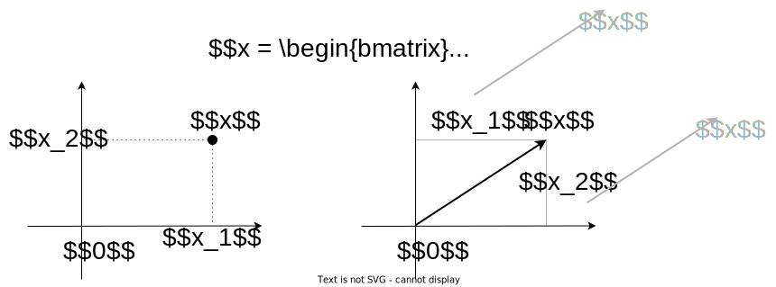
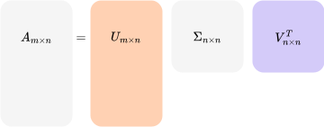
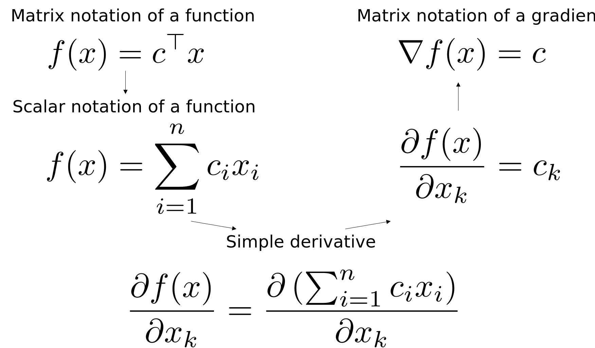

## Basic linear algebra background

### Vectors and matrices

We will treat all vectors as column vectors by default. The space of real vectors of length $n$ is denoted by $\mathbb{R}^n$, while the space of real-valued $m \times n$ matrices is denoted by $\mathbb{R}^{m \times n}$. That's it: [^1]

[^1]: A full introduction to applied linear algebra can be found in [Introduction to Applied Linear Algebra -- Vectors, Matrices, and Least Squares](https://web.stanford.edu/~boyd/vmls/) - book by Stephen Boyd & Lieven Vandenberghe, which is indicated in the source. Also, a useful refresher for linear algebra is in Appendix A of the book Numerical Optimization by Jorge Nocedal Stephen J. Wright.

$$
x = \begin{bmatrix}
x_1 \\
x_2 \\
\vdots \\
x_n
\end{bmatrix} \quad x^T = \begin{bmatrix}
x_1 & x_2 & \dots & x_n
\end{bmatrix} \quad x \in \mathbb{R}^n, x_i \in \mathbb{R}
$$ {#eq-vector}
Similarly, if $A \in \mathbb{R}^{m \times n}$ we denote transposition as $A^T \in \mathbb{R}^{n \times m}$:
$$
A = \begin{bmatrix}
a_{11} & a_{12} & \dots & a_{1n} \\
a_{21} & a_{22} & \dots & a_{2n} \\
\vdots & \vdots & \ddots & \vdots \\
a_{m1} & a_{m2} & \dots & a_{mn}
\end{bmatrix} \quad A^T = \begin{bmatrix}
a_{11} & a_{21} & \dots & a_{m1} \\
a_{12} & a_{22} & \dots & a_{m2} \\
\vdots & \vdots & \ddots & \vdots \\
a_{1n} & a_{2n} & \dots & a_{mn}
\end{bmatrix} \quad A \in \mathbb{R}^{m \times n}, a_{ij} \in \mathbb{R}
$$
We will write $x \geq 0$ and $x \neq 0$ to indicate componentwise relationships

{#fig-vector}

A matrix is symmetric if $A = A^T$. It is denoted as $A \in \mathbb{S}^n$ (set of square symmetric matrices of dimension $n$). Note that only a square matrix could be symmetric by definition.

A matrix $A \in \mathbb{S}^n$ is called **positive (negative) definite** if for all $x \neq 0 : x^T Ax > (<) 0$. We denote this as $A \succ (\prec) 0$. The set of such matrices is denoted as $\mathbb{S}^n_{++} (\mathbb{S}^n_{- -})$

A matrix $A \in \mathbb{S}^n$ is called **positive (negative) semidefinite** if for all $x : x^T Ax \geq (\leq) 0$. We denote this as $A \succeq (\preceq) 0$. The set of such matrices is denoted as $\mathbb{S}^n_{+} (\mathbb{S}^n_{-})$

:::{.callout-question}
Is it correct that a positive semidefinite matrix has all non-negative positive entries?

:::{.callout-solution collapse="true"}
**Answer: No.**  
A positive semidefinite matrix does not necessarily have all non-negative entries. The definition of a positive semidefinite matrix is that for any non-zero vector $x$, the quadratic form $x^\top A x > 0$. This implies that the matrix has non-negative eigenvalues, but the individual entries of the matrix could be negative. For example, the matrix 
$$
A = \begin{pmatrix} 1 & -1 \\ -1 & 1 \end{pmatrix}
$$
is positive semidefinite, because $x^\top A x = x_1^2 + x_2^2 - 2x_1x_2 \geq 0$ but it contains negative entries.
:::
:::

:::{.callout-question}
Is it correct that a matrix should be positive definite if it is symmetric?

:::{.callout-solution collapse="true"}
**Answer: No.**  
A matrix being symmetric does not necessarily mean it is positive definite. A symmetric matrix can have negative or zero eigenvalues, in which case it would be either negative definite, indefinite, or positive semidefinite. A matrix is positive definite only if all its eigenvalues are positive. For instance, the matrix
$$
A = \begin{pmatrix} 1 & 0 \\ 0 & -1 \end{pmatrix}
$$
is symmetric but not positive definite because it has a negative eigenvalue.
:::
:::

:::{.callout-question}
Is it correct, that if a matrix is positive definite it should be symmetric?

:::{.callout-solution collapse="true"}
It is a tricky question. By definition a matrix is called positive definite only if it is symmetric. But in fact, if we talk about the real field $x \in \mathbb{R}^n$, it is easy to imagine a non-symmetric matrix for which $x^T A x \geq 0$ is satisfied, but the matrix will not be symmetric:
$$
A = \begin{pmatrix} 1 & 0 \\ -3 & 1 \end{pmatrix}
$$
However, the reader will not be able to come up with such a matrix if we allow the vector $x \in \mathbb{C}^n$ to have complex entries and replace the transpose in the definition with a complex conjugation.
:::
:::

### Matrix and vector product

Let $A$ be a matrix of size $m \times n$, and $B$ be a matrix of size $n \times p$, and let the product $AB$ be:
$$
C = AB
$$
then $C$ is a $m \times p$ matrix, with element $(i, j)$ given by:
$$
c_{ij} = \sum_{k=1}^n a_{ik}b_{kj}.
$$

This operation in a naive form requires $\mathcal{O}(n^3)$ arithmetical operations, where $n$ is usually assumed as the largest dimension of matrices.

:::{.callout-question}
Is it possible to multiply two matrices faster, than $\mathcal{O}(n^3)$? How about $\mathcal{O}(n^2)$, $\mathcal{O}(n)$?
:::

Let $A$ be a matrix of shape $m \times n$, and $x$ be $n \times 1$ vector, then the $i$-th component of the product:
$$
z = Ax
$$
is given by:
$$
z_i = \sum_{k=1}^n a_{ik}x_k
$$

This operation in a naive form requires $\mathcal{O}(n^2)$ arithmetical operations, where $n$ is usually assumed as the largest dimension of matrices.

Remember, that:

* $C = AB \quad C^T = B^T A^T$
* $AB \neq BA$
* $e^{A} =\sum\limits_{k=0}^{\infty }{1 \over k!}A^{k}$
* $e^{A+B} \neq e^{A} e^{B}$ (but if $A$ and $B$ are commuting matrices, which means that $AB = BA$, $e^{A+B} = e^{A} e^{B}$)
* $\langle x, Ay\rangle = \langle A^T x, y\rangle$

:::{.callout-example}

### Simple yet important idea on matrix computations.

Suppose, you have the following expression

$$
b = A_1 A_2 A_3 x,
$$

where the $A_1, A_2, A_3 \in \mathbb{R}^{3 \times 3}$ - random square dense matrices and $x \in \mathbb{R}^n$ - vector. You need to compute b.

Which one way is the best to do it?

1. $A_1 A_2 A_3 x$ (from left to right)
2. $\left(A_1 \left(A_2 \left(A_3 x\right)\right)\right)$ (from right to left)
3. It does not matter
4. The results of the first two options will not be the same.

Check the simple [\faPython code snippet](https://colab.research.google.com/github/MerkulovDaniil/optim/blob/master/assets/Notebooks/stupid_important_idea_on_mm.ipynb) after all.
:::

### Norms and scalar products

Norm is a **qualitative measure of the smallness of a vector** and is typically denoted as $\Vert x \Vert$.

The norm should satisfy certain properties:

1.  $\Vert \alpha x \Vert = \vert \alpha\vert \Vert x \Vert$, $\alpha \in \mathbb{R}$
2.  $\Vert x + y \Vert \leq \Vert x \Vert + \Vert y \Vert$ (triangle inequality)
3.  If $\Vert x \Vert = 0$ then $x = 0$

The distance between two vectors is then defined as
$$ 
d(x, y) = \Vert x - y \Vert. 
$$
The most well-known and widely used norm is **Euclidean norm**:
$$
\Vert x \Vert_2 = \sqrt{\sum_{i=1}^n |x_i|^2},
$$
which corresponds to the distance in our real life. If the vectors have complex elements, we use their modulus.

Euclidean norm, or $2$-norm, is a subclass of an important class of $p$-norms:

$$
\Vert x \Vert_p = \Big(\sum_{i=1}^n |x_i|^p\Big)^{1/p}. 
$$
There are two very important special cases. The infinity norm, or Chebyshev norm is defined as the element of the maximal absolute value:
$$
\Vert x \Vert_{\infty} = \max_i | x_i| 
$$
$L_1$ norm (or **Manhattan distance**) which is defined as the sum of modules of the elements of $x$:

$$
\Vert x \Vert_1 = \sum_i |x_i| 
$$

$L_1$ norm plays a very important role: it all relates to the **compressed sensing** methods that emerged in the mid-00s as one of the most popular research topics. The code for the picture below is available here: [👨‍💻](https://colab.research.google.com/github/MerkulovDaniil/optim/blob/master/assets/Notebooks/Balls_p_norm.ipynb)

{#fig-p_balls}

In some sense there is no big difference between matrices and vectors (you can vectorize the matrix), and here comes the simplest matrix norm **Frobenius** norm:
$$
\Vert A \Vert_F = \left(\sum_{i=1}^m \sum_{j=1}^n |a_{ij}|^2\right)^{1/2}
$$
Spectral norm, $\Vert A \Vert_2$ is one of the most used matrix norms (along with the Frobenius norm).

$$
\Vert A \Vert_2 = \sup_{x \ne 0} \frac{\Vert A x \Vert_2}{\Vert x \Vert_{2}},
$$
It can not be computed directly from the entries using a simple formula, like the Frobenius norm, however, there are efficient algorithms to compute it. It is directly related to the **singular value decomposition** (SVD) of the matrix. It holds

$$
\Vert A \Vert_2 = \sigma_1(A) = \sqrt{\lambda_{\max}(A^TA)}
$$

where $\sigma_1(A)$ is the largest singular value of the matrix $A$.

::: {.callout-question}
Is it true, that all matrix norms satisfy the submultiplicativity property: $\Vert AB \Vert \leq \Vert A \Vert \Vert B \Vert$? Hint: consider Chebyshev matrix norm $\Vert A \Vert_C = \max\limits_{i,j} \vert a_{ij}\vert$.
:::

The standard **scalar (inner) product** between vectors $x$ and $y$ from $\mathbb{R}^n$ is given by
$$
\langle x, y \rangle = x^T y = \sum\limits_{i=1}^n x_i y_i = y^T x =  \langle y, x \rangle
$$

Here $x_i$ and $y_i$ are the scalar $i$-th components of corresponding vectors.

::: {.callout-question}
Is there any connection between the norm $\Vert \cdot \Vert$ and scalar product $\langle \cdot, \cdot \rangle$?
:::

::: {.callout-example}
Prove, that you can switch the position of a matrix inside a scalar product with transposition: $\langle x, Ay\rangle = \langle A^Tx, y\rangle$ and $\langle x, yB\rangle = \langle xB^T, y\rangle$
:::

The standard **scalar (inner) product** between matrices $X$ and $Y$ from $\mathbb{R}^{m \times n}$ is given by

$$
\langle X, Y \rangle = \text{tr}(X^T Y) = \sum\limits_{i=1}^m\sum\limits_{j=1}^n X_{ij} Y_{ij} =  \text{tr}(Y^T X) =  \langle Y, X \rangle
$$

::: {.callout-question} 
Is there any connection between the Frobenious norm $\Vert \cdot \Vert_F$ and scalar product between matrices $\langle \cdot, \cdot \rangle$?
:::

::: {.callout-example}
Simplify the following expression:
$$
\sum\limits_{i=1}^n \langle S^{-1} a_i, a_i \rangle,
$$
where $S = \sum\limits_{i=1}^n a_ia_i^T, a_i \in \mathbb{R}^n, \det(S) \neq 0$

::: {.callout-solution collapse="true"}
1.  Let $A$ be the matrix of columns vector $a_i$, therefore matrix $A^T$ contains rows $a_i^T$
2.  Note, that, $S = A A^T$ - it is the skeleton decomposition from vectors $a_i$. Also note, that $A$ is not symmetric, while $S$, clearly, is.
3.  The target sum is $\sum\limits_{i=1}^n a_i^T S^{-1} a_i$.
4.  The most important part of this exercise lies here: we'll present this sum as the trace of some matrix $M$ to use trace cyclic property.
$$
\sum\limits_{i=1}^n a_i^T S^{-1} a_i = \sum\limits_{i=1}^n m_{ii},
$$
where $m_{ii}$ - i-th diagonal element of some matrix $M$.
5. Note, that $M = A^T \left( S^{-1} A \right)$ is the product of 2 matrices, because $i$-th diagonal element of $M$ is the scalar product of $i$-th row of the first matrix $A^T$ and $i$-th column of the second matrix $S^{-1} A$. $i$-th row of matrix $A^T$, by definition, is $a_i^T$, while $i$-th column of the matrix $S^{-1} A$ is clearly $S^>{-1} a_i$.

    Indeed, $m_{ii} = a_i^T S^{-1} a_i$, then we can finish the exercise:
    $$
    \begin{split}
    \sum\limits_{i=1}^n a_i^T S^{-1} a_i &= \sum\limits_{i=1}^n m_{ii} = \text{tr} M \\
    &= \text{tr} \left( A^T S^{-1} A\right) =  \text{tr} \left( AA^T S^{-1} \right) \\
    &=  \text{tr } \left( SS^{-1} \right) =  \text{tr} \left( I\right) = n
    \end{split}
    $$
:::
:::

### Eigenvalues, eigenvectors, and the singular-value decomposition

#### Eigenvalues

A scalar value $\lambda$ is an eigenvalue of the $n \times n$ matrix $A$ if there is a nonzero vector $q$ such that
$$ 
Aq = \lambda q. 
$$

::: {.callout-example}
Consider a 2x2 matrix:
$$
A = \begin{bmatrix}
2 & 1 \\
1 & 2 \\
\end{bmatrix}
$$ 
The eigenvalues of this matrix can be found by solving the characteristic equation:
$$
\text{det}(A - \lambda I) = 0
$$
For this matrix, the eigenvalues are $\lambda_1 = 1$ and $\lambda_2 = 3$. These eigenvalues tell us about the scaling factors of the matrix along its principal axes.
:::

The vector $q$ is called an eigenvector of $A$. The matrix $A$ is nonsingular if none of its eigenvalues are zero. The eigenvalues of symmetric matrices are all real numbers, while nonsymmetric matrices may have imaginary eigenvalues. If the matrix is positive definite as well as symmetric, its eigenvalues are all positive real numbers.

:::{.callout-theorem}
$$
A \succeq 0 \Leftrightarrow \text{all eigenvalues of } A \text{ are } \geq 0 
$$
$$
A \succ 0 \Leftrightarrow \text{all eigenvalues of } A \text{ are } > 0
$$  

:::{.callout-proof collapse="true"}
We will just prove the first point here. The second one can be proved analogously. 

1. $\rightarrow$ Suppose some eigenvalue $\lambda$ is negative and let $x$ denote its corresponding eigenvector. Then
$$
Ax = \lambda x \rightarrow x^T Ax = \lambda x^T x < 0
$$
which contradicts the condition of $A \succeq 0$.
2. $\leftarrow$ For any symmetric matrix, we can pick a set of eigenvectors $v_1, \dots, v_n$ that form an orthogonal basis of $\mathbb{R}^n$. Pick any $x \in \mathbb{R}^n$.
$$
\begin{split}
x^T A x &= (\alpha_1 v_1 + \ldots + \alpha_n v_n)^T A (\alpha_1 v_1 + \ldots + \alpha_n v_n)\\
&= \sum \alpha_i^2 v_i^T A v_i = \sum \alpha_i^2 \lambda_i v_i^T v_i \geq 0
\end{split}
$$
here we have used the fact that $v_i^T v_j = 0$, for $i \neq j$.
:::
:::

:::{.callout-question} 
If a matrix has all positive eigenvalues, what can we infer about the matrix's definiteness?
:::

Suppose $A \in S_n$, i.e., $A$ is a real symmetric $n \times n$ matrix. Then $A$ can be factorized as

$$ 
A = Q\Lambda Q^T,
$$

where $Q \in \mathbb{R}^{n \times n}$ is orthogonal, i.e., satisfies $Q^T Q = I$, and $\Lambda = \text{diag}(\lambda_1, \ldots , \lambda_n)$. The (real) numbers $\lambda_i$ are the eigenvalues of $A$ and are the roots of the characteristic polynomial $\text{det}(A - \lambda I)$. The columns of $Q$ form an orthonormal set of eigenvectors of $A$. The factorization is called the spectral decomposition or (symmetric) eigenvalue decomposition of $A$. [^2]

[^2]: A good cheat sheet with matrix decomposition is available at the NLA course [website](https://nla.skoltech.ru/_files/decompositions.pdf).

We usually order the eigenvalues as $\lambda_1 \geq \lambda_2 \geq \ldots \geq \lambda_n$. We use the notation $\lambda_i(A)$ to refer to the $i$-th largest eigenvalue of $A \in S$. We usually write the largest or maximum eigenvalue as $\lambda_1(A) = \lambda_{\text{max}}(A)$, and the least or minimum eigenvalue as $\lambda_n(A) = \lambda_{\text{min}}(A)$.

The largest and smallest eigenvalues satisfy

$$
\lambda_{\text{min}} (A) = \inf_{x \neq 0} \dfrac{x^T Ax}{x^T x}, \qquad \lambda_{\text{max}} (A) = \sup_{x \neq 0} \dfrac{x^T Ax}{x^T x}
$$

and consequently $\forall x \in \mathbb{R}^n$ (Rayleigh quotient):

$$
\lambda_{\text{min}} (A) x^T x \leq x^T Ax \leq \lambda_{\text{max}} (A) x^T x
$$

The **condition number** of a nonsingular matrix is defined as

$$
\kappa(A) = \|A\|\|A^{-1}\|
$$

If we use spectral matrix norm, we can get:

$$
\kappa(A) = \dfrac{\sigma_{\text{max}}(A)}{\sigma _{\text{min}}(A)}
$$

If, moreover, $A \in \mathbb{S}^n_{++}$: $\kappa(A) = \dfrac{\lambda_{\text{max}}(A)}{\lambda_{\text{min}}(A)}$

#### Singular value decomposition

Suppose $A \in \mathbb{R}^{m \times n}$ with rank $A = r$. Then $A$ can be factored as

$$
A = U \Sigma V^T , \quad
$$

{#fig-svd}

{#fig-svd_economic}

where $U \in \mathbb{R}^{m \times r}$ satisfies $U^T U = I$, $V \in \mathbb{R}^{n \times r}$ satisfies $V^T V = I$, and $\Sigma$ is a diagonal matrix with $\Sigma = \text{diag}(\sigma_1, ..., \sigma_r)$, such that

$$
\sigma_1 \geq \sigma_2 \geq \ldots \geq \sigma_r > 0. 
$$

This factorization is called the **singular value decomposition (SVD)** of $A$. The columns of $U$ are called left singular vectors of $A$, the columns of $V$ are right singular vectors, and the numbers $\sigma_i$ are the singular values. The singular value decomposition can be written as

$$
A = \sum_{i=1}^{r} \sigma_i u_i v_i^T,
$$

where $u_i \in \mathbb{R}^m$ are the left singular vectors, and $v_i \in \mathbb{R}^n$ are the right singular vectors.

:::{.callout-example} 
Consider a 2x2 matrix: 
$$
B = \begin{bmatrix}
4 & 0 \\
0 & 2 \\
\end{bmatrix}
$$ 
The singular value decomposition of this matrix can be represented as: 
$$
B = U \Sigma V^T.
$$ 
Where $U$ and $V$ are orthogonal matrices and $\Sigma$ is a diagonal matrix with the singular values on its diagonal. For this matrix, the singular values are 4 and 2, which are also the eigenvalues of the matrix.
:::

:::{.callout-example}
Let $A \in \mathbb{R}^{m \times n}$, and let $q := \min\{m, n\}$. Show that  
$$
\|A\|_F^2 = \sum_{i=1}^{q} \sigma_i^2(A),
$$
where $\sigma_1(A) \geq \ldots \geq \sigma_q(A) \geq 0$ are the singular values of matrix $A$. Hint: use the connection between Frobenius norm and scalar product and SVD. 

:::{.callout-solution collapse="true"}
1. $\|A\|_F^2 = \langle A, A\rangle = \text{tr }(A^T A)$
2. Using SVD: $A = U \Sigma V^T \quad A^T = V \Sigma U^T$
3. $\|A\|_F^2 = \text{tr }(V \Sigma U^T U \Sigma V^T) = \text{tr }(V \Sigma^2 V^T) = \text{tr }(V^T V \Sigma^2) = \text{tr }(\Sigma^2) = \sum\limits_{1}^q \sigma_i^2$
:::
:::

::: {.callout-question}
Suppose, matrix $A \in \mathbb{S}^n_{++}$. What can we say about the connection between its eigenvalues and singular values?

:::{.callout-solution collapse="true"}
$$
\sigma(A) = \lambda(A) > 0
$$
:::
:::

::: {.callout-question}
How do the singular values of a matrix relate to its eigenvalues, especially for a symmetric matrix?

:::{.callout-solution collapse="true"}
$$
\sigma(A) = \sqrt{\lambda(A^TA)} = |\lambda(A)|
$$
:::
:::

#### Skeleton decomposition

Simple, yet very interesting decomposition is Skeleton decomposition, which can be written in two forms:

$$
A = U V^T \quad A = \hat{C}\hat{A}^{-1}\hat{R}
$$

The latter expression refers to the fun fact: you can randomly choose $r$ linearly independent columns of a matrix and any $r$ linearly independent rows of a matrix and store only them with the ability to reconstruct the whole matrix exactly.

{#fig-skeleton}

::: {.callout-question} 
How does the choice of columns and rows in the Skeleton decomposition affect the accuracy of the matrix reconstruction?
:::

Use cases for Skeleton decomposition are:

* Model reduction, data compression, and speedup of computations in numerical analysis: given rank-$r$ matrix with $r \ll n, m$ one needs to store $\mathcal{O}((n + m)r) \ll nm$ elements.
* Feature extraction in machine learning, where it is also known as matrix factorization 
* All applications where SVD applies, since Skeleton decomposition can be transformed into truncated SVD form.

### Canonical tensor decomposition

One can consider the generalization of Skeleton decomposition to the higher order data structure, like tensors, which implies representing the tensor as a sum of $r$ primitive tensors.

{#fig-cp_decomposition}

::: {.callout-example} 
Note, that there are many tensor decompositions: Canonical, Tucker, Tensor Train (TT), Tensor Ring (TR), and others. In the tensor case, we do not have a straightforward definition of *rank* for all types of decompositions. For example, for TT decomposition rank is not a scalar, but a vector.
:::

::: {.callout-question} 
How does the choice of rank in the Canonical tensor decomposition affect the accuracy and interpretability of the decomposed tensor?
:::

### Determinant and trace

The determinant and trace can be expressed in terms of the eigenvalues

$$
\text{det} A = \prod\limits_{i=1}^n \lambda_i, \qquad \text{tr} A = \sum\limits_{i=1}^n \lambda_i
$$

The determinant has several appealing (and revealing) properties. For instance,  

* $\text{det} A = 0$ if and only if $A$ is singular; 
* $\text{det}  AB = (\text{det} A)(\text{det}  B)$; 
* $\text{det}  A^{-1} = \frac{1}{\text{det} \ A}$.

Don't forget about the cyclic property of a trace for arbitrary matrices $A, B, C, D$ (assuming, that all dimensions are consistent):

$$
\text{tr} (ABCD) = \text{tr} (DABC) = \text{tr} (CDAB) = \text{tr} (BCDA)
$$

::: {.callout-example} 
For the matrix:  
$$
C = \begin{bmatrix}
2 & 1 \\
1 & 3 \\
\end{bmatrix}
$$
The determinant is $\text{det}(C) = 6 - 1 = 5$, and the trace is $\text{tr}(C) = 2 + 3 = 5$. The determinant gives us a measure of the volume scaling factor of the matrix, while the trace provides the sum of the eigenvalues.
:::

::: {.callout-question} 
How does the determinant of a matrix relate to its invertibility?
:::

::: {.callout-question}
What can you say about the determinant value of a positive definite matrix?
:::

## Optimization bingo

### Gradient

Let $f(x):\mathbb{R}^n→\mathbb{R}$, then vector, which contains all first-order partial derivatives:

$$
\nabla f(x) = \dfrac{df}{dx} = \begin{pmatrix}
    \frac{\partial f}{\partial x_1} \\
    \frac{\partial f}{\partial x_2} \\
    \vdots \\
    \frac{\partial f}{\partial x_n}
\end{pmatrix}
$$

named gradient of $f(x)$. This vector indicates the direction of the steepest ascent. Thus, vector $−\nabla f(x)$ means the direction of the steepest descent of the function in the point. Moreover, the gradient vector is always orthogonal to the contour line in the point.

::: {.callout-example}
For the function $f(x, y) = x^2 + y^2$, the gradient is: 
$$
\nabla f(x, y) =
\begin{bmatrix}
2x \\
2y \\
\end{bmatrix}
$$
This gradient points in the direction of the steepest ascent of the function.
:::

::: {.callout-question} 
How does the magnitude of the gradient relate to the steepness of the function?
:::

### Hessian

Let $f(x):\mathbb{R}^n→\mathbb{R}$, then matrix, containing all the second order partial derivatives:

$$
f''(x) = \nabla^2 f(x) = \dfrac{\partial^2 f}{\partial x_i \partial x_j} = \begin{pmatrix}
    \frac{\partial^2 f}{\partial x_1 \partial x_1} & \frac{\partial^2 f}{\partial x_1 \partial x_2} & \dots  & \frac{\partial^2 f}{\partial x_1\partial x_n} \\
    \frac{\partial^2 f}{\partial x_2 \partial x_1} & \frac{\partial^2 f}{\partial x_2 \partial x_2} & \dots  & \frac{\partial^2 f}{\partial x_2 \partial x_n} \\
    \vdots & \vdots & \ddots & \vdots \\
    \frac{\partial^2 f}{\partial x_n \partial x_1} & \frac{\partial^2 f}{\partial x_n \partial x_2} & \dots  & \frac{\partial^2 f}{\partial x_n \partial x_n}
\end{pmatrix}
$$

In fact, Hessian could be a tensor in such a way: $\left(f(x): \mathbb{R}^n \to \mathbb{R}^m \right)$ is just 3d tensor, every slice is just hessian of corresponding scalar function $\left( \nabla^2f_1(x), \ldots, \nabla^2f_m(x)\right)$.

::: {.callout-example} 
For the function $f(x, y) = x^2 + y^2$, the Hessian is:

$$
H_f(x, y) = \begin{bmatrix} 2 & 0 \\
0 & 2 \\
\end{bmatrix}
$$
:::

This matrix provides information about the curvature of the function in different directions.

::: {.callout-question} 
How can the Hessian matrix be used to determine the concavity or convexity of a function?
:::

:::{.callout-theorem}

### Schwartz theorem

Let $f: \mathbb{R}^n \rightarrow \mathbb{R}$ be a function. If the mixed partial derivatives $\frac{\partial^2 f}{\partial x_i \partial x_j}$ and $\frac{\partial^2 f}{\partial x_j \partial x_i}$ are both continuous on an open set containing a point $a$, then they are equal at the point $a$. That is,
$$
\frac{\partial^2 f}{\partial x_i \partial x_j} (a) = \frac{\partial^2 f}{\partial x_j \partial x_i} (a)
$$

Given the Schwartz theorem, if the mixed partials are continuous on an open set, the Hessian matrix is symmetric. That means the entries above the main diagonal mirror those below the main diagonal:

$$
\frac{\partial^2 f}{\partial x_i \partial x_j} = \frac{\partial^2 f}{\partial x_j \partial x_i} \quad \nabla^2 f(x)  =(\nabla^2 f(x))^T
$$

This symmetry simplifies computations and analysis involving the Hessian matrix in various applications, particularly in optimization.
:::

::: {.callout-example}

### Schwartz counterexample
$$
f(x,y) = 
\begin{cases}
    \frac{xy\left(x^2 - y^2\right)}{x^2 + y^2} & \text{ for } (x,\, y) \ne (0,\, 0),\\
    0 & \text{ for } (x, y) = (0, 0).
\end{cases}
$$

:::{.plotly}
schwartz_counterexample.html
:::
One can verify, that $\frac{\partial^2 f}{ \partial x \partial y} (0, 0) \neq \frac{\partial^2 f}{ \partial y \partial x} (0, 0)$, although the mixed partial derivatives do exist, and at every other point the symmetry does hold.
:::

### Jacobian

The extension of the gradient of multidimensional $f(x):\mathbb{R}^n\to\mathbb{R}^m$ is the following matrix:

$$
J_f = f'(x) = \dfrac{df}{dx^T} = \begin{pmatrix}
    \frac{\partial f_1}{\partial x_1} & \frac{\partial f_2}{\partial x_1} & \dots  & \frac{\partial f_m}{\partial x_1} \\
    \frac{\partial f_1}{\partial x_2} & \frac{\partial f_2}{\partial x_2} & \dots  & \frac{\partial f_m}{\partial x_2} \\
    \vdots & \vdots & \ddots & \vdots \\
    \frac{\partial f_1}{\partial x_n} & \frac{\partial f_2}{\partial x_n} & \dots  & \frac{\partial f_m}{\partial x_n}
\end{pmatrix}
$$

::: {.callout-example}
For the function  
$$
f(x, y) = \begin{bmatrix}
x + y \\
x - y \\
\end{bmatrix}, 
$$
the Jacobian is: 
$$
J_f(x, y) = \begin{bmatrix}
1 & 1 \\
1 & -1 \\
\end{bmatrix}
$$ 
:::
This matrix provides information about the rate of change of the function with respect to its inputs.

::: {.callout-question} 
How does the Jacobian matrix relate to the gradient for scalar-valued functions?
:::

::: {.callout-question} 
Can we somehow connect those three definitions above (gradient, jacobian, and hessian) using a single correct statement?
:::

### Summary

$$
f(x) : X \to Y; \qquad \frac{\partial f(x)}{\partial x} \in G
$$

|             X             |       Y        |             G             |                      Name                       |
|:----------------:|:----------------:|:----------------:|:-----------------:|
|       $\mathbb{R}$        |  $\mathbb{R}$  |       $\mathbb{R}$        |              $f'(x)$ (derivative)               |
|      $\mathbb{R}^n$       |  $\mathbb{R}$  |      $\mathbb{R^n}$       |  $\dfrac{\partial f}{\partial x_i}$ (gradient)  |
|      $\mathbb{R}^n$       | $\mathbb{R}^m$ | $\mathbb{R}^{n \times m}$ | $\dfrac{\partial f_i}{\partial x_j}$ (jacobian) |
| $\mathbb{R}^{m \times n}$ |  $\mathbb{R}$  | $\mathbb{R}^{m \times n}$ |      $\dfrac{\partial f}{\partial x_{ij}}$      |

### Taylor approximations

Taylor approximations provide a way to approximate functions locally by polynomials. The idea is that for a smooth function, we can approximate it by its tangent (for the first order) or by its parabola (for the second order) at a point.

#### First-order Taylor approximation

The first-order Taylor approximation, also known as the linear approximation, is centered around some point $x_0$. If $f: \mathbb{R}^n \rightarrow \mathbb{R}$ is a differentiable function, then its first-order Taylor approximation is given by:

$$
f_{x_0}^I(x) = f(x_0) + \nabla f(x_0)^T (x - x_0)
$$

Where: 

* $f(x_0)$ is the value of the function at the point $x_0$.
* $\nabla f(x_0)$ is the gradient of the function at the point $x_0$.

It is very usual to replace the $f(x)$ with $f_{x_0}^I(x)$ near the point $x_0$ for simple analysis of some approaches.

{#fig-first_order_taylor}

::: {.callout-example}
For the function $f(x) = e^x$ around the point $x_0 = 0$, the first order Taylor approximation is: 
$$
f_{x_0}^I(x) = 1 + x
$$
The second-order Taylor approximation is:
$$
f_{x_0}^{II}(x) = 1 + x + \frac{x^2}{2}
$$ 
These approximations provide polynomial representations of the function near the point $x_0$.
:::

#### Second-order Taylor approximation

The second-order Taylor approximation, also known as the quadratic approximation, includes the curvature of the function. For a twice-differentiable function $f: \mathbb{R}^n \rightarrow \mathbb{R}$, its second-order Taylor approximation centered at some point $x_0$ is:

$$
f_{x_0}^{II}(x) = f(x_0) + \nabla f(x_0)^T (x - x_0) + \frac{1}{2} (x - x_0)^T \nabla^2 f(x_0) (x - x_0)
$$

Where: 

* $\nabla^2 f(x_0)$ is the Hessian matrix of $f$ at the point $x_0$.

{#fig-second_order_taylor}

When using the linear approximation of the function is not sufficient one can consider replacing the $f(x)$ with $f_{x_0}^{II}(x)$ near the point $x_0$. In general, Taylor approximations give us a way to locally approximate functions. The first-order approximation is a plane tangent to the function at the point $x_0$, while the second-order approximation includes the curvature and is represented by a parabola. These approximations are especially useful in optimization and numerical methods because they provide a tractable way to work with complex functions.

::: {.callout-example} 
Calculate first and second order Taylor approximation of the function $f(x) = \dfrac{1}{2}x^T A x - b^T x + c$ 

:::{.callout-solution collapse="true"}

**First-order Taylor Approximation**

1. **Function evaluation at $x_0$:**
  $$
  f(x_0) = \dfrac{1}{2}x_0^T A x_0 - b^T x_0 + c
  $$

2. **Gradient of $f(x)$:**
  The gradient of $f(x)$ is:
  $$
  \nabla f(x) = \frac12(A+A^T) x - b
  $$
  So, at $x_0$:
  $$
  \nabla f(x_0) = \frac12(A+A^T) x_0 - b
  $$

3. **First-order approximation:**
  Using the first-order Taylor expansion formula:
  $$
  f_{x_0}^I(x) = f(x_0) + \nabla f(x_0)^T (x - x_0)
  $$
  Substituting the expressions:
  $$
  \begin{split}
  f_{x_0}^I(x) &= \left( \dfrac{1}{2}x_0^T A x_0 - b^T x_0 + c \right) + (\frac12(A+A^T) x_0 - b)^T (x - x_0)\\ 
  &= c - \frac12x_0^T(A+A^T)x_0 + \left(\frac12(A+A^T) x_0 - b\right)x
  \end{split}
  $$

**Second-order Taylor Approximation**

1. **Hessian matrix of $f(x)$:**
  The Hessian of $f(x)$ is:
  $$
  \nabla^2 f(x) = \frac12(A+A^T)
  $$
  Since $A$ is constant, it is the same at $x_0$.

2. **Second-order approximation:**
  Using the second-order Taylor expansion formula:
  $$
  f_{x_0}^{II}(x) = f_{x_0}^I(x) + \dfrac{1}{2}(x - x_0)^T A (x - x_0)
  $$
  Substituting the expressions:
  $$
  \begin{split}
  f_{x_0}^{II}(x) &= c - \frac12x_0^T(A+A^T)x_0 + \left(\frac12(A+A^T) x_0 - b\right)x + \dfrac{1}{2}(x - x_0)^T A (x - x_0) \\
  &= \dfrac{1}{2}x^T A x - b^Tx + c = f(x)
  \end{split}
  $$

:::
:::

::: {.callout-question}
Why might one choose to use a Taylor approximation instead of the original function in certain applications?
:::

Note, that even the second-order approximation could become inaccurate very quickly. The code for the picture below is available here: [👨‍💻](https://colab.research.google.com/github/MerkulovDaniil/optim/blob/master/assets/Notebooks/taylor_inaccuracy.ipynb)

:::{.video}
inaccurate_taylor.mp4
:::

## Derivatives

### Naive approach

The basic idea of the naive approach is to reduce matrix/vector derivatives to the well-known scalar derivatives. 
{#fig-naive_derivative}
One of the most important practical tricks here is to separate indices of sum ($i$) and partial derivatives ($k$). Ignoring this simple rule tends to produce mistakes.

### Differential approach

The guru approach implies formulating a set of simple rules, which allows you to calculate derivatives just like in a scalar case. It might be convenient to use the differential notation here. [^3]

[^3]: The most comprehensive and intuitive guide about the theory of taking matrix derivatives is presented in [these notes](http://www.machinelearning.ru/wiki/images/a/ab/MOMO18_Seminar1.pdf) by Dmitry Kropotov team.

::: {.callout-theorem}
Let $x \in S$ be an interior point of the set $S$, and let $D : U \rightarrow V$ be a linear operator. We say that the function $f$ is differentiable at the point $x$ with derivative $D$ if for all sufficiently small $h \in U$ the following decomposition holds: 
$$ 
f(x + h) = f(x) + D[h] + o(\|h\|)
$$
If for any linear operator $D : U \rightarrow V$ the function $f$ is not differentiable at the point $x$ with derivative $D$, then we say that $f$ is not differentiable at the point $x$.
:::

#### Differentials

After obtaining the differential notation of $df$ we can retrieve the gradient using the following formula:

$$
df(x) = \langle \nabla f(x), dx\rangle
$$

Then, if we have a differential of the above form and we need to calculate the second derivative of the matrix/vector function, we treat "old" $dx$ as the constant $dx_1$, then calculate $d(df) = d^2f(x)$

$$
d^2f(x) = \langle \nabla^2 f(x) dx_1, dx\rangle = \langle H_f(x) dx_1, dx\rangle
$$

#### Properties

Let $A$ and $B$ be the constant matrices, while $X$ and $Y$ are the variables (or matrix functions).

-   $dA = 0$
-   $d(\alpha X) = \alpha (dX)$
-   $d(AXB) = A(dX )B$
-   $d(X+Y) = dX + dY$
-   $d(X^T) = (dX)^T$
-   $d(XY) = (dX)Y + X(dY)$
-   $d\langle X, Y\rangle = \langle dX, Y\rangle+ \langle X, dY\rangle$
-   $d\left( \dfrac{X}{\phi}\right) = \dfrac{\phi dX - (d\phi) X}{\phi^2}$
-   $d\left( \det X \right) = \det X \langle X^{-T}, dX \rangle$
-   $d\left(\text{tr } X \right) = \langle I, dX\rangle$
-   $df(g(x)) = \dfrac{df}{dg} \cdot dg(x)$
-   $H = (J(\nabla f))^T$
-   $d(X^{-1})=-X^{-1}(dX)X^{-1}$

::: {.callout-example} 
Find $\nabla^2 f(x)$, if $f(x) = \langle Ax, x\rangle - \langle b, x\rangle + c$. 

::: {.callout-solution collapse="true"}
1. Let's write down differential $df$
    $$
    \begin{split}
    df &= d\left(\langle Ax, x\rangle - \langle b, x\rangle + c\right) \\
    &= \langle Ax, dx\rangle + \langle x, Adx\rangle - \langle b, dx\rangle \\
    &= \langle Ax, dx\rangle + \langle A^Tx, dx\rangle - \langle b, dx\rangle \\
    &= \langle (A+A^T)x - b, dx\rangle  \\
    \end{split}
    $$

    Which essentially means $\nabla f = (A+A^T)x - b$.

2. Let's find $d^2f = d(df)$, assuming, that $dx=dx_1 = \text{const}$:
    $$
    \begin{split}
    d^2f &= d\left(\langle (A+A^T)x - b, dx_1\rangle\right) \\
    &= \langle (A+A^T)dx, dx_1\rangle \\
    &= \langle dx, (A+A^T)^Tdx_1\rangle \\
    &= \langle (A+A^T)dx_1, dx\rangle 
    \end{split}
    $$

    Thus, the hessian is $\nabla^2 f = (A+A^T)$.
:::
:::

::: {.callout-example}
Find $df, \nabla f(x)$, if $f(x) = \ln \langle x, Ax\rangle$. 

::: {.callout-solution collapse="true"}
1.  It is essential for $A$ to be positive definite, because it is a logarithm argument. So, $A \in \mathbb{S}^n_{++}$Let's find the differential first: 
    $$
    \begin{split}
        df &= d \left( \ln \langle x, Ax\rangle \right) = \dfrac{d \left( \langle x, Ax\rangle \right)}{ \langle x, Ax\rangle} = \dfrac{\langle dx, Ax\rangle +  \langle x, d(Ax)\rangle}{ \langle x, Ax\rangle} = \\
        &= \dfrac{\langle Ax, dx\rangle + \langle x, Adx\rangle}{ \langle x, Ax\rangle} = \dfrac{\langle Ax, dx\rangle + \langle A^T x, dx\rangle}{ \langle x, Ax\rangle} = \dfrac{\langle (A + A^T) x, dx\rangle}{ \langle x, Ax\rangle} 
    \end{split}
    $$
2.  Note, that our main goal is to derive the form $df = \langle \cdot, dx\rangle$
    $$
    df = \left\langle  \dfrac{2 A x}{ \langle x, Ax\rangle} , dx\right\rangle
    $$
    Hence, the gradient is $\nabla f(x) = \dfrac{2 A x}{ \langle x, Ax\rangle}$
:::
:::

::: {.callout-example} 
Find $df, \nabla f(X)$, if $f(X) = \Vert AX - B\Vert_F$. 

::: {.callout-solution collapse="true"}
Let's write down differential $df$
$$
\begin{split}
df &= d\left(\Vert AX - B\Vert_F\right) = d\left(\langle AX - B, AX - B \rangle^{\frac12}\right) \\
&= \frac12 \langle AX - B, AX - B \rangle^{-\frac12} 2\langle AX - B, d\left(AX - B\right) \rangle \\
&= \dfrac{\langle (AX-B), AdX\rangle}{\sqrt{\langle AX - B, AX - B \rangle}} =\dfrac{\langle A^T(AX-B), dX\rangle}{\Vert AX - B\Vert_F}
\end{split}
$$

Which essentially means $\nabla f = \dfrac{A^T(AX-B)}{\Vert AX - B\Vert_F}$.
:::
:::

::: {.callout-example}
Find $df, \nabla f(X)$, if $f(X) = \langle S, X\rangle - \log \det X$. 

::: {.callout-solution collapse="true"}
$df(X) = d\left(\langle S, X\rangle - \log \det X\right) = \langle S, dX\rangle - \dfrac{d\left(\det X\right)}{\det X} = \langle S, dX\rangle - \dfrac{\det X \langle X^{-T}, dX \rangle}{\det X} = \langle S - X^{-T}, dX \rangle$

And the gradient is $\nabla f(X) =  S - X^{-T}$.
:::
:::

::: {.callout-example} 
Find the gradient $\nabla f(x)$ and hessian $\nabla^2f(x)$, if $f(x) = \ln \left( 1 + \exp\langle a,x\rangle\right)$ 

::: {.callout-solution collapse="true"}
1. Let's start by computing the differential $df$. We have:
    $$
    f(x) = \ln \left( 1 + \exp\langle a, x\rangle\right)
    $$

    Using the chain rule, the differential is:
    $$
    df = d \left( \ln \left( 1 + \exp\langle a, x\rangle\right) \right)
    = \frac{d \left( 1 + \exp\langle a, x\rangle \right)}{1 + \exp\langle a, x\rangle}
    $$

    Now, compute the differential of the exponential term:
    $$
    d \left( \exp\langle a, x\rangle \right) = \exp\langle a, x\rangle \langle a, dx\rangle
    $$

    Substituting this into the previous equation, we get:
    $$
    df = \frac{\exp\langle a, x\rangle \langle a, dx\rangle}{1 + \exp\langle a, x\rangle}
    $$

2. To express $df$ in the desired form, we write:
    $$
    df = \left\langle \frac{\exp\langle a, x\rangle}{1 + \exp\langle a, x\rangle} a, dx\right\rangle
    $$

    Recall that the sigmoid function is defined as:
    $$
    \sigma(t) = \frac{1}{1 + \exp(-t)}
    $$
    Thus, we can rewrite the differential as:
    $$
    df = \langle \sigma(\langle a, x\rangle) a, dx \rangle
    $$

    Therefore, the gradient is:
    $$
    \nabla f(x) = \sigma(\langle a, x\rangle) a
    $$

3. Now, let's find the Hessian $\nabla^2 f(x)$ by differentiating the gradient:
    $$
    d(\nabla f(x)) = d\left( \sigma(\langle a, x\rangle) a \right)
    $$
    Since $a$ is constant, we only need to differentiate the sigmoid term. Using the chain rule:
    $$
    d\left( \sigma(\langle a, x\rangle) \right) = \sigma(\langle a, x\rangle)(1 - \sigma(\langle a, x\rangle)) \langle a, dx\rangle
    $$

    Therefore:
    $$
    d(\nabla f(x)) = \sigma(\langle a, x\rangle)(1 - \sigma(\langle a, x\rangle)) \langle a, dx\rangle a
    $$

    We can now express the Hessian as:
    $$
    \nabla^2 f(x) = \sigma(\langle a, x\rangle)(1 - \sigma(\langle a, x\rangle)) a a^T
    $$

    Thus, the Hessian matrix is:
    $$
    \nabla^2 f(x) = \sigma(\langle a, x\rangle)(1 - \sigma(\langle a, x\rangle)) a a^T
    $$
:::
:::

## References

-   [Convex Optimization](https://web.stanford.edu/~boyd/cvxbook/) book by S. Boyd and L. Vandenberghe - Appendix A. Mathematical background.
-   [Numerical Optimization](assets/files/NumericalOptimization.pdf) by J. Nocedal and S. J. Wright. - Background Material.
-   [Matrix decompositions Cheat Sheet](https://nla.skoltech.ru/lectures/files/decompositions.pdf).
-   [Good introduction](https://atmos.washington.edu/~dennis/MatrixCalculus.pdf)
-   [The Matrix Cookbook](https://www.math.uwaterloo.ca/~hwolkowi/matrixcookbook.pdf)
-   [MSU seminars](http://www.machinelearning.ru/wiki/images/a/ab/MOMO18_Seminar1.pdf) (Rus.)
-   [Online tool](http://www.matrixcalculus.org/) for analytic expression of a derivative.
-   [Determinant derivative](https://charlesfrye.github.io/math/2019/01/25/frechet-determinant.html)
-   [Introduction to Applied Linear Algebra -- Vectors, Matrices, and Least Squares](https://web.stanford.edu/~boyd/vmls/) - book by Stephen Boyd & Lieven Vandenberghe.
-   [Numerical Linear Algebra](https://nla.skoltech.ru) course at Skoltech
