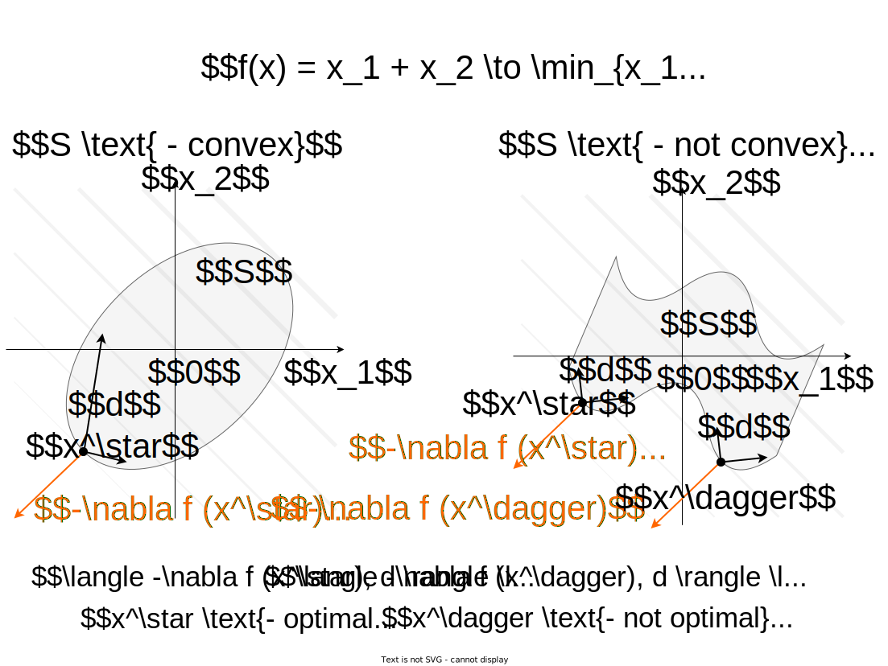
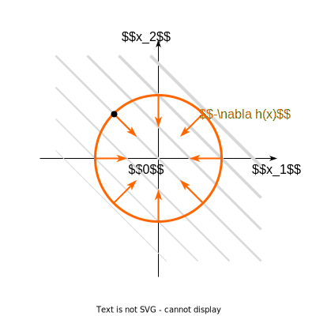
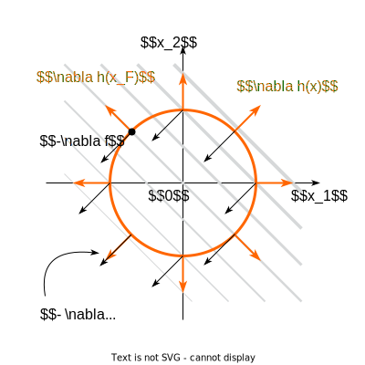
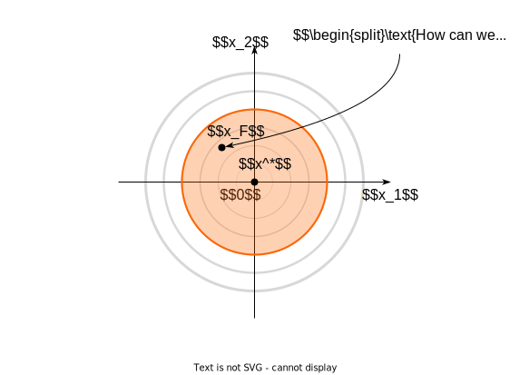
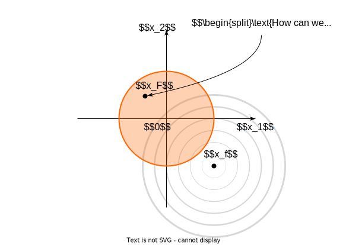
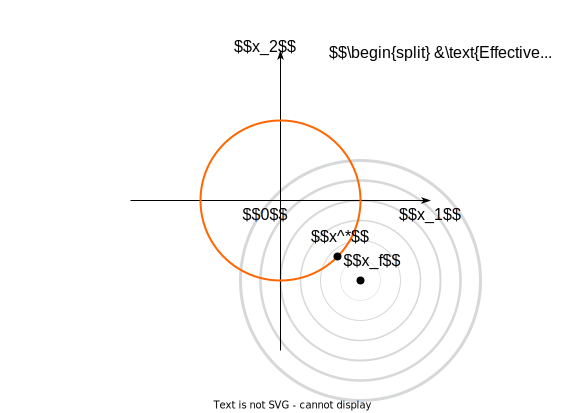
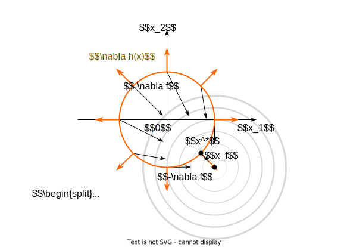

# Background

$$
f(x) \to \min\limits_{x \in S}
$$

* A set $S$ is usually called a **budget set**.

We say that the problem has a solution if the budget set **is not empty**: $x^* \in S$, in which the minimum or the infimum of the given function is achieved. 

* A point $x^*$ is a **global minimizer** if $f(x^*) \leq f(x)$ for all $x$.
* A point $x^*$ is a **local minimizer** if there exists a neighborhood $N$ of $x^*$ such that $f(x^*) \leq f(x)$ for all $x \in N$.
* A point $x^*$ is a **strict local minimizer** (also called a **strong local minimizer**) if there exists a neighborhood $N$ of $x^*$ such that $f(x^*) < f(x)$ for all $x \in N$ with $x \neq x^*$.
* We call $x^*$ a **stationary point** (or critical) if $\nabla f(x^*) = 0$. Any local minimizer must be a stationary point.

{#fig-stationary_points}

:::{.callout-theorem}

## Extreme value (Weierstrass) theorem

Let $S \subset \mathbb{R}^n$ be a compact set and $f(x)$ a continuous function on $S$. 
So that, the point of the global minimum of the function $f (x)$ on $S$ exists.
:::

{#fig-weierstrass}

:::{.callout-theorem}

## Taylor’s Theorem
Suppose that $f : \mathbb{R}^n \to \mathbb{R}$ is continuously differentiable and that $p \in \mathbb{R}^n$. Then we have:
$$
f(x + p) = f(x) + \nabla f(x + tp)^T p \quad \text{ for some } t \in (0, 1)
$$

Moreover, if $f$ is twice continuously differentiable, we have:

$$
\nabla f(x + p) = \nabla f(x) + \int_0^1 \nabla^2 f(x + tp)p \, dt
$$  

$$
f(x + p) = f(x) + \nabla f(x)^T p + \frac{1}{2} p^T \nabla^2 f(x + tp) p  \quad \text{ for some } t \in (0, 1)
$$
:::

## Lagrange multipliers
Consider simple yet practical case of equality constraints:

$$
\begin{split}
& f(x) \to \min\limits_{x \in \mathbb{R}^n} \\
\text{s.t. } & h_i(x) = 0, i = 1, \ldots, p
\end{split}
$$

The basic idea of Lagrange method implies the switch from conditional to unconditional optimization through increasing the dimensionality of the problem:

$$
L(x, \nu) = f(x) + \sum\limits_{i=1}^p \nu_i h_i(x) \to \min\limits_{x \in \mathbb{R}^n, \nu \in \mathbb{R}^p} \\
$$

# Unconstrained optimization

:::{.callout-theorem}

## First-Order Necessary Conditions

If $x^*$ is a local minimizer and $f$ is continuously differentiable in an open neighborhood, then 

$$
\nabla f(x^*) = 0
$${#eq-unconstrained_problem_necessary}

:::{.callout-proof collapse="true"}
Suppose for contradiction that $\nabla f(x^*) \neq 0$. Define the vector $p = -\nabla f(x^*)$ and note that 

$$
p^T \nabla f(x^*) = -\| \nabla f(x^*) \|^2 < 0
$$

Because $\nabla f$ is continuous near $x^*$, there is a scalar $T > 0$ such that

$$
p^T \nabla f(x^* + tp) < 0, \text{ for all } t \in [0,T]
$$

For any $\bar{t} \in (0, T]$, we have by Taylor’s theorem that

$$
f(x^* + \bar{t}p) = f(x^*) + \bar{t} p^T \nabla f(x^* + tp), \text{ for some } t \in (0,\bar{t})
$$

Therefore, $f(x^* + \bar{t}p) < f(x^*)$ for all $\bar{t} \in (0, T]$. We have found a direction from $x^*$ along which $f$ decreases, so $x^*$ is not a local minimizer, leading to a contradiction.
:::
:::

:::{.callout-theorem}

## Second-Order Sufficient Conditions

Suppose that $\nabla^2 f$ is continuous in an open neighborhood of $x^*$ and that

$$
\nabla f(x^*) = 0 \quad \nabla^2 f(x^*) \succ 0.
$$

Then $x^*$ is a strict local minimizer of $f$.

:::{.callout-proof collapse="true"}
Because the Hessian is continuous and positive definite at $x^*$, we can choose a radius $r > 0$ such that $\nabla^2 f(x)$ remains positive definite for all $x$ in the open ball $B = \{ z \mid \|z - x^*\| < r \}$. Taking any nonzero vector $p$ with $\|p\| < r$, we have $x^* + p \in B$ and so

$$ 
f(x^* + p) = f(x^*) + p^T \nabla f(x^*) + \frac{1}{2} p^T \nabla^2 f(z) p
$$

$$ 
= f(x^*) + \frac{1}{2} p^T \nabla^2 f(z) p
$$

where $z = x^* + tp$ for some $t \in (0,1)$. Since $z \in B$, we have $p^T \nabla^2 f(z) p > 0$, and therefore $f(x^* + p) > f(x^*)$, giving the result.

:::
:::

:::{.callout-example}

## Peano surface

Note, that if $\nabla f(x^*) = 0, \nabla^2 f(x^*) \succeq 0$, i.e. the hessian is positive *semidefinite*, we cannot be sure if $x^*$ is a local minimum.

$$
f(x,y) = (2x^2 - y)(x^2 - y)
$$

:::{.plotly}
peano_surface.html
:::
One can verify, that $\nabla^2 f(0, 0) = \mathbb{0}$ and $\nabla f(0, 0) = (0, 0)$, but $(0, 0)$ is not a local minimizer. Although the surface does not have a local minimizer at the origin, its intersection with any vertical plane through the origin (a plane with equation $y=mx$ or $x=0$) is a curve that has a local minimum at the origin. In other words, if a point starts at the origin $(0,0)$ of the plane, and moves away from the origin along any straight line, the value of $(2x^2-y)(x^2 - y)$ will increase at the start of the motion. Nevertheless, $(0,0)$ is not a local minimizer of the function, because moving along a parabola such as $y=\sqrt{2}x^2$  will cause the function value to decrease.
:::

Direction $d \in \mathbb{R}^n$ is a feasible direction at $x^* \in S \subseteq \mathbb{R}^n$ if small steps along $d$ do not take us outside of $S$.

Consider a set $S \subseteq \mathbb{R}^n$ and a function $f : \mathbb{R}^n \to \mathbb{R}$. Suppose that $x^* \in S$ is a point of local minimum for $f$ over $S$, and further assume that $f$ is continuously differentiable around $x^*$.

1. Then for every feasible direction $d \in \mathbb{R}^n$ at $x^*$ it holds that $\nabla f(x^*)^\top d \geq 0$.
2. If, additionally, $S$ is convex then 
    
    $$
    \nabla f(x^*)^\top(x − x^*) \geq 0, \forall x \in S.
    $$
    
{#fig-general_first_order_optimality}

:::{.callout-question}
But how to determine optimality if the function is non-smooth?
:::

:::{.callout-theorem}

## Fermat's rule

Suppose $f : \mathbb{R}^n \to\mathbb{R} \cup \{\infty\}$, then $x^*$ is a global minimizer of $f$ if and only if 
$$
0 \in \partial f(x^*)
$$

:::


## Convex case
It should be mentioned, that in the **convex** case (i.e., $f(x)$ is convex) necessary condition becomes sufficient. 

One more important result for convex unconstrained case sounds as follows. If $f(x): S \to \mathbb{R}$ - convex function defined on the convex set $S$, then:

* Any local minima is the global one.
* The set of the local minimizers $S^*$ is convex.
* If $f(x)$ - strictly or strongly (different cases 😀) convex function, then $S^*$ contains only one single point $S^* = \{x^*\}$.

# Constrained problem 
## Optimization with equality conditions
### Intuition
Things are pretty simple and intuitive in unconstrained problem. In this section we will add one equality constraint, i.e.

$$
\begin{split}
& f(x) \to \min\limits_{x \in \mathbb{R}^n} \\
\text{s.t. } & h(x) = 0
\end{split}
$$

We will try to illustrate approach to solve this problem through the simple example with $f(x) = x_1 + x_2$ and $h(x) = x_1^2 + x_2^2 - 2$.





Generally: in order to move from $x_F$ along the budget set towards decreasing the function, we need to guarantee two conditions:

$$
\langle \delta x, \nabla h(x_F) \rangle = 0
$$

$$
\langle \delta x, - \nabla f(x_F) \rangle > 0
$$

Let's assume, that in the process of such a movement we have come to the point where
$$
-\nabla f(x) = \nu \nabla h(x)
$$

$$
\langle  \delta x, - \nabla f(x)\rangle = \langle  \delta x, \nu\nabla h(x)\rangle = 0  
$$

Then we came to the point of the budget set, moving from which it will not be possible to reduce our function. This is the local minimum in the constrained problem :)



So let's define a Lagrange function (just for our convenience):

$$
L(x, \nu) = f(x) + \nu h(x)
$$

Then if the problem is *regular* (we will define it later) and the point $x^*$ is the local minimum of the problem described above, then there exist $\nu^*$:

$$
\begin{split}
& \text{Necessary conditions} \\
& \nabla_x L(x^*, \nu^*) = 0 \text{ that's written above}\\
& \nabla_\nu L(x^*, \nu^*) = 0 \text{ budget constraint}\\
% & \text{Sufficient conditions} \\
% & \langle y , \nabla^2_{xx} L(x^*, \nu^*) y \rangle > 0,\\
% & \forall y \neq 0 \in \mathbb{R}^n : \nabla h(x^*)^\top y = 0
\end{split}
$$

We should notice that $L(x^*, \nu^*) = f(x^*)$.

### General formulation

$$
\tag{ECP}
\begin{split}
& f(x) \to \min\limits_{x \in \mathbb{R}^n} \\
\text{s.t. } & h_i(x) = 0, \; i = 1,\ldots, p
\end{split}
$$

Solution 

$$
L(x, \nu) = f(x) + \sum\limits_{i=1}^p\nu_i h_i(x) = f(x) + \nu^\top h(x)
$$

Let $f(x)$ and $h_i(x)$ be twice differentiable at the point $x^*$ and continuously differentiable in some neighborhood $x^*$. The local minimum conditions for $x \in \mathbb{R}^n, \nu \in \mathbb{R}^p$ are written as

$$
\begin{split}
& \text{ECP: Necessary conditions} \\
& \nabla_x L(x^*, \nu^*) = 0 \\
& \nabla_\nu L(x^*, \nu^*) = 0 \\
% & \text{ECP: Sufficient conditions} \\
% & \langle y , \nabla^2_{xx} L(x^*, \nu^*) y \rangle \ge 0,\\
% & \forall y \neq 0 \in \mathbb{R}^n : \nabla h_i(x^*)^\top y = 0
\end{split}
$$

Depending on the behavior of the Hessian, the critical points can have a different character.

:::{.plotly}
critical_point_eigenvalues.html
:::

:::{.callout-example}
Pose the optimization problem and solve them for linear system $Ax = b, A \in \mathbb{m \times n}$ for three cases (assuming the matrix is full rank):

* $m < n$
* $m = n$
* $m > n$
:::

## Optimization with inequality conditions
### Example

$$
f(x) = x_1^2 + x_2^2 \;\;\;\; g(x) = x_1^2 + x_2^2 - 1
$$

$$
\begin{split}
& f(x) \to \min\limits_{x \in \mathbb{R}^n} \\
\text{s.t. } & g(x) \leq 0
\end{split}
$$





Thus, if the constraints of the type of inequalities are inactive in the constrained problem, then don't worry and write out the solution to the unconstrained problem. However, this is not the whole story 🤔. Consider the second childish example

$$
f(x) = (x_1 - 1)^2 + (x_2 + 1)^2 \;\;\;\; g(x) = x_1^2 + x_2^2 - 1
$$

$$
\begin{split}
& f(x) \to \min\limits_{x \in \mathbb{R}^n} \\
\text{s.t. } & g(x) \leq 0
\end{split}
$$










So, we have a problem:

$$
\begin{split}
& f(x) \to \min\limits_{x \in \mathbb{R}^n} \\
\text{s.t. } & g(x) \leq 0
\end{split}
$$

Two possible cases:

| $g(x) \leq 0$ is inactive. $g(x^*) < 0$ | $g(x) \leq 0$ is active. $g(x^*) = 0$ |
|:---:|:---:|
| $g(x^*) < 0$ <br />  $\nabla f(x^*) = 0$<br /> $\nabla^2 f(x^*) > 0$ | Necessary conditions <br /> $g(x^*) = 0$ <br /> $- \nabla f(x^*) = \lambda \nabla g(x^*)$, $\lambda > 0$ <br /> Sufficient conditions <br /> $\langle y, \nabla^2_{xx} L(x^*, \lambda^*) y \rangle > 0,$ <br /> $\forall y \neq 0 \in \mathbb{R}^n : \nabla g(x^*)^\top y = 0$ |  

Combining two possible cases, we can write down the general conditions for the problem:

$$
\begin{split}
& f(x) \to \min\limits_{x \in \mathbb{R}^n} \\
\text{s.t. } & g(x) \leq 0 \\
&
\end{split}
$$

Let's define the Lagrange function:

$$
L (x, \lambda) = f(x) + \lambda g(x)
$$

The classical Karush-Kuhn-Tucker first and second order optimality conditions for a local minimizer
$x^*$, stated under the linear independence constraint qualification (LICQ) (or other regularity conditions), can be written as follows: 

If $x^*$ is a local minimum of the problem described above, then there exists a unique Lagrange multiplier $\lambda^*$ such that:

$$
\begin{split}
    & (1) \; \nabla_x L (x^*, \lambda^*) = 0 \\
    & (2) \; \lambda^* \geq 0 \\
    & (3) \; \lambda^* g(x^*) = 0 \\
    & (4) \; g(x^*) \leq 0\\
    & (5) \; \forall y \in C(x^*):  \langle y , \nabla^2_{xx} L(x^*, \lambda^*) y \rangle > 0 \\
    &  \text{where } C(x^*) = \{y \ \in \mathbb{R}^n |  \nabla f(x^*) ^\top y \leq 0 \text{ and } \forall i \in I(x^*):  \nabla g_i(x^*)^⊤ y \leq 0
    \} \text{ is the critical cone.} \\
    & I(x^*) = \{i| g_i(x^*) = 0\} \\
\end{split}
$$

It's noticeable, that $L(x^*, \lambda^*) = f(x^*)$. Conditions $\lambda^* = 0 , (1), (4)$ are the first scenario realization, and conditions $\lambda^* > 0 , (1), (3)$ - the second one. 

### General formulation

$$
\begin{split}
& f_0(x) \to \min\limits_{x \in \mathbb{R}^n}\\
\text{s.t. } & f_i(x) \leq 0, \; i = 1,\ldots,m\\
& h_i(x) = 0, \; i = 1,\ldots, p
\end{split}
$$

This formulation is a general problem of mathematical programming. 

The solution involves constructing a Lagrange function: 

$$
L(x, \lambda, \nu) = f_0(x) + \sum\limits_{i=1}^m \lambda_i f_i(x) + \sum\limits_{i=1}^p\nu_i h_i(x)
$$

# Karush-Kuhn-Tucker conditions {#sec-KKT}

::: {.panel-tabset}
## @bibtex
```bibtex
@misc{kuhn1951nonlinear,
  title={Nonlinear programming, in (J. Neyman, ed.) Proceedings of the Second Berkeley Symposium on Mathematical Statistics and Probability},
  author={Kuhn, Harold W and Tucker, Albert W},
  year={1951},
  publisher={University of California Press, Berkeley}
}
```

## file
[📜 File](/assets/files/kuhntucker.pdf)
:::

::: {.panel-tabset}
## @bibtex
```bibtex
@article{karush1939minima,
  title={Minima of functions of several variables with inequalities as side constraints},
  author={Karush, William},
  journal={M. Sc. Dissertation. Dept. of Mathematics, Univ. of Chicago},
  year={1939}
}
```

## file
[📜 File](/assets/files/karush.pdf)
:::

## Necessary conditions
Let $x^*$, $(\lambda^*, \nu^*)$ be a solution to a mathematical programming problem with zero duality gap (the optimal value for the primal problem $p^*$ is equal to the optimal value for the dual problem $d^*$). Let also the functions $f_0, f_i, h_i$ be differentiable.

* $\nabla_x L(x^*, \lambda^*, \nu^*) = 0$
* $\nabla_\nu L(x^*, \lambda^*, \nu^*) = 0$
* $\lambda^*_i \geq 0, i = 1,\ldots,m$
* $\lambda^*_i f_i(x^*) = 0, i = 1,\ldots,m$
* $f_i(x^*) \leq 0, i = 1,\ldots,m$

## Some regularity conditions
These conditions are needed in order to make KKT solutions the necessary conditions. Some of them even turn necessary conditions into sufficient (for example, Slater's). Moreover, if you have regularity, you can write down necessary second order conditions $\langle y , \nabla^2_{xx} L(x^*, \lambda^*, \nu^*) y \rangle \geq 0$ with *semi-definite* hessian of Lagrangian.

* **Slater's condition**. If for a convex problem (i.e., assuming minimization, $f_0,f_{i}$ are convex and $h_{i}$ are affine), there exists a point $x$ such that $h(x)=0$ and $f_{i}(x)<0$ (existance of a strictly feasible point), then we have a zero duality gap and KKT conditions become necessary and sufficient.
* **Linearity constraint qualification** If $f_{i}$ and $h_{i}$ are affine functions, then no other condition is needed.
* For other examples, see [wiki](https://en.wikipedia.org/wiki/Karush%E2%80%93Kuhn%E2%80%93Tucker_conditions#Regularity_conditions_(or_constraint_qualifications)).

## Sufficient conditions
For smooth, non-linear optimization problems, a second order sufficient condition is given as follows. The solution $x^{*},\lambda ^{*},\nu ^{*}$, which satisfies the KKT conditions (above) is a constrained local minimum if for the Lagrangian,

$$
L(x, \lambda, \nu) = f_0(x) + \sum\limits_{i=1}^m \lambda_i f_i(x) + \sum\limits_{i=1}^p\nu_i h_i(x)
$$

the following conditions hold:

$$
\begin{split}
& \langle y , \nabla^2_{xx} L(x^*, \lambda^*, \nu^*) y \rangle > 0 \\
& \forall y \neq 0 \in \mathbb{R}^n : \nabla h_i(x^*)^\top y = 0, \nabla f_0(x^*) ^\top y \leq 0,\nabla f_j(x^*)^\top y \leq 0 \\
& i = 1,\ldots, p \quad \forall j: f_j(x^*) = 0
\end{split}
$$

# References
* [Lecture](http://www.csc.kth.se/utbildning/kth/kurser/DD3364/Lectures/KKT.pdf) on KKT conditions (very intuitive explanation) in course "Elements of Statistical Learning" @ KTH.
* [One-line proof of KKT](https://link.springer.com/content/pdf/10.1007%2Fs11590-008-0096-3.pdf)
* [On the Second Order Optimality Conditions for
Optimization Problems with Inequality Constraints](https://www.scirp.org/pdf/OJOp_2013120315191950.pdf)
* [On Second Order Optimality Conditions in
Nonlinear Optimization](https://www.ime.usp.br/~ghaeser/secondorder.pdf)
* [Numerical Optimization](https://www.math.uci.edu/~qnie/Publications/NumericalOptimization.pdf) by Jorge Nocedal and Stephen J. Wright. 