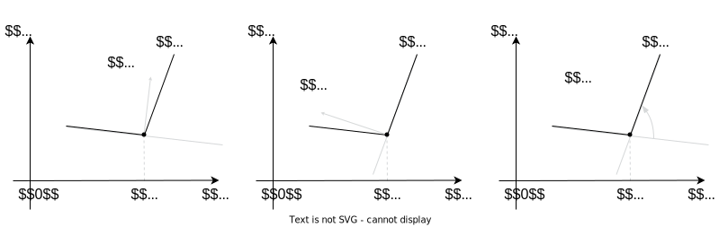

# Subgradient and subdifferential

## Definition

An important property of a continuous convex function $f(x)$ is that at
any chosen point $x_0$ for all $x \in \text{dom } f$ the inequality
holds:

$$
f(x) \geq f(x_0) + \langle g, x - x_0 \rangle
$$

for some vector $g$, i.e., the tangent to the graph of the function is
the *global* estimate from below for the function.

Figure 1: Taylor linear approximation serves as a global lower bound for
a convex function

- If $f(x)$ is differentiable, then $g = \nabla f(x_0)$
- Not all continuous convex functions are differentiable 🐱

We wouldn’t want to lose such a nice property.

### Subgradient

A vector $g$ is called the **subgradient** of a function
$f(x): S \to \mathbb{R}$ at a point $x_0$ if $\forall x \in S$:

$$
f(x) \geq f(x_0) + \langle g, x - x_0 \rangle
$$

> [!EXAMPLE]
>
> ### Example
>
> 

>
> 

>
> Find $\partial f(x)$, if $f(x) = |x|$
>
> > [!SOLUTION]
> >
> > ### Solution
> >
> > 

> >
> > 

> >
> > The problem can be solved either geometrically (at each point of the
> > numerical line indicate the angular coefficients of the lines
> > globally supporting the function from the bottom), or by the
> > Moreau-Rockafellar theorem, considering $f(x)$ as a point-wise
> > maximum of convex functions:
> >
> > $$
> > f(x) = \max\{-x, x\}
> > $$
> >
> > 

> >
> > 
> >
> > Figure 2: Subgradient of $\vert x \vert$
> >
> > 

> >
> > 

> >
> > 

>
> 

>
> 

### Subdifferential

The set of all subgradients of a function $f(x)$ at a point $x_0$ is
called the **subdifferential** of $f$ at $x_0$ and is denoted by
$\partial f(x_0)$.

Figure 3: Subgradient calculus

- If $x_0 \in \mathbf{ri } S$, then $\partial f(x_0)$ is a convex
  compact set.
- The convex function $f(x)$ is differentiable at the point
  $x_0\Rightarrow \partial f(x_0) = \{\nabla f(x_0)\}$.
- If $\partial f(x_0) \neq \emptyset \quad \forall x_0 \in S$, then
  $f(x)$ is convex on $S$.

## Subdifferentiability and convexity

> [!QUESTION]
>
> ### Question
>
> 

>
> 

>
> Is it correct, that if the function has a subdifferential at some
> point, the function is convex?
>
> 

>
> 

> [!EXAMPLE]
>
> ### Example
>
> 

>
> 

>
> Find $\partial f(x)$, if $f(x) = \sin x, x \in [\pi/2; 2\pi]$
> 
>
> > [!SOLUTION]
> >
> > ### Solution
> >
> > 

> >
> > 

> >
> > $$
> > \partial_S f(x) = 
> > \begin{cases} 
> > (-\infty ; \cos x_0], &x = \frac\pi2 \\ 
> > \emptyset, &x \in \left(\frac\pi2; x_0\right) \\
> > \cos x, &x \in [x_0; 2\pi) \\
> > [1; \infty), &x = 2\pi
> > \end{cases}
> > $$
> >
> > 

> >
> > 

>
> 

>
> 

> [!THEOREM]
>
> ### Theorem
>
> 

>
> 

>
> **Subdifferential of a differentiable function** Let
> $f : S \to \mathbb{R}$ be a function defined on the set $S$ in a
> Euclidean space $\mathbb{R}^n$. If $x_0 \in \mathbf{ri }(S)$ and $f$
> is differentiable at $x_0$, then either $\partial f(x_0) = \emptyset$
> or $\partial f(x_0) = \{\nabla f(x_0)\}$. Moreover, if the function
> $f$ is convex, the first scenario is impossible.
>
> > [!PROOF]
> >
> > ### Proof
> >
> > 

> >
> > 

> >
> > 1.  Assume, that $s \in \partial f(x_0)$ for some
> >     $s \in \mathbb{R}^n$ distinct from $\nabla f(x_0)$. Let
> >     $v \in  \mathbb{R}^n$ be a unit vector. Because $x_0$ is an
> >     interior point of $S$, there exists $\delta > 0$ such that
> >     $x_0 + tv \in S$ for all $0 < t < \delta$. By the definition of
> >     the subgradient, we have $$
> >      f(x_0 + tv) \geq f(x_0) + t \langle s, v \rangle
> >      $$ which implies: $$
> >      \frac{f(x_0 + tv) - f(x_0)}{t} \geq \langle s, v \rangle
> >      $$ for all $0 < t < \delta$. Taking the limit as $t$ approaches
> >     0 and using the definition of the gradient, we get: $$
> >      \langle \nabla f(x_0), v \rangle = \lim_{{t \to 0; 0 < t < \delta}} \frac{f(x_0 + tv) - f(x_0)}{t} \geq \langle s, v \rangle
> >      $$
> > 2.  From this, $\langle s - \nabla f(x_0), v \rangle \geq 0$. Due to
> >     the arbitrariness of $v$, one can set $$
> >      v = -\frac{s - \nabla f(x_0)}{\| s - \nabla f(x_0) \|},
> >      $$ leading to $s = \nabla f(x_0)$.
> > 3.  Furthermore, if the function $f$ is convex, then according to
> >     the differential condition of convexity
> >     $f(x) \geq f(x_0) + \langle \nabla f(x_0), x - x_0 \rangle$ for
> >     all $x \in S$. But by definition, this means
> >     $\nabla f(x_0) \in \partial f(x_0)$.
> >
> > 

> >
> > 

>
> 

>
> 

It is interesting to mention, that the statement for the convex function
could be strengthened. Let $f : S \to \mathbb{R}$ be a convex function
defined on the set $S$ in a finite-dimensional Euclidean space
$\mathbb{R}^n$, and let $x_0 \in \mathbf{ri }(S)$. Then, $f$ is
differentiable at $x_0$ if and only if the subdifferential
$\partial f(x_0)$ contains exactly one element. In this case,
$\partial f(x_0) = \{\nabla f(x_0)\}$.

> [!QUESTION]
>
> ### Question
>
> 

>
> 

>
> Let $f : S \to \mathbb{R}$ be a function defined on the set $S$ in a
> Euclidean space, and let $x_0 \in S$. Show that the point $x_0$ is a
> minimum of the function $f$ if and only if $0 \in \partial f(x_0)$.
>
> 

>
> 

> [!QUESTION]
>
> ### Question
>
> 

>
> 

>
> Is it correct, that if the function is convex, it has a subgradient at
> any point?
>
> 

>
> 

Convexity follows from subdifferentiability at any point. A natural
question to ask is whether the converse is true: is every convex
function subdifferentiable? It turns out that, generally speaking, the
answer to this question is negative.

> [!EXAMPLE]
>
> ### Example
>
> 

>
> 

>
> Let $f : [0,\infty) \to \mathbb{R}$ be the function defined by
> $f(x) := -\sqrt{x}$. Then, $\partial f(0) = \emptyset$.
>
> > [!SOLUTION]
> >
> > ### Solution
> >
> > 

> >
> > 

> >
> > Assume, that $s \in \partial f(0)$ for some $s \in \mathbb{R}$.
> > Then, by definition, we must have $sx \leq -\sqrt{x}$ for all
> > $x \geq 0$. From this, we can deduce $s \leq -\sqrt{1}$ for all
> > $x > 0$. Taking the limit as $x$ approaches $0$ from the right, we
> > get $s \leq -\infty$, which is impossible.
> >
> > 

> >
> > 

>
> 

>
> 

## Subdifferential calculus

> [!THEOREM]
>
> ### Theorem
>
> 

>
> 

>
> **Moreau - Rockafellar theorem** (subdifferential of a linear
> combination). Пусть $f_i(x)$ - выпуклые функции на выпуклых множествах
> $S_i, \; i = \overline{1,n}$.  
> Тогда, если $\bigcap\limits_{i=1}^n \mathbf{ri } S_i \neq \emptyset$
> то функция $f(x) = \sum\limits_{i=1}^n a_i f_i(x), \; a_i > 0$ имеет
> субдифференциал $\partial_S f(x)$ на множестве
> $S = \bigcap\limits_{i=1}^n S_i$ и
>
> $$
> \partial_S f(x) = \sum\limits_{i=1}^n a_i \partial_{S_i} f_i(x)
> $$
>
> 

>
> 

> [!THEOREM]
>
> ### Theorem
>
> 

>
> 

>
> **Dubovitsky - Milutin theorem** (subdifferential of a point-wise
> maximum). Пусть $f_i(x)$ - выпуклые функции на открытом выпуклом
> множестве $S  \subseteq \mathbb{R}^n, \; x_0 \in S$, а поточечный
> максимум определяется как
> $f(x)  = \underset{i}{\operatorname{max}} f_i(x)$. Тогда:
>
> $$
> \partial_S f(x_0) = \mathbf{conv}\left\{  \bigcup\limits_{i \in I(x_0)} \partial_S f_i(x_0) \right\},
> $$
>
> где $I(x) = \{ i \in [1:m]: f_i(x) = f(x)\}$
>
> 

>
> 

**Chain rule for subdifferentials** Пусть $g_1, \ldots, g_m$ - выпуклые
функции на открытом выпуклом множестве $S \subseteq \mathbb{R}^n$,
$g = (g_1, \ldots, g_m)$ - образованная из них вектор - функция,
$\varphi$ - монотонно неубывающая выпуклая функция на открытом выпуклом
множестве $U \subseteq \mathbb{R}^m$, причем $g(S) \subseteq U$. Тогда
субдифференциал функции $f(x) = \varphi \left( g(x)\right)$ имеет вид:

$$
\partial f(x) = \bigcup\limits_{p \in \partial \varphi(u)} \left( \sum\limits_{i=1}^{m}p_i \partial g_i(x) \right),
$$

где $u = g(x)$

В частности, если функция $\varphi$ дифференцируема в точке $u = g(x)$,
то формула запишется так:

$$
\partial f(x) = \sum\limits_{i=1}^{m}\dfrac{\partial \varphi}{\partial u_i}(u) \partial g_i(x)
$$

- $\partial (\alpha f)(x) = \alpha \partial f(x)$, for $\alpha \geq 0$
- $\partial (\sum f_i)(x) = \sum \partial f_i (x)$, $f_i$ - выпуклые
  функции
- $\partial (f(Ax + b))(x) = A^T\partial f(Ax + b)$, $f$ - выпуклая
  функция
- $z \in \partial f(x)$ if and only if $x \in \partial f^*(z)$.

## Examples

Концептуально, различают три способа решения задач на поиск
субградиента:

- Теоремы Моро - Рокафеллара, композиции, максимума
- Геометрически
- По определению

> [!EXAMPLE]
>
> ### Example
>
> 

>
> 

>
> Найти $\partial f(x)$, если $f(x) = |x - 1| + |x + 1|$
>
> > [!SOLUTION]
> >
> > ### Solution
> >
> > 

> >
> > 

> >
> > Совершенно аналогично применяем теорему Моро - Рокафеллара, учитывая
> > следующее:
> >
> > $$
> > \partial f_1(x) = \begin{cases} -1,  &x < 1\\ [-1;1], \quad &x = 1 \\ 1,  &x > 1 \end{cases} \qquad \partial f_2(x) = \begin{cases} -1,  &x < -1\\ [-1;1], &x = -1 \\ 1,  &x > -1  \end{cases}
> > $$
> >
> > Таким образом:
> >
> > $$
> > \partial f(x) = \begin{cases} -2, &x < -1\\ [-2;0], &x = -1 \\ 0,  &-1 < x < 1 \\ [0;2], &x = 1 \\ 2, &x > 1 \\ \end{cases}
> > $$
> >
> > 

> >
> > 

>
> 

>
> 

> [!EXAMPLE]
>
> ### Example
>
> 

>
> 

>
> Найти $\partial f(x)$, если $f(x) = |c_1^\top x| + |c_2^\top x|$
>
> > [!SOLUTION]
> >
> > ### Solution
> >
> > 

> >
> > 

> >
> > Пусть $f_1(x) = |c_1^\top x|$, а $f_2(x) = |c_2^\top x|$. Так как
> > эти функции выпуклы, субдифференциал их суммы равен сумме
> > субдифференциалов. Найдем каждый из них:
> >
> > $\partial f_1(x) = \partial \left( \max \{c_1^\top x, -c_1^\top x\} \right) = \begin{cases} -c_1,  &c_1^\top x < 0\\ \mathbf{conv}(-c_1;c_1), &c_1^\top x = 0 \\ c_1,  &c_1^\top x > 0 \end{cases}$
> > $\partial f_2(x) = \partial \left( \max \{c_2^\top x, -c_2^\top x\} \right) = \begin{cases} -c_2,  &c_2^\top x < 0\\ \mathbf{conv}(-c_2;c_2), &c_2^\top x = 0 \\ c_2,  &c_2^\top x > 0 \end{cases}$
> >
> > Далее интересными представляются лишь различные взаимные
> > расположения векторов $c_1$ и $c_2$, рассмотрение которых
> > предлагается читателю.
> >
> > 

> >
> > 

>
> 

>
> 

> [!EXAMPLE]
>
> ### Example
>
> 

>
> 

>
> Найти $\partial f(x)$, если $f(x) = \left[ \max(0, f_0(x))\right]^q$.
> Здесь $f_0(x)$ - выпуклая функция на открытом выпуклом множестве $S$,
> $q \geq 1$.
>
> > [!SOLUTION]
> >
> > ### Solution
> >
> > 

> >
> > 

> >
> > Согласно теореме о композиции (функция $\varphi (x) = x^q$ -
> > дифференцируема), а $g(x) = \max(0, f_0(x))$ имеем:
> > $\partial f(x) = q(g(x))^{q-1} \partial g(x)$
> >
> > По теореме о поточечном максимуме:
> >
> > $$
> > \partial g(x) = \begin{cases} \partial f_0(x), \quad f_0(x) > 0,\\ \{0\}, \quad f_0(x) < 0 \\ \{a \mid a = \lambda a', \; 0 \le \lambda \le 1, \; a' \in \partial f_0(x)\}, \;\; f_0(x) = 0 \end{cases}
> > $$
> >
> > 

> >
> > 

>
> 

>
> 

> [!EXAMPLE]
>
> ### Example
>
> 

>
> 

>
> Найти $\partial f(x)$, если $f(x) = \| x\|_1$
>
> > [!SOLUTION]
> >
> > ### Solution
> >
> > 

> >
> > 

> >
> > По определению
> >
> > $$
> > \|x\|_1 = |x_1| + |x_2| + \ldots + |x_n| = s_1 x_1 + s_2 x_2 + \ldots + s_n x_n
> > $$
> >
> > Рассмотрим эту сумму как поточечный максимум линейных функций по
> > $x$: $g(x) = s^\top x$, где $s_i = \{ -1, 1\}$. Каждая такая функция
> > однозначно определяется набором коэффициентов $\{s_i\}_{i=1}^n$.
> >
> > Тогда по теореме Дубовицкого - Милютина, в каждой точке
> > $\partial f = \mathbf{conv}\left(\bigcup\limits_{i \in I(x)} \partial g_i(x)\right)$
> >
> > Заметим, что
> > $\partial g(x) = \partial \left( \max \{s^\top x, -s^\top x\} \right) = \begin{cases} -s,  &s^\top x < 0\\ \mathbf{conv}(-s;s), &s^\top x = 0 \\ s,  &s^\top x > 0 \end{cases}$.
> >
> > Причем, правило выбора “активной” функции поточечного максимума в
> > каждой точке следующее: \* Если j-ая координата точки отрицательна,
> > $s_i^j = -1$ \* Если j-ая координата точки положительна, $s_i^j = 1$
> > \* Если j-ая координата точки равна нулю, то подходят оба варианта
> > коэффициентов и соответствующих им функций, а значит, необходимо
> > включать субградиенты этих функций в объединение в теореме
> > Дубовицкого - Милютина.
> >
> > В итоге получаем ответ:
> >
> > $$
> > \partial f(x) = \left\{ g \; : \; \|g\|_\infty \leq 1, \quad g^\top x = \|x\|_1 \right\}
> > $$
> >
> > 

> >
> > 

>
> 

>
> 

> [!EXAMPLE]
>
> ### Example
>
> 

>
> 

>
> **Subdifferential of the Norm.** Let $V$ be a finite-dimensional
> Euclidean space, and $x_0 \in V$. Let $\lVert \cdot \rVert$ be an
> arbitrary norm in $V$ (not necessarily induced by the scalar product),
> and let $\lVert \cdot \rVert_*$ be the corresponding conjugate norm.
> Then,
>
> $$
> \partial \lVert \cdot \rVert (x_0) = 
> \begin{cases}
> B_{\lVert \cdot \rVert_*}(0, 1), & \text{if } x_0 = 0, \\
> \{s \in V : \lVert s \rVert_* \leq 1; \langle s, x_0 \rangle = \lVert x_0 \rVert \} = \{s \in V : \lVert s \rVert_* = 1; \langle s, x_0 \rangle = \lVert x_0 \rVert \}, & \text{otherwise.}
> \end{cases}
> $$
>
> Where $B_{\lVert \cdot \rVert_*}(0,1)$ is the closed unit ball
> centered at zero with respect to the conjugate norm. In other words, a
> vector $s \in V$ with $\lVert s \rVert_* = 1$ is a subgradient of the
> norm $\lVert \cdot \rVert$ at point $x_0 \neq 0$ if and only if the
> Hölder’s inequality $\langle s, x_0 \rangle \leq \lVert x_0 \rVert$
> becomes an equality.
>
> > [!PROOF]
> >
> > ### Proof
> >
> > 

> >
> > 

> >
> > Let $s \in V$. By definition,
> > $s \in \partial \lVert \cdot \rVert (x_0)$ if and only if
> >
> > $$
> > \langle s, x \rangle - \lVert x \rVert \leq \langle s, x_0 \rangle - \lVert x_0 \rVert, \text{ for all } x \in V,
> > $$
> >
> > or equivalently,
> >
> > $$
> > \sup_{x \in V} \{\langle s, x \rangle - \lVert x \rVert\} \leq \langle s, x_0 \rangle - \lVert x_0 \rVert.
> > $$
> >
> > By the definition of the supremum, the latter is equivalent to
> >
> > $$
> > \sup_{x \in V} \{\langle s, x \rangle - \lVert x \rVert\} = \langle s, x_0 \rangle - \lVert x_0 \rVert.
> > $$
> >
> > It is important to note that the expression on the left side is the
> > supremum from the definition of the Fenchel conjugate function for
> > the norm, which is known to be
> >
> > $$
> > \sup_{x \in V} \{\langle s, x \rangle - \lVert x \rVert\} = 
> > \begin{cases}
> > 0, & \text{if } \lVert s \rVert_* \leq 1, \\
> > +\infty, & \text{otherwise.}
> > \end{cases}
> > $$
> >
> > Thus, equation is equivalent to $\lVert s \rVert_* \leq 1$ and
> > $\langle s, x_0 \rangle = \lVert x_0 \rVert$.
> >
> > Consequently, it remains to note that for $x_0 \neq 0$, the
> > inequality $\lVert s \rVert_* \leq 1$ must become an equality since,
> > when $\lVert s \rVert_* < 1$, Hölder’s inequality implies
> > $\langle s, x_0 \rangle \leq \lVert s \rVert_* \lVert x_0 \rVert < \lVert x_0 \rVert$.
> >
> > 

> >
> > 

>
> 

>
> 

The conjugate norm in Example above does not appear by chance. It turns
out that, in a completely similar manner for an arbitrary function $f$
(not just for the norm), its subdifferential can be described in terms
of the dual object — the Fenchel conjugate function.

> [!EXAMPLE]
>
> ### Example
>
> 

>
> 

>
> **Characterization of the subdifferential through the conjugate
> function.** Let $f: E \to \mathbb{R}$ be a function defined on the set
> $E$ in a Euclidean space. Let $x_0 \in E$ and let
> $f^*: E^* \to \mathbb{R}$ be the conjugate function. Show that
>
> $$
> \partial f(x_0) = \{s \in E^* : \langle s, x_0 \rangle = f^*(s) + f(x_0)\},
> $$
>
> 

>
> 

In other words, a vector $s \in E^*$ is a subgradient of the function
$f$ at point $x_0$ if and only if the Fenchel-Young inequality
$\langle s, x_0 \rangle \leq f^*(s) + f(x_0)$ becomes an equality.

In the case $f = \lVert \cdot \rVert$, we have
$f^* = \delta_{B_{\lVert \cdot \rVert_*}(0,1)}$, i.e., the conjugate
function is equal to the indicator function of the ball
$B_{\lVert \cdot \rVert_*}(0,1)$, and equation becomes.

> [!THEOREM]
>
> ### Theorem
>
> 

>
> 

>
> **Criteria for equality in the Fenchel-Young inequality.** Let
> $f: E \to \mathbb{R}$ be a convex closed function,
> $f^*: E^* \to \mathbb{R}$ the conjugate function, and let
> $x \in E, s \in E^*$. The following statements are equivalent:
>
> 1)  $\langle s, x \rangle = f^*(s) + f(x)$.
>
> 2)  $s \in \partial f(x)$.
>
> 3)  $x \in \partial f^*(s)$.
>
> > [!PROOF]
> >
> > ### Proof
> >
> > 

> >
> > 

> >
> > According to Exercise above, the condition
> > $\langle s, x \rangle = f^*(s) + f(x)$ is equivalent to
> > $s \in \partial f(x)$. On the other hand, since $f$ is convex and
> > closed, by the Fenchel-Moreau theorem, we have $f^{**} = f$.
> > Applying previous results to the function $f^*$, it follows that the
> > equality $\langle s, x \rangle = f^*(s) + f(x)$ is equivalent to
> > $x \in \partial f^*(s)$.
> >
> > 

> >
> > 

>
> 

>
> 

## References

- [Lecture Notes for ORIE 6300: Mathematical Programming I by Damek
  Davis](https://people.orie.cornell.edu/dsd95/teaching/orie6300/ORIE6300Fall2019notes.pdf)
