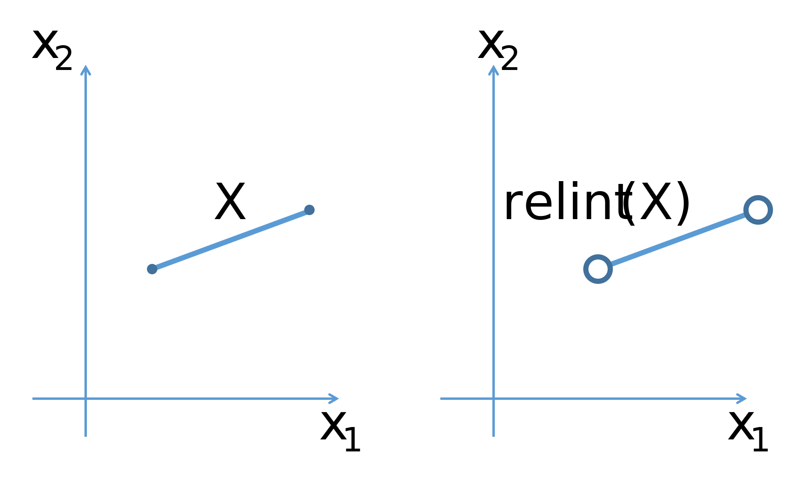

# Line
Suppose $x_1, x_2$ are two points in $\mathbb{R^n}$. Then the line passing through them is defined as follows:

$$
x = \theta x_1 + (1 - \theta)x_2, \theta \in \mathbb{R}
$$

{#fig-line}

# Affine set
The set $A$ is called **affine** if for any $x_1, x_2$ from $A$ the line passing through them also lies in $A$, i.e. 

$$
\forall \theta \in \mathbb{R}, \forall x_1, x_2 \in A: \theta x_1 + (1- \theta) x_2 \in A
$$

::: {.callout-example}
* $\mathbb{R}^n$ is an affine set.
* The set of solutions $\left\{x \mid \mathbf{A}x =  \mathbf{b} \right\}$ is also an affine set.
:::

# Related definitions
## Affine combination
Let we have $x_1, x_2, \ldots, x_k \in S$, then the point $\theta_1 x_1 + \theta_2 x_2 + \ldots + \theta_k x_k$ is called affine combination of $x_1, x_2, \ldots, x_k$ if $\sum\limits_{i=1}^k\theta_i = 1$.

## Affine hull
The set of all affine combinations of points in set $S$ is called the affine hull of $S$:

$$
\mathbf{aff}(S) = \left\{ \sum\limits_{i=1}^k\theta_i x_i \mid x_i \in S, \sum\limits_{i=1}^k\theta_i = 1\right\}
$$

::: {.callout-example}
The set $\mathbf{aff}(S)$ is the smallest affine set containing $S$.
:::

## Interior
The interior of the set $S$ is defined as the following set:

$$
\mathbf{int} (S) = \{\mathbf{x} \in S \mid \exists \varepsilon > 0, \; B(\mathbf{x}, \varepsilon) \subset S\}
$$

where $B(\mathbf{x}, \varepsilon) = \mathbf{x} + \varepsilon B$ is the ball centered at point $\mathbf{x}$ with radius $\varepsilon$.

## Relative Interior
The relative interior of the set $S$ is defined as the following set:

$$
\mathbf{relint} (S) = \{\mathbf{x} \in S \mid \exists \varepsilon > 0, \; B(\mathbf{x}, \varepsilon) \cap \mathbf{aff} (S) \subseteq S\}
$$

{#fig-rel_int}

::: {.callout-example}
Any non-empty convex set $S \subseteq \mathbb{R}^n$ has a non-empty relative interior $\mathbf{relint}(S)$.
:::

::: {.callout-question}
Give an example of a set $S \subseteq \mathbb{R}^n$, which has an empty interior, but at the same time has a non-empty relative interior $\mathbf{relint}(S)$.
:::