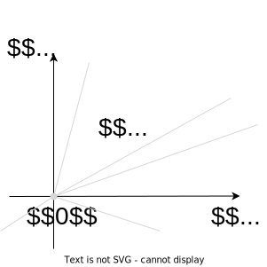
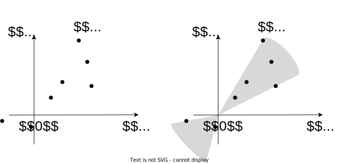

# Conic set

## Cone

A non-empty set $S$ is called a cone, if:

$$
\forall x \in S, \; \theta \ge 0 \;\; \rightarrow \;\; \theta x \in S
$$

Figure 1: Illustration of a cone

## Convex cone

The set $S$ is called a convex cone, if:

$$
\forall x_1, x_2 \in S, \; \theta_1, \theta_2 \ge 0 \;\; \rightarrow \;\; \theta_1 x_1 + \theta_2 x_2 \in S
$$

Figure 2: Illustration of a convex cone

> [!EXAMPLE]
>
> ### Example
>
> 

>
> 

>
> - $\mathbb{R}^n$
> - Affine sets, containing $0$
> - Ray
> - $\mathbf{S}^n_+$ - the set of symmetric positive semi-definite
>   matrices
>
> 

>
> 

## Related definitions

### Conic combination

Let we have $x_1, x_2, \ldots, x_k \in S$, then the point
$\theta_1 x_1 + \theta_2 x_2 + \ldots + \theta_k x_k$ is called conic
combination of $x_1, x_2, \ldots, x_k$ if $\theta_i \ge 0$.

### Conic hull

The set of all conic combinations of points in set $S$ is called the
conic hull of $S$:

$$
\mathbf{cone}(S) = \left\{ \sum\limits_{i=1}^k\theta_i x_i \mid x_i \in S, \; \theta_i \ge 0\right\}
$$

Figure 3: Illustration of a convex hull

