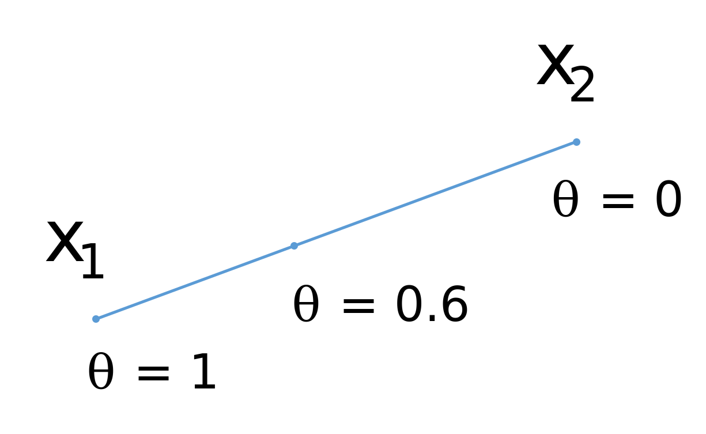
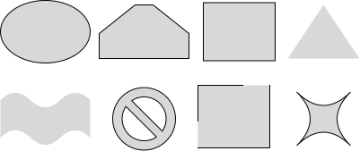
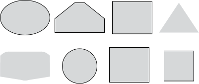

# Definitions
## Line segment
Suppose $x_1, x_2$ are two points in $\mathbb{R^n}$. Then the line segment between them is defined as follows:

$$
x = \theta x_1 + (1 - \theta)x_2, \; \theta \in [0,1]
$$

{#fig-line_segment}

## Convex set
The set $S$ is called **convex** if for any $x_1, x_2$ from $S$ the line segment between them also lies in $S$, i.e. 

$$
\forall \theta \in [0,1], \; \forall x_1, x_2 \in S: \\ \theta x_1 + (1- \theta) x_2 \in S
$$

::: {.callout-example}
An empty set and a set from a single vector are convex by definition.
:::

::: {.callout-example}
Any affine set, a ray, a line segment - they all are convex sets.
:::

{#fig-convex_sets}

## Convex combination
Let $x_1, x_2, \ldots, x_k \in S$, then the point $\theta_1 x_1 + \theta_2 x_2 + \ldots + \theta_k x_k$ is called the convex combination of points $x_1, x_2, \ldots, x_k$ if $\sum\limits_{i=1}^k\theta_i = 1, \; \theta_i \ge 0$.

## Convex hull
The set of all convex combinations of points from $S$ is called the convex hull of the set $S$.

$$
\mathbf{conv}(S) = \left\{ \sum\limits_{i=1}^k\theta_i x_i \mid x_i \in S, \sum\limits_{i=1}^k\theta_i = 1, \; \theta_i \ge 0\right\}
$$

* The set $\mathbf{conv}(S)$ is the smallest convex set containing $S$.
* The set $S$ is convex if and only if $S = \mathbf{conv}(S)$.

Examples:

{#fig-convex_hull}

## Minkowski addition
The Minkowski sum of two sets of vectors $S_1$ and $S_2$ in Euclidean space is formed by adding each vector in $S_1$ to each vector in $S_2$:

$$
S_1+S_2=\{\mathbf {s_1} +\mathbf {s_2} \,|\,\mathbf {s_1} \in S_1,\ \mathbf {s_2} \in S_2\}
$$

Similarly, one can define a linear combination of the sets.

::: {.callout-example}
We will work in the $\mathbb{R}^2$ space. Let's define:

$$
S_1 := \{x \in \mathbb{R}^2 : x_1^2 + x_2^2 \leq 1\}
$$

This is a unit circle centered at the origin. And:

$$
S_2 := \{x \in \mathbb{R}^2 : -1 \leq x_1 \leq 2, -3 \leq x_2 \leq 4\}
$$

This represents a rectangle. The sum of the sets $S_1$ and $S_2$ will form an enlarged rectangle $S_2$ with rounded corners. The resulting set will be convex.
:::

# Finding convexity

In practice, it is very important to understand whether a specific set is convex or not. Two approaches are used for this depending on the context.

* By definition.
* Show that $S$ is derived from simple convex sets using operations that preserve convexity.

## By definition

$$
x_1, x_2 \in S, \; 0 \le \theta \le 1 \;\; \rightarrow \;\; \theta x_1 + (1-\theta)x_2 \in S
$$

::: {.callout-example}
Prove, that ball in $\mathbb{R}^n$ (i.e. the following set $\{ \mathbf{x} \mid \Vert \mathbf{x} - \mathbf{x}_c \Vert \leq r \}$) - is convex.

::: {.callout-solution}
  
  
  
  
:::
:::

::: {.callout-question}
Which of the sets are convex:

* Stripe, $\{x \in \mathbb{R}^n \mid \alpha \leq a^\top x \leq \beta \}$
* Rectangle, $\{x \in \mathbb{R}^n \mid \alpha_i \leq x_i \leq \beta_i, i = \overline{1,n} \}$
* Kleen, $\{x \in \mathbb{R}^n \mid a_1^\top x \leq b_1, a_2^\top x \leq b_2 \}$
* A set of points closer to a given point than a given set that does not contain a point, $\{x \in \mathbb{R}^n \mid \Vert x - x_0\Vert _2 \leq \Vert x-y\Vert _2, \forall y \in S \subseteq \mathbb{R}^n \}$
* A set of points, which are closer to one set than another, $\{x \in \mathbb{R}^n \mid \mathbf{dist}(x,S) \leq \mathbf{dist}(x,T) , S,T \subseteq \mathbb{R}^n \}$
* A set of points, $\{x \in \mathbb{R}^{n} \mid x + X \subseteq S\}$, where $S \subseteq \mathbb{R}^{n}$ is convex and $X \subseteq \mathbb{R}^{n}$ is arbitrary.
* A set of points whose distance to a given point does not exceed a certain part of the distance to another given point is $\{x \in \mathbb{R}^n \mid \Vert x - a\Vert _2 \leq \theta\Vert x - b\Vert _2, a,b \in \mathbb{R}^n, 0 \leq 1 \}$
:::

## Preserving convexity

### The linear combination of convex sets is convex

Let there be 2 convex sets $S_x, S_y$, let the set 

$$
S = \left\{s \mid s = c_1 x + c_2 y, \; x \in S_x, \; y \in S_y, \; c_1, c_2 \in \mathbb{R}\right\}
$$

Take two points from $S$: $s_1 = c_1 x_1 + c_2 y_1, s_2 = c_1 x_2 + c_2 y_2$ and prove that the segment between them 
$\theta  s_1 + (1 - \theta)s_2, \theta \in [0,1]$ also belongs to $S$

$$
\theta s_1 + (1 - \theta)s_2
$$

$$
\theta (c_1 x_1 + c_2 y_1) + (1 - \theta)(c_1 x_2 + c_2 y_2)
$$

$$
c_1 (\theta x_1 + (1 - \theta)x_2) + c_2 (\theta y_1 + (1 - \theta)y_2)
$$

$$
c_1 x + c_2 y \in S
$$

### The intersection of any (!) number of convex sets is convex

If the desired intersection is empty or contains one point, the property is proved by definition. Otherwise, take 2 points and a segment between them. These points must lie in all intersecting sets, and since they are all convex, the segment between them lies in all sets and, therefore, in their intersection.

### The image of the convex set under affine mapping is convex

$$
S \subseteq \mathbb{R}^n \text{ convex}\;\; \rightarrow \;\; f(S) = \left\{ f(x) \mid x \in S \right\} \text{ convex} \;\;\;\; \left(f(x) = \mathbf{A}x + \mathbf{b}\right)
$$

Examples of affine functions: extension, projection, transposition, set of solutions of linear matrix inequality $\left\{ x \mid x_1 A_1 + \ldots + x_m A_m \preceq B\right\}$. Here $A_i, B \in \mathbf{S}^p$ are symmetric matrices $p \times p$. 

Note also that the prototype of the convex set under affine mapping is also convex.

$$
S \subseteq \mathbb{R}^m \text{ convex}\; \rightarrow \; f^{-1}(S) = \left\{ x \in \mathbb{R}^n \mid f(x) \in S \right\} \text{ convex} \;\; \left(f(x) = \mathbf{A}x + \mathbf{b}\right)
$$

::: {.callout-example}
Let $x \in \mathbb{R}$ is a random variable with a given probability distribution of $\mathbb{P}(x = a_i) = p_i$, where $i = 1, \ldots, n$, and $a_1 < \ldots < a_n$. It is said that the probability vector of outcomes of $p \in \mathbb{R}^n$ belongs to the probabilistic simplex, i.e. 

$$
P = \{ p \mid \mathbf{1}^Tp = 1, p \succeq 0 \} = \{ p \mid p_1 + \ldots + p_n = 1, p_i \ge 0 \}.
$$

Determine if the following sets of $p$ are convex:

* $\mathbb{P}(x > \alpha) \le \beta$
* $\mathbb{E} \vert x^{201}\vert \le \alpha \mathbb{E}\vert x \vert$
* $\mathbb{E} \vert x^{2}\vert \ge \alpha$$\mathbb{V} x \ge \alpha$

::: {.callout-solution}
  
  
  
  
:::
:::