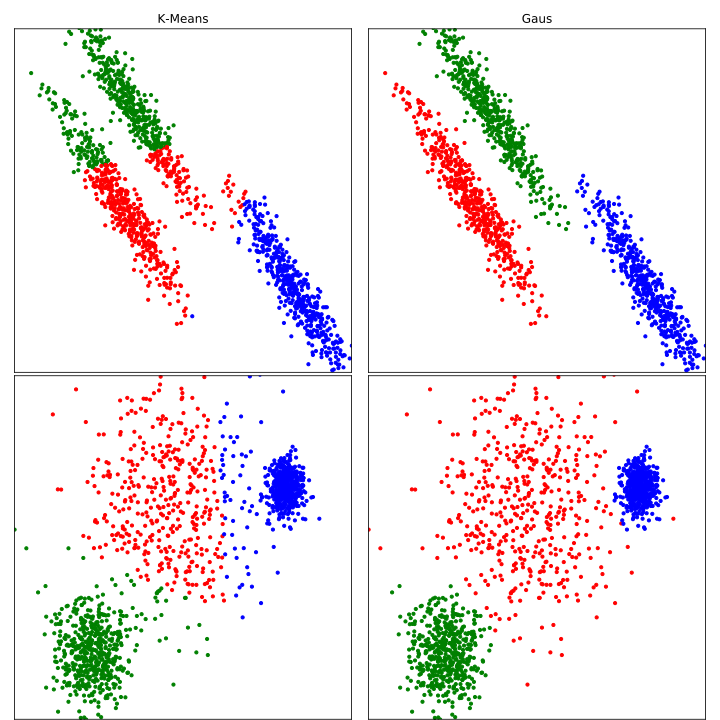
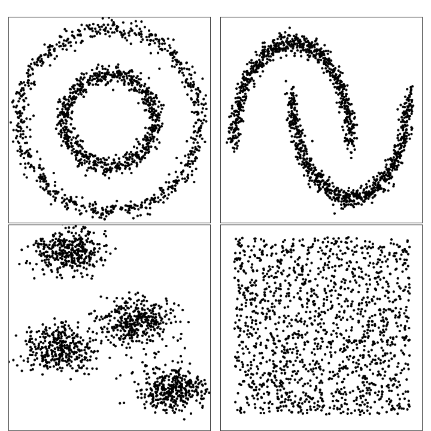
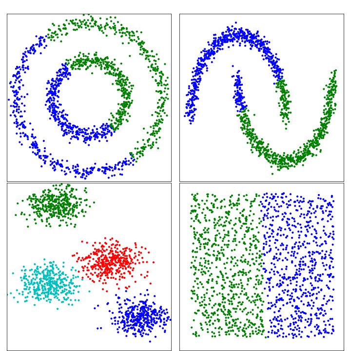
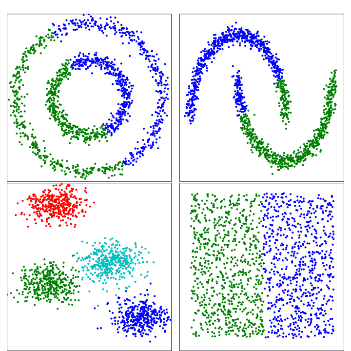
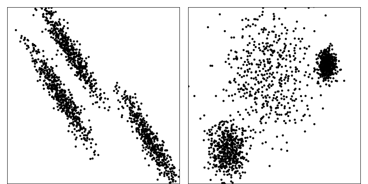

# EM Algorithm 
## Introduction
In statistics, an **expectation–maximisation** (**EM**) **algorithm** is an iterative method to find maximum likelihood or maximum a posteriori (MAP) estimates of parameters in statistical models, where the model depends on unobserved latent variables. 
At a high level, the expectation maximisation algorithm can be described as follows:
1.  Start with random Gaussian parameters (θ)
2.  Repeat the following until we converge:

a)  **Expectation Step**: Compute $p(z_{i} = k | x_{i}, θ)$. In other words, does sample  _i_  look like it came from cluster k?

b)  **Maximisation Step**: Update the Gaussian parameters (θ)  to fit points assigned to them.

 

## Problem formulation

Let the distribution density on the set $X$ have the form of a _mixture_ of $k$ distributions
$p(x) = \sum_{j=1}^k w_jp_j(x),\quad \sum_{i=1}^k w_j = 1,\quad w_j\geq 0,$
where $p_j(x)$ --- likelihood function of the $j^{th}$ _mixture_'s component, $w_j$ --- it's a priori probability.

Let the likelihood functions belong to the parametric distribution family $\varphi (x; \theta)$ and differ only in the values of the parameter $p_j (x) = \varphi (x; \theta_j)$.

The problem is to separate the _mixture_ into different distribution and get their parameters: having a sample of $X^m$ random and independent observations from the _mixture_ $p(x)$, knowing the number $k$ and the $\varphi$ function, estimate the parameter vector $\Theta = (w_1, ..., w_k, \theta_1 , ..., \theta_k)$.

## Algorithm

Artificially introduced an auxiliary vector of hidden variables $G$, having next 2 property:
1.  Having $\Theta$ we can find $G$;
2.  Having values of the hidden variables, it's easier to find maximum likelihood.

Algorithm is built interactively based on 2 steps: **Expectation** and **Maximisation**

### Expectation Step

On this step we calculate value of _expected_ vector $G$ using current approximate vector $\Theta$.

Let $p(x,\theta_j)$ denote the probability density that the object $x$ is obtained from the $j^{th}$ component of the _mixture_. By conditional probability we have: 
$$p(x,\theta_j) = p(x)P(\theta_j |x) = w_jp_j(x), \text{ introduce } g_{ij} \equiv P(\theta_j |x_i).$$

This is an unknown posterior probability that the training object $x_i$ is obtained from the $j^{th}$ component of the _mixture_. Take these values as hidden variables.
$\sum_{j = 1}^k g_{ij} = 1$, for any $i = 1, \dots, m$, since it makes sense that the object $x_i$ belongs to one of the $k$ components of the _mixture_. From **Bayes formula**
$$g_{ij} = \frac{w_jp_j (x_i)} {\sum_{s = 1}^k w_sp_s(x_i)},  \forall i, j.$$

### Maximisation Step

At the **M-step**, the maximisation problem is solved and the following approximation of the $\Theta$ vector is found from the current values ​​of the vectors $G$ and $\Theta$.
We will maximize the log of complete likelihood:

$$Q (\Theta) = \ln \prod_{i = 1}^mp(x_i) = \sum_{i = 1}^m \ln \sum_{j = 1}^kw_jp_j (x_i) \rightarrow \max_{\Theta}.$$

Solving the Lagrange optimization problem with a restriction on the sum $w_j$, we find:

$$w_j = \frac 1 m \sum_{i = 1}^m g_{ij}, \: j = 1, \dots, k, \\
\theta_j = arg \max_{\theta} \sum_{i = 1}^m g_{ij} \ln \varphi (x_i, \theta), \: j = 1, \dots, k.$$

Thus, the **M-step** reduces to calculating the weights of the $w_j$ components as arithmetic means and estimating the parameters of the $\theta_j$ components by solving $k$ independent optimisation problems. Note that the separation of variables has been made possible thanks to the successful introduction of hidden variables.

In the _maximisation_ step, we want to maximise the _likelihood_ that each sample came from the distribution. Recall, that the _likelihood_ is the height of the curve at a point along the _x-axis_. Therefore, we want to modify the variance and mean of the distribution such that the height of the plot at each data point is maximised.

### Mixture of normal distributions

Further, a _mixture_ of normal distributions will often be encountered, therefore, we write for it the results of the **E-** and **M-step** of the algorithm:
$$\theta = (w_1, ..., w_k; \; \mu_1, ..., \mu_k; \; \sigma_1, ..., \sigma_k) - \text{is the parameter vector,} \\
p_j(x) = N(x; \mu_j, \sigma_j) = \frac1 {\sqrt {2 \pi} \sigma_j} \exp \biggl (- \frac {(x - \mu_j)^2} {2 \sigma_j^2} \biggr) - \text{distribution density.}$$
_E-step_

$$g_{ij} = \frac {w_jN (x_i; \mu_j, \sigma_j)} {\sum_{s = 1}^k w_sN(x_i; \mu_s, \sigma_s)}$$

_M-step_

$$w_j = \frac 1 m \sum_{i = 1}^m g_{ij}, \\
\mu_j = \frac 1 {mw_j} \sum_{i = 1}^m g_{ij} x_i, \\
\sigma_j^2 = \frac 1 {mw_j} \sum_{i = 1}^m g_{ij} (x_i - \mu_j)^2, \; j = 1, \dots, k.$$

## Experiment 

To show this algorithm in action, we'll generate several noisy datasets with different configurations, after that we'll clusterize them.

### Data 

Let's create several synthetic datasets like on pictures:

 1. Circles
 2. Moons
 3. Gausians
 4. No structure

 

### Clusterization

EM algorithm is used as base in f.e. gaussians-mixtures and _k-meams_, therefore we can compare these approaches

#### Gaussians-mixtures

This algorithm tries to clusterize by taking into account that it has a set of Gaussian distributions --- _Gaussian mixture_.

 

#### K-means

_K-means_ tries to find some mass centres by minimising the total quadratic deviation of the points of the clusters from these centres.

 
 
#### K-means _VS_ Gaussians-mixtures
Here let's find some cases where Gaussians-mixtures approach works better then K-means. For this we are going to take next datasets

 

Clusterize it! 
 
  

### Code

### References

 1. [https://ru.wikipedia.org/wiki/EM-алгоритм](https://ru.wikipedia.org/wiki/EM-%D0%B0%D0%BB%D0%B3%D0%BE%D1%80%D0%B8%D1%82%D0%BC)

2.  [http://www.machinelearning.ru/wiki/index.php?title=EM-алгоритм](http://www.machinelearning.ru/wiki/index.php?title=EM-%D0%B0%D0%BB%D0%B3%D0%BE%D1%80%D0%B8%D1%82%D0%BC)

3. https://machinelearningmastery.com/expectation-maximization-em-algorithm/

4. https://medium.com/@jonathan_hui/machine-learning-expectation-maximization-algorithm-em-2e954cb76959

5. https://towardsdatascience.com/inference-using-em-algorithm-d71cccb647bc

6.  **The EM Algorithm and Extensions** 2nd Edition (by [Geoffrey J. McLachlan](https://www.amazon.com/Geoffrey-J-McLachlan/e/B000APTC1S/ref=dp_byline_cont_book_1) (Author), [Thriyambakam Krishnan](https://www.amazon.com/s/ref=dp_byline_sr_book_2?ie=UTF8&field-author=Thriyambakam+Krishnan&text=Thriyambakam+Krishnan&sort=relevancerank&search-alias=books) (Author))

7.  **The EM Algorithm and Related Statistical Models (**Michiko Watanabe, Kazunori Yamaguchi**)**

8. https://www.math.univ-toulouse.fr/~besse/Wikistat/pdf/st-m-datSc4-EMmixt.pdf

9. https://towardsdatascience.com/gaussian-mixture-models-d13a5e915c8e

10. https://link.springer.com/referenceworkentry/10.1007%2F978-0-387-30164-8_289