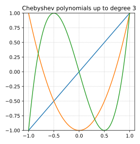
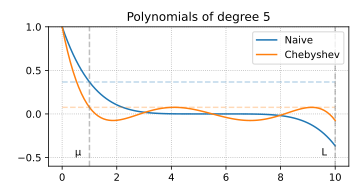

Suppose, we have a strongly convex quadratic function minimization problem solved by the gradient descent method:

$$
f(x) = \frac{1}{2} x^T A x - b^T x \qquad x_{k+1} = x_k - \alpha_k \nabla f(x_k).
$$

Let $x^*$ be the unique solution of the linear system $Ax=b$ and put $e_k = \|x_k-x^*\|$, where $x_{k+1}=x_k - \alpha_k (Ax_k-b)$ is defined recursively starting from some $x_0,$ and $\alpha_k$ is a step size we'll determine shortly.
$$
e_{k+1} = (I-\alpha_k A)e_k.
$$

## Polynomials

The above calculation gives us $e_k = p_k(A)e_0,$

where $p_k$ is the polynomial
$$
p_k(a) = \prod_{i=1}^k (1-\alpha_ka).
$$
We can upper bound the norm of the error term as
$$
\|e_k\|\le \|p_k(A)\|\cdot\|e_0\|\,.
$$

Since $A$ is a symmetric matrix with eigenvalues in $[\mu,L],$:
$$
\|p_k(A)\|\le \max_{\mu\le a\le L} \left|p_k(a)\right|\,.
$$
This leads to an interesting problem: Among all polynomials that satisfy  $p_k(0)=1$ we're looking for a polynomial whose magnitude is as small as possible in the interval $[\mu, L]$.

## Naive polynomial solution

A naive solution is to choose a uniform step size $\alpha_k=\frac{2}{\mu+L}$ in the expression. This choice makes $|p_k(\mu)| = |p_k(L)|$.
$$
\|e_k\|\le \left(1-\frac1{\varkappa}\right)^k\|e_0\|
$$
This is exactly the rate we proved in the previous lecture for any smooth and strongly convex function.

Let's look at this polynomial a bit closer. In the figure, we choose $\alpha=1$ and $\beta=10$ so that $\kappa=10.$ The relevant interval is therefore $[1,10].$

Can we do better? The answer is yes.

{width="75%" fig-align="center"}

## Chebyshev polynomials

Chebyshev polynomials turn out to give an optimal answer to the question that we asked. Suitably rescaled, they minimize the absolute value in a desired interval $[\mu, L]$ while satisfying the normalization constraint of having value  1  at the origin.

$$
\begin{aligned}
T_0(x) &= 1\\
T_1(x) &= x\\
T_k(x) &=2xT_{k-1}(x)-T_{k-2}(x),\qquad k\ge 2.\\
\end{aligned}
$$

Let's plot the standard Chebyshev polynomials (without rescaling):

{width="75%" fig-align="center"}

## Rescaled Chebyshev polynomials

Original Chebyshev polynomials are defined on the interval $[-1,1]$. To use them for our purposes, we must rescale them to the interval $[\mu, L]$. 

We will use the following affine transformation to map our interval $[\mu, L]$ to the standard interval $[-1,1]$ where Chebyshev polynomials are defined:
$$
x = \frac{L + \mu - 2a}{L - \mu}, \quad a \in [\mu,L], \quad x \in [-1,1]. 
$$

Note, that $x=1$ corresponds to $a=\mu$, $x=-1$ corresponds to $a=L$ and $x=0$ corresponds to $a=\frac{\mu+L}{2}$. This transformation ensures that the behavior of the Chebyshev polynomial on $[-1,1]$ is reflected on the interval $[\mu, L]$

In our error analysis, we require that the polynomial equals 1 at 0 (i.e., $p_k(0)=1$). After applying the transformation, the value $T_k$ takes at the point corresponding to $a=0$ might not be 1. Thus, we multiply by the inverse of $T_k$ evaluated at
$$
\frac{L+\mu}{L-\mu}, \qquad \text{ensuring that} \qquad P_k(0)= T_k\left(\frac{L+\mu-0}{L-\mu}\right) \cdot T_k\left(\frac{L+\mu}{L-\mu}\right)^{-1} = 1.
$$

Let's plot the rescaled Chebyshev polynomials
$$
P_k(a) = T_k\left(\frac{L+\mu-2a}{L-\mu}\right) \cdot T_k\left(\frac{L+\mu}{L-\mu}\right)^{-1}
$$
and observe, that they are much better behaved than the naive polynomials in terms of the magnitude in the interval $[\mu, L]$.

## Rescaled Chebyshev polynomials

{width="75%" fig-align="center"}

{width="75%" fig-align="center"}

{width="75%" fig-align="center"}

{width="75%" fig-align="center"}

{width="75%" fig-align="center"}

## Chebyshev polynomials upper bound

We can see, that the maximum value of the Chebyshev polynomial on the interval $[\mu, L]$ is achieved at the point $a=\mu$. Therefore, we can use the following upper bound:
$$
\|P_k(A)\|_2 \le P_k(\mu) = T_k\left(\frac{L+\mu-2\mu}{L-\mu}\right) \cdot T_k\left(\frac{L+\mu}{L-\mu}\right)^{-1} = T_k\left(1\right) \cdot T_k\left(\frac{L+\mu}{L-\mu}\right)^{-1} = T_k\left(\frac{L+\mu}{L-\mu}\right)^{-1}
$$
Using the definition of condition number $\varkappa = \frac{L}{\mu}$, we get:
$$
\|P_k(A)\|_2 \le T_k\left(\frac{\varkappa+1}{\varkappa-1}\right)^{-1} = T_k\left(1 + \frac{2}{\varkappa-1}\right)^{-1} = T_k\left(1 + \epsilon\right)^{-1}, \quad \epsilon = \frac{2}{\varkappa-1}.
$$

Therefore, we only need to understand the value of $T_k$ at $1+\epsilon$. This is where the acceleration comes from. We will bound this value with $\mathcal{O}\left(\frac{1}{\sqrt{\epsilon}}\right)$.

## Chebyshev polynomials upper bound

To upper bound $|P_k|$, we need to lower bound $|T_k(1 + \epsilon)|$.

1. For any $x\ge 1$, the Chebyshev polynomial of the first kind can be written as
 $$
   \begin{aligned}
   T_k(x)&=\cosh\left(k\,\mathrm{arccosh}(x)\right)\\
   T_k(1+\epsilon)&=\cosh\left(k\,\mathrm{arccosh}(1+\epsilon)\right).
   \end{aligned}
   $$

2. Recall that:
 $$
    \cosh(x)=\frac{e^x+e^{-x}}{2} \quad \mathrm{arccosh}(x) = \ln(x + \sqrt{x^2-1}).
    $$

3. Now, letting $\phi=\mathrm{arccosh}(1+\epsilon)$,
 $$
    e^{\phi}=1+\epsilon + \sqrt{2\epsilon+\epsilon^2} \geq 1+\sqrt{\epsilon}.
    $$

4. Therefore,
 $$
    \begin{aligned}
    T_k(1+\epsilon)&=\cosh\left(k\,\mathrm{arccosh}(1+\epsilon)\right) \\
    &= \cosh\left(k\phi\right) \\
    &= \frac{e^{k\phi} + e^{-k\phi}}{2} \geq\frac{e^{k\phi}}{2} \\
    &= \frac{\left(1+\sqrt{\epsilon}\right)^k}{2}.
    \end{aligned}
    $$

5. Finally, we get:
 $$
    \begin{aligned}
    \|e_k\| &\leq \|P_k(A)\| \|e_0\| \leq \frac{2}{\left(1 + \sqrt{\epsilon}\right)^k} \|e_0\| \\ 
    &\leq 2 \left(1 + \sqrt{\frac{2}{\varkappa-1}}\right)^{-k} \|e_0\| \\
    &\leq 2 \exp\left( - \sqrt{\frac{2}{\varkappa-1}} k\right) \|e_0\|
    \end{aligned}
    $$
    
## Accelerated method

Due to the recursive definition of the Chebyshev polynomials, we directly obtain an iterative acceleration scheme. Reformulating the recurrence in terms of our rescaled Chebyshev polynomials, we get:
$$
T_{k+1}(x) =2xT_{k}(x)-T_{k-1}(x)
$$
Given the fact, that $x = \frac{L+\mu-2a}{L-\mu}$, and:

$$
\begin{aligned}
P_k(a) &= T_k\left(\frac{L+\mu-2a}{L-\mu}\right) T_k\left(\frac{L+\mu}{L-\mu}\right)^{-1}\\
T_k\left(\frac{L+\mu-2a}{L-\mu}\right) &= P_k(a) T_k\left(\frac{L+\mu}{L-\mu}\right) 
\end{aligned}
$$

$$
\begin{aligned}
T_{k-1}\left(\frac{L+\mu-2a}{L-\mu}\right) &= P_{k-1}(a) T_{k-1}\left(\frac{L+\mu}{L-\mu}\right) \\
T_{k+1}\left(\frac{L+\mu-2a}{L-\mu}\right) &= P_{k+1}(a) T_{k+1}\left(\frac{L+\mu}{L-\mu}\right)
\end{aligned}
$$

$$
\begin{aligned}
P_{k+1}(a) t_{k+1} &= 2 \frac{L+\mu-2a}{L-\mu} P_{k}(a) t_{k} - P_{k-1}(a) t_{k-1} \text{, where } t_{k} = T_{k}\left(\frac{L+\mu}{L-\mu}\right) \\
P_{k+1}(a) &= 2 \frac{L+\mu-2a}{L-\mu} P_{k}(a) \frac{t_{k}}{t_{k+1}} - P_{k-1}(a) \frac{t_{k-1}}{t_{k+1}}
\end{aligned}
$$

Since we have $P_{k+1}(0) = P_{k}(0) = P_{k-1}(0) = 1$, we can find the method in the following form:
$$
P_{k+1}(a) = (1 - \alpha_k a) P_k(a) + \beta_k \left(P_{k}(a) - P_{k-1}(a) \right).
$$

Rearranging the terms, we get:
$$
\begin{aligned}
P_{k+1}(a) &= (1 + \beta_k) P_k(a) - \alpha_k a P_k(a) - \beta_k P_{k-1}(a),\\
P_{k+1}(a) &= 2 \frac{L+\mu}{L-\mu}  \frac{t_{k}}{t_{k+1}} P_{k}(a) - \frac{4a}{L-\mu}  \frac{t_{k}}{t_{k+1}}P_{k}(a) - \frac{t_{k-1}}{t_{k+1}} P_{k-1}(a)
\end{aligned}
$$

$$
\begin{cases}
\beta_k = \dfrac{t_{k-1}}{t_{k+1}}, \\[6pt]
\alpha_k = \dfrac{4}{L-\mu} \dfrac{t_k}{t_{k+1}}, \\[6pt]
1 + \beta_k = 2 \dfrac{L + \mu}{L - \mu} \dfrac{t_k}{t_{k+1}}
\end{cases}
$$

We are almost done :) We remember, that $e_{k+1} = P_{k+1}(A) e_0$. Note also, that we work with the quadratic problem, so we can assume $x^* = 0$ without loss of generality. In this case, $e_0 = x_0$ and $e_{k+1} = x_{k+1}$.
$$
\begin{aligned}
x_{k+1} &= P_{k+1}(A) x_0 =  (I - \alpha_k A) P_k(A) x_0 + \beta_k \left(P_{k}(A) - P_{k-1}(A) \right) x_0 \\
&= (I - \alpha_k A) x_k + \beta_k \left(x_k - x_{k-1}\right)
\end{aligned}
$$

For quadratic problem, we have $\nabla f(x_k) = A x_k$, so we can rewrite the update as:
$$
\boxed{
x_{k+1} = x_k - \alpha_k \nabla f(x_k) + \beta_k \left(x_k - x_{k-1}\right)
}
$$

The following visualization demonstrates the convergence behavior of the Chebyshev-accelerated gradient descent compared to standard gradient descent:

:::{.video}
chebyshev_gd.mp4
:::

[Code](chebyshev_gd.py)