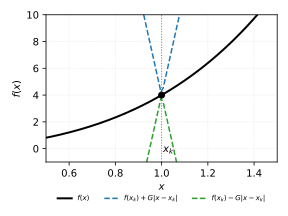
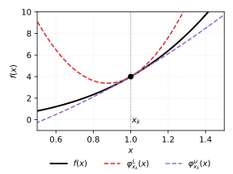

## Lipschitz continuity of a function

A function $f: \mathbb{R}^n \to \mathbb{R}$ is called $G$-Lipschitz continuous on a set $S$ if there exists a constant $G \geq 0$ such that for all $x, y \in S$:

$$
|f(x) - f(y)| \leq G \|x - y\|
$$

Geometrically, the Lipschitz condition means the function graph lies inside a cone of slope $G$ centered at any point $(x, f(x))$. The animation below illustrates how moving the reference point shifts the cone while the function always remains inside it.

:::{.video}
lipschitz_cone.mp4
:::

## L-smoothness and the descent lemma

A function $f$ is called $L$-smooth if its gradient is $L$-Lipschitz continuous:

$$
\|\nabla f(x) - \nabla f(y)\| \leq L \|x - y\|
$$

An equivalent characterization is the descent lemma: for all $x, y$,

$$
f(y) \leq f(x) + \langle \nabla f(x), y - x \rangle + \frac{L}{2} \|y - x\|^2
$$

This means the function is always bounded above by a parabola with curvature $L$ tangent at any point. The animation shows how moving the tangent point shifts the bounding parabola while the function stays below it.

:::{.video}
lipschitz_parabola.mp4
:::

## Strong convexity and smoothness bounds

When a function is both $\mu$-strongly convex and $L$-smooth, its Hessian satisfies:

$$
\mu I \preceq \nabla^2 f(x) \preceq L I
$$

This gives two-sided quadratic bounds at every point:

$$
f(x) + \langle \nabla f(x), y - x \rangle + \frac{\mu}{2}\|y-x\|^2 \leq f(y) \leq f(x) + \langle \nabla f(x), y - x \rangle + \frac{L}{2}\|y-x\|^2
$$

The ratio $\kappa = L / \mu$ is the condition number, which determines convergence rates of optimization methods. The animation shows how the function is sandwiched between a lower parabola (strong convexity) and an upper parabola (smoothness) at each point.

:::{.video}
lipschitz_strong_convexity.mp4
:::
