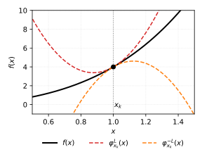

A function $f$ is called $L$-smooth if its gradient is $L$-Lipschitz continuous:

$$
\|\nabla f(x) - \nabla f(y)\| \leq L \|x - y\|
$$

An equivalent characterization is the descent lemma: for all $x, y$,

$$
f(y) \leq f(x) + \langle \nabla f(x), y - x \rangle + \frac{L}{2} \|y - x\|^2
$$

This means the function is always bounded above by a parabola with curvature $L$ tangent at any point. The animation shows how moving the tangent point shifts the bounding parabola while the function stays below it.

:::{.video}
lipschitz_parabola.mp4
:::
