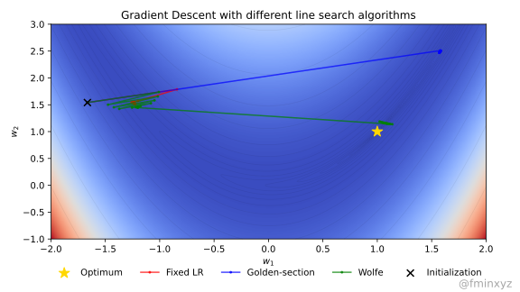

# Step Size Selection in Gradient Descent via Line Search

If a function is strongly convex with known parameters, the optimal
fixed step size is $\frac{2}{\mu + L}$, where $\mu$ and $L$ are the
smallest and largest Hessian eigenvalues.

In practice, these are rarely known, and functions may be non-convex.
Instead, we tune the learning rate manually, use line search, or
adaptive methods like AdamW & NAG-GS.

- Golden-section search works well for convex functions but lacks
  guarantees for non-unimodal ones.
- Wolfe conditions ensure sufficient function decrease while avoiding
  too tiny steps.

Line search often reduces function values faster with fewer iterations,
despite higher per-step costs.

<video autoplay loop muted playsinline class="video"><source src="ls_gd.mp4" type="video/mp4">Your browser does not support the video tag.</video>

[Code](ls.py)
