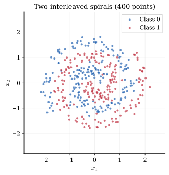
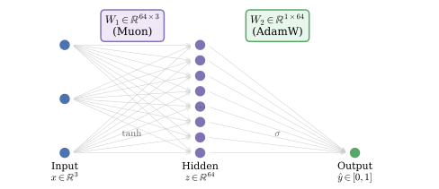

## The dataset

We generate **400 points** forming two interleaved spirals — a classic non-linearly-separable binary classification benchmark.

{width="45%" fig-align="center"}

No linear classifier can solve this — the optimizer must find a non-trivial decision boundary through a neural network.

## The model

A single-hidden-layer network with 64 neurons and $\tanh$ activation:

$$
\hat y = \sigma\!\bigl(W_2\, \tanh(W_1\, x)\bigr)
$$

The input is augmented with a constant feature for the bias: $x = [x_1,\, x_2,\, 1]^\top$. The loss is binary cross-entropy.

{width="75%" fig-align="center"}

The key detail: $W_1 \in \mathbb{R}^{64 \times 3}$ is a **matrix** parameter. This is where Muon applies spectral-norm steepest descent via Newton-Schulz orthogonalization of the gradient. For the output layer $W_2 \in \mathbb{R}^{1 \times 64}$, **all four methods use the same AdamW** — this isolates the effect of the optimizer on the matrix weight.

## Training

Mini-batch training with batch size 40, for 3000 gradient steps. Same random seed controls batch sampling for all methods.

## Part 1 — Hand-tuned hyperparameters

:::{.video}
muon_spiral.mp4
:::

### Decision boundary snapshots

{width="100%"}

### Convergence (raw + EMA-smoothed)

{width="70%" fig-align="center"}

### Hyperparameters used

| Method | lr | Momentum | Weight decay |
|:------:|:--:|:--------:|:------------:|
| SGD | 0.23 | — | $10^{-4}$ |
| Nesterov | 1.4 | $\mu = 0.9$ | $10^{-4}$ |
| AdamW | 0.37 | $\beta_1 = 0.9,\; \beta_2 = 0.999$ | $10^{-4}$ |
| Muon ($W_1$) | 0.44 | $\mu = 0.95$ | $10^{-4}$ |

## Part 2 — Optuna hyperparameter tuning

Hand-tuning gives one method an unfair advantage if its HPs were chosen more carefully. To ensure a fair comparison, we give each method the same budget of [Optuna](https://optuna.readthedocs.io/) TPE trials: **500 trials × 1000 steps**, tuning **all** hyperparameters simultaneously.

### Search spaces

| Method | Tuned parameters |
|:------:|:------------|
| SGD | `lr` $\in [10^{-3}, 30]$, `momentum` $\in [0, 0.99]$, `wd` $\in [10^{-6}, 0.1]$ |
| Nesterov | `lr` $\in [10^{-3}, 30]$, `momentum` $\in [0.5, 0.99]$, `wd` $\in [10^{-6}, 0.1]$ |
| AdamW | `lr` $\in [10^{-4}, 3]$, $\beta_1 \in [0.8, 0.99]$, $\beta_2 \in [0.9, 0.9999]$, `wd` $\in [10^{-6}, 0.1]$, $\varepsilon \in [10^{-10}, 10^{-4}]$ |
| Muon | `lr_muon` $\in [10^{-3}, 3]$, $\mu \in [0.8, 0.999]$, `ns_steps` $\in [3, 10]$, `lr_adam`, $\beta_1$, $\beta_2$, `wd`, $\varepsilon$ |

### Best configurations found

| Method | Best HPs | Final loss | Accuracy |
|:------:|:---------|:----------:|:--------:|
| **Muon** | lr=0.27, $\mu$=0.999, ns=7, wd$\approx$0 | **0.090** | 96.2% |
| AdamW | lr=0.26, $\beta_1$=0.96, $\beta_2$=0.96, wd=4$\cdot 10^{-4}$ | 0.095 | 96.5% |
| Nesterov | lr=0.14, $\mu$=0.99, wd$\approx$0 | 0.161 | 94.2% |
| SGD | lr=0.70, momentum=0.93, wd$\approx$0 | 0.310 | 86.2% |

### Training with Optuna-tuned HPs (3000 steps)

:::{.video}
muon_spiral_optuna.mp4
:::

### Decision boundaries after Optuna tuning

{width="100%"}

### Optuna optimization history

Each dot is one trial. Bold line shows the best loss found so far.

{width="100%"}

### Hyperparameter importance (fANOVA)

{width="100%"}

For SGD, Nesterov, and AdamW the **learning rate dominates** ($>$70% importance). For Muon, **weight decay and lr_muon are equally important** (~50%/40%), while Newton-Schulz iterations and momentum have low importance.

## Takeaways

1. **Muon consistently matches or beats AdamW** on this matrix-parameterized neural network, even after full Optuna HP tuning with equal budget (500 trials each).
2. **SGD and Nesterov struggle** in the mini-batch regime — adaptive scaling is essential for efficient neural network training.
3. Muon's advantage comes from **spectral orthogonalization** of the gradient: it makes equal progress across all singular directions of $W_1$, whereas AdamW can only adapt per-element.
4. Muon has more hyperparameters (8 vs 5 for AdamW), but fANOVA shows most of them have low importance — the method is **robust** to HP choices.

## Code

- [Main experiment](muon_spiral.py)
- [Optuna tuning](muon_spiral_optuna.py)
