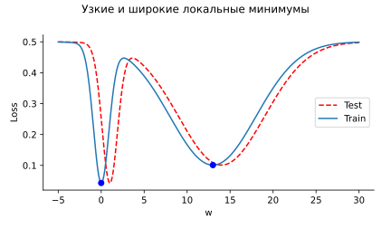

# SGD intuition in a scalar case

Gradient descent with an appropriate constant learning rate converges
for a minimum for a convex function:

<video autoplay loop class="video"><source src="sgd_3.mp4" type="video/mp4">Your browser does not support the video tag.</video>

But what if the minimized function is not convex?

<video autoplay loop class="video"><source src="sgd_4.mp4" type="video/mp4">Your browser does not support the video tag.</video>

In contrast, Stochastic Gradient Descent (SGD) could escape local
minimuma:

<video autoplay loop class="video"><source src="sgd_5.mp4" type="video/mp4">Your browser does not support the video tag.</video>

Recent studies suggest, that we should care not only about the depth of
the local minimum, but of its width as well:

  

One more interesting case, where the classical convergence of Gradient
Descent may not be useful:

<video autoplay loop class="video"><source src="sgd_1.mp4" type="video/mp4">Your browser does not support the video tag.</video>

While what initially looks like a clear divergence leads to a better
minimum from the generalization perspective:

<video autoplay loop class="video"><source src="sgd_2.mp4" type="video/mp4">Your browser does not support the video tag.</video>

[Code](https://colab.research.google.com/github/MerkulovDaniil/optim/blob/master/assets/Notebooks/SGD_1d_visualization.ipynb)
