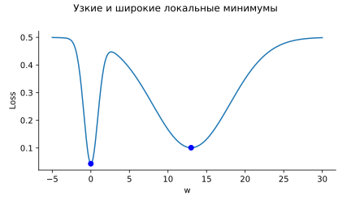
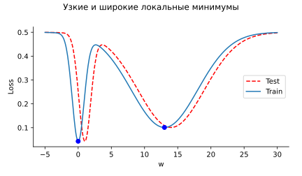
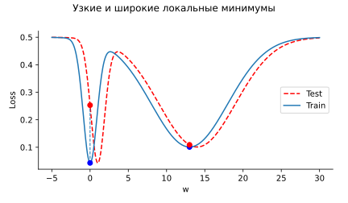

Gradient descent with an appropriate constant learning rate converges for a minimum for a convex function:

:::{.video}
sgd_3.mp4
:::

But what if the minimized function is not convex?

:::{.video}
sgd_4.mp4
:::

In contrast, Stochastic Gradient Descent (SGD) could escape local minimuma:

:::{.video}
sgd_5.mp4
:::

Recent studies suggest, that we should care not only about the depth of the local minimum, but of its width as well:

One more interesting case, where the classical convergence of Gradient Descent may not be useful:

:::{.video}
sgd_1.mp4
:::

While what initially looks like a clear divergence leads to a better minimum from the generalization perspective:

:::{.video}
sgd_2.mp4
:::

[Code](https://colab.research.google.com/github/MerkulovDaniil/optim/blob/master/assets/Notebooks/SGD_1d_visualization.ipynb)
